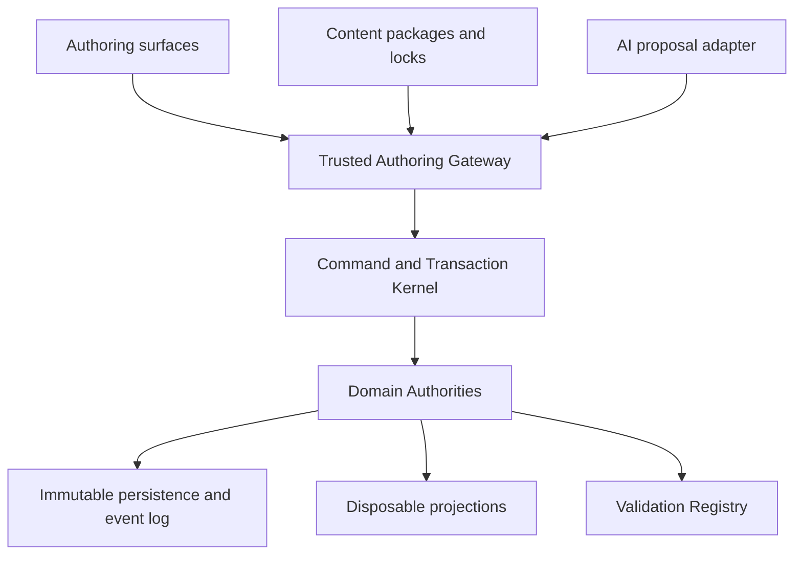

# WELTRAUM Authoring Platform Architecture V1

## Dokumentstatus

| Feld | Wert |
|---|---|
| Dokument | `AUTHORING_PLATFORM_ARCHITECTURE_V1.md` |
| Stand | 2026-08-12 |
| G18-Status | `PROPOSED_FOR_OWNER_ACCEPTANCE` |
| Implementierungsstatus | Nicht implementiert |
| Produktintegrationsstatus | Nicht freigegeben |
| Zweck | Systemische Zielarchitektur und Entscheidungsgrundlage |

Dieses Dokument beschreibt eine vorgeschlagene Zielarchitektur. Es behauptet weder einen vorhandenen Editor noch eine integrierte Content-Plattform, KI-Automation, Player-Construction-Funktion oder Produktpipeline. Technische Referenzen, Research-Artefakte und Prototypen sind Nachweise für Entscheidungen oder offene Risiken, keine Produktfeatures.

Der verbindliche Detailvorschlag für Commands, Transactions und Receipts steht in [EDITOR_COMMAND_CONTRACT_V1.md](EDITOR_COMMAND_CONTRACT_V1.md). Reife, Blocker und nächste Gates stehen in [TECHNICAL_READINESS_CROSSWALK.md](TECHNICAL_READINESS_CROSSWALK.md).

## 1. Quellenstatus und Nachweisgrenze

### 1.1 Primäre Synthesequellen

| Quelle | Rolle in dieser Architektur | Quellenstatus |
|---|---|---|
| Projektanweisungen, Projektgedächtnis und Research Register | Projektgrenzen und dokumentierte Invarianten | bereitgestellte Projektbasis |
| G02 Unified Authoring Platform | Plattformmodell, Modi, Approvalstufen und Appgrenze | `REQUIRES_OWNER_DECISION` |
| G03A Owner Freeze und Command-/Receipt-RFC | präziser Vertrag und Charter für einen möglichen isolierten Spike 1 | `REQUIRES_OWNER_DECISION` |
| G04 Settlement/City Builder | City-Authoring-Domäne | `REQUIRES_OWNER_DECISION` |
| G05 Mission, Dialogue und Narrative | getrennte Graphdomänen und Headless Compiler | `REQUIRES_SPIKE` |
| G09 Ship, Vehicle und Drone Builder | Buildergraph, Interfaces und Test-Flight-Receipt | `REQUIRES_OWNER_DECISION` |
| G10 Planet/System/Orbit Editor | systemische Dokumentauthority und Kartenprojektionen | `READY_FOR_SYNTHESIS` |
| G11 AI Authoring Copilot | Host-Commitgrenze, Proposal-only und Approvalbindung | `READY_FOR_SYNTHESIS` |
| G12 Blender to HVOX | Assetcompiler und HVOX-Authority | `REQUIRES_SPIKE` |
| G13 Content Platform | Pakete, Locks, Hot Reload, Modding und Savebindung | `REQUIRES_OWNER_DECISION` |
| G14 UX Modes | orthogonale UI-Zustände und Workspacegrenzen | `REQUIRES_OWNER_DECISION` |
| G16 City Generation | semantischer Citygraph und Hybridgenerator | `REQUIRES_SPIKE` |
| G17 Editor QA | Validation, E2E, Recovery und Evidence | `REQUIRES_OWNER_DECISION` |

Aktiver Quellen-Freeze: `G03A_owner_freeze_command_receipt_rfc_spike1_plan_2026-08-12.md` mit SHA-256 `052b292977229abfec977ac4a2ac6341b3a8e1aabbca7bee5400ea5c4a79f5da` und `G04_settlement_city_builder_system_abschlussbericht_2026-08-12(1).md` mit SHA-256 `cdb98f5404028b23f2c907fee3d4679bfb084a4dd05cee2eb72e72c1cd1efb54` sind durch das Launch-Addendum als aktuelle Dateien final bestaetigt. Diese Quellenfinalitaet ersetzt keine der in den Dokumenten weiterhin geforderten fachlichen Ownerentscheidungen.

G03A präzisiert ausschließlich einen isolierten Topologie- und Command-Spike. Es entscheidet nicht die finale Produktengine, Editor-Topologie oder Produktintegration. G02, G11 und G17 ergänzen den produktweiten Zielvertrag, ersetzen aber nicht G03As präzise Spikegrenzen.

### 1.2 Nicht verfügbare oder nicht abgeschlossene Evidence

- Separate Dateien mit den exakten Namen `WELTRAUM_RESEARCH_SYNTHESIS_2026-08-12.md`, `WELTRAUM_RESEARCH_DECISION_LOG_2026-08-12.md` und `WELTRAUM_GAMEPLAY_EDITOR_VISION_ADDENDUM_2026-08-12.md` lagen nicht vor. Ihr Inhalt wird nicht rekonstruiert oder als gelesen ausgegeben.
- `P06` liegt nicht vor. Es wird keine Aussage zu Inhalt, Qualität oder Adoption erfunden.
- `X01` liegt nicht vor. Es gibt daher keinen Ausführungs-, Integrations- oder Launchnachweis aus X01.
- Ein tatsächliches WP04-Branchreview mit Endstatus `ACCEPT` liegt nicht vor.
- Ein tatsächlicher autorisierter Fast-forward-Integrationsschritt mit `--ff-only` liegt nicht vor.
- C08 ist kein Bestandteil von G18. G18 synthetisiert und schlägt vor. Ein späteres C08-Artefakt muss davon getrennt prüfen und darf nicht durch eine G18-Selbstaussage ersetzt werden.
- Es wurden für G18 keine Repositories verändert, Builds, Tests, Browserläufe oder Benchmarks ausgeführt.

## 2. Architekturentscheidung

### 2.1 Entscheidung in einem Satz

WELTRAUM erhält einen renderneutralen gemeinsamen Authoring-Kern mit genau einer fachlichen Authority je Domain, einem vertrauenswürdigen Authoring Gateway und einem gemeinsamen versionierten Command-/Transaction-/Receipt-Pfad. Darauf sitzen zwei getrennte Produkte: eine Developer Authoring App und eine eng begrenzte Player Construction Workspace im Spiel.

### 2.2 Status der Teilentscheidungen

| Teilentscheidung | G18-Entscheidung | Status |
|---|---|---|
| Developer Editor versus Player Builder | getrennte Produkte, gemeinsame Verträge und Validatoren | `PROPOSED_FOR_OWNER_ACCEPTANCE` |
| Developer-App versus Runtime-Overlay | logische Trennung fest; physische Topologie nach G03A Gate 1 | `REQUIRES_OWNER_DECISION` |
| Mutation | ausschließlich Gateway, Command Kernel und Domain Authority | `PROPOSED_FOR_OWNER_ACCEPTANCE` |
| AI-Autonomie | Read, Proposal, Preview und begrenztes Stage; kein modellaufrufbarer Commit | `PROPOSED_FOR_OWNER_ACCEPTANCE` |
| Player Construction | schmale Gameplay-Allowlist mit Kosten-, Claim- und Serverauthority | `REQUIRES_OWNER_DECISION` |
| Modding v1 | additive deklarative Datenpakete, kein ausführbarer Modcode | `REQUIRES_OWNER_DECISION` |
| Kollaboration | CAS, sequenzierte Commits, Leases und semantischer Merge; kein allgemeiner CRDT-Zwang | `PROPOSED_FOR_OWNER_ACCEPTANCE` |
| Renderer | Projektion, nie fachliche Authority | mit D-001 konsistent |

## 3. Produktgrenze

### 3.1 Developer Authoring App

Die Developer Authoring App ist ein developer-only Produkt für Szenen, Assets, Städte, Missionen, Dialoge, NPCs, Fraktionen, Wirtschaft, Schiffe, Systeme und Validation. Sie darf breite Authoring-Capabilities anfordern, erhält sie aber nur über ein vertrauenswürdiges Gateway und eine explizite Policy.

Die logische Trennung ist vorgeschlagen. Die physische Shell bleibt offen:

- `SEP-D`: getrennte Browser-Shell mit gekoppelter Authoring Runtime;
- `OVR-D`: developer-only Overlay in einer gemeinsamen Seite;
- beide müssen denselben serialisierten Bridge-, Gateway-, Authority-, Persistence- und Testpfad verwenden;
- eine Overlayvariante darf keinen direkten Domainzugriff erhalten;
- Gate 1 des akzeptierten G03A-Spikes entscheidet nur die belastbarere Topologiehypothese.

Der sichere aktuelle Default aus G02 ist eine separate Developer-App. G18 erhebt diesen Default nicht ohne G03A-Gate und Owner-ADR zur implementierten oder endgültigen Topologie.

### 3.2 Player Construction Workspace

Player Construction ist kein verkleinerter Developer Editor. Es ist eine Gameplayoberfläche mit:

- allowlisteten Rezepten, Prefabs, Formen, Materialien und Werkzeugen;
- Claims, Plot- und Reichweitengrenzen;
- Zell-, Objekt-, Energie-, Inventar- und Kostenbudgets;
- atomarer Welt- und Ressourcenbuchung;
- serverseitiger Authority in geteilten Welten;
- kompensierenden Commands und definierter Rückerstattung statt freiem History-Rewind;
- keiner Developer-Shell, keinem Package-Publish, keinem freien Import und keinen globalen Devrechten.

Der Playerpfad verwendet dieselben fachlichen Commands, Preconditions, Validatoren, CAS- und Receiptprinzipien. Seine Capabilitymenge und Policy sind wesentlich kleiner.

### 3.3 Keine gemeinsame UI-Bundle-Closure

Die gemeinsame Plattform bedeutet nicht, dass Player und Developer dieselben UI-Module ausliefern. Ein späteres `PLAYER_EDITOR_ISOLATION_V1` muss beweisen:

- Player Runtime importiert keine Editor-Shell, Developer-Policy, DCC-, MCP-, Playwright- oder Graphbibliothek;
- nur Developer-Builds registrieren das Developer Authoring Gateway;
- Queryparameter, versteckte Menüs oder UI-Sichtbarkeit sind keine Sicherheitsgrenze;
- Domainverträge exportieren keine Three-, DOM-, Docking- oder Testtypen.

## 4. Logische Plattformarchitektur

### 4.1 Schichten

| Schicht | Verantwortung | Darf nicht besitzen |
|---|---|---|
| Authoring Surfaces | Eingabe, Auswahl, Panels, Ghosts, Preview und Review | World Authority oder trusted Actor-/Capabilitybindung |
| Trusted Authoring Gateway | Sessionprincipal, Policy, Capability, Approval, Budget und Targetbindung | Rendererzustand als Wahrheit |
| Command/Transaction Kernel | geschlossene Commands, Dry Run, Diff, CAS, Atomizität, Idempotenz und Receipt | UI- oder enginespezifische Typen |
| Domain Authorities | kanonische Dokumente, stabile IDs, Invarianten und Revisionen | flüchtige UI-/GPU-Handles |
| Content Platform | Schemata, Pakete, Resolver, Locks, Registry, Migration, Provenienz und Quarantäne | direkten Weltcommit |
| Persistence | immutable Generationen, Checkpoints, Event-Tail, Head-CAS und Recovery | Derived-Caches als einzige Wahrheit |
| Validation Registry | deterministic Issues, Blocking Scopes und Quick-Fix-Beschreibung | direkte Mutation |
| Projection Layer | Three.js, Karten, Graphcanvas, Navmesh, Collider, Mesh und Preview | fachliche Identität, History oder Commitentscheidung |
| Evidence Layer | Fixtures, Receipts, E2E-Belege, BR01-/BR02-Provenienz | Produktentscheidung ohne Ownergate |
| AI Adapter | strukturierte Proposal Bundles, Read/Preview/Stage | Commit, Publish, Approval oder eigener Mutator |

## 5. Domain Authorities

### 5.1 Authority-Regel

Jede fachliche Domain besitzt genau eine Authority. Projektionen dürfen mehrere Sichten erzeugen, aber keine zweite Wahrheit.

| Domain | Kanonische Authority | Beispiele abgeleiteter Produkte |
|---|---|---|
| Welt und Voxel | CPU-Zellzustand, Generatorbasis oder Checkpoint plus globaler Event-Tail | Mesh, AO, GPU-Buffer, Collider |
| City und Settlement | semantischer Road-/Parcel-/Building-/Utility-Graph plus revisionsgebundene Referenz auf committed World-/Voxelzustand | Cityoverlay, Navmesh, Renderinstanzen |
| Mission und Narrative | versionierte Story-, Mission-, Dialogue-Graphen und Conditions/Effects | React-Flow-Ansicht, Textpreview |
| NPC und Society | persistente IDs, Zustände, Beziehungen und Events | LOD-Projektionen, UI-Karten |
| Faction und Law | Organisationen, Jurisdiktion, Reputation, Cases und Diplomacy Events | UI-Badges und Beziehungsgrafen |
| Economy | exakte Ledger, Lots, Recipes, Orders, Capacity und Events | Marktcharts und Forecasts |
| Ship/Vehicle/Drone | Blueprint-, Part-, Socket-, Connection- und Interfacegraph | Three-Projektion, Physics-Projektion |
| System/Orbit | `CelestialSystemDocumentV1` mit Frames und State Vector | 3D-Karte, 2D-Orbitansicht, Schematic View |
| Content | Paketmanifeste, stabile Entry IDs, Authority Digests und exakter Lock | Derived GLB, Thumbnails und Caches |

### 5.2 Cross-Domain-Änderungen

Eine Transaction darf mehrere Authority-Owner nur verändern, wenn:

1. alle betroffenen Owner und erwarteten Revisionen im vorbereiteten Write Set stehen;
2. jeder Domainvalidator den vollständigen Candidate sieht;
3. Ressourcen-, Inventar-, Eigentums- und Weltänderungen gemeinsam preflighted werden;
4. ein atomarer Commitpunkt oder ein vertrauenswürdiger Coordinator die Gesamtwirkung publiziert;
5. kein Zwischenzustand sichtbar wird;
6. ein gemeinsames Receipt alle betroffenen Roots und Diffs bindet.

Die konkrete Multi-Authority-Committechnik ist vor Produktarbeit noch zu entscheiden. Ein UI-Makro allein stellt keine Atomizität her.

## 6. Gateway, Capabilities und Approval

### 6.1 Trusted Gateway Binding

Der Client, ein UI-Panel, ein Prototyp, MCP oder ein Modell darf Principal, Actorrolle, Capability, Approval oder Risk Class nicht vertrauenswürdig selbst behaupten. Das Gateway bindet diese Daten aus authentisierter Session und server- oder hostseitiger Policy.

Ein Transporttoken, MCP-Toolhinweis, Queryparameter oder Besitz eines Staginghandles ersetzt keine Domainauthorization. Jede Phase prüft Capability und Ziel erneut.

### 6.2 Approvalstufen

| Stufe | Bedeutung | Typische Nutzung |
|---|---|---|
| `A0 Observe` | lesen, suchen, erklären | Query, Diff und Issues |
| `A1 Preview` | flüchtiger Draft ohne Authority-Mutation | Ghosts, AI-Proposals und Dry Runs |
| `A2 Bounded Commit` | kleine reversible allowlistete Änderung | bewusster Developer-Drag oder Playerrecipe |
| `A3 Exact Transaction` | One-shot-Freigabe eines versiegelten Transaction-Digests | Bulk, Delete, destructive Brush oder AI-Vorschlag |
| `A4 Review/Publish` | Owner- oder unabhängige Freigabe | Package Publish, Schema, Registry, Generator oder Waiver |
| `X Forbidden` | in diesem Modus verboten | Player-Publish, ausführbare untrusted Mods, modellseitiger Commit |

`requiredApprovalLevel` wird deterministisch aus Commandklasse, Target, Diff, Budget, Irreversibilität und Policy berechnet. Ein allgemeiner Auftrag ist keine Freigabe eines später erzeugten Writes.

### 6.3 Modusmatrix

| Fähigkeit | Developer Human | Player Construction | AI Copilot |
|---|---|---|---|
| Query, Search, Issues | breit im Workspace | eigener sichtbarer Scope | `A0`, gefiltertes Read Model |
| Preview | erlaubt | erlaubt für Rezept | `A1`, Standardmaximum |
| kleine Mutation | `A2` nach Policy | `A2` in Claim, Kosten und Budget | nicht modellaufrufbar |
| destruktive oder breite Mutation | `A3` exakter Digest | normalerweise verboten | Vorschlag, menschliches `A3` außerhalb des Modells |
| Import und Registry | `A3`, Publish `A4` | verboten | Metadatenvorschlag `A1` |
| Publish | `A4` | verboten | verboten |
| freie Scripts/Plugins | nicht in v1 | verboten | verboten |

## 7. Command-, Transaction- und Receipt-Kern

Der Plattformkern folgt diesen Invarianten:

- geschlossene versionierte Commands statt freier JSON-Patches;
- `validate`, `dryRun`, `preview`, `commit` und `rollback` als getrennte Phasen;
- Prepare auf immutable Snapshot mit semantischem Diff und exaktem Inversionsplan;
- Recheck von Authority, Epoch, Revision, Contentdigest, Policy und Approval beim Commit;
- all-or-nothing Rootwechsel;
- idempotente Actionbindung und Statusreconciliation bei unbekanntem Transportausgang;
- exakte Before-Deltas für Undo;
- monotone Revisionen, auch wenn Undo einen früheren Contentdigest wiederherstellt;
- Quick Fix, Migration und AI-Vorschlag besitzen keinen privilegierten Nebenpfad.

Autoritatives Commit-Receipt, Runtime Projection Receipt und E2E Read-only Receipt bleiben getrennte Typen. Details stehen in [EDITOR_COMMAND_CONTRACT_V1.md](EDITOR_COMMAND_CONTRACT_V1.md).

## 8. Content Platform

### 8.1 Paketmodell

V1 verwendet engine-neutrale deklarative Pakete für Assets, Missionen, NPCs, Factions, Economy, Cities, Systems, Materials, Localization und Generator Config. Core Code enthält Interpreter, geschlossene Schemata, Resolver, Migrationen und Policy.

Pakete dürfen in v1 keinen beliebigen JS-, TS-, HTML-, WGSL-, Wasm- oder nativen Code aktivieren. Mods sind additiv und datenbasiert. Allgemeine Overrides und Capability-Wasm sind spätere, getrennte Security-Gates.

### 8.2 Identität und Locks

- stabile namespaced `PackageId` und `EntryId`;
- immutable `packageId + packageVersion` nach Publish;
- vollständiger `packageDigest` für ausgelieferte Bytes;
- `authorityDigest` für fachliche Semantik;
- exakter `contentLockDigest` für das Artefaktset;
- `authorityLockDigest` und `simulationContractDigest` für Save- und Serversicht;
- getrennte `contentEpoch` und Dokument-/Weltrevision.

Ein Content-Root-Wechsel darf eine laufende Welt nicht still neu interpretieren. Simulationsrelevanter Hot Reload ist in v1 normalerweise `restart-required` oder `migration-required`.

### 8.3 Install, Cache und Quarantäne

Neue Paketbytes werden content-addressed gestaged, vollständig geprüft und erst danach über einen kleinen Active-Pointer-CAS aktiviert. Fehlerhafte Releases, gleiche Version mit anderem Digest und rechteunklare Artefakte gehen in Quarantäne. Fehlerhafte lokale Drafts bleiben editierbare Rejections.

## 9. Persistenz, Migration und Recovery

### 9.1 Schichten

| Ebene | Bindet |
|---|---|
| Content Lock | exakte Pakete, Derived Bytes, Provenienz und Lizenzen |
| Authority Lock | simulationsrelevante Authority Digests und Grants |
| Document Manifest | Dokument-ID, Revision, World-State-Hash, Checkpoint und Event-Tail |
| World Manifest | Generator, Koordinatenvertrag, Materialregistry und globale Eventsequenz |
| History/Journal | Commands, Receipts, Inversionspläne und Idempotenz |

Das G13-Save-Manifest und das G17-Document-Manifest sind geschichtet zu komponieren. Keines ersetzt das andere.

### 9.2 Regeln

- immutable Generationen statt In-place-Mutation;
- Digestprüfung vor Migration;
- strukturelle Save-Migration als pure Stagingfunktion;
- fachliche Migration als normale, isolierte Transaction auf staged Root;
- Originalbytes bleiben unverändert;
- atomarer Headwechsel erst nach vollständiger Validation;
- unknown future version fail-closed;
- Generatorversion und Implementierungsdigest werden gebunden;
- beschädigte Authority wird nicht durch einen Derived Cache ersetzt;
- Salvage öffnet ein neues, gekennzeichnetes Dokument.

Das normative Browser-Backend bleibt Ownerentscheidung. G03A verwendet IndexedDB nur als sicheren Default eines möglichen isolierten Spikes, nicht als bereits gewählte Produktpersistenz.

## 10. Validation, Issues und Quick Fixes

Validatoren sind versioniert, lesen immutable Snapshots und erzeugen deterministische Issues. Blocking Scopes unterscheiden Commit, Save, Export und Play. Asynchrone Resultate binden Revision, Contentdigest und Inputdigest; stale Resultate werden verworfen.

Der gemeinsame Issuevertrag muss vor Umsetzung die G13- und G17-Varianten harmonisieren:

- stabiler fachlicher `issueKey` oder Fingerprint;
- separate `occurrenceId` für den konkreten Lauf;
- stabile Codes und lokalisierte Darstellung;
- Target über Domain-IDs, nie Rendererhandles;
- Suppression als auditierbares Policy-Overlay;
- Security-, Korruptions- und Authority-Invarianten nicht suppressible;
- Quick Fix als normale Preview und Transaction mit Revalidation.

Ob `blocker` eine eigene Severity bleibt oder vollständig durch `blockingScopes` ausgedrückt wird, ist eine Owner-/Contractentscheidung.

## 11. AI Authoring Copilot

### 11.1 Sicherheitsgrenze

Der Copilot ist Proposal-Autor. Die modellseitige Tool Registry enthält in v1 nur Read, Preview und begrenztes Stage. Commit und Destructive werden dem Modell nicht angeboten.

Ein hostseitiger Commit Coordinator darf nur eine versiegelte Transaction committen, wenn mindestens übereinstimmen:

- Proposal- und Transactiondigest;
- Preview- und Validatorbericht;
- Approval und Policy;
- Tool-Registry-Digest;
- Authority-Epoch und erwartete Revisionen;
- Target-, Read- und Write-Sets;
- vollständige Provenienz.

MCP ist optionaler Adapter, keine Authority. Toolbeschreibungen und Annotationen sind untrusted Hinweise. AI Memory darf stabile Präferenzen und Pointer enthalten, aber keine Kopie der World Truth.

### 11.2 Prompt Injection und Schutzgüter

Benutzertext, Assetmetadaten, Dokumente, Retrieval, Toolresultate und Multi-Agent-Handoffs sind untrusted Content. Erlaubte Kontrollen:

- geschlossene Tool- und Outputschemas;
- kleinste Capability-Allowlist;
- Target- und Pfadallowlists;
- Egress-, Call-, Kosten- und Laufzeitbudgets;
- echte Approval-ID statt Textbehauptung;
- keine Secrets, Rohprompts oder personenbezogenen Namen in Domainreceipts;
- Saves, Goldens, Evidence und Tests als geschützte Ressourcen;
- keine Selbstfreigabe von Golden-, Rubric- oder Securityänderungen.

## 12. Domain Workspaces

| Workspace | Kernwerkzeuge | Authority-/Gatehinweis |
|---|---|---|
| Scene | Hierarchy, Inspector, Selection, Gizmos, Placement | Minimaler erster Slice, noch ohne Voxel |
| Settlement | Roads, Parcels, Zones, Buildings, Utilities | G04 Ownerfreeze und G16-Spikes erforderlich |
| Narrative | getrennte Story-, Mission- und Dialogue-Graphen | Headless Compiler und Validator vor UI-Adoption |
| Society | NPCs, Schedules, Relationships und LOD-Diagnostik | persistente Identitäten, Execution LOD |
| Factions | Organisations-, Jurisdiktions-, Law- und Diplomacyeditor | Rank nie als Permission verwenden |
| Economy | Items, Recipes, Markets, Routes und Ledgerdiagnostik | exakte Integer, deterministische Events |
| Builder | Ship/Vehicle/Drone Blueprint, Parts, Sockets und Interfaces | bestehendes Format erweitern, kein Parallelformat |
| System | Bodies, Frames, Orbits, Sites und Routes | `CelestialSystemDocumentV1` als Authority |
| Assets | Source Scene, HVOX, Sidecar, Provenienz und Review | HVOX Authority, GLB Derived |
| Validation | Issues, Quick Fix, Fixtures, Evidence und Recovery | G17 Ownerfreeze erforderlich |

## 13. Prototypen und Adoption

P01 bis P05 sind höchstens UX-, Flow- und Contract-Evidence. Ein Prototyp beweist nicht:

- fachliche Authority;
- atomare Persistenz;
- Security oder Capabilitygrenzen;
- Save- oder Migrationskompatibilität;
- Browser-/Performancebudgets;
- Lizenz- oder Produktintegrationsreife.

Adoption muss getrennt nach UX, Contract, Code und Assets erfolgen. Die Entscheidungen `ADOPT`, `ADAPT`, `REFERENCE_ONLY` oder `REJECT` stehen im separaten [PROTOTYPE_ADOPTION_MATRIX.md](PROTOTYPE_ADOPTION_MATRIX.md). P06 ist `NOT_PROVIDED`. X01 ist `NOT_PROVIDED` und kann keine Ausführung bestätigen.

## 14. Build-, Tool- und Integrationsgrenzen

### 14.1 Engine und Rendering

Three.js `0.185.1` bleibt aktueller Referenzpfad und G03A-Spike-Pin. Die finale Engineentscheidung bleibt einem späteren WP12-Gate vorbehalten. G18 führt keinen Enginewechsel durch.

Blender ist primäres DCC für kuratierte Assets und Building Kits. DCC-Dateien sind Authoringquellen. HVOX und versionierte Sidecars tragen Authority; GLB ist Proxy oder Derived Delivery.

### 14.2 WP04

WP04-Research darf als Vertrags- und Fixturequelle zitiert werden. WP04-Code, Branchzustand oder Integration werden erst technische Wahrheit, wenn beide Bedingungen erfüllt sind:

1. ein tatsächliches unabhängiges Review endet mit `ACCEPT`, einschließlich Owner-Visual-Gate;
2. der autorisierte Integrationsschritt erfolgt nachweislich als Fast-forward mit `--ff-only`.

`READY_FOR_LATER_IMPLEMENTATION` des Reviewprotokolls ist kein Branchurteil. `TECHNICAL_ACCEPT_VISUAL_PENDING` wäre ebenfalls noch kein `ACCEPT`.

### 14.3 G18 und C08

G18 bleibt read-only Synthese. Es friert keine Implementierungsbasis ein, führt keinen Merge aus und akzeptiert seine eigenen Vorschläge nicht. C08 muss als getrennte spätere Aktivität mit eigener Eingangs-Evidence, eigenem Reviewer und eigenem Ergebnis behandelt werden. Ein G18-Status darf nicht als C08-Pass oder Launchfreigabe erscheinen.

## 15. Serielle Plattformgates

| Gate | Entry | Scope | Exit | Stop bei |
|---|---|---|---|---|
| `AP-00 Owner Freeze` | vollständiges G18-Paket | Appgrenze, Command RFC, AI, Player, Modding, Persistence und Publish entscheiden | signierter Decision Record | offene P0-Entscheidung |
| `AP-01 Contract Crosswalk` | `AP-00 PASS` | G03A, G02, G11, G13 und G17 auf einen Typkatalog abbilden | keine parallele Authority oder Receiptsemantik | zwei konkurrierende Kernverträge |
| `AP-02 Isolated Command Spike` | akzeptiertes `G03A-DR1`, Lizenz- und Zielortfreeze | ausschließlich G03A Spike 1 | Gate-1-ADR oder `NO_GO` | Produktimport, Partial Commit, Scope Creep |
| `AP-03 Content Contract Fixtures` | G13 Ownerentscheidungen | Package-, Lock-, Issue- und Digestfixtures | Golden Vectors und negative Fixtures | Digest-/Schemaabweichung |
| `AP-04 Validation Foundation` | `AP-01`, Command Kernel und G17 Ownerfreeze | Registry, Issues und Quick Fixes | deterministische Issues, stale rejection | direkter Validator-/Fixwrite |
| `AP-05 E2E Harness` | Contractfixtures und build-only Grenze | echte UI-Eingaben und Read-only Receipt | Produktionsabwesenheit belegt | Mutator-Bridge oder feste Sleeps |
| `AP-06 First Domain Adapter` | Kern- und Validationgates PASS | genau eine Domäne, Empfehlung: Scene Entities | vollständige Authority-, Undo-, Save- und E2E-Belege | Parallelformat oder zweiter Mutator |
| `AP-07 AI Preview Slice` | G11 Policy und Securitysuite akzeptiert | genau ein Previewtool, kein Committool | Safe-Success- und Injection-Evidence | Forbidden Diff oder Approval-Bypass |
| `AP-08 Player Recipe Slice` | Playerauthority, Kosten und Claimpolicy entschieden | ein lokales Rezept | atomare Welt-/Ressourcenbuchung | Developerimport oder ungeprüfter Refund |
| `AP-09 Independent Review` | vollständige Evidence | unabhängige Architektur-, Security- und Lizenzprüfung | separate Annahme oder Fixliste | Selbstfreigabe |
| `AP-10 Product Integration Decision` | WP12, WP04 `ACCEPT` plus `--ff-only`, C08 separat abgeschlossen | Integrationsplan, noch kein stiller Merge | explizite Ownerfreigabe | fehlende Evidence oder unklare Basis-SHAs |

## 16. Offene Ownerentscheidungen

### P0

1. Wird `G03A-DR1` als isolierte Spikecharter akzeptiert?
2. Wird die logische Trennung von Developer Authoring App und Player Construction Workspace akzeptiert?
3. Welche physische Developer-Topologie folgt aus Gate 1?
4. Welche Domain ist der erste Produktadapter nach einem erfolgreichen Kernspike?
5. Welches Persistenzbackend ist für v1 normativ?
6. Wann wird Session-History zum append-only persistenten Event?
7. Bleibt KI in v1 strikt ohne modellaufrufbaren Commit?
8. Darf Player Construction geteilte Welten nur über serverseitige Authority ändern?
9. Bleibt Modding v1 additive data-only?
10. Wer darf `A4` erteilen, und wann ist unabhängige Review zwingend?

### P1

11. Wie lange bleiben alte Paket-, Generator- und Saveversionen verfügbar?
12. Welche Browser und Geräte bilden Release-, Compatibility- und Diagnostic-Tiers?
13. Welche Validatoren blockieren Commit, Save, Export und Play?
14. Dürfen lossless lokale Quick Fixes später automatisch angewandt werden?
15. Welche Evidence- und Agententrace-Retention gilt?
16. Welche Namespacepräfixe und Publishernachweise gelten?
17. Welche Rechtebasis gilt für First-Party- und Voxel-Lab-Bytes?
18. Wie groß darf ein exaktes Inversionsdelta werden, bevor Before-Pages verwendet werden?

## 17. Schlussurteil

Die Architektur ist kohärent genug für einen Ownerfreeze und kleine isolierte Spikes. Sie ist nicht produktions- oder integrationsreif. Die wichtigste Entscheidung ist nicht eine UI-Bibliothek, sondern die harte gemeinsame Mutationsgrenze: trusted Gateway, versionierter Command-/Transaction-Kern, genau eine Domain Authority, atomarer Commit und getrennte Receipts.

**Status: `PROPOSED_FOR_OWNER_ACCEPTANCE`**

Die physischen Editor-Topologie, das Persistenzbackend, Playerauthority, Moddingpolicy, Publish-Governance und die erste Produktdomäne bleiben `REQUIRES_OWNER_DECISION`.
