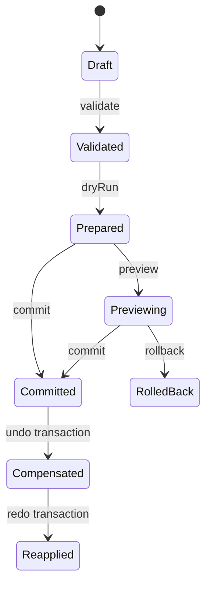

# WELTRAUM Editor Command Contract V1

## Dokumentstatus

| Feld | Wert |
|---|---|
| Dokument | `EDITOR_COMMAND_CONTRACT_V1.md` |
| Stand | 2026-08-12 |
| Vertragsstatus | `PROPOSED_FOR_OWNER_ACCEPTANCE` |
| Freigabestatus | `REQUIRES_OWNER_DECISION` |
| Implementierungsstatus | Nicht implementiert |
| Präzise Spike-Unterlage | `G03A_owner_freeze_command_receipt_rfc_spike1_plan_2026-08-12.md`, SHA-256 `052b292977229abfec977ac4a2ac6341b3a8e1aabbca7bee5400ea5c4a79f5da` |
| Ergänzende Architekturquellen | G02, G11, G13 und G17 |

Dieser Vertrag ist eine G18-Synthese. Er beschreibt die gemeinsame renderneutrale Mutationsgrenze für Developer Authoring, spätere Player Construction, Quick Fixes, fachliche Migrationen und KI-Vorschläge. Er ist kein Nachweis, dass diese Grenze bereits implementiert oder integriert ist.

Die Plattformumgebung steht in [AUTHORING_PLATFORM_ARCHITECTURE_V1.md](AUTHORING_PLATFORM_ARCHITECTURE_V1.md). Reifestatus und Blocker stehen in [TECHNICAL_READINESS_CROSSWALK.md](TECHNICAL_READINESS_CROSSWALK.md).

## 1. Quellenrang und Profilgrenze

### 1.1 Quellenrang

1. Die bereitgestellten Projektanweisungen und das Projektgedächtnis setzen die Sicherheits- und Integrationsgrenze. Eine separate Datei mit dem exakten Namen des erwarteten Decision Logs lag nicht vor und wird nicht als gelesen ausgegeben.
2. G03A ist die präziseste Unterlage für einen isolierten Spike-1-Command-, Receipt-, Bridge- und Persistence-Vertrag.
3. G02 erweitert den Blick auf Developer-, Player-, Approval-, Content- und Collaborationanforderungen.
4. G11 ergänzt die AI- und Host-Commit-Sicherheitsgrenze.
5. G13 ergänzt Content Epoch, Authority Lock, Package Activation, Save- und Migrationsbindung.
6. G17 ergänzt generalisierte QA-, Validation-, Issue-, Undo-, Recovery-, E2E- und Evidenceanforderungen.

G18 darf aus diesen Quellen keinen bereits implementierten Produktvertrag ableiten. Wo G03A und G17 unterschiedliche Feldnamen oder Wiretypen verwenden, wird die Semantik vereinheitlicht und die konkrete Produktkodierung als eigenes Contract-Gate markiert.

### 1.2 Profile

| Profil | Zweck | Status |
|---|---|---|
| `G03A Spike Profile` | synthetische Entities, fünf Edits, eine Authority, Safe-Integer-Revision und IndexedDB | erst nach `G03A-DR1 ACCEPTED` startbar |
| `Product Core Profile` | gemeinsame logische Semantik für echte Domains | `PROPOSED_FOR_OWNER_ACCEPTANCE` |
| `Player Construction Profile` | eng allowlistete Commands plus Gameplaykosten und Serverauthority | `REQUIRES_OWNER_DECISION` |
| `AI Proposal Profile` | Read, Preview und Stage, Commit nicht modellaufrufbar | `PROPOSED_FOR_OWNER_ACCEPTANCE` |
| `Remote/Collaborative Profile` | sequenzierter Commitdienst, Leases, signierte Receipts und Merge | späteres Gate |

Das Product Core Profile darf nicht still als identisch zum G03A Spike Profile serialisiert werden. G03A verwendet bewusst eine kleine synthetische Safe-Integer-Domäne. Für das Produkt wird eine kanonische Decimal-Uint64-Wirekodierung empfohlen. Diese Kodierungsentscheidung benötigt Golden Vectors und Ownerfreigabe.

## 2. Nicht verhandelbare Invarianten

1. Genau eine Authority besitzt den kanonischen Zustand einer Domain.
2. Renderer, UI, Graphcanvas, Navmesh, Collider, Caches und Tests sind Projektionen.
3. Jede fachliche Mutation läuft über ein vertrauenswürdiges Gateway, einen versionierten Command und eine atomare Transaction.
4. Clientdaten sind nicht selbst Autorisierung.
5. Actor, Principal, Capability, Policy, Approval und Risk Class werden am trusted Gateway gebunden.
6. `validate`, `dryRun`, `preview`, `commit` und `rollback` sind getrennte Phasen.
7. Vor dem Commitpunkt ist jeder Fehler nebenwirkungsfrei.
8. Eine erfolgreiche nicht leere Transaction publiziert genau einen neuen Authority Root und ein autoritatives Commit Receipt.
9. Ein Partial Commit ist unzulässig.
10. Idempotenz wird über eine dauerhaft gebundene Actionidentität hergestellt, nicht über Transportnachrichten.
11. Ein unbekannter Commitausgang wird reconciled, nie blind mit neuer ID wiederholt.
12. Undo und Redo sind neue vorwärtslaufende Transactions mit exakten Inversionsdaten.
13. Quick Fix, Migration, Player und AI besitzen keinen privilegierten Mutationspfad.
14. Projektionserfolg und E2E-Beobachtung sind keine Commitbestätigung.
15. Content Root und Dokument-/World Root sind getrennte CAS-Domänen.

## 3. Begriffe

| Begriff | Normative Bedeutung |
|---|---|
| Domain Authority | einziger Owner von kanonischem Zustand, Revision, Journal und Commit Receipts |
| Projection | wegwerfbare Sicht auf Authority State |
| Session State | Auswahl, Kamera, Panels, Hover und Layout, ohne World-Authority |
| Draft | untrusted Commandentwurf ohne Actor- oder Capabilityautorität |
| Action | eine durch Gateway, Actor, Policy und `actionId` gebundene Ausführung |
| Command | geschlossene, versionierte fachliche Operation |
| Transaction | geordnete, nicht leere, atomare Commandliste |
| Validate | Schema-, Registry-, Policy- und Preconditionprüfung ohne Mutation |
| Dry Run | deterministische Ausführung auf immutable Shadow State |
| Prepared Transaction | digestgebundener Candidate mit Diff, Impact und Inversionsplan |
| Preview | flüchtige Projektion eines Prepared Candidates |
| Commit | erneute Prüfung und atomare Veröffentlichung durch die Authority |
| Rollback | Verwerfen von Preview oder Staging vor dem Commitpunkt |
| Undo | neue Transaction, die ein früheres angewandtes Receipt exakt kompensiert |
| Receipt | typspezifischer unveränderlicher Nachweis, dessen Authority explizit feststeht |

## 4. Trust Boundary und Gateway Binding

### 4.1 Untrusted Draft

Ein UI-Panel, Playerclient, Modell, MCP-Adapter oder Prototyp darf nur einen Draft liefern:

```ts
interface DraftActionRequestV1 {
  schema: 'weltraum.draft-action-request/v1';
  actionId: string;
  transaction: DraftTransactionV1;
  requestedPhase: 'validate' | 'dryRun' | 'preview' | 'commit' | 'rollback';
  clientContext?: unknown;
}
```

`clientContext` ist untrusted und darf keine wirksame Principal-, Capability-, Policy- oder Approvalbindung enthalten. Ein Client darf gewünschte Intention und Ziele beschreiben, aber keine Rechte erzeugen.

### 4.2 Trusted Action Binding

Das Gateway erzeugt aus authentisierter Session und Policy eine stabile Bindung:

```ts
interface TrustedActionBindingV1 {
  schema: 'weltraum.action-binding/v1';
  actionId: string;
  actor: {
    actorId: string;
    actorKind: 'human-developer' | 'player' | 'service' | 'agent-proposal';
  };
  policy: {
    policyId: string;
    policyVersion: number;
    policyDigest: Sha256;
  };
  capabilitySetDigest: Sha256;
  transactionDigest: Sha256;
  provenanceDigest: Sha256;
  actionBindingDigest: Sha256;
}
```

Der konkrete G03A-Spike bindet nur `human-developer-spike-v1`. Player- und AI-Policytypen gehören nicht in Spike 1. Das AI-Modell erhält in v1 keinen Committool-Descriptor. Sein `agent-proposal` bezeichnet Provenienz eines Vorschlags, nicht einen schreibberechtigten Principal.

Session-, Transport-, Connection-, Message-, Runtime- und Reauthentisierungs-IDs liegen außerhalb des stabilen Action Binding Digest. Sie werden separat auditiert und dürfen ein terminales Receipt nicht verändern.

### 4.3 Approval Binding

Ein Approval gilt nur für den exakt geprüften Candidate:

```ts
interface ApprovalBindingV1 {
  schema: 'weltraum.approval-binding/v1';
  approvalId: string;
  approverId: string;
  approvalLevel: 'A2' | 'A3' | 'A4';
  actionBindingDigest: Sha256;
  preparedDigest: Sha256;
  previewDigest: Sha256;
  validatorReportDigest: Sha256;
  policyDigest: Sha256;
  authorityEpoch: string;
  expectedRootDigest: Sha256;
  expiresAtUtc: string;
}
```

Jede Draftänderung, neue Basisrevision, neue Policy, abgelaufene Freigabe oder abweichender Validatorbericht invalidiert das Approval. G03A Spike 1 implementiert diesen generalisierten Approvalvertrag nicht. Er gehört frühestens in einen separaten späteren Spike.

## 5. Identitäten und Digestdomänen

### 5.1 Logische IDs

| ID | Owner | Bedeutung |
|---|---|---|
| `authorityId` | Authority | stabiles Dokument oder Domainroot |
| `authorityEpoch` | Authority | geladene Authority-Lineage und Instanzgeneration |
| `entityId` | Authority oder reservierter Pool | stabile fachliche Identität, nie semantisch recycelt |
| `actionId` | externer Initiator, danach dauerhaft gebunden | genau eine logische Ausführung |
| `transactionId` | Client bei normalen Edits, Authority bei Historymaterialisierung | unveränderlicher Transactioninhalt |
| `commandId` | Client oder Authority | innerhalb der Transaction eindeutig |
| `receiptId` | Authority | autoritatives Commitresultat |
| `inversePlanId` | Authority | exakte Inversion einer angewandten Transaction |
| `previewId` | Previewhost | flüchtige, TTL-gebundene Projektion |
| `messageId` | Transportsender | nur Transportdeduplizierung |
| `projectionReceiptId` | Runtime Projection | Projektionsnachweis, keine Commitauthority |

### 5.2 Digests

Persistierte Vertragsartefakte verwenden vorgeschlagen RFC 8785 JCS, UTF-8 und SHA-256 mit versionierter Domainseparation. Self-Digests werden ausgeschlossen. Arrays mit fachlicher Reihenfolge werden nicht sortiert. Sets und Changes werden kanonisch sortiert.

Mindestens getrennt bleiben:

- State Content Digest;
- Storage Snapshot Digest;
- Transaction Digest;
- Action Binding Digest;
- Commit Request Digest;
- Policy Decision Digest;
- Semantic Diff Digest;
- Inverse Plan Digest;
- Commit Receipt Digest;
- Runtime Outbox Digest;
- Projection Receipt Digest;
- Content Lock und Authority Lock Digest.

Timestamps, Session State, Telemetrie, Rendererhandles und Runtime-Acks gehören nicht in fachliche State- oder Transactiondigests.

## 6. Command Registry

### 6.1 Command Envelope

```ts
interface CommandEnvelopeV1<TPayload> {
  schema: 'weltraum.command/v1';
  commandId: string;
  commandType: string;
  commandVersion: number;
  payload: TPayload;
  semanticPayloadDigest: Sha256;
}
```

Jeder `commandType` verweist auf eine geschlossene, im Core gebündelte Schema- und Handlerregistry. Unbekannte Commands, Versionen, Felder oder Property IDs sind Hard Fail. Es gibt keinen freien JSON Patch, keine beliebigen JSON Pointer und keine Scriptoperation.

### 6.2 Domain Adapter Contract

Jeder Commandtyp muss liefern:

- geschlossenes Inputschema und Größenlimits;
- fachliche Target- und Ownerauflösung;
- deterministische Preconditionprüfung;
- Read Set und Write Set;
- pure Planung auf immutable Snapshot;
- semantischen Diff;
- exaktes Inversionsdelta oder explizite Nichtinvertierbarkeit;
- Dirty Domains und Derived-Invalidierungen;
- stabile Fehlercodes;
- Validatorabhängigkeiten;
- minimale Capability und Approvalstufe;
- Provenienz- und Save-Impact.

Nichtinvertierbare Commands sind im G03A Spike Profile nicht commitfähig. Im späteren Produktprofil benötigen sie mindestens einen eigenen irreversible-action-Vertrag und `A3` oder `A4`; diese Erweiterung ist noch nicht akzeptiert.

### 6.3 Transaction

```ts
interface TransactionSpecV1 {
  schema: 'weltraum.transaction/v1';
  transactionId: string;
  intentId: string;
  authority: {
    authorityId: string;
    authorityEpoch: string;
    baseRevision: CanonicalRevision;
    baseStateContentDigest: Sha256;
  };
  contentBinding?: {
    contentEpoch: CanonicalRevision;
    authorityLockDigest: Sha256;
    simulationContractDigest: Sha256;
  };
  commands: readonly [CommandEnvelopeV1<unknown>, ...CommandEnvelopeV1<unknown>[]];
}
```

`contentBinding` ist eine vorgeschlagene Produktprofilerweiterung aus G13. Es ist nicht Teil des unveränderten G03A Spike-1-Schemas. Eine tatsächliche Aufnahme erfordert eine neue versionierte Schema-ID und Golden Vectors.

Regeln:

- Commandreihenfolge ist semantisch;
- Transaction ist nicht leer und budgetiert;
- alle neuen fachlichen IDs stehen vor Preview fest;
- eine geänderte Transaction benötigt neue Transaction-ID und neuen Digest;
- Multi-Command-Makros sind all-or-nothing;
- rekursive Batchcommands sind verboten;
- interne Historyoperationen werden ausschließlich durch die Authority materialisiert;
- Cross-Domain-Transactions benötigen einen vollständigen Coordinatorvertrag.

## 7. Action Lifecycle



### 7.1 Phasen

| Phase | Pflichtprüfung | Erlaubte Mutation | Ergebnis |
|---|---|---|---|
| `validate` | Envelope, Schema, IDs, Registry, Policy, Capability, Revision und Preconditions | keine | strukturierte Issues |
| `dryRun` | vollständige Planung auf immutable Shadow State | keine | Prepared Candidate, Diff, Impact und Inversionsplan |
| `preview` | unveränderter Prepared Digest, Basis, Capability und TTL | nur flüchtige Projektion | Preview Projection und Preview Receipt |
| `commit` | Commitlock, Writer Fence, CAS, Policy, Approval, Validatoren und deterministischer Replan | genau eine atomare Authoritypublikation | Commit Receipt |
| `rollback` | Action noch nicht committed und Previewzuordnung gültig | Preview/Staging verwerfen | Auditresultat ohne Authorityrevision |

Rollback gilt ausschließlich vor dem Commitpunkt. Nach Commit erfolgt Korrektur durch Undo oder fachlich kompensierendes Event.

### 7.2 Prepared Transaction

```ts
interface PreparedTransactionV1 {
  schema: 'weltraum.prepared-transaction/v1';
  actionId: string;
  transactionId: string;
  transactionDigest: Sha256;
  authorityId: string;
  authorityEpoch: string;
  baseRevision: CanonicalRevision;
  baseStateContentDigest: Sha256;
  candidateStateContentDigest: Sha256;
  semanticDiffDigest: Sha256;
  validatorReportDigest: Sha256;
  policyDecisionDigest: Sha256;
  predictedOutcome: 'applied' | 'no-change';
  inversePlanDigest: Sha256 | null;
  expiresAtUtc: string;
  preparedDigest: Sha256;
}
```

Ein vollständig wirkungsloser Edit ist `no-change`. Eine A-nach-B-nach-A-Transaction kann trotz identischem Before-/After-Contentdigest `applied` sein, wenn ihr Authority Write Set oder Versionsledger wirksam geändert wurde.

## 8. Commitalgorithmus

Der vorgeschlagene logische Ablauf ist:

1. Trusted Action Binding und Digests neu berechnen.
2. `actionId` im Idempotency Store suchen.
3. Bei identischem terminalem Request dasselbe gespeicherte Commit Receipt liefern.
4. Bei gleicher `actionId` und anderer Bindung mit `ACTION_ID_CONFLICT` abbrechen.
5. Authority Commit Lock und Writer Lease/Fence prüfen.
6. Authority-ID, Epoch, Root, Revision, Contentdigest und optional Content Epoch/Authority Lock prüfen.
7. Policy, Capability, Target, Budget und Approval erneut prüfen.
8. Commands in deklarierter Reihenfolge auf Shadow State neu planen.
9. Prepared-, Diff-, Validator- und Inverse-Digests vergleichen.
10. Bei jedem Fehler den vollständigen Candidate verwerfen.
11. Ergebnis atomar publizieren:
    - `applied`: Root, Revision, Versionsledger, Inversionsplan, Commit Receipt, History/Event, Idempotency Record und Outbox;
    - `no-change`: terminales Commit Receipt und Idempotency Record, aber keine neue Revision, History oder Outbox;
    - gebundenes `rejected`: Rejection Receipt und Idempotency Record, aber keine Authoritymutation.
12. Erst nach bestätigtem Commitpunkt Erfolg melden.
13. Derived Jobs und Runtimeprojektion asynchron starten.

Wenn Storage State, Receipt und Idempotenz nicht atomar speichern kann, sind Writes mit `PERSISTENCE_ATOMICITY_UNAVAILABLE` gesperrt.

## 9. Outcome und Receipt Taxonomie

### 9.1 Warum die Typen getrennt bleiben

Das Wort Receipt bezeichnet mehrere Nachweisrollen. Sie dürfen weder denselben Statusraum noch dieselbe Authority vortäuschen.

| Typ | Erzeuger | Beweist | Beweist ausdrücklich nicht |
|---|---|---|---|
| `ValidationResultV1` | Validatoren | Issues auf gebundenem Snapshot | Commit oder sichtbaren Frame |
| `PreparedTransactionV1` | Domain Planner | deterministischen Candidate auf einer Basis | Freigabe oder Commit |
| `PreviewReceiptV1` | Previewhost | welche Candidate-Projektion geprüft wurde | Authoritymutation |
| `ApprovalBindingV1` | trusted Approvaldienst | Freigabe des exakten Candidates | tatsächlichen Commit |
| `CommitReceiptV1` | Domain Authority | terminales autoritatives Actionresultat | Runtimeprojektion oder Screenshot |
| `RuntimeProjectionReceiptV1` | Runtime Projection | Adoption oder Ablehnung einer committed Revision | Domaincommit |
| `EditorE2EReceiptV1` | build-only E2E-Beobachter | beobachtete UI-/Scheduler-/Revision-Daten | Mutation oder Autorisierung |
| `ContentActivationRecordV1` | Content Registry | aktiven Content Root und Grants | Worldtransaction |
| `EvidenceBundleManifestV1` | Evidencepipeline | Integrität und Provenienz eines Belegpakets | fachliche Korrektheit ohne Oracles |

### 9.2 Commit Receipt

```ts
type CommitReceiptContentV1 =
  | {
      outcome: 'applied';
      receiptId: string;
      actionId: string;
      transactionId: string;
      transactionDigest: Sha256;
      authorityId: string;
      authorityEpoch: string;
      baseRevision: CanonicalRevision;
      resultRevision: CanonicalRevision;
      stateContentDigestBefore: Sha256;
      stateContentDigestAfter: Sha256;
      semanticDiffDigest: Sha256;
      inversePlanRef: { inversePlanId: string; inversePlanDigest: Sha256 };
      policyDecisionDigest: Sha256;
      provenanceDigest: Sha256;
      history: {
        kind: 'normal' | 'undo' | 'redo';
        parentReceiptId: string | null;
        targetReceiptId: string | null;
      };
    }
  | {
      outcome: 'no-change';
      receiptId: string;
      actionId: string;
      transactionId: string;
      baseRevision: CanonicalRevision;
      resultRevision: CanonicalRevision;
      stateContentDigestBefore: Sha256;
      stateContentDigestAfter: Sha256;
      semanticDiffDigest: Sha256;
      inversePlanRef: null;
    }
  | {
      outcome: 'rejected';
      receiptId: string;
      actionId: string;
      transactionId: string;
      observedRevision: CanonicalRevision | null;
      error: CommandErrorV1;
    };
```

Das gespeicherte Envelope besitzt einen separaten `receiptDigest`. Malformed Requests vor erfolgreicher Actionbindung erzeugen kein Domainreceipt. Lokalisierter Freitext, Stacks, interne Pfade, Prompts, Tokens und Secrets gehören nicht in das Receipt.

### 9.3 Projection Receipt

Ein Projection Receipt verweist auf das Commit Receipt und bindet Runtimeinstanz, Authority-Epoch, Revision, State Digest, Scene Manifest und Status `applied | already-applied | restart-required | rejected`.

Ein Runtimefehler rollt keinen bestätigten Domaincommit zurück. Die Projection resynchronisiert oder meldet `restart-required`.

### 9.4 E2E Receipt

Das G17-E2E-Receipt ist versiegelt und read-only. Es darf nur Fixture-, Kamera-, beobachtete Revision, World-State-Hash, Selection, Commandresultatreferenzen, Schedulerzustand, projizierte Hit Targets und Ressourcenzähler ausgeben. Es führt keine Commands aus und setzt keinen beliebigen World State.

## 10. Idempotenz und unbekannter Ausgang

### 10.1 Regeln

- Transport-Retry verwendet dieselbe `actionId` und denselben Commit Request Digest.
- Identischer terminaler Retry liefert dasselbe gespeicherte Commit Receipt.
- Gleiche Action-ID mit anderem Binding oder Request ist `ACTION_ID_CONFLICT`.
- `messageId`, Bridge Sequence und HTTP Retry-ID ersetzen die Action-ID nicht.
- Bei Verbindungsabbruch zwischen Commitpunkt und Antwort meldet der Client `unknown-outcome`.
- Danach fragt der Client `action.status(authorityId, actionId)` ab oder sendet denselben Commitrequest.
- Eine neue `actionId` ist erst nach geklärtem Ausgang und neuem Draft zulässig.
- Ein alter Writer darf nach Leaseverlust auch mit laufendem JavaScript nicht committen.

### 10.2 Ergebnisstatus

| Status | Bedeutung | Nächste Aktion |
|---|---|---|
| `applied` | Authoritymutation bestätigt | Projection abwarten oder resynchronisieren |
| `no-change` | terminal, keine fachliche Mutation | gespeichertes Receipt verwenden |
| `rejected` | terminal, fail-closed | Fehlercode behandeln, neue Action nur nach Änderung |
| `in-progress` | gleiche Action läuft | Status erneut abfragen |
| `unknown-outcome` | Antwortlage unklar | ursprüngliche Action reconciliieren |
| `absent` | kein gebundener Actionrecord | nur nach Refresh und Policy eine neue Action erwägen |

## 11. Undo, Redo und Persistenzgrenze

### 11.1 Exaktes Undo

- Undo verwendet gespeicherten Inversionsplan oder content-addressed Before-Pages.
- Eine geometrische Gegenoperation ist für destruktive Voxeländerungen nicht ausreichend.
- Undo ist eine neue Transaction mit neuer Action-ID, höherer Revision und neuem Commit Receipt.
- Fachlicher Contentdigest nach Undo entspricht dem Digest vor dem Zielcommit.
- Versionsledger, Tombstones, Revision und History bleiben monoton.
- Redo ist Inversion des Undo-Receipts, nicht blinder Replay alter Commands.
- Jeder andere Commit beendet den linearen Redopfad.
- fehlendes oder digestungültiges Inverse führt fail-closed zu `UNDO_CONFLICT` oder `REDO_CONFLICT`.

### 11.2 Session History versus Weltlog

Diese Grenze bleibt Ownerentscheidung:

- transienter Single-User-Authoringstand darf linearen History Cursor verwenden;
- nach durable Publish, Simulation oder Mehrbenutzersicht wird Undo ein neues kompensierendes Event;
- alte Events werden nicht gelöscht oder unter neuer Semantik umgedeutet;
- Player Construction kompensiert zusätzlich Inventar-, Kosten-, Claim- und Refundwirkung atomar.

## 12. Content Epoch, Packages und Migration

G13 und der Commandkern werden durch folgende Regel verbunden:

- eine Action bindet den Authority Root, gegen den sie geplant wurde;
- eine contentabhängige Product-Action soll zusätzlich `contentEpoch`, `authorityLockDigest` und `simulationContractDigest` binden;
- Content Hot Reload mit unverändertem `authorityDigest` kann reine Projektionen aktualisieren;
- jede simulationsrelevante Contentänderung verlangt Restart oder zertifizierte Migration;
- ein Content Active-Pointer-CAS ist kein World Command Commit;
- eine fachliche Save-Migration läuft als isolierte Transaction auf staged Root;
- eine rohe Save-Schema-Migration bleibt eine pure Bytefunktion und erscheint nicht als Benutzer-History.

Die konkrete versionierte Product-Wireform ist noch offen. Sie darf G03A Spike-1-Artefakte nicht nachträglich umdeuten.

## 13. Bridge und Shellgrenze

### 13.1 Runtime Bridge

Separate Shell und Overlay müssen dieselbe geschlossene, versionierte, serialisierte Bridge verwenden. Verboten sind:

- direkte Overlayabkürzung zur Authority;
- UI-, Three-, DOM-, Function-, `Map`-, `Set`- oder Transferhandle-Typen im Domainpayload;
- generische RPC-, Eval-, Script-, URL- oder Dateipfadnachrichten;
- Senderfelder als Authentifizierung;
- blinder Replay nach Disconnect;
- unversionierter Bootstrap.

Handshake verwendet exakten Origin, einmalige Nonce, erwartete Peerrolle und neue Connection Generation. Danach wird ein begrenzter MessagePort übertragen. Alte Ports und Generationen werden invalidiert.

### 13.2 Writer Lease

In einem lokalen Browserprofil besitzt genau ein Kontext die Writer Lease. Jede Leaseübernahme erhöht einen Writer Fence. Weitere Kontexte sind read-only. Web Locks können lokale Koordination unterstützen, sind aber keine Server- oder Securityauthority.

## 14. AI-Profil

### 14.1 Toolgrenze

Das Modell sieht nur:

- Read-Tools;
- Preview-Tools;
- begrenzte Stage-Tools;
- strukturierte Proposal Bundles.

Commit und Destructive werden nicht als modellaufrufbare Tools registriert. Der Host Commit Coordinator prüft versiegelte Candidate-, Preview-, Validator-, Approval-, Policy-, Registry-, Epoch- und Revisiondigests.

MCP transportiert optional Requests und Results. MCP-Annotations sind untrusted Hinweise. Besitz eines Staginghandles ist kein Recht. Jeder Folgeaufruf wird erneut autorisiert.

### 14.2 AI-Provenienz

Provenienz bindet mindestens Provider, Modell-ID, Proposal Action, Proposal Transaction Digest, Tool Registry Digest, Inputreferenzen und menschliches Approval. Der Rohprompt muss nicht im Domainreceipt liegen. Verborgene Reasoningtexte werden weder verlangt noch gespeichert.

## 15. Player-Construction-Profil

Eine Playertransaction benötigt zusätzlich:

- server- oder hostbestätigte Spieleridentität;
- Claim- und Gebietspolicy;
- Recipe-, Asset-, Material- und Toolallowlist;
- Ressourcen-, Inventar-, Energie- und Kostenpreconditions;
- Reichweiten-, Zell-, Objekt- und Ratebudgets;
- atomare Welt- und Ledgerwirkung;
- definierte Refund-/Compensationpolicy;
- Serverauthorität für geteilte Welten.

Der Client darf die Kostenberechnung, Claimzugehörigkeit oder Serverfreigabe nicht selbst behaupten. Ein bestandener G03A-Developer-Spike beweist kein Playerprofil.

## 16. Error Contract

Fehlercodes sind geschlossene, versionierte Literale. Mindestens erforderlich:

| Familie | Beispiele |
|---|---|
| Protocol/Schema | `PROTOCOL_VERSION_UNSUPPORTED`, `MALFORMED_ENVELOPE`, `INVALID_CANONICAL_VALUE` |
| Registry/Command | `COMMAND_KIND_UNSUPPORTED`, `INTERNAL_OPERATION_FORBIDDEN`, `DUPLICATE_COMMAND_ID` |
| Identity | `TRANSACTION_ID_CONFLICT`, `ACTION_ID_CONFLICT`, `ID_DERIVATION_COLLISION` |
| Authority/CAS | `AUTHORITY_EPOCH_MISMATCH`, `BASE_REVISION_STALE`, `PRECONDITION_FAILED` |
| Policy | `POLICY_DENIED`, `CAPABILITY_DENIED`, `APPROVAL_REQUIRED`, `APPROVAL_STALE` |
| Planning | `DRY_RUN_REQUIRED`, `DRY_RUN_STALE`, `NON_DETERMINISTIC_PLAN` |
| History | `UNDO_NOT_AVAILABLE`, `UNDO_CONFLICT`, `REDO_NOT_AVAILABLE`, `REDO_CONFLICT` |
| Persistence | `PERSISTENCE_ATOMICITY_UNAVAILABLE`, `COMMIT_OUTCOME_UNKNOWN` |
| Runtime | `WRITER_UNAVAILABLE`, `RUNTIME_RESYNC_REQUIRED` |
| Content | `CONTENT_EPOCH_STALE`, `AUTHORITY_LOCK_MISMATCH`, `MIGRATION_REQUIRED` |

Ein Error enthält Stage, stabile Message Key, Action-/Transaction-/Commandreferenzen, beobachtete Revision und eine geschlossene Retryklasse. Freie Stacks oder absolute Pfade verlassen die Trust Boundary nicht.

## 17. Validation und Issue Integration

### 17.1 Precommit

Blockierende Validatoren müssen deterministisch, versioniert und an Snapshot, Revision, Contentdigest und Inputdigest gebunden sein. Ein `deterministic: false` Validator darf keinen Commit oder Golden Gate blockieren.

### 17.2 Issue Identity

G13 und G17 werden wie folgt harmonisiert vorgeschlagen:

- `issueKey`: stabiler fachlicher Fingerprint aus Validator, Version, Code, Target und stabilen Parametern;
- `occurrenceId`: konkrete Ausführung;
- `blockingScopes`: Commit, Save, Export und Play;
- `severity`: Darstellung, getrennt von Blockierung;
- `suppression`: Policy-Overlay außerhalb des Contenthashes;
- Quick Fix: Builder einer normalen Transaction, nie direkter Mutator.

Die endgültige Severityunion bleibt Contractentscheidung.

## 18. Pflichtoracles

### 18.1 Command und Transaction

1. Jede Mutation erreicht Authority nur über den Kernel.
2. Schemafehler und fachliche Fehler bleiben getrennt.
3. Rejection verändert Root, Revision, Hash, History und Eventstream nicht.
4. Fehler im ersten, mittleren oder letzten Child hinterlässt null Mutation.
5. Identischer Input erzeugt identische kanonische Bytes, Digests und Dirty Sets.
6. Map-, Chunk- und Workerreihenfolge verändert das Ergebnis nicht.
7. No-change erzeugt keine neue Revision oder Historykante.
8. Identischer Retry liefert dasselbe Commit Receipt.
9. Gleiche Action-ID mit anderer Bindung scheitert.
10. Stale Worker- oder Validatorresultate werden verworfen.

### 18.2 Undo und Recovery

1. Execute, Undo und Redo reproduzieren die erwarteten Contentbytes und Digests.
2. Revisionen steigen monoton.
3. Materialien, Ownership, IDs und stabile Reihenfolge kehren exakt zurück.
4. Crashpunkt liefert vollständigen Alt- oder Neuzustand, nie Mischung.
5. Originalbytes bleiben bei Migration und Salvage unverändert.
6. fehlende Cross-Store-Referenz sperrt Recovery fail-closed.

### 18.3 Bridge und E2E

1. Separate und Overlaytopologie verwenden denselben serialisierten Pfad.
2. Disconnect zwischen Commit und Antwort erzeugt keine Doppelmutation.
3. Runtimeausfall ändert kein Domainreceipt.
4. E2E verwendet echte Pointer-, Tastatur- und UI-Aktionen.
5. Read-only Receipt besitzt keine Mutation-API.
6. feste Sleeps sind kein Idle-Oracle.
7. Production Build enthält keine E2E-Route, Fixtures oder Receiptimplementation.

### 18.4 AI und Security

1. Forbidden Diff ist immer null.
2. Approval-Bypass ist immer null.
3. Kein modellaufrufbarer Commit oder Destructive Tool.
4. Prompt Injection ändert keine Policy oder Toolallowlist.
5. Rollback stellt exakt den Vorzustand her.
6. Mutation bleibt auf Run, Proposal, Toolcall, Approval, Transaction und Receipt rückführbar.

## 19. Serial Gates

| Gate | Entry | Exit | Stop bei |
|---|---|---|---|
| `ECV1-00 Owner Freeze` | G18-Dokumente vollständig | trusted Binding, Wiretyp, Receiptarten, Undo/Eventgrenze und AI-Regel entschieden | fehlende P0-Entscheidung |
| `ECV1-01 Schema Crosswalk` | `ECV1-00 PASS` | G03A/G02/G11/G13/G17 auf eine versionierte Typregistry abgebildet | zwei Action-, Transaction- oder Receipt Authorities |
| `ECV1-02 Golden Digests` | akzeptierte Registry | JCS-, Domain- und Digestvektoren positiv und negativ | Byte- oder Digestabweichung |
| `ECV1-03 Pure Planner` | Schemas und Fixtures PASS | Validate, Dry Run, Diff und Inverse pure | Seiteneffekt oder nichtdeterministischer Plan |
| `ECV1-04 Atomic Commit` | Planner PASS | Root, Receipt, Journal, Idempotenz und Outbox atomar | Partial Commit oder Receipt ohne State |
| `ECV1-05 Idempotency` | Commit PASS | gleicher Retry byteidentisch, unknown-outcome reconciled | Doppelmutation oder blindes Retry |
| `ECV1-06 Undo/Redo` | Commit und Inverse PASS | exakter Roundtrip bei monotoner Revision | Hash-/Byteabweichung |
| `ECV1-07 Bridge` | Domainkernel PASS | gleiche Bridge für beide Topologien, Reconnect und Fence | direkter Overlaywrite oder alter Writer commitfähig |
| `ECV1-08 E2E Boundary` | build-only Harness akzeptiert | echte UI-Flows und read-only Receipt, Production clean | Mutator-Bridge, feste Sleeps oder Testcode im Produktbundle |
| `ECV1-09 AI Proposal` | Securitypolicy und Evals akzeptiert | Preview-only Tool und Hostcommitgrenze belegt | Modellcommit oder Approval-Bypass |
| `ECV1-10 Independent Review` | vollständige Evidence | separate Annahme, Fixliste oder `NO_GO` | Selbstfreigabe oder inherited Evidence als neuer Test |

## 20. Stop Conditions

Sofort stoppen bei:

- zweiter Domain- oder World Truth;
- regulärer Mutation außerhalb Gateway und Authority;
- clientbehaupteter trusted Actor-, Capability- oder Approvalbindung;
- direktem Three-/DOM-/Graphwrite als Commitpfad;
- UI- oder Frameworktypen im Domainvertrag;
- Teilcommit oder Root ohne vollständiges Receipt/Journal;
- blinder Wiederholung bei unbekanntem Commitausgang;
- freiem JSON Patch, Script, Eval oder generischem Mutation-RPC;
- Modellcommit, Modellpublish oder Selbstapproval;
- nicht versioniertem Content- oder Generatorwechsel;
- Product- oder WP04-Integration ohne spätere Freigaben;
- Versuch, G18 als C08-Pass oder Produktfreigabe auszugeben.

## 21. Offene Ownerentscheidungen

1. Wird G03As `actionId`-zentriertes Modell als Kernsemantik akzeptiert?
2. Wird für das Produkt Decimal Uint64 auf dem Wire verwendet, während der synthetische G03A-Spike bei Safe Integer bleibt?
3. Welche Felder bilden den minimalen Product Core Envelope?
4. Werden `contentEpoch`, `authorityLockDigest` und `simulationContractDigest` Pflicht jeder contentabhängigen Product Action?
5. Wo liegt die atomare Grenze einer Multi-Domain-Transaction?
6. Wann wird linearer Undo-Cursor zu kompensierendem Event?
7. Welches Persistenzbackend trägt Root, Receipt, Idempotenz und Outbox atomar?
8. Welche maximale Inversedeltagröße löst Before-Pages aus?
9. Welche Actions sind `A2`, `A3`, `A4` oder `X`?
10. Darf irgendein AI-Workflow später automatisch committen? Empfehlung für v1: nein.
11. Wer erteilt `A4`, und braucht Publish eine zweite Person?
12. Welche Playercommands, Claims, Kosten und Refunds werden zuerst erlaubt?
13. Welche Receipt- und Evidence-Retention gilt?
14. Welche Severityunion harmonisiert G13 und G17?
15. Welche Remote-Signatur und Serverreceipt-Erweiterung wird später benötigt?

## 22. WP04, Prototypen, X01 und C08

- Dieser Vertrag hängt nicht von einem unreviewten WP04-Codezustand ab.
- WP04 wird erst nach tatsächlichem `ACCEPT` und nachgewiesenem Fast-forward-Schritt mit `--ff-only` als integrierte technische Wahrheit behandelt.
- P01 bis P05 können UX- und Flow-Evidence liefern, aber keine Command-, Security-, Persistence- oder Product-Authority belegen.
- P06 ist nicht vorhanden.
- X01 ist nicht vorhanden und bestätigt keine Ausführung dieses Vertrags.
- G18 schlägt den Vertrag vor. C08 muss getrennt prüfen und darf nicht durch dieses Dokument als erledigt gelten.

## 23. Schlussstatus

Der renderneutrale gemeinsame Command-/Transaction-/Receipt-Kern ist die eigenständige Architekturentscheidung von G18. Seine Semantik ist konkret genug für Ownerfreeze, Schema-Crosswalk und einen isolierten G03A-Spike. Er ist weder implementiert noch produktintegriert.

**Vertragsstatus: `PROPOSED_FOR_OWNER_ACCEPTANCE`**

**Freigabestatus: `REQUIRES_OWNER_DECISION`**
