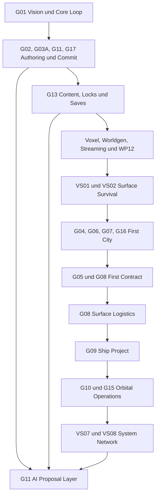
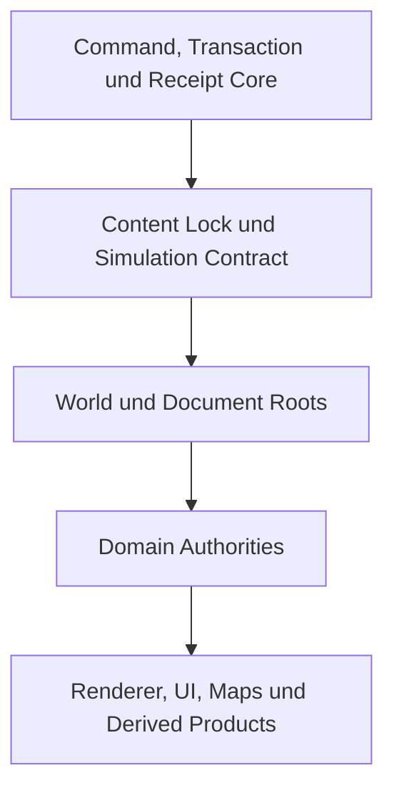
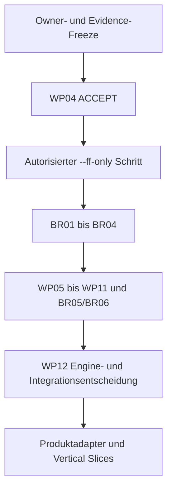

# WELTRAUM Feature Dependency Graph V1

## Dokumentstatus

| Feld | Wert |
|---|---|
| Stand | 2026-08-12 |
| Status | `REQUIRES_OWNER_DECISION` |
| Zweck | Fachliche und technische Abhängigkeiten in serieller Ausführungsreihenfolge |
| Produktintegration | Vor WP12 und separater Ownerfreigabe gesperrt |
| WP04 | `BLOCKED` bis Abschlussstatus `ACCEPT` und autorisierter `--ff-only`-Integrationsschritt |

Dieser Graph beschreibt Abhängigkeiten, keine implementierten Features. Ein Pfeil bedeutet: Der nachfolgende Knoten darf seine Authority oder Produktintegration nicht vor dem vorgelagerten Contract- oder Gate-Ergebnis festlegen.

## 1. Produktabhängigkeiten

AI hängt im Graphen bewusst spät an produktiven Mutationen. Read-only Analyse und Proposal-UX können früher isoliert erforscht werden. Commit- oder Publishfähigkeit bleibt trotzdem gesperrt.

## 2. Authority-Abhängigkeiten

| Authority | Besitzt | Benötigt vorher | Darf nicht besitzen |
|---|---|---|---|
| Authoring Gateway und CommitCoordinator | Policy, Prepare, Approval, CAS, atomare Veröffentlichung, Receipt | G02/G03A/G11/G17 Contract-Freeze | fachliche World-, Economy- oder Settlement-Wahrheit |
| Content Platform | Packages, Digests, Locks, Registry, Migration, Quarantäne | gemeinsamer Canonicalization- und Issuevertrag | laufenden Worldzustand oder Renderobjekte |
| World/Voxel Authority | Terrainzellen, World Edits, Regionen, physische Materialisierung | Voxel-Contracts, WP-Roadmap, WP12 | Eigentum, Geld, Missionen oder Gesellschaft |
| Settlement Authority | Roads, Parcels, Rights Bindings, Buildings, Services, Construction | World Bindings, Command Core, Content Locks | Cargo-, Geld- oder Produktionsledger |
| Economy Authority | Cargo, Geld, Produktion, Orders, Verträge, Routen, Deposits | G08 Contract, G07 Party-/Law-IDs, G06 Workforce Adapter | Personenidentität, Combat oder Voxelzustand |
| NPC/Society Authority | Personen, Beziehungen, Ziele, gesellschaftliche Historie | G06/G07 Contracts, globaler SimTick | Economy-Lose oder Mission Effects |
| Narrative Authority | Story-, Mission- und Dialogue-Graphen | G05 Contract, Gateway Effects, Text-/Localization-IDs | direkte World- oder Economy-Mutation |
| Ship/Vehicle Authority | Blueprint, Parts, Connections, Interfaces, Readiness | G09 Contract, Content Lock, Frame Adapter | gleichzeitige HVOX-Structural-Authority |
| Celestial System Authority | Bodies, Frames, State Vector, Systemzeit | G10 Contract und Math-Spike | UI-Layout oder Flugsteuerung |
| Presentation | Three.js, GLB, Mesh, Collider, Map, HUD, Heatmap | revisionsgebundene Domainprodukte | jede fachliche Authority |

## 3. Fachliche Feature-Abhängigkeiten

| Feature | Direkte Voraussetzungen | Nachgelagerte Verbraucher | Harte Konfliktgrenze |
|---|---|---|---|
| Crash Site | Worldgrundlage, Content Lock, Save, Interaction | Wilderness, Salvage, First Contract | kein freier City Builder |
| Wilderness Expedition | Worldgen, Hydrologie, Navigation, Survey | First City, Surface Mining | keine planetare Vollsimulation |
| First City | Settlement, NPC Identity, Law, authored Content | Contract Circuit, Surface Logistics | Population nicht durch sichtbare Agents definieren |
| First Contract | Mission Contract, Economy Ledger, Rights, Reputation | MVP-Abschluss, dynamische Angebote | Mission darf Reward/Cargo nicht selbst minten |
| Surface Logistics | Cargo, Warehouses, Routes, Vehicles, Damage/Repair | Ship Project, Orbital Economy | kein Systemindex als Warenpool |
| Ship Project | Buildergraph, Parts, Power/Thermal Adapter, Economy | First Launch, Orbital Operations | Partgraph und HVOX nicht gleichzeitig Authority |
| Orbital Economy | Ship/Flight, System Map, Mining Operations, Station Market | Contested Route | Cargo nie ohne Route und Reisezeit |
| Contested Route | Sensortracks, Combat Core, ROE, Law, Insurance | Two-System Network | kein unautorisierter Lethal- oder Drone-Autonomy-Pfad |
| Two-System Network | Planet-/Systempersistenz, Route Network, Diplomatie, LOD | späteres Endgame | kein Multiplayer als versteckte Voraussetzung |
| AI Copilot | alle relevanten Contracts, Validatoren, Capability Registry, Approval | authoringweite Assistenz | kein model-visible Committool |
| Data-only Modding | Packages, Locks, Migration, Save Compatibility, Quarantäne | Creator Content | kein JS/Wasm/native Code in V1 |

## 4. Technische Readiness-Kette

WP04 ist aktuell nicht als akzeptierte technische Grundlage belegt. Deshalb ist die Kante `D0 -> W4` blockiert. Weder ein Research-Bericht noch ein Prototyp ersetzt `ACCEPT` und den autorisierten `--ff-only`-Integrationsschritt.

## 5. Serielle Gatefolge

| Gate | Eintritt | Arbeit | Austritt | Sofortiger Stop |
|---|---|---|---|---|
| `FDG-00 Evidence Freeze` | G01 bis G17, Launch-Addendum und Prototype-Audit liegen vor | exakte Dateinamen, SHA-256, Status und Supersession festhalten | eindeutiges Source Manifest | aktive G03A- oder G04-Identitaet weicht vom Owner-Freeze ab oder eine andere Quellenidentitaet bleibt unklar |
| `FDG-01 Owner Decision Freeze` | `FDG-00 PASS` | MVP, Authority, Zeit, AI, Modding, Lizenz, Frames und Population entscheiden | versionierter Decision Record | Pflichtentscheidung fehlt oder widerspricht bindender Baseline |
| `FDG-02 Unified Contract Crosswalk` | `FDG-01 PASS` | G03A Command/Receipt, G13 Locks/Saves und G17 Validation/Issues ohne Paralleltypen zusammenführen | ein Contract-Set mit eindeutigen Ownern | zweite Authority, clientbehauptete Capability oder unklare CAS-Domäne |
| `FDG-03 WP04 Readiness` | unabhängiger WP04-Abschlussbericht liegt vor | Status und Evidence prüfen | exakt `ACCEPT` | jeder andere Status, fehlende Evidence oder unklarer Commitstand |
| `FDG-04 WP04 Integration` | `FDG-03 ACCEPT`, Ownerfreigabe und sauberer Zielstand | ausschließlich autorisierter `--ff-only`-Schritt | dokumentierter integrierter SHA | Mergecommit nötig, Divergenz, Konflikt oder anderer Write-Agent |
| `FDG-05 Benchmark Foundation` | `FDG-04 PASS` | BR01 bis BR04 gemäß bestehender Roadmap | reproduzierbare Contract-, Telemetry-, Runner- und Aggregator-Evidence | Diagnostic Timing wird als Produktclaim verwendet |
| `FDG-06 Voxel Lab Sequence` | `FDG-05 PASS` | WP05, WP06 und WP07 seriell, danach BR05 | akzeptierte Scheduler-/Pipeline-Evidence | stale Adoption, unbounded Queue oder fehlende Provenienz |
| `FDG-07 Advanced Voxel Sequence` | `FDG-06 PASS` | WP08 bis WP11 seriell, danach BR06 | akzeptierte Advanced-Pipeline-Evidence | Authority-Drift, Seamfehler oder verletzte Goldens |
| `FDG-08 WP12 Decision` | `FDG-07 PASS` | Engine-, Renderer- und Produktintegrationsentscheidung | akzeptierte WP12 ADR | vorgezogene Produktintegration oder unbelegte Performancewahl |
| `FDG-09 Content Foundation` | `FDG-02 PASS`, `FDG-08 PASS` für Produktpfad | G13.0 bis G13.3: Schemas, Digests, Registry, Hot Reload | immutable Content Root und negative Fixtures | stale Kandidat ändert Active Root, Lizenz oder Digest unklar |
| `FDG-10 Command and QA Core` | `FDG-02 PASS`, G03A-DR1 für Spike, G17-00 | Prepare/Commit, Receipts, Undo, Validation, Issues und E2E-Harness | atomare Contract-Goldens und Produktionsabwesenheitsnachweis | State ohne Receipt, Receipt ohne State, Mutator-Bridge oder feste Sleeps |
| `FDG-11 World and Save Foundation` | `FDG-09 PASS`, `FDG-10 PASS` | World Root, Checkpoint plus Tail, Content-/Generatorbindung | deterministischer Save/Load-Roundtrip | stille Migration, Hashbruch oder fehlende historische Bytes |
| `FDG-12 VS01 to VS03` | `FDG-11 PASS` | Crash Site, Wilderness und First Contract Circuit seriell | MVP-Exitkriterien erfüllt | Scope wächst in Ship, Orbit oder Vollstadt |
| `FDG-13 Settlement and City` | MVP PASS, G04 Ownerfragen, G16-0/1 | Road-/Parcel-Spike, City Contract, Utilities und Repair | VS04 Entry bereit | Polygon-/Lineagefehler, zweite Economy Authority oder WP04-Bypass |
| `FDG-14 Economy and Logistics` | `FDG-13 PASS`, G08-S0 | G08-S1 bis S6 headless und dann Surface Integration | Surface Logistics Golden und Slice PASS | Masse/Geld dupliziert, Cargo teleportiert oder Outcome rerolled |
| `FDG-15 Ship and Orbit` | `FDG-14 PASS`, G09/G10 Owner- und Spikegates | Ship Builder, Frame Adapter, First Launch, Station und Mining | VS05/VS06 PASS | Framekonflikt, zweite Solverauthority oder unbestätigte Extraktion |
| `FDG-16 Conflict and Network` | `FDG-15 PASS`, G07/G15 Entscheidungen | Contested Route und Two-System Network | VS07/VS08 PASS | unautorisierte Gewalt, LOD-Verlust oder Save-/Route-Bruch |
| `FDG-17 AI and Creator Expansion` | produktive Validatoren, Security Suite, data-only Registry | AI Proposal Layer und additive Creator Packages | getrennte Freigabe pro Domain | Autocommit, ausführbarer Modcode oder Approval-Bypass |

## 6. Zulässige Parallelität

Die Roadmap verwendet keine Mega-Parallelität.

- Read-only Research, Review und Quellenprüfung dürfen parallel laufen.
- Contractentscheidungen werden vor Code seriell eingefroren.
- Pro Repository arbeitet höchstens ein Write-Agent gleichzeitig.
- Ein Gate startet erst auf dem akzeptierten Stand des vorherigen Gates.
- Isolierte Spikes dürfen außerhalb des Produkts laufen, wenn ihr Scope, Zielpfad und Stop-Gate ausdrücklich freigegeben sind.
- Ergebnisse paralleler Spikes werden nicht direkt kombiniert. Sie werden nacheinander durch einen Contract- und Owner-Review adoptiert.
- Produktintegration wartet auf WP12 und einen konkret benannten Basis-SHA.

## 7. Aktuell blockierte Knoten

| Knoten | Status | Blocker |
|---|---|---|
| vollständige G03 Toolentscheidung | `BLOCKED` | G03A ist der final bestaetigte aktive Folgeeingang und die Spikecharter; der referenzierte Basis-Bake-off lag nicht separat vor, die Topologie-ADR fehlt |
| G03A Spike 1 | `REQUIRES_OWNER_DECISION` | `G03A-DR1` fehlt |
| WP04 Adoption | `BLOCKED` | kein nachgewiesenes `ACCEPT`, kein autorisierter `--ff-only`-Schritt |
| Product Voxel Integration | `BLOCKED` | WP12 und Ownerentscheidung fehlen |
| Settlement Product Implementation | `BLOCKED` | G04 Ownerfragen, G16 Spikes und Product World Ownership offen |
| Economy Product Integration | `BLOCKED` | G08-S0 bis S7 und Produktadapter fehlen |
| Ship Product Integration | `BLOCKED` | Frame-, Grid-, Physics- und Activation-Entscheidungen offen |
| AI Commit oder Publish | `NO_GO` in V1 | G11 verbietet model-visible Commitfähigkeit |
| Executable Mods | `NO_GO` in V1 | G13 erlaubt nur data-only Packages |
| Multiplayer | `DEFERRED` | kein akzeptierter Authority-, Conflict- oder Trust-Contract |

## 8. Abschlussstatus

Die Abhängigkeiten sind für eine serielle Roadmap ausreichend bestimmt. Der Start von Code- oder Integrationsarbeit bleibt an Source-, Owner-, WP04- und WP12-Gates gebunden.

**Status: `REQUIRES_OWNER_DECISION`**
