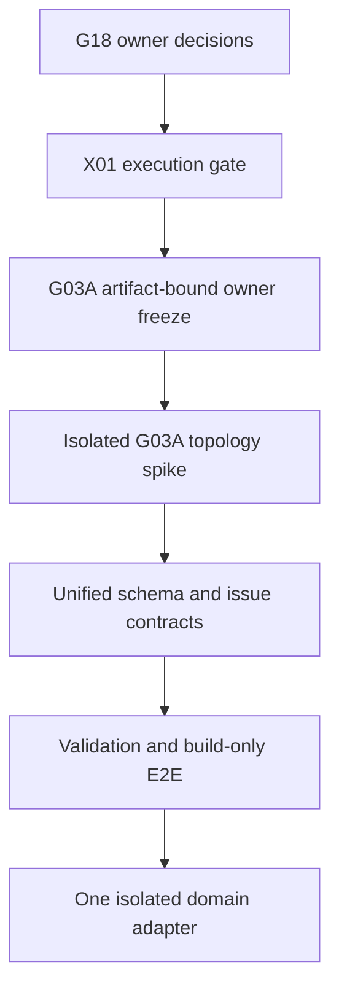

# WELTRAUM Technical Readiness Crosswalk

## Dokumentstatus

| Feld | Wert |
|---|---|
| Dokument | `TECHNICAL_READINESS_CROSSWALK.md` |
| Stand | 2026-08-12 |
| Status | `PROPOSED_FOR_OWNER_ACCEPTANCE` |
| Zweck | Trennung von Research-, Contract-, Spike-, Implementation-, Review- und Integrationsreife |
| Implementierungsnachweis | Keiner durch G18 |
| Produktfreigabe | Keine |

Dieses Crosswalk verhindert, dass ein Forschungsbericht, eine implementierungsreife Spezifikation, ein Prototyp, ein Reviewprotokoll oder diagnostische Evidence als implementierte und integrierte Produktfunktion ausgegeben wird.

Die Architektur steht in [AUTHORING_PLATFORM_ARCHITECTURE_V1.md](AUTHORING_PLATFORM_ARCHITECTURE_V1.md). Der Commandvertrag steht in [EDITOR_COMMAND_CONTRACT_V1.md](EDITOR_COMMAND_CONTRACT_V1.md). Prototypdetails gehören in [PROTOTYPE_ADOPTION_MATRIX.md](PROTOTYPE_ADOPTION_MATRIX.md).

## 1. Readiness-Vokabular

### 1.1 Quellenstatus bleibt unverändert

Dieses Dokument bewahrt den jeweiligen Quellenstatus. Es übersetzt ihn nur in eine G18-Disposition.

| Quellenstatus | Darf für G18 bedeuten | Darf nicht bedeuten |
|---|---|---|
| `READY_FOR_SYNTHESIS` | ausreichend für Architektur- und Roadmapsynthese | implementiert, getestet oder integriert |
| `REQUIRES_OWNER_DECISION` | konkrete Optionen und Blocker sind bekannt | Owner hat entschieden |
| `REQUIRES_SPIKE` | Richtung ist begründet, empirischer Korrektheitsbeleg fehlt | produktreif |
| `INSUFFICIENT_EVIDENCE` | Aussage bleibt offen | sichere Negativ- oder Positivaussage |
| `NO_GO` | die bezeichnete Option ist gesperrt | jede alternative Lösung ist gesperrt |
| `READY_FOR_LATER_IMPLEMENTATION` | Vertrag ist für einen späteren autorisierten Implementierungsslice konkret | Code existiert oder wurde ausgeführt |
| `REQUIRES_ADDITIONAL_RESEARCH` | Spezifikation besitzt definierte offene Forschungsfragen | implementierungsreif |
| `PROPOSED` | prüfbarer Vorschlag | angenommen |
| `ACCEPT` | tatsächlich ausgeführtes unabhängiges Gate wurde vollständig bestanden | gilt für andere Artefakte oder spätere Commits |

### 1.2 Normalisierte G18-Disposition

| Disposition | Bedeutung |
|---|---|
| `SYNTHESIS_INPUT` | darf in G18 mit Quellenstatus und Grenzen verwendet werden |
| `OWNER_BLOCKED` | nächste Arbeit beginnt erst nach dokumentierter Ownerentscheidung |
| `SPIKE_BLOCKED` | nur isolierter Spike kann die zentrale Unsicherheit schließen |
| `CONTRACT_READY_ONLY` | Spezifikation ist implementierungsnah, aber nicht implementiert |
| `REVIEW_PROTOCOL_ONLY` | Reviewverfahren ist bereit, das zu prüfende Ergebnis wurde nicht bewertet |
| `INTEGRATION_BLOCKED` | Übernahme in Produkt oder Hauptpfad ist gesperrt |
| `REFERENCE_ONLY` | UX-, Methoden- oder Toolreferenz ohne Code-/Produktadoption |
| `MISSING` | Artefakt liegt nicht vor, keine Aussage erfinden |
| `SUPERSEDED` | ältere Variante wird nicht doppelt gewichtet |

## 2. Truth- und Acceptance-Regeln

1. Nur im bereitgestellten Project Memory ausdrücklich als `ACCEPTED` dokumentierte Invarianten haben Vorrang vor älteren `RUNNING`-Einträgen des Research Registers. Eine separate Decision-Log-Datei ist im aktuellen G18-Quellenfreeze nicht als eigenständiges Artefakt vorhanden und wird hier weder als vorliegend noch als unabhängig akzeptiert behauptet.
2. Ein später datierter, vollständigerer Bericht derselben Domäne ersetzt eine ältere Kurzfassung nur, wenn Identität und Status nachvollziehbar sind.
3. Byteidentische Duplikate zählen als eine Quelle.
4. `READY_FOR_SYNTHESIS` ist keine Implementierungsfreigabe.
5. `READY_FOR_LATER_IMPLEMENTATION` ist kein Ausführungsnachweis.
6. Prototyp-UX ist kein Produktfeature, kein Authoritybeleg und kein Securitybeleg.
7. Diagnosezeiten, HUD-Werte, Traces und einzelne Browserläufe sind keine Benchmarks.
8. G18 ist read-only Synthese. G18 akzeptiert seine eigenen Vorschläge nicht.
9. C08 bleibt ein getrenntes späteres Artefakt mit eigener Evidence, eigenem Reviewer und eigenem Ergebnis.
10. P06 und X01 fehlen. Ihre Inhalte, Ergebnisse oder Status werden nicht erfunden.

Wenn ein Research-Bericht wie G03A oder G17 eine separate Decision-Log-Datei zitiert, ist dies für G18 ein quellengebundener Berichtshinweis. Es ersetzt weder das fehlende eigenständige Artefakt noch einen aktuellen G18-Ownerfreeze.

### 2.1 Eingefrorene aktuelle G03A-/G04-Artefakte

| Domäne | Exakter aktueller Dateiname | Bytes | SHA-256 | Freeze-Bedeutung |
|---|---|---:|---|---|
| G03A | `G03A_owner_freeze_command_receipt_rfc_spike1_plan_2026-08-12.md` | 98.649 | `052b292977229abfec977ac4a2ac6341b3a8e1aabbca7bee5400ea5c4a79f5da` | aktuelle Dateiidentitaet durch Launch-Addendum final bestaetigt; `G03A-DR1` als fachliche Spikefreigabe noch nicht `ACCEPTED` |
| G04 | `G04_settlement_city_builder_system_abschlussbericht_2026-08-12(1).md` | 114.241 | `cdb98f5404028b23f2c907fee3d4679bfb084a4dd05cee2eb72e72c1cd1efb54` | aktuelle Dateiidentitaet durch Launch-Addendum final bestaetigt; Bericht `COMPLETED`, Produktentscheidungen bleiben `PROPOSED` beziehungsweise `REQUIRES_OWNER_DECISION` |

Der Freeze identifiziert die ausgewerteten Bytes. Er ist keine Ownerannahme, keine Spikefreigabe und kein Implementierungsnachweis. Jede Änderung an einer dieser Dateien benötigt einen neuen SHA-256 und einen sichtbar versionierten Nachfolger.

## 3. G01 bis G17 Crosswalk

| ID | Domäne | Quellenstatus | G18-Disposition | Belastbar nutzbar | Harte Blocker | Nächster Entry Gate |
|---|---|---|---|---|---|---|
| G01 | Core Loop, Progression, Vertical Slices | `REQUIRES_OWNER_DECISION` | `OWNER_BLOCKED` plus `SYNTHESIS_INPUT` | Pillars, gemeinsame Ledgers, Slicefolge VS01 bis VS08 | Zeitziele, MVP-Grenze und konkrete First-City-Parameter | G01 Owner Freeze |
| G02 | Unified Authoring Platform | `REQUIRES_OWNER_DECISION` | `OWNER_BLOCKED` plus `SYNTHESIS_INPUT` | separate Developer- und Playerprodukte, gemeinsamer Commandkern, A0 bis A4, CAS | Appgrenze, Playerauthority, AI-Autocommit, A4-Governance | G02-D1 und G18 AP-00 |
| G03/G03A | Editor-/Tool-Technologie und Spikecharter | G03A `REQUIRES_OWNER_DECISION` | `OWNER_BLOCKED` | aktueller Freeze `G03A_owner_freeze_command_receipt_rfc_spike1_plan_2026-08-12.md` mit SHA-256 `052b2929...a79f5da`; präziser synthetischer Command-/Receipt-/Bridge-Spike, SEP-D versus OVR-D | `G03A-DR1` nicht akzeptiert, Topologie offen | nach X01: G03A `S1-00` mit artefaktgebundenem ACCEPT |
| G04 | Settlement/City Builder | `REQUIRES_OWNER_DECISION` | `OWNER_BLOCKED` | aktueller Freeze `G04_settlement_city_builder_system_abschlussbericht_2026-08-12(1).md` mit SHA-256 `cdb98f54...d1efb54`; semantische Roads, Parcels, Zones, Buildings und Utilities | Authority, Zeitmodell, Maßstab, Lizenzen und Spikebelege | G04 Owner Freeze, danach Road-/Parcel-Spike |
| G05 | Mission, Dialogue, Narrative | `REQUIRES_SPIKE` | `SPIKE_BLOCKED` | getrennte Story-/Mission-/Dialogue-Graphen, Conditions/Effects, headless Compiler | Ink-Entscheid, Graphcompiler und Simulatorbelege | G05 S0, dann Compiler-/Simulator-Spike |
| G06 | NPC Society und Simulation LOD | neuere Fassung `READY_FOR_SYNTHESIS` | `SYNTHESIS_INPUT` | persistente Individuen, FULL/REDUCED/COHORT/AGGREGATE, hybrid FSM/Utility/GOAP/BT | empirische Browser- und LOD-Equivalence-Gates, Offscreen-Death-Policy | G06 128-Entity-Headless-Gate |
| G06 alt | ältere Kurzfassung | ältere Variante | `SUPERSEDED` | nur Provenienz der Variantenbildung | nicht separat gewichten | keine |
| G07 | Factions, Guilds, Reputation, Law | `REQUIRES_OWNER_DECISION` | `OWNER_BLOCKED` plus `SYNTHESIS_INPUT` | Organisation getrennt von Settlement/Jurisdiction, Law Lifecycle, Diplomacy Events | politische und UX-Policies, Membership und Hidden Reputation | G07 Owner Freeze |
| G08 | Economy, Trade, Production, Logistics | `READY_FOR_SYNTHESIS` | `SYNTHESIS_INPUT` | deterministische Economy- und Logistikverträge des Berichts | Produktbudgets, Integration und ausgeführte Belastungstests weiterhin offen | erster isolierter Economy-Contract-Slice |
| G09 | Ship, Vehicle, Drone Builder | `REQUIRES_OWNER_DECISION`, Runtimephysics sekundär Spike | `OWNER_BLOCKED` | bestehendes Blueprintformat erweitern, Part-/Socket-/Interfacegraph, immutable Test Receipt | Achsenframe, Grid, V1/V2, Physicsversion, Modpolicy | Frame- und Contract-Freeze |
| G10 | Planet, System, Orbit Editor | `READY_FOR_SYNTHESIS` | `SYNTHESIS_INPUT` plus mathematischer Spike | `CelestialSystemDocumentV1`, State Vector at Epoch, Frame Tree, getrennte Views | Two-body-Mathematik, Ticktyp, Binaries und Lane-Semantik | isolierter Orbit-Math-Spike |
| G11 | AI Authoring Copilot | `READY_FOR_SYNTHESIS` | `SYNTHESIS_INPUT` | Proposal-only, Host Commit Coordinator, sealed Transaction, MCP nur Adapter | Provider-/Retention-/Approval-/Securitypolicy und Sandbox-Evidence | G11 Owner-/Policy-Freeze, dann isolierte Eval-Sandbox |
| G12 | Blender to HVOX | `REQUIRES_SPIKE` | `SPIKE_BLOCKED` | SourceScene to HVOX plus manifest, GLB Derived, 0,25 m Normvorschlag | Voxelizer, Blenderpin, Materialauthority, 0,125-m-Pilot und Rechte | G12 AT00, dann HVOX-/Voxelizer-Spike |
| G13 | Content, Modding, Versioning, Saves | `REQUIRES_OWNER_DECISION` | `OWNER_BLOCKED` | Package-, Digest-, Lock-, Hot-Reload-, Save-, Quarantäne- und Serververträge | Modcode, Namespace, Overrides, Savefenster, Voxel-Lab-Rechte | G13.0, danach G13.1/2 |
| G14 | UX Modes und Workspaces | `REQUIRES_OWNER_DECISION` | `OWNER_BLOCKED` plus `SYNTHESIS_INPUT` | orthogonale Modezustände, TargetRefs, getrennte Workspaces, DOM/CSS-UI | First City/Launch, Zeitpolicy, Pointer/Kamera und Construction Scope | UX00 Owner Freeze |
| G15 Hauptbericht | Combat, Mining, Drone Operations | `REQUIRES_OWNER_DECISION` | `OWNER_BLOCKED` | gemeinsamer Operationsloop, Sensor Tracks, Authority Damage/Mining, ROE | Lethal/Disable, Pause, Waffen, Droneloss, Law und Materialcatalog | G15 Owner Freeze |
| G15 Alternativbericht | Combat, Mining, Drone Operations | `READY_FOR_SYNTHESIS` | `SYNTHESIS_INPUT`, nicht doppelt gewichten | vorhandene Core-Preservation, O1 bis O3, LogicalV1 vor Voxel Structural | Statuskonflikt wird konservativ durch Hauptbericht blockiert | gemeinsamer G15 Decision Record |
| G16 | Procedural Settlement/City Generation | `REQUIRES_SPIKE` | `SPIKE_BLOCKED` | semantischer Featuregraph, Hybridlayout, OBB Parcels, globales World Log | Planetenrahmen, Geometry Core, Profile, Gebäudeownership, Golden Fixtures | G16-0/1, dann G16-2 |
| G17 | Editor QA, Validation, Playwright | `REQUIRES_OWNER_DECISION` | `OWNER_BLOCKED` | Command-/Undo-/Persistenzoracles, Validation Registry, build-only E2E, Evidence | Q01 bis Q14, Konfliktcrosswalk mit G03A | G17-00, danach G17-01/02 |

## 4. Cross-cutting Vertragsreife

| Vertrag | Stärkste Quelle | Readiness | Darf G18 festlegen | Darf G18 nicht behaupten |
|---|---|---|---|---|
| CPU-/Domain Authority | Project Memory sowie quellengebundene Aussagen in G02, G03A und G17 | Architekturgrundlage | Renderer bleibt Projection | vorhandene vollständige Implementation oder eine separat vorliegende Decision-Log-Datei |
| Command/Transaction/Receipt | G03A präzise, G02/G11/G17 ergänzend | `PROPOSED_FOR_OWNER_ACCEPTANCE` | gemeinsame Mutationsgrenze und Trusted Binding | akzeptiertes Product-Wireformat |
| Content Packages und Locks | G13 | `OWNER_BLOCKED` | Schichten, IDs, Digests und Lockrollen | Registryimplementation |
| Issue Contract | G13 und G17 | Contractkonflikt offen | Harmonisierungspflicht | finale Severityunion |
| Save/Checkpoint/Event Tail | G13, G16, G17, Planetbericht | Architekturgrundlage plus Spikebedarf | immutable Generationen und Replayinvariante | entschiedenes Binärformat |
| AI Proposal/Approval | G11, G02, G17 | Synthese-ready, Security-Gates offen | kein modellaufrufbarer Commit in v1 | sichere produktive AI-Funktion |
| Player Construction | G02, G14 | `OWNER_BLOCKED` | getrennte Capability-/Policyoberfläche | konkrete freigegebene Playercommands |
| City Feature Graph | G04 und G16 | `SPIKE_BLOCKED` | semantische Planung oberhalb Chunks | korrekter Generator oder Seams |
| HVOX Asset Authority | G12 und Assetbericht | `SPIKE_BLOCKED` | HVOX authoritative, GLB Derived | validierte Converterpipeline |
| Benchmark Evidence | BR01 bis BR04 | gemischt | klare Contract-/Diagnostikgrenze | Leistungssieger oder Budgetpass |

## 5. P-Prototypen und X01

### 5.1 Verfügbarkeitscrosswalk

| ID | Artefaktlage | G18-Gesamtklassifikation | Zulässige Nutzung | Unzulässige Schlussfolgerung |
|---|---|---|---|---|
| P01 | ZIP vorhanden | `ADAPT` | Editor-Shell-UX, Panels und Flow nach Abgleich mit G03A/G14 anpassen | Produkteditor, Authority, Codeadoption oder Bundle-Isolation |
| P02 | ZIP vorhanden | `ADAPT` | Mission-Graph-UX an getrennte Story-/Mission-/Dialogue-Verträge und den Headless Compiler anpassen | Narrative Compiler-, Runtime- oder Contractreife |
| P03 | ZIP vorhanden | `REFERENCE_ONLY` | Settlement-Editor-UX und Road-/Parcel-Flow als Reviewreferenz | Generator-, Seam-, Persistence- oder Codeadoption |
| P04 | ZIP vorhanden | `REFERENCE_ONLY` | Star-System-Map-UX und View-Hypothesen als Reviewreferenz | Orbitmathematik, Systemauthority oder Codeadoption |
| P05 | ZIP vorhanden | `ADAPT` | AI-Transaction-UX, Preview und Approvaldarstellung an Trusted Binding und getrennte Receipts anpassen | Security, Approvalbindung, Commit Coordinator oder Modellcommit |
| P06 | nicht vorhanden | `MISSING` | keine | Inhalt, Status, UX oder Adoption |
| X01 | nicht vorhanden | `MISSING` | keine | Ausführung, Integration, Akzeptanz oder Launchreife |

### 5.2 Adoptionregel

Für P01 bis P05 werden vier Achsen getrennt entschieden:

| Achse | Mögliche Entscheidung | Pflichtbeleg |
|---|---|---|
| UX/Flow | `ADOPT`, `ADAPT`, `REFERENCE_ONLY`, `REJECT` | Review gegen G14, Accessibility und Domainworkflow |
| Contract | `ADOPT`, `ADAPT`, `REFERENCE_ONLY`, `REJECT` | Abgleich mit G02/G03A/G11/G13/G17 |
| Code | `ADOPT`, `ADAPT`, `REFERENCE_ONLY`, `REJECT` | Source Review, Lizenz, SBOM, Tests und Integration Boundary |
| Assets | `ADOPT`, `ADAPT`, `REFERENCE_ONLY`, `REJECT` | Provenienz, Rechte, Format- und Art Gate |

Die Gesamtklassifikation ist für P01 `ADAPT`, P02 `ADAPT`, P03 `REFERENCE_ONLY`, P04 `REFERENCE_ONLY` und P05 `ADAPT`. Eine UX-Adoption oder -Anpassung darf nie automatisch Code-, Asset- oder Contractadoption auslösen.

## 6. WP04 und technischer Labpfad

### 6.1 WP04-Wahrheitsregel

Aktuell belastbar:

- WP04 Block-AO-/Palette-Research und technische Spezifikation liegen vor.
- Das unabhängige Reviewprotokoll trägt `READY_FOR_LATER_IMPLEMENTATION`.
- Dieser Status bewertet das Protokoll, nicht einen tatsächlichen WP04-Branch.
- Ein technischer Review kann zunächst höchstens `TECHNICAL_ACCEPT_VISUAL_PENDING` erreichen.
- Erst tatsächliches `ACCEPT` nach technischem Review und Owner-Visual-Gate ist ein Annahmestatus.

WP04-Code wird erst dann als integrierte technische Wahrheit behandelt, wenn zusätzlich zum `ACCEPT` ein autorisierter Fast-forward-Integrationsschritt mit `--ff-only` nachgewiesen ist. Vorher gilt für G18:

**WP04 disposition: `INTEGRATION_BLOCKED`.**

### 6.2 WP04-/WP05-nahe Crosswalk

| Artefakt | Quellenstatus | Disposition | Nächster Gate | Stop bei |
|---|---|---|---|---|
| WP04 Block AO/Palette Research | Research abgeschlossen, keine Implementierung behauptet | `SYNTHESIS_INPUT` | tatsächlicher Branchreview | Research als Codebeleg |
| WP04 Independent Review Protocol | `READY_FOR_LATER_IMPLEMENTATION` | `REVIEW_PROTOCOL_ONLY` | Protokoll auf exakten Branch/SHA anwenden | fehlende Evidence oder Owner-Visual-Gate |
| tatsächliches WP04 Reviewresultat | nicht vorhanden | `MISSING` | unabhängiger Review | Status erfinden |
| WP04 Fast-forward Integration | nicht vorhanden | `MISSING` | erst nach `ACCEPT`, autorisiert `--ff-only` | nicht fast-forward-fähige Basis oder fehlende Freigabe |
| WP05 Worker/Scheduler Report | Architekturbericht vorhanden | `SYNTHESIS_INPUT` | späterer akzeptierter Implementierungsslice | Implementierung aus Bericht ableiten |

### 6.3 Spätere Labfolge

Die akzeptierte grobe Reihenfolge bleibt:

```text
WP04 review and ACCEPT
-> authorized --ff-only integration
-> BR01, BR02, BR03, BR04 readiness closure
-> WP05, WP06, WP07
-> BR05
-> WP08, WP09, WP10, WP11
-> BR06
-> WP12 integration decision
```

Fehlende oder nicht abgeschlossene Elemente dürfen nicht übersprungen werden. G18 beginnt keine dieser Arbeiten.

## 7. Benchmark Research Crosswalk

| ID | Artefakt | Quellenstatus | G18-Disposition | Offene Grenze |
|---|---|---|---|---|
| BR01 | Benchmark Contracts und Provenienz | `READY_FOR_LATER_IMPLEMENTATION` | `CONTRACT_READY_ONLY` | keine Implementation oder Runs |
| BR02 | In-Browser Telemetrie | `READY_FOR_LATER_IMPLEMENTATION` | `CONTRACT_READY_ONLY` | Rohtelemetrie, keine Aggregation oder Memoryclaims |
| BR03 | Playwright/CDP Runner | `READY_FOR_LATER_IMPLEMENTATION` | `CONTRACT_READY_ONLY` | tatsächlicher Runner und Environmentruns fehlen |
| BR04 | Aggregator | `REQUIRES_ADDITIONAL_RESEARCH` | `SPIKE_BLOCKED` | verpflichtende Forschungsfragen und gültige Aggregationskette fehlen |
| BR05 | Memory-/Leak-Gate | nicht im Quellenpaket | `MISSING` | keine Peak-Memory- oder Leakfreigabe |
| BR06 | spätere Integrations-/Benchmarkstufe | nicht im Quellenpaket | `MISSING` | nachgelagerte Readiness blockiert |

Folgerung:

- Korrektheits- und Evidenceverträge dürfen entworfen werden.
- Kein Performancewinner wird erklärt.
- G03A-, G16- oder G17-Diagnostik bleibt `measurementEligible: false`, solange die volle Kette nicht gilt.
- Memory-/Leakclaims bleiben ohne BR05 blockiert.

## 8. Lizenz, Provenienz und Distribution

| Artefakt | Status | Disposition | Auswirkung |
|---|---|---|---|
| Open-Source-/GitHub-License-Audit | Bericht vorhanden | `SYNTHESIS_INPUT` | keine GPL-, NC-, proprietären oder ungeklärten Bytes übernehmen |
| C06 Voxel-Lab License/Contribution Decision Brief | `REQUIRES_OWNER_DECISION` | `OWNER_BLOCKED` | öffentliche Lizenz, Commercial License, Contributions und AI-Origin offen |
| Voxel-Lab-Repositorylizenz am Prüfstand | keine belastbare LICENSE nachgewiesen | `INTEGRATION_BLOCKED` | keine Drittübernahme oder Distribution ableiten |
| G13 Provenance/License Contract | vorgeschlagen | `OWNER_BLOCKED` | Release verlangt Rights Basis, Review und Paketlineage |
| Prototypcode und Assets | separate Prüfung erforderlich | `REFERENCE_ONLY` | keine Adoption allein aus ZIP-Verfügbarkeit |

Ein Owner kann First-Party-Rechte separat dokumentieren. Das ersetzt nicht die Prüfung von Drittbeiträgen, Assets, Fonts, Modellen, Trainings-/Referenzdaten und Transitiven.

## 9. Tool Readiness

| Tool oder Ansatz | Vorgeschlagene Rolle | Readiness | Gate |
|---|---|---|---|
| Three.js `0.185.1` | aktuelle Browser- und G03A-Spike-Referenz | Referenz, keine finale Engineentscheidung | G03A Gate 1, final WP12 |
| Raw WebGPU | neutraler WP10-Vergleichspfad | späterer Spike | WP10 und BR-Kette |
| Dockview Core `8.0.0` | no-React Shellhypothese im isolierten G03A-Spike | nur nach G03A Owner Freeze | G03A S1-01/06 |
| React Flow | Mission-/Graphprojektion | späterer UI-Kandidat | G05 Compiler zuerst, Lizenzpin |
| Blender 5.2 LTS | primäres DCC | Toolentscheidung vorgeschlagen | G12 Owner-/Versionfreeze |
| HVOX | Asset-/Voxel-Authorityformat | Contract-/Spikephase | G12 HVOX- und Convertergates |
| GLB 2.0 | Derived Proxy/Delivery | zulässig als Derived | niemals alleinige Authority |
| Rapier | Physics-/Colliderkandidat | späterer Spike | Physics- und Lizenzpin |
| Recast Navigation | abgeleiteter Navmesh-Kandidat | späterer Spike | npm/Wasm-Pin und Semantic-Graph-Gate |
| Clipper2 | Integer-Polygonkern-Kandidat | G16-Spikeoption | G16-0 Lizenz-/Geometry-Entscheid |
| MCP | AI-/Tooltransportadapter | späteres Adaptergate | niemals Authority oder Berechtigungsbeweis |

## 10. G18-Output Readiness

| G18-Artefakt | Zweck | Readiness | Annahmebedarf |
|---|---|---|---|
| `MASTER_GDD_V1.md` | systemisches Spiel- und Scopebild | `PROPOSED_FOR_OWNER_ACCEPTANCE` | Gameplay- und Sliceentscheidungen |
| `AUTHORING_PLATFORM_ARCHITECTURE_V1.md` | Plattform- und Produktgrenze | `PROPOSED_FOR_OWNER_ACCEPTANCE` | AP-00 Owner Freeze |
| `EDITOR_COMMAND_CONTRACT_V1.md` | gemeinsame Mutationsgrenze | `PROPOSED_FOR_OWNER_ACCEPTANCE`, zusätzlich `REQUIRES_OWNER_DECISION` | ECV1-00 und Schema-Crosswalk |
| `FEATURE_DEPENDENCY_GRAPH.md` | Abhängigkeiten und Blocker | Planungsartefakt | Owner bestätigt Gateordnung |
| `VERTICAL_SLICE_ROADMAP.md` | produktseitige Slicefolge | Planungsartefakt | Scope-, Zeit- und Contententscheidungen |
| `TOOL_DECISION_LOG.md` | Adopt/Build/Spike/Reject | Entscheidungsentwurf | Owner-/Lizenzgates |
| `OPEN_OWNER_DECISIONS.md` | offene Entscheidungen | Handlungsregister | dokumentierte Entscheidungen |
| `PROTOTYPE_ADOPTION_MATRIX.md` | P-Artefakte nach UX/Contract/Code/Assets | Reviewartefakt | kein Code-/Assetadopt ohne Evidence |
| `TECHNICAL_READINESS_CROSSWALK.md` | Truth- und Reifegrenzen | `PROPOSED_FOR_OWNER_ACCEPTANCE` | unabhängige Prüfung |
| zehn Folgeprompts | kleine spätere Gates | Handoffentwürfe | jeweilige Entry-/Exit-/Stopbedingungen |

Kein G18-Artefakt ist ein C08-Pass, WP04-`ACCEPT`, `--ff-only`-Integrationsnachweis oder X01-Ausführungsnachweis.

## 11. Critical Path zur ersten verantwortbaren Implementation



Dieser Pfad folgt dem Launch-Addendum: zuerst X01, danach der isolierte G03A-Topologiespike. X01 liegt aktuell nicht vor, daher ist der Pfad an diesem Gate blockiert. C08 ist davon getrennt und weder Voraussetzung noch Knoten dieser G18-Folgequeue. Der Pfad ist ebenfalls vom WP04-/Labpfad getrennt. Eine spätere Produktintegration benötigt zusätzlich WP12 und die vollständigen Integrations-, Lizenz- und Evidencegates.

## 12. Serielle Readiness-Gates

| Gate | Entry | Exit | Stop bei |
|---|---|---|---|
| `TR-00 Source Freeze` | vollständiges G18-Quelleninventar | eindeutige aktuelle Variante je Domain, Missing-Liste bestätigt | unaufgelöste Dublette oder fehlende Pflichtquelle |
| `TR-01 Owner Decision Pack` | G18-Drafts vollständig | P0-Entscheidungen mit Datum, Owner und Scope | unentschiedene Authority-, AI-, Player-, Save- oder Lizenzfrage |
| `TR-02 X01 Execution Gate` | G18 Owner Decision Pack abgeschlossen und X01-Auftrag eingefroren | eigenständiges X01-Artefakt mit zulässigem Ergebnis, Evidence und expliziter Freigabe für den nächsten Gate | X01 fehlt, scheitert oder gibt den G03A-Spike nicht frei |
| `TR-03 G03A Acceptance` | `TR-02 PASS`, exakte Datei `G03A_owner_freeze_command_receipt_rfc_spike1_plan_2026-08-12.md`, SHA-256 `052b292977229abfec977ac4a2ac6341b3a8e1aabbca7bee5400ea5c4a79f5da` und Decision Record | `G03A-DR1 ACCEPTED` oder Stop | fehlender artefaktgebundener Freeze oder Digestabweichung |
| `TR-04 Isolated G03A Topology Spike` | `TR-03 PASS`, isolierter Ort, SBOM | Gate-1-ADR, `REQUIRES_OWNER_DECISION` oder `NO_GO` | Produktimport, Partial Commit, Scope Creep oder Beginn eines Folgegates |
| `TR-05 Contract Unification` | Spike Evidence und G13/G17 Ownerfreeze | ein Command-, Receipt-, Issue- und Save-Crosswalk | parallele Authorities oder Receiptvermischung |
| `TR-06 QA Foundation` | Contractgoldens PASS | Validatoren, build-only E2E und Recovery-Evidence | Mutator-Bridge, stale Adoption, feste Sleeps |
| `TR-07 WP04 Acceptance` | tatsächlicher exakter WP04-Branch | unabhängiges `ACCEPT` mit Owner-Visual-PASS | `TECHNICAL_ACCEPT_VISUAL_PENDING`, P0/P1/P2 oder fehlende Evidence |
| `TR-08 WP04 Integration` | `TR-07 PASS`, autorisierte Zielbasis | nachgewiesener Fast-forward mit `--ff-only` | nicht fast-forward-fähig oder fehlende Freigabe |
| `TR-09 BR Closure` | BR01 bis BR04 Verträge vollständig | implementierte und validierte Kette, bei Memory zusätzlich BR05 | BR04 Research offen oder ungültige Provenienz |
| `TR-10 WP12 Decision` | alle vorgelagerten Lab- und Integrationgates | explizite Engine-/Produktintegrationsentscheidung | Research- oder Diagnostikevidence allein |

## 13. Stop Conditions

Readiness wird sofort zurückgestuft oder Arbeit gestoppt, wenn:

- ein Prototyp als Produktfunktion bezeichnet wird;
- `READY_FOR_SYNTHESIS` oder `READY_FOR_LATER_IMPLEMENTATION` als Codebeleg verwendet wird;
- P06- oder X01-Inhalte erfunden werden;
- WP04 vor tatsächlichem `ACCEPT` und `--ff-only` als integriert gilt;
- G18 als C08-Review oder Selbstfreigabe verwendet wird;
- G03A ohne artefaktgebundenen Owner Freeze implementiert wird;
- ein Receipt-Typ die Authority eines anderen Receipt-Typs behauptet;
- UI, Renderer oder Testharness zur World Authority wird;
- AI, MCP oder Client Capability/Approval selbst behauptet;
- eine Diagnose als Benchmark oder Performancewinner ausgegeben wird;
- Voxel-Lab- oder Prototypbytes ohne dokumentierte Rechtebasis übernommen werden;
- Produktintegration vor WP12 und separater Ownerentscheidung begonnen wird.

## 14. Offene Readiness-Entscheidungen

1. Welche G18-Teilentscheidungen akzeptiert der Owner, welche bleiben Proposal?
2. Falls C08 separat beauftragt wird: Wer reviewt es mit welchem Scope und welchen Stop-Gates, ohne die G18-Folgequeue oder X01 zu blockieren?
3. Wird `G03A-DR1` artefaktgebunden akzeptiert?
4. Welche G03A-Topologieentscheidung darf Gate 1 tatsächlich treffen?
5. Welche G13-/G17-Vertragspunkte müssen vor einem Spike vereinheitlicht werden?
6. Welches G06- und G15-Artefakt wird im formellen Quellenregister als primär markiert?
7. Welche tatsächliche WP04-Branchbasis soll später geprüft werden?
8. Wer ist unabhängiger WP04-Reviewer und wer entscheidet das Visual Gate?
9. Welcher Zielbranch darf nach `ACCEPT` per `--ff-only` integriert werden?
10. Welche offenen BR04-Forschungsfragen blockieren die Aggregatorkette konkret?
11. Sind BR05 und BR06 beauftragt, und welche Eingangsverträge gelten?
12. Ist P06 noch zu liefern oder aus dem Scope zu entfernen?
13. Ist X01 geplant, und welche Art von Ausführung soll es beweisen?
14. Welche Prototypteile dürfen nach dem separaten Matrixreview nur als UX übernommen werden?
15. Welches einzelne Domainadapter-Gate folgt nach einem erfolgreichen Commandkern?

## 15. Schlussstatus

Die Quellenlage reicht für eine belastbare G18-Synthese und eine genaue Blockerkarte. Sie reicht nicht für die Behauptung einer implementierten Authoring-Plattform, eines akzeptierten WP04-Branches, einer Produktintegration, eines Performancepasses oder einer Launchfreigabe.

**Status: `PROPOSED_FOR_OWNER_ACCEPTANCE`**

Die nächste verantwortbare Folge ist das Owner Decision Pack, danach X01 und erst nach dessen zulässigem Ergebnis sowie artefaktgebundener Annahme der isolierte G03A-Topologiespike. C08 bleibt ein unabhängiger Vorgang außerhalb dieser Reihenfolge.
