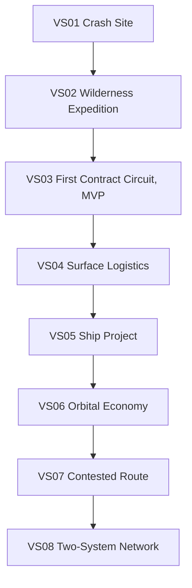

# WELTRAUM Vertical Slice Roadmap V1

## Dokumentstatus

| Feld | Wert |
|---|---|
| Stand | 2026-08-12 |
| Status | `REQUIRES_OWNER_DECISION` |
| Quelle der Slice-Folge | G01 |
| MVP-Grenze | nach `VS03 First Contract Circuit` |
| Produktintegration | vor WP12 und separater Freigabe gesperrt |
| WP04 | `BLOCKED` bis `ACCEPT` plus autorisierter `--ff-only`-Integrationsschritt |

Zeitangaben wie „erste Stadt nach 60 bis 90 Minuten“ oder „Orbit nach 15 bis 20 Stunden“ bleiben Ownerentscheidungen. Diese Roadmap definiert System- und Erlebnisgates, keine unbelegten Entwicklungs- oder Spielzeitversprechen.

## 1. Serielle Spielerreise

Jeder Slice muss die gemeinsame Schleife `Verstehen -> Sichern -> Verarbeiten oder Konfigurieren -> Transportieren oder Einsetzen -> Erfüllen -> Konsequenz` vollständig oder als klarer Teilkreislauf zeigen.

## 2. Slice-Regeln

1. Ein Slice startet erst, wenn sein Entry Gate dokumentiert bestanden ist.
2. Ein Slice gilt erst als abgeschlossen, wenn seine fachlichen Exit Criteria und Save-/Reload-Oracles bestanden sind.
3. Scope außerhalb der Ausschlussliste benötigt eine neue Ownerentscheidung.
4. Prototypen dürfen UX-Fragen beantworten, aber kein Entry Gate als Produktcode erfüllen.
5. Jeder fachliche Commit läuft über den gemeinsamen Command-, Transaction- und Receipt-Kern.
6. Jeder Slice bindet exakte Content-, Generator-, Schema- und Saveversionen.
7. Keine Slice-Abnahme verwendet Diagnostic Timing als Performanceevidence.
8. WP04-abhängige Technik bleibt blockiert, bis `ACCEPT` und der autorisierte `--ff-only`-Schritt vorliegen.

## 3. VS01 Crash Site

### Spielergebnis

Der Spieler erwacht an einer beschädigten Landestelle, versteht seine unmittelbare Lage, birgt verwertbares Material, stellt eine minimale sichere Basisfunktion wieder her und erzeugt den ersten dauerhaften Welt- und Inventarfortschritt.

### Entry Gate

- G01 Core Loop und MVP-Fantasie sind bestätigt.
- gemeinsamer Content-, Save- und Commandvertrag ist eingefroren;
- World-/Voxel-Authority und Presentation sind getrennt;
- minimaler authored Crash-Site-Content besitzt eindeutige IDs und Provenienz;
- keine Produktintegration verwendet WP04 vor `ACCEPT` plus autorisiertem `--ff-only`;
- mindestens ein deterministisches Save-/Reload-Fixture ist definiert.

### Enthaltene Domänen

- G01 Core Loop und physische Agency;
- G12 Asset-/HVOX-Referenzen für freigegebene Assets;
- G13 Content Locks und Savebindung;
- G14 Primary Control, TargetRefs, Inventory-/Inspect-Overlays;
- minimale G08 Cargo-Lots, Eigentum, Custody und Location;
- authored G05 Objective Chain ohne dynamische Missiongenerierung;
- lokale G17 Validation, Issues und semantische E2E-Oracles.

### Kernablauf

1. Umgebung und beschädigte Komponenten inspizieren.
2. mindestens ein physisches Salvage-Los bergen.
3. Masse, Volumen, Toolfähigkeit oder Energiegrenze verstehen.
4. eine Basisfunktion reparieren oder konfigurieren.
5. einen nachvollziehbaren Receipt- und Savezustand erzeugen.

### Exit Criteria

- Salvage entsteht nur aus bestätigter physischer oder authored Quelle;
- Cargo besitzt stabile ID, Eigentum, Custody und Standort;
- eine Reparatur konsumiert Input genau einmal;
- Undo ist im Developer Authoring korrekt, Gameplayänderungen verwenden nach Commit Reparatur oder Compensation;
- Save, Reload und Replay ergeben denselben fachlichen Zustand und dieselben Content Locks;
- UI und Renderer besitzen keine zweite World- oder Inventory-Authority;
- der Spieler kann Ursache, Handlung und Folge des ersten Loops erklären.

### Stop Gate

Sofort stoppen bei:

- Cargo- oder Materialduplikation;
- Save ohne exakte Content-/Generatorbindung;
- direkter UI- oder Three.js-Write auf Domainzustand;
- unklarer Asset- oder Codeprovenienz;
- Scope-Ausweitung in freie Stadt-, Ship- oder Orbitmechanik.

### Ausgeschlossen

- prozedurale Großlandschaft;
- First City Simulation;
- Markt und dynamische Preise;
- Player Builder;
- freie Destruction Sandbox;
- AI Copilot als Produktfunktion;
- Multiplayer.

## 4. VS02 Wilderness Expedition

### Spielergebnis

Der Spieler verlässt die Crash Site, plant eine kleine Expedition, navigiert durch eine reproduzierbare Landschaft, sammelt Surveywissen oder Ressourcen und kehrt mit begrenztem Material und neuen Handlungsmöglichkeiten zurück.

### Entry Gate

- VS01 vollständig bestanden;
- Worldgen-Feature-/Constraint-Pipeline, Hydrologie und lokale 3D-Strukturen besitzen versionierte Fixtures;
- Navigation unterscheidet bekannte, unbekannte und nicht materialisierte Gebiete;
- Surveywissen ist von Ground Truth getrennt;
- Workerresultate sind nur revisionsgebundene Kandidaten;
- planetare Produktintegration bleibt bis WP12 gesperrt.

### Enthaltene Domänen

- Voxel Landscape und Hydrologie;
- G06 lokale Gefahr- oder Begleiterreaktionen in kleinem Scope;
- G08 Survey, Deposit-Signatur und begrenzte Cargo-Logistik;
- G14 Navigation, System-/Local-Map-Handoff und TargetRefs;
- G13 Generatorversion, Event-Tail und Savebindung;
- minimale G15 Drone- oder Tool-Observation nur, falls ohne Operations-Scope-Creep möglich.

### Kernablauf

1. Ziel, Route, Last und Rückkehrreserve planen.
2. Gelände, Wasser, Gefahr und Coverage lesen.
3. eine Signatur untersuchen oder begrenztes Material gewinnen.
4. Tool-, Energie-, Kapazitäts- oder Wettergrenze bewältigen.
5. mit Wissen und Cargo zur Basis zurückkehren.

### Exit Criteria

- gleicher Seed, Generatorstand und Event-Tail ergeben dieselbe relevante Landschaft;
- Hydrologie und harte Voxeloberfläche widersprechen einander nicht im Fixture;
- `missing_coverage` wird nie als Air oder freier Baugrund behandelt;
- Survey zeigt Unsicherheit und verändert Ground Truth nicht;
- Extraktion und Cargoerzeugung sind idempotent und massenerhaltend;
- LOD, Kameradistanz und Workerreihenfolge verändern kein fachliches Ergebnis;
- Save während Expedition und nach Rückkehr reproduziert Route, Wissen, Cargo und Weltzustand.

### Stop Gate

- Terrain- oder Wasserwahrheit hängt von Renderdaten ab;
- Workeradoption ohne passende Epoch, Revision oder Inputdigest;
- Deposit oder Loot wird bei Reload neu gewürfelt;
- Expedition benötigt bereits Stadt-, Ship- oder planetare Vollsimulation;
- Performancebehauptung ohne BR01-/BR02-Kampagne.

### Ausgeschlossen

- autonome NPC-Gesellschaft;
- vollständige Mining-Industrie;
- Surface Logistics Network;
- prozedurale Stadt;
- Ship Builder und Orbit;
- globales Planetstreaming als Produktversprechen.

## 5. VS03 First Contract Circuit, MVP

### Spielergebnis

Der Spieler erreicht die First City, versteht eine reale lokale Knappheit, erhält durch Beziehung oder Recht Zugang zu einem Vertrag, beschafft oder verarbeitet das benötigte Gut, liefert es physisch und erlebt materielle, wirtschaftliche, rechtliche und soziale Folgen.

Dieser Slice muss sich wie eine kleine Version des späteren Spiels anfühlen. Nach seinem Abschluss ist das MVP erreicht.

### Entry Gate

- VS02 vollständig bestanden;
- authored First-City-Ort mit stabilen Settlement-, Building-, NPC- und Organization-IDs;
- G05 Mission Contract, G07 Rights und G08 Delivery Contract besitzen eindeutige Adapter;
- G08 Cargo-, Currency-, Escrow- und Delivery-Proof-Minimum ist deterministisch;
- G06 persistente NPC-Identität ist von sichtbarer Agentenprojektion getrennt;
- G13 Save bindet Content, Economy, NPC, Mission und Worldstände;
- G17 Issues, Quick Fixes und Playwright-Oracles umgehen keine Authority.

### Enthaltene Domänen

- G01 First Contract Circuit;
- G04 authored First-City-Semantik in kleinem Scope;
- G05 authored MissionGraph und DialogueGraph;
- G06 persistente Schlüsselpersonen und begrenztes Verhalten;
- G07 Organisation, Mitgliedschaft, Rights und Reputation;
- G08 lokaler Bestand, eine Produktions- oder Servicekette, echter Delivery Contract, Escrow und Zahlung;
- G14 Dialogue-, Inventory-, City- und Contract-UX;
- G17 end-to-end Validation und Evidence.

### Kernablauf

1. lokale Organisation, Dienst oder Betrieb kennenlernen.
2. reale Ursache des Bedarfs verstehen.
3. Zugang, Recht oder Mitgliedschaft für den Auftrag erhalten.
4. Input sichern und einen kleinen Prozess oder Transport durchführen.
5. Cargo am richtigen Ort und innerhalb der Vertragsbedingungen übergeben.
6. Reward, Reputation, Relationship oder Access als Receipt-basierte Folge erhalten.
7. Konsequenz im Cityzustand beobachten.

### Exit Criteria

- Mission und Economy teilen keinen Mutationspfad: Mission referenziert Economy- und World-Receipts;
- Reward ist finanziert und wird nicht vom Narrativsystem gemintet;
- Lieferung benötigt reales Cargo, Custody, Location und Delivery-Proof;
- Rechte, Reputation und Beziehungen werden nachvollziehbar aktualisiert;
- mindestens ein Failure- oder Delaypfad bleibt recoverable und erklärt seine Ursache;
- Save/Load reproduziert Vertrag, Cargo, Geld, Rechte, NPC-Beziehungen und Weltfolge;
- ein kompletter Core Loop ist ohne Developerwerkzeug spielbar;
- alle MVP-Features besitzen klaren Scope und keine versteckte Orbitabhängigkeit.

### Stop Gate

- Narrative Effect mutiert World oder Economy direkt;
- NPC- oder Marktbedarf ist unendlich oder ohne Budget;
- Vertrag kann ohne Cargo, Route oder Zahlung abgeschlossen werden;
- Citysimulation wächst vor MVP in autonome Zoning-, Traffic- oder Vollökonomie;
- AI erzeugt oder commitet Missionen zur Laufzeit;
- Save kann akzeptierte Verpflichtungen nicht reproduzieren.

### Ausgeschlossen

- freier Settlement Builder;
- autonome Stadtentwicklung;
- vollständige Call-Auction-Marktwirtschaft;
- Surface Fleet Automation;
- Ship Builder;
- Orbit, Combat und Piraterie;
- ausführbare Mods und Multiplayer.

### MVP-Abnahme

Das MVP ist nur erreicht, wenn VS01, VS02 und VS03 gemeinsam die spätere Spielerfantasie glaubhaft abbilden. Eine reine Questkette ohne physische, wirtschaftliche und soziale Authority reicht nicht.

## 6. VS04 Surface Logistics

### Spielergebnis

Der Spieler stabilisiert einen kleinen operativen Stadtbezirk, baut oder repariert Straßen und Dienste, verbindet Gewinnung, Lager, Produktion und Markt und automatisiert die erste begrenzte Route.

### Entry Gate

- MVP vollständig bestanden und Scope erneut bestätigt;
- G04 Ownerfragen zu City-Scope, Rechten, Zeit und WorldTransaction-Owner entschieden;
- G16-0 und G16-1 bestanden;
- isolierter Road-/Parcel-Spike besteht Topologie-, Frontage-, Lineage- und Coverage-Invarianten;
- G08-S0 bis mindestens S4 headless bestanden;
- G06/G04-Populationsadapter verhindert Identitätsverlust;
- WP04-abhängige Technik weiterhin nur nach `ACCEPT` plus autorisiertem `--ff-only`.

### Enthaltene Domänen

- G04 Roads, Parcels, Frontage, Buildings, Utilities, Construction und Repair;
- G06 First-City-LOD und Workforce-Referenzen;
- G07 Landrechte und Jurisdiction Policies;
- G08 Warehouses, Facilities, Recipes, Call Auctions, Contracts, Vehicles/Drones und Reorder-Regeln;
- G16 authored Reservations und begrenzte lokale Generation;
- Damage Adapter aus World/Structural in Settlement und Economy;
- Player Construction Workspace mit enger Capability-Allowlist.

### Kernablauf

1. Engpass oder Schaden diagnostizieren.
2. Road, Parcel, Utility oder Facility planen.
3. Rechte, Terrain, Material, Budget und Kapazität reservieren.
4. Bau oder Repair phasenweise committen.
5. Route und Lagerfluss herstellen.
6. erste Reorder- oder Routenvorlage aktivieren.
7. Wirkung auf Versorgung, Jobs, Markt und Bevölkerung beobachten.

### Exit Criteria

- Road-, Parcel- und Frontage-IDs bleiben über kleine Edits nachvollziehbar;
- Settlement- und World-Commit verwenden einen journalgestützten, idempotenten Coordinatorpfad;
- Bau und Reparatur konsumieren Material genau einmal;
- G08 bleibt alleinige Economy Authority;
- 128 x 128 m Detailfenster funktioniert mit 80 bis 250 aktiven Einwohnern, ohne die 2.048 persistierenden First-City-Identitäten zu verlieren;
- Surface Route transportiert Cargo ohne Teleport und mit realer Kapazität;
- Foundry- oder Utility-Störung erzeugt emergente, erklärbare Folgen;
- Player- und Developer-Modus erzeugen bei gleichen Capabilities denselben Domainzustand.

### Stop Gate

- zweite Economy-, Road- oder World-Authority;
- Parcel-Lineage oder Flächenbilanz bricht;
- `missing_coverage` wird bebaut;
- Population wird beim LOD-Wechsel dupliziert oder gelöscht;
- Systemindex hält Cargo;
- Produktintegration nutzt ungeprüfte WP04-Arbeit.

### Ausgeschlossen

- vollständige prozedurale Großstadt;
- autonomes Zoningwachstum;
- Stadtweite Mikrosimulation aller Personen und Fahrzeuge;
- Ship Builder und Orbit;
- bewaffnete Drones;
- allgemeine AI-District-Autonomie.

## 7. VS05 Ship Project

### Spielergebnis

Der Spieler finanziert, konstruiert, prüft und aktiviert sein erstes flugfähiges Fahrzeug oder Schiff aus denselben Material-, Produktions-, Rechte- und Engineering-Systemen, die zuvor an der Oberfläche verstanden wurden.

### Entry Gate

- VS04 vollständig bestanden;
- G09 Ownerentscheidungen zu Frames, Raster, V1/V2, Catalog/HVOX und Activation Receipt getroffen;
- Frameadapter zwischen Builder und Flight ist spezifiziert und getestet;
- Fuel-, Power- und Thermal-Adapter verwenden bestehende Authorities, keine zweiten Solver;
- Ship- und Part-Content ist über G13-Pakete und Locks gebunden;
- Economy besitzt reale Material-, Facility-, Labor- und Budgetpfade.

### Enthaltene Domänen

- G09 Blueprint, Parts, Sockets, Connections, Interfaces, Stats und Readiness;
- G08 Beschaffung, Produktion, Finanzierung, Werftkapazität und Cargo;
- G07 Lizenz, Ownership und Betriebsrecht;
- G12 HVOX-Parts und Assetmanifest;
- bestehende Flight-, Power- und Thermal-Cores über Adapter;
- G14 Construction Workspace, Flight-Handoff und Readiness-UX.

### Kernablauf

1. Zielprofil und zulässige Parts wählen.
2. Material, Budget, Facility und Rechte sichern.
3. funktionalen Partgraph konstruieren.
4. Masse, Schwerpunkt, Trägheit, Wrench, Fuel, Power, Thermal und Struktur validieren.
5. immutable Test-Flight-Snapshot erzeugen.
6. Fehler beheben und Activation Receipt erhalten.

### Exit Criteria

- Buildergraph ist alleinige funktionale Build-Authority;
- physische und Renderprojektionen sind digestgebunden;
- Framekonvertierung ist eindeutig und ohne versteckten Axis-Swap;
- Test Flight bindet genau den geprüften Blueprint-Snapshot;
- Aktivierung ist ohne Readiness Receipt unmöglich;
- Baukosten, Material und Facilityzeit werden genau einmal gebucht;
- Save/Load reproduziert Blueprint, Connections, Stats, Receipts und Content Locks.

### Stop Gate

- Partgraph und HVOX besitzen gleichzeitig Structural Authority;
- Power-, Thermal- oder Fuel-Solver wird dupliziert;
- Builder wechselt still von 0,5 m auf 0,25 oder 0,125 m;
- Flight startet mit anderem Digest als geprüft;
- AI kann Partänderung selbst aktivieren.

### Ausgeschlossen

- freies Voxel-Hull-Sculpting als V1-Pflicht;
- große Crewschiffe;
- Flottenautomation;
- orbitaler Markt;
- Combat Damage Voxelization;
- data-code Mods.

## 8. VS06 Orbital Economy

### Spielergebnis

Der Spieler erreicht den Orbit, verwendet die Systemkarte, führt eine beaufsichtigte Survey- und Mining-Operation aus und verbindet Station und First City durch reale Cargo-, Preis-, Risiko- und Rückfrachtflüsse.

### Entry Gate

- VS05 vollständig bestanden;
- G10 Two-Body-Math-Spike und Framevertrag bestanden;
- G15 Survey-/Drone-/Mining-Operationsvertrag akzeptiert;
- G08-S5 und S6 headless bestanden;
- Surface-Orbit-Route besitzt Mindestzeit, Energie-, Docking-, Handling- und Rechtskosten;
- Station und City sind getrennte lokale Hubs.

### Enthaltene Domänen

- G10 CelestialSystemDocument, Frames, Systemzeit und Kartenprojektionen;
- G09 Flight, Vehicle Readiness und Cargo Holds;
- G15 Sensortracks, Survey Drone und beaufsichtigte Operations;
- G08 Deposit, Claim, Depletion, Station Market, Shipment, Insurance und Rückfracht;
- G07 Claim-, Zoll- und Jurisdiction-Bindings;
- G14 Flight HUD, Local Orbit, System Map und Operations Workspace.

### Kernablauf

1. Orbitalziel und Route im Systemdokument auswählen.
2. Rendezvous und Survey durchführen.
3. Claim oder Lizenz sichern.
4. Drone und Cargooperation autorisieren.
5. bestätigten Extraktionsbatch zur Station transportieren.
6. lokal verkaufen oder City-Vertrag erfüllen.
7. Repair Parts als reale Rückfracht verwenden.

### Exit Criteria

- Systemkarte, 2D und 3D sind Projektionen desselben CelestialSystemDocument;
- Survey offenbart Intervalle, nicht Ground Truth;
- Extraktion reduziert Deposit dauerhaft und erzeugt genau ein Economy-Ereignis;
- Cargo bewegt sich nur mit Asset, Route, Energie und Reisezeit;
- City und Station behalten getrennte Bestände und Preise;
- LOD-Wechsel würfelt Risk Commitment nicht neu;
- Save/Load reproduziert Orbitstate, Shipment, Cargo, Markt, Claim und Depletion.

### Stop Gate

- Kartenprojektion wird Orbital-Authority;
- Route-ETA oder Delta-v stammt aus einem Mockwert ohne Kennzeichnung;
- Deposit respawnt oder Extraktion wird doppelt gebucht;
- Systemindex merged Cargo;
- unbewaffnete Mining-Drohne erhält implizite Combat-Autonomie.

### Ausgeschlossen

- breite orbital-industrielle Simulation;
- Beam Weapons;
- bewaffnete autonome Drones;
- große Flotten;
- mehrere Sternsysteme;
- voxelbasierter Schiffszerfall als Produktpflicht.

## 9. VS07 Contested Route

### Spielergebnis

Der Spieler schützt oder durchquert eine umkämpfte Route, unterscheidet Sensortrack von Wahrheit, trifft eine rechtlich und taktisch nachvollziehbare Entscheidung und trägt Schaden, Verlust, Bergung, Versicherung und diplomatische Folgen.

### Entry Gate

- VS06 vollständig bestanden;
- G07 Diplomatie-, Krieg-, Evidenz- und Sanktionsregeln entschieden;
- G15 ROE, Lethal-/Disable-Profil, Pausemodell, Remote-Loss und Damage Mode entschieden;
- projectile-basierter Combat Core und LogicalV1 Damage sind stabil;
- Insurance, Cargo Provenance und Salvage-Recht besitzen geschlossene Policies;
- anchored NPC- und Remote-Combat-Sicherheitsregeln sind definiert.

### Enthaltene Domänen

- G15 Observation, Track, Authorization, Action, Receipt und Ledger;
- projectile-basierter Combat und logischer Damage;
- G07 Organisation, Diplomatie, Law, Evidence und Sanction;
- G06 Crew, anchored NPCs und Combat-Promotion;
- G08 Shipment, Risk, Insurance, Cargo Damage und Salvage;
- G05 missionsgebundene Konfliktziele und Folgen;
- G14 Combat-, Flight- und Operations-UX.

### Kernablauf

1. unsicheren Kontakt beobachten und klassifizieren.
2. Route, Cargo, Recht, ROE und Fluchtoption bewerten.
3. ausweichen, verhandeln, eskortieren oder kämpfen.
4. Damage, Cargo und Crewfolge als Receipts verarbeiten.
5. Route abschließen, bergen oder Claim/Insurance abwickeln.
6. Reputation, Case oder Diplomatieänderung beobachten.

### Exit Criteria

- Track und Ground Truth bleiben getrennt;
- Feuer oder Drone-Aktion benötigt gültige Autorisierung und ROE;
- Damage wird nur einmal in Ship, Cargo, Economy und Mission übernommen;
- Remote-Simulation entscheidet keinen beobachtbaren kritischen Ausgang ohne vorherige Promotion;
- Versicherung zahlt nur nachgewiesenen wirtschaftlichen Verlust;
- gesellschaftliche und rechtliche Folgen referenzieren Evidence und Receipts;
- Failurepfade bleiben spielbar und führen nicht automatisch zum Softlock.

### Stop Gate

- UI-Target wird automatisch als bestätigte Wahrheit behandelt;
- AI oder Drone erhält ungeprüfte Fire Authority;
- Remote Total Loss ohne explizite Policy;
- Salvage-Recht mintet Eigentum ohne Rechtsereignis;
- LogicalV1 und VoxelStructuralV1 sind gleichzeitig Damage Authority.

### Ausgeschlossen

- großflächiger Krieg;
- vollständige militärische Fraktionssimulation;
- Beam Weapons, sofern nicht separat freigegeben;
- autonome bewaffnete Drone Swarms;
- allgemeine Multiplayer-Kämpfe;
- unbeschränkte Voxelzerstörung.

## 10. VS08 Two-System Network

### Spielergebnis

Der Spieler betreibt ein belastbares Netzwerk über zwei Sternsysteme, verbindet Produktion, Verträge, Diplomatie, Information und Risiko und reagiert auf Störungen ohne die lokale physische und gesellschaftliche Kausalität zu verlieren.

### Entry Gate

- VS07 vollständig bestanden;
- planetare und systemweite Streaming-, Save- und LOD-Verträge sind akzeptiert;
- CelestialSystem- und Route-Contracts unterstützen zwei Systeme ohne globale Cargo- oder Zeitabkürzung;
- G13 Content Locks und Save-Supportfenster sind festgelegt;
- G08 E3-System-Envelope und Promotion/Demotion-Goldens bestehen;
- G06/G07 Remote Society und Diplomatie verlieren keine kritischen Identitäten oder Verpflichtungen;
- Multiplayer bleibt außerhalb, sofern kein eigener Authority-Vertrag akzeptiert wurde.

### Enthaltene Domänen

- zwei CelestialSystemDocuments und explizite Inter-System-Routen;
- G08 System Logistics, Verträge, Embargos, alternative Hubs und Netzwerkplanung;
- G07 Diplomatie, Territory, Treaties und Jurisdiktionen;
- G06 Remote Society LOD und persistente Schlüsselpersonen;
- G05 dynamische, template-basierte Netzwerkmissionen;
- G13 Content-/Generator-Locks, Migration und Save-Recovery;
- G10 System- und Network-Map-Projektionen;
- begrenzte Player-Automation mit Budget, Risiko und Kill Switch.

### Kernablauf

1. zwei Systeme, Hubs, Rechte und Informationsqualität vergleichen.
2. Produktions- und Vertragsbedarf identifizieren.
3. Route, Cargo, Versicherung und diplomatische Risiken binden.
4. Netzwerkauftrag oder begrenzte Automation ausführen.
5. Störung, Embargo, Schaden oder Nachfrageänderung bewältigen.
6. alternative Route, Produktion oder Beziehung aktivieren.
7. makroskopische und lokale Konsequenzen konsistent beobachten.

### Exit Criteria

- kein globaler Warenpool, jede Ware besitzt Hub, Route und Custody;
- keine Route unterschreitet physische Mindestzeit;
- E0 bis E3 erhalten Geld, Stoff, Eigentum, Verpflichtungen und committed Outcomes;
- Remote-Society behält kritische Identitäten und Geschichte;
- Diplomatieänderungen sind Treaty-/Event-basiert, nicht stiller Scalar Flip;
- Save/Load und Checkpoint plus Tail reproduzieren beide Systeme und ihr Netzwerk;
- Automation besitzt nachvollziehbare Ursache, Budget, Policy und Kill Switch;
- ein Systemausfall kann durch reale Resilienzmaßnahmen beantwortet werden.

### Stop Gate

- Cargo oder Personen teleportieren zwischen Systemen;
- LOD löscht Vertrag, Eigentum, Identity oder Damagefolge;
- Save substituiert fehlende Content- oder Generatorversionen still;
- dynamische Mission mintet Bedarf oder Belohnung;
- Scope wächst ohne neuen Vertrag in Multiplayer oder viele Systeme;
- AI erhält autonome Commit-, Publish-, Treaty- oder Combatfähigkeit.

### Ausgeschlossen

- offene Galaxie mit vielen Systemen;
- Shared Open World oder Multiplayer;
- unbeschränkte autonome Flotten;
- ausführbare Mods;
- AI-gesteuerte Politik oder Kriegserklärung;
- universelle Echtzeitsimulation aller Systeme.

## 11. Domänenabdeckung pro Slice

| Domäne | VS01 | VS02 | VS03 | VS04 | VS05 | VS06 | VS07 | VS08 |
|---|:---:|:---:|:---:|:---:|:---:|:---:|:---:|:---:|
| World/Voxel | Kern | erweitert | stabil | Bauadapter | Partprojektion | Orbitübergang | Damageadapter | planetar/systemweit |
| Content/Save | Kern | Generatorbindung | Multi-Domain | City Content | Ship Content | System Content | Conflict Content | Multi-System Locks |
| Narrative | Objective | Expedition | Vertrag | Servicefälle | Ship Project | Mining Contract | Conflict Missions | Network Templates |
| NPC/Society | minimal | lokal | Schlüsselpersonen | First City LOD | Crew | Station Crew | Combat/Crew | Remote Society |
| Law/Factions | minimal | Zugang | Mitgliedschaft/Recht | Land/Policy | Lizenz | Claim/Zoll | ROE/Case/Diplomatie | Treaties/Embargos |
| Economy | Cargo Lite | Survey/Extraction | Delivery/Payment | Produktion/Markt/Route | Beschaffung/Werft | Station/Mining | Insurance/Loss | System Logistics |
| Settlement | Kulisse plus Binding | Gatewayziel | authored First City | operativer Builder | Werftort | City Hub | Folgen | mehrere Hubs |
| Ship/Flight | nein | nein | nein | Surface Vehicle | Kern | Orbit | Combat Flight | Inter-System Route |
| AI | kein Produktpfad | kein Produktpfad | nur authored | Proposal später | Proposal später | Proposal später | kein Autocommit | kein Autocommit |

## 12. Abschlussstatus

Die Slice-Reihenfolge ist fachlich kohärent und hält das MVP nach VS03 klein. Ihre Umsetzung bleibt von Source-, Owner-, WP04-, WP12- und Domain-Spike-Gates abhängig.

**Status: `REQUIRES_OWNER_DECISION`**
