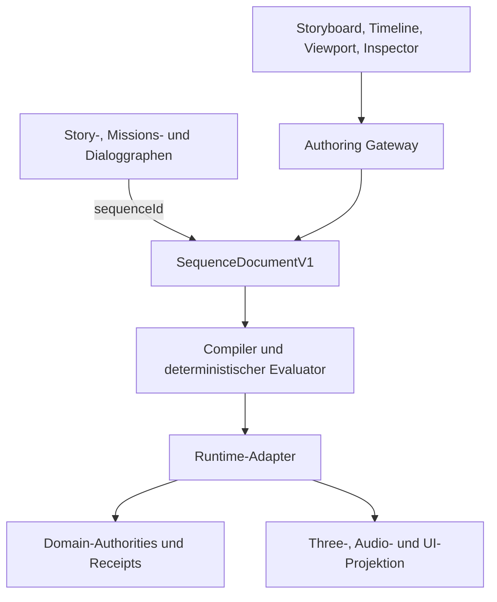

# Storyboard-, Sequence- und Animationseditor für WELTRAUM

- **Datum:** 2026-08-12
- **Repository-Basis:** `BenjaminHornung/Weltraum-Spiel` auf `main` bei `15f3550bd604856b25d40a7ac700ec4d5106b89e`
- **Dokumentstatus:** `PROPOSED`
- **Entscheidungsstatus:** `REQUIRES_OWNER_DECISION`
- **Implementierungsstatus:** `REQUIRES_SPIKE`, keine Produktfunktion vorhanden
- **Integrationsstatus:** `BLOCKED_BY_PREREQUISITES`

## 1. Ergebnis in einem Satz

WELTRAUM sollte einen eigenen browserbasierten **Storyboard & Sequence Workspace** erhalten, der lineare, zeitbasierte Inszenierung als versioniertes und renderneutrales `SequenceDocumentV1` speichert, während Story-, Missions- und Dialogverzweigungen in ihren getrennten Graphen bleiben und Three.js, Timeline-UI, Kameras, NPC-Rigs und Audio nur Laufzeit- oder Editorprojektionen dieses Dokuments sind.

Das ist kein kosmetischer Architekturwunsch. Es ist die belastbarste untersuchte Richtung, die gleichzeitig zu den bereits erarbeiteten Authority-, CAS-, Persistenz-, Content-, NPC-, Asset- und QA-Verträgen passt, ohne eine zweite Weltwahrheit im Editor zu erzeugen.

## 2. Die eigentliche Empfehlung

Der gewünschte Arbeitsfluss sollte so aussehen:

1. Im Story-, Missions- oder Dialoggraphen wird ein Knoten `PlaySequence` beziehungsweise eine stabile `sequenceId` referenziert.
2. Ein Doppelklick öffnet den Storyboard & Sequence Workspace.
3. Dort werden Schauspieler, NPCs, Objekte, Kamera, Dialog, Audio und Effekte über stabile Bindings in eine Szene eingesetzt.
4. Ein Shot-Strip beschreibt die filmische Gliederung. Eine Timeline beschreibt die zeitliche Inszenierung innerhalb der Shots.
5. Ein 3D-Viewport zeigt die echte Three-Laufzeitprojektion. Gizmos erzeugen semantische Keyframes, keine persistierten `Object3D`-Zustände.
6. Validierung, Dry Run und Preview laufen gegen denselben headless Compiler und Evaluator wie die spätere Laufzeit.
7. Der Commit schreibt ausschließlich kanonische Contentdaten über den gemeinsamen Authoring-Command-/Transaction-/Receipt-Pfad.
8. Gameplay-Wirkungen werden nie direkt von einer Timeline in Welt, Mission, Wirtschaft, Fraktion oder NPC-Persistenz geschrieben. Sie werden als typisierte Gateway-Anfragen geplant und quittiert.

Die UI kann sich wie eine Mischung aus Storyboard, Dope Sheet, einfacher NLA-Timeline und Game-Viewport anfühlen. Technisch darf sie aber weder Blender, Three.js noch eine Timeline-Bibliothek zur Datenquelle machen.

## 3. Evidenzklassen und Grenzen dieses Berichts

Der Bericht trennt Aussagen nach den Projektregeln:

| Kennzeichnung | Bedeutung |
|---|---|
| `FACT` | Direkt durch aktuellen Repository-Stand, verbindliche Projektinstruktionen oder akzeptierten Project-Memory-Stand belegt. |
| `CODE EVIDENCE` | Durch konkreten Code oder committed Tests auf der genannten Basis-SHA belegt. |
| `INFERENCE` | Aus mehreren vorhandenen Verträgen abgeleitete Folgerung. |
| `PROPOSAL` | Neue Empfehlung dieses Berichts. Noch nicht angenommen oder implementiert. |
| `UNKNOWN` | Offene Entscheidung oder noch nicht empirisch geprüfte Eigenschaft. |

Wichtig: Die G18-, X01-, X02- und P06-Zweige enthalten besonders passende Vorarbeiten. Sie sind jedoch nicht nach `main` gemergt. Ihr Inhalt ist deshalb Research- und Entscheidungsevidenz, keine aktuelle Produktwahrheit.

## 4. Umfang der Bestandsaufnahme

### 4.1 GitHub-Repository

Für `main` bei der genannten SHA wurde der komplette Git-Baum inventarisiert:

- 3.670 Tree-Einträge
- 2.650 Dateien beziehungsweise Blobs
- 2.094 code- oder dokumentartige Dateien
- 429 Pfadtreffer für breit gewählte Story-, Editor-, Kamera-, NPC-, Animation-, Asset- und Timeline-Begriffe

Jeder Pfad wurde in die Inventur einbezogen. Alle relevanten Text- und Codebereiche wurden anschließend inhaltsbasiert durchsucht. Die aktuellen Browserpakete, Missions-, Persistenz-, Präsentations-, Render-, Hestia-, Test- und Architekturbereiche sowie die unmittelbar relevanten Forschungszweige wurden vertieft gelesen. Binärdateien, historische Unity-Inhalte, Build-Artefakte und große Archive wurden über Pfad, Typ, Metadaten und ihre zugehörigen Verträge eingeordnet. Damit bedeutet „alle Projektdateien betrachtet“ eine vollständige Inventur plus vollständige Relevanzsuche, nicht die Behauptung, dass jede Binärdatei semantisch zeilenweise gelesen werden könnte.

### 4.2 Bereitgestellte Projektdateien

Alle 16 bereitgestellten Markdown-Dateien wurden vollständig ausgewertet. Sie umfassen zusammen 14.470 Zeilen:

| Datei | Zeilen | Relevanz für den Editor |
|---|---:|---|
| `WELTRAUM_PROJECT_INSTRUCTIONS_ADDENDUM(1).md` | 72 | Harte Browser-, Authority-, Evidence- und Freigaberegeln. |
| `WELTRAUM_PROJECT_MEMORY(1).md` | 424 | Kanonischer Projektstand, offene Gates und verworfene Fehlrichtungen. |
| `03-WELTRAUM_RESEARCH_REGISTER-1-.md` | 122 | Status und Reihenfolge bestehender Forschungsarbeiten. |
| `07_benchmark_test_methodology_audit_report(1).md` | 885 | Deterministische Commandstreams, Revisionen, semantische Oracles und Provenienz. |
| `05_destruction_connectivity_physics_research_report(2).md` | 1.033 | Stabile Objektidentität, Frames, atomare Commands, Prepare/Commit und stale Rejection. |
| `WP04_Block_AO_Palette_Research_Abschlussbericht(1).md` | 823 | Klare Abgrenzung: Blockpalette und AO sind kein Character-, PBR- oder Animationssystem. |
| `09_weltraum_integration_boundary_audit_report(1).md` | 658 | RenderBackend- und Authority-Grenzen, keine direkte Three- oder UI-Mutation. |
| `08_planet_scale_streaming_lod_persistence_research_report(1).md` | 897 | Explizite Frames, stabile Ereignisreihenfolge, Checkpoints und Trennung von Simulation und Darstellung. |
| `03_webgpu_engine_bakeoff_abschlussbericht(2).md` | 428 | Three/WebGL2 bleibt Referenz, kein Anlass für einen Enginewechsel. |
| `06_open_source_github_license_audit_report(2).md` | 582 | Provenienz- und Lizenzpflicht für fremden Code, Tools und Assets. |
| `BR01_benchmark_contracts_provenance_specification(1).md` | 2.459 | Geschlossene Schemata, JCS, SHA-256 und harte Versionsfehler. |
| `BR02_In_Browser_Telemetrie_Abschlussbericht_2026-08-12(1).md` | 1.255 | Korrelation und Telemetriegrenzen. Telemetrie ist kein Mutationsweg. |
| `C06_voxel_lab_license_contribution_decision_brief_2026-08-12(1).md` | 660 | Source-available ist nicht automatisch OSS, Clean-room- und Provenienzpflicht. |
| `BR04_Benchmark_Aggregator_Abschlussbericht_2026-08-12(1).md` | 1.622 | Claims benötigen Trace, `Unknown` muss sichtbar bleiben. |
| `BR03_Playwright_CDP_Runner_Abschlussbericht(1).md` | 1.636 | Reale UI-Aktionen, deterministische Tests, keine mutierende TestBridge. |
| `WP04_independent_review_protocol_abschlussbericht_2026-08-12(1).md` | 914 | Getrennte Code-, Contract-, Browser-, Evidence- und visuelle Prüfung. |

Zusätzlich wurden die für diese Fragestellung relevanten G02-, G03-, G03A-, G05-, G06-, G07-, G11-, G12-, G13-, G14-, G15-, G17-, G18-, X01-, X02- und P06-Artefakte geprüft.

### 4.3 Externe Primärquellen

Die technische Bewertung beruht auf offiziellen Spezifikationen, offiziellen Dokumentationen und den jeweiligen Primär-Repositories. Sekundäre Blogposts waren nicht entscheidungsleitend.

## 5. Was heute auf `main` tatsächlich existiert

### 5.1 Missionskern

`FACT` und `CODE EVIDENCE`: Unter `apps/weltraum-browser/src/missions/**` existiert bereits ein deterministischer, UI-freier Missionskern. Er besitzt stabile IDs, Definitionen und Instanzen, Objective-Graphen, Lifecycle, `expectedRevision`, idempotente `commandId`, typed Progress sowie Reward-, Penalty- und Event-Intents. Die Validierung lehnt Zyklen und unbekannte Felder fail-closed ab. Unit- und Playwright-Tests existieren.

Quellen:

- [Mission Contract Framework Core V1](https://github.com/BenjaminHornung/Weltraum-Spiel/blob/15f3550bd604856b25d40a7ac700ec4d5106b89e/docs/browser-mainline/mission-contract-framework-core-v1.md)
- [Mission Types](https://github.com/BenjaminHornung/Weltraum-Spiel/blob/15f3550bd604856b25d40a7ac700ec4d5106b89e/apps/weltraum-browser/src/missions/types.ts)
- [Mission Core](https://github.com/BenjaminHornung/Weltraum-Spiel/blob/15f3550bd604856b25d40a7ac700ec4d5106b89e/apps/weltraum-browser/src/missions/core.ts)
- [Mission Validation](https://github.com/BenjaminHornung/Weltraum-Spiel/blob/15f3550bd604856b25d40a7ac700ec4d5106b89e/apps/weltraum-browser/src/missions/validation.ts)

Seine Grenze ist ebenso wichtig: Er enthält keine Missions-UI, keine Story- oder Dialoggraphen, keine NPC-Bindings und keine Sequenzen. `main.ts` verdrahtet ihn noch nicht als Storyruntime.

### 5.2 Three.js und Präsentation

`FACT`: Das aktuelle Browserpaket nutzt Three `0.185.1`, aber weder React noch React Flow noch eine Timeline-Bibliothek. [package.json](https://github.com/BenjaminHornung/Weltraum-Spiel/blob/15f3550bd604856b25d40a7ac700ec4d5106b89e/apps/weltraum-browser/package.json)

`CODE EVIDENCE`: `shipVisual.ts` lädt GLB-Szenen und bindet Marker und Kameraanker, verwendet aber die im glTF-Ergebnis vorhandenen Animationsclips nicht. Es gibt auf `main` keine relevante Verwendung von `AnimationMixer`, `AnimationClip`, `KeyframeTrack`, `SkeletonUtils` oder einem Storyboard-/Sequencer-Vertrag. [shipVisual.ts](https://github.com/BenjaminHornung/Weltraum-Spiel/blob/15f3550bd604856b25d40a7ac700ec4d5106b89e/apps/weltraum-browser/src/render/three/shipVisual.ts)

`FACT`: Three und der RenderBackend sind abgeleitete Darstellung. Persistierte Wahrheit darf kein `Object3D` und keine Three-UUID sein. [World Runtime / Render Backend Boundary](https://github.com/BenjaminHornung/Weltraum-Spiel/blob/15f3550bd604856b25d40a7ac700ec4d5106b89e/docs/architecture/world-runtime-render-backend-boundary.md)

### 5.3 Persistenz und Zeit

`CODE EVIDENCE`: Der Persistenzbereich besitzt stabile IDs, geordnete immutable Events, Canonicalization, SHA-256, CAS, IndexedDB-/Memory-Repositories und getrennte Zeitkonzepte. Das ist ein gutes Muster für Sequence-Revisionen und Run-State, ist aber noch nicht an eine Storyruntime gebunden.

`INFERENCE`: Editorlayout, Auswahl, Hover, Zoom, Playhead und Previewkamera dürfen nicht in den Game-Save gelangen. Kanonischer Sequence-Content und ein tatsächlich laufender Sequence-Run-State benötigen getrennte Verträge.

### 5.4 Assetpipeline

`FACT`: Hestia Authoring V1 modelliert Assets, Parts, Joints, Marker, Materialien, stabile IDs, explizite Frames, GLB-Extras und Digests. Der bestehende Blender-Exporter erzeugt GLB plus Report. Er definiert aber keine Skeleton-, Rig-, Skin-, Clip-, Root-Motion-, Retargeting- oder Avatarverträge.

Quellen:

- [Hestia Asset Authoring Contract V1](https://github.com/BenjaminHornung/Weltraum-Spiel/blob/15f3550bd604856b25d40a7ac700ec4d5106b89e/docs/tools/hestia-asset-authoring-contract-v1.md)
- [Blender Hestia Exporter V1](https://github.com/BenjaminHornung/Weltraum-Spiel/blob/15f3550bd604856b25d40a7ac700ec4d5106b89e/docs/tools/blender-hestia-asset-authoring-exporter-v1.md)

`INFERENCE`: Die Animationspipeline muss ein neues, separates Manifest für Rig und Clips ergänzen. Hestia V1 darf nicht still umgedeutet werden. GLB bleibt abgeleitetes Laufzeit-Transferformat, nicht Story- oder Gameplay-Authority.

### 5.5 NPCs

`FACT`: Auf `main` gibt es noch kein implementiertes NPC-, Society- oder Character-Animationssystem. G06 beschreibt ein künftiges Modell mit persistenter Personenauthority und abgeleiteten Skeleton-, Animations- und Szenenobjektzuständen, ist aber nicht Produktcode.

`CONSEQUENCE`: Der erste Sequence-Spike darf nicht von echten NPCs abhängen. Er sollte mit einem synthetischen Actor-Adapter arbeiten. Die reale NPC-Integration folgt erst nach einem akzeptierten G06-Vertrag und einem belastbaren Headless-NPC-Kern.

## 6. Relevante ungemergte Vorarbeiten

| Zweig | SHA | Status | Bedeutung |
|---|---|---|---|
| `docs/g18-master-synthesis-v1` | `ef6d2b4b6589d93b69da7ced737aa16679610a2d` | `PROPOSED_FOR_OWNER_ACCEPTANCE` | Zielarchitektur für getrennte Developer-/Player-Produkte, gemeinsamen renderneutralen Authoring-Kern und getrennte Story-/Mission-/Dialog-/NPC-Domänen. |
| `docs/x01-common-contract-vocabulary-v1` | `e7f2aad3ede7f307cf80ddd5a118e8a19ad5cd30` | `REQUIRES_OWNER_DECISION` | Gemeinsames Vokabular für IDs, Authority, Epoch, Revision, Digest, Commands, Transactions, Preview, Approval, Receipts und Events. |
| `docs/x02-owner-decision-freeze-2026-08-12` | `53a78b3465075f52bcaa44df1a48bdb2f28cbc7a` | Entscheidungsvorlage, Sign-off offen | Separate App gegen Overlay, gemeinsamer Kern, Komponentenstrategie und erster Write-Scope bleiben offen. |
| `docs/p06-prototype-intake-audit-2026-08-12` | `9da5a187d68fd801ee3acafa9db5837215350cbd` | `REQUIRES_FIX` | P01 als Shell-UX adaptierbar, P02 nur partiell adaptierbar, P05-Archiv verworfen. |
| `archive/cloud-research-prototypes-2026-08-12` | `181b07bafa7437bfe9585764043f640f67ee3d07` | Archiv, niemals mergen | Metadaten und Handoff, keine Produktbasis. |

Wichtige Quellen:

- [G18 Authoring Platform Architecture](https://github.com/BenjaminHornung/Weltraum-Spiel/blob/ef6d2b4b6589d93b69da7ced737aa16679610a2d/docs/research/g18-master-synthesis-v1/AUTHORING_PLATFORM_ARCHITECTURE_V1.md)
- [G18 Technical Readiness Crosswalk](https://github.com/BenjaminHornung/Weltraum-Spiel/blob/ef6d2b4b6589d93b69da7ced737aa16679610a2d/docs/research/g18-master-synthesis-v1/TECHNICAL_READINESS_CROSSWALK.md)
- [G18 Tool Decision Log](https://github.com/BenjaminHornung/Weltraum-Spiel/blob/ef6d2b4b6589d93b69da7ced737aa16679610a2d/docs/research/g18-master-synthesis-v1/TOOL_DECISION_LOG.md)
- [G18 Vertical Slice Roadmap](https://github.com/BenjaminHornung/Weltraum-Spiel/blob/ef6d2b4b6589d93b69da7ced737aa16679610a2d/docs/research/g18-master-synthesis-v1/VERTICAL_SLICE_ROADMAP.md)
- [G18 Editor Command Contract](https://github.com/BenjaminHornung/Weltraum-Spiel/blob/ef6d2b4b6589d93b69da7ced737aa16679610a2d/docs/research/g18-master-synthesis-v1/EDITOR_COMMAND_CONTRACT_V1.md)

Die gemeinsame Richtung dieser Artefakte ist belastbar, ihr Annahmestatus aber offen:

- genau eine Authority je Domäne;
- Developer Authoring App und Player Construction als getrennte Produkte;
- UI, Renderer, Worker, KI, Telemetrie und Prototypen sind nie Authority;
- Validate, Dry Run, Preview, Approval, Commit und Receipt bilden den Mutationspfad;
- StoryGraph, MissionGraph und DialogueGraph bleiben getrennt;
- React Flow ist nur Projektion;
- deklarative Contentpakete enthalten keinen beliebigen JS-, TS- oder WASM-Code;
- der erste belastbare Schritt ist ein headless Vertrag, kein großer Editor.

## 7. Warum ein eigener Sequence-Vertrag nötig ist

Die bisherigen Graphverträge beantworten die Frage **was als Nächstes passiert**:

- Welche Bedingung ist erfüllt?
- Welche Mission startet?
- Welche Dialogoption wurde gewählt?
- Welcher Erfolg- oder Fehlerpfad wird genommen?

Eine Sequenz beantwortet dagegen **wie ein begrenzter Moment über Zeit inszeniert wird**:

- Wann beginnt ein Shot?
- Wann blickt eine Figur wohin?
- Wann wird ein Clip mit welchem Gewicht abgespielt?
- Wann fährt die Kamera, ändert FOV oder schneidet?
- Wann erscheint eine Untertitelzeile?
- Wann wird ein Sound gestartet?
- Wann soll ein kontrollierter semantischer Cue angefordert werden?

Diese Modelle in einen einzigen Megagraphen zu zwingen, vermischt Verzweigung, Zeit, UI-Layout, Laufzeitprojektion und Domainwirkungen. Das würde Validierung, Hashing, Simulation, Skip, Save und Zusammenarbeit unnötig schwer machen.

`PROPOSAL`: Story-, Mission- und DialogueGraph referenzieren Sequenzen nur über stabile IDs. Eine Sequenz darf stabile Ergebnisports anbieten, aber keine frei eingebettete Storylogik enthalten. Choices und größere Verzweigungen bleiben im Story- beziehungsweise DialogueGraph. Ein Sequence-Player kann an einem `choiceGate` pausieren, die Entscheidung selbst gehört jedoch in den Graphvertrag.

## 8. Zielarchitektur



### 8.1 Kanonische und abgeleitete Artefakte

| Artefakt | Rolle | Authority |
|---|---|---|
| `SequenceDocumentV1` | Semantische Shots, Tracks, Cues, Bindings, Zeitbasis und Completion-Ports | Kanonischer Content |
| `SequenceLayoutV1` | Spurhöhen, Farben, aufgeklappte Gruppen, Panelzustand, Kommentare und Storyboard-Anordnung | Editor-Metadaten, nicht im semantischen Digest |
| `CompiledSequenceProgramV1` | Validierte, sortierte und für die Laufzeit vorbereitete Auswertung | Derived, reproduzierbar aus Content plus registrierten Profilen |
| `SequenceRunStateV1` | Aktuelle Sequenz, Tick, Checkpoint, Actor-Bindings, ausgeführte Cue-Receipts und Abbruchzustand | Laufzeit-Persistenz |
| `AnimationClipManifestV1` | Stabile Clip-IDs, Quelldigest, Dauer, Rigprofil, Root-Motion-Policy und Provenienz | Kanonische Assetmetadaten |
| `RigProfileV1` | Semantische Bone-Slots, Referenzpose, Achsen, Retargetprofil und Kompatibilität | Kanonische Assetmetadaten |
| GLB, Waveform, Thumbnail | Meshes, Skeletons, AnimationClips, Audioanalyse und Vorschaubilder | Derived Artifacts |

### 8.2 Minimales Datenmodell

Der konkrete Vertrag muss in einem eigenen Contract-Spike abgeschlossen werden. Folgende Form zeigt die benötigte Trennung:

```ts
interface SequenceDocumentV1 {
  schema: "weltraum.sequence/v1";
  sequenceId: SequenceId;
  contentVersion: number;
  tickRate: SequenceTickRate;
  durationTicks: SequenceTick;
  bindings: readonly SequenceBindingV1[];
  shots: readonly ShotV1[];
  tracks: readonly SequenceTrackV1[];
  markers: readonly MarkerV1[];
  completionPorts: readonly CompletionPortV1[];
  provenance: ContentProvenanceV1;
}

interface ShotV1 {
  shotId: ShotId;
  startTick: SequenceTick;
  endTickExclusive: SequenceTick;
  cameraBindingId: BindingId;
  transitionIn: ShotTransitionV1;
}

type SequenceTrackV1 =
  | CameraTrackV1
  | PresentationTransformTrackV1
  | AnimationClipTrackV1
  | ActorIntentTrackV1
  | LookAtTrackV1
  | DialogueCueTrackV1
  | AudioTrackV1
  | VisibilityVfxTrackV1
  | MarkerTrackV1
  | SemanticCueTrackV1;
```

Wesentliche Regeln:

- Alle IDs sind stabil, typisiert und namespaced.
- UI-Koordinaten und Three-Pfade fehlen vollständig im kanonischen Modell.
- Zeit wird als Integer-Tick gespeichert.
- Tracktypen bilden eine geschlossene, versionierte Union. Unbekannte Typen schlagen hart fehl.
- Interpolationsmodi kommen aus einer geschlossenen Registry.
- SourceBindings binden Dokumente an Authority, Revision, Epoch, Digestprofil und Assetdigests.
- Layout und semantischer Content werden getrennt kanonisiert und gehasht.
- Keine JavaScript-Funktionen, Skriptstrings oder frei ausführbarer Code im Content.

## 9. Tracktypen und ihre Bedeutung

### 9.1 Kamera

- Position relativ zu stabilem `FrameRef`
- Target-Pfad oder stabile Look-at-Bindung
- Quaternion beziehungsweise Roll
- FOV oder Brennweite
- Cut, Blend und Blendprofil
- optionaler Shake als separater, begrenzter Präsentationslayer

Kamerawege dürfen im Editor mit Catmull-Rom-Kurven bequem modelliert werden. Der Compiler sollte sie für die Laufzeit auf eine definierte Bogenlängenparametrisierung, LUT oder gebackene Position-/Quaternion-Keyframes reduzieren. Implizites Damping oder der interne Zustand von Orbit Controls darf nicht exportierte Wahrheit sein.

### 9.2 Präsentationstransform

Geeignet für nicht autoritative Requisiten, reine Dekoration, Licht- oder Effektobjekte. Ein Track adressiert stabile Bindings und explizite Frames, niemals globale Three-Vektoren oder Objekt-Hierarchiepfade.

Für ein gameplayrelevantes Objekt, etwa Tür, Plattform, Fahrzeug, Erzbrocken oder physischer Container, ist ein roher Transformtrack nicht ausreichend. Dann muss die Sequenz eine Domainaktion wie `requestDoorOpen`, `requestJointTarget`, `requestNavigationTarget` oder `requestKinematicMove` anfordern. Die zuständige Authority entscheidet und quittiert.

### 9.3 Animationsclip und Blend

- stabile `clipId`, nicht Clipname als Authority
- Startoffset, Dauer, Loopmodus und Time Scale
- Layer beziehungsweise Kanal
- Gewichtskurve und Blendprofil
- Root-Motion-Policy
- erwartetes `rigProfileId` und Assetdigest

Für V1 wird `in_place_only` empfohlen. Die NPC- oder Bewegungsauthority bewegt die Figur, der Clip stellt sie dar. Root Motion benötigt einen eigenen späteren Spike mit Extraktion, Kollisionskopplung, Navigation und deterministischem Bake.

### 9.4 Actor Intent

Actor-Tracks beschreiben Absichten statt versteckter Transformmutation:

- gehe zu Anchor oder Navigation Target;
- drehe dich zu Actor, Anchor oder Richtung;
- blicke zu Ziel;
- spiele Geste oder Pose;
- interagiere mit Entity oder Part;
- sprich eine Dialogreferenz;
- nimm einen definierten Staging-Slot ein.

Ein Intent besitzt Timeout, Failure-Policy, benötigte Capability, Control-Kanal und Completion-Kriterium. Dadurch kann der gleiche Content mit synthetischen Actors im Spike und später mit realen NPCs laufen.

### 9.5 Dialog, Audio und Untertitel

Text wird nicht in der Timeline dupliziert. Ein Cue referenziert stabile Dialogue-/Localization-IDs, Speaker-Binding und optional ein Voice-Asset. WebVTT eignet sich für Import und Export, intern werden jedoch stabile Cue-IDs und Localization-Metadaten benötigt.

Audio wird gegen eine Audio-Präsentationsuhr geplant. Bei Seek oder Branch-Wechsel werden Quellen gestoppt und mit korrektem Offset neu erzeugt. Die AudioClock ist keine Simulationsauthority.

### 9.6 Marker und semantische Cues

Three.js bietet keine allgemeine Gameplay-Eventspur. Deshalb benötigt das Sequence-Modell eine eigene Event- beziehungsweise Cue-Lane.

Empfohlene Policies:

- `preview_only`: rein visuell oder diagnostisch;
- `reversible_preview`: darf im Copy-on-write-Preview simuliert werden;
- `once_per_run`: wird pro Run und Cue-ID höchstens einmal quittiert;
- `commit_command`: erzeugt nur eine typisierte Gateway-Anfrage und benötigt ein Receipt;
- `completion_output`: beendet die Sequenz über einen benannten Ergebnisport.

Storykritische Wirkungen wie Belohnung, Ruf, Fracht, Missionserfolg, Weltmutation oder Voxel-Edit sollten möglichst vor oder nach `PlaySequence` im zuständigen Graphen liegen. Dadurch bleibt Skip korrekt. Falls eine Wirkung fachlich mitten in der Sequenz liegen muss, benötigt sie stabile Cue-ID, Idempotenz, genaue Revision, Repeat-Policy, Receipt und einen expliziten Skip-Eintrag.

## 10. Authority-Matrix

| Inhalt | Darf die Timeline direkt samplen? | Zuständige Wahrheit | Laufzeitweg |
|---|---:|---|---|
| Kamera, FOV, Cut | Ja | Sequence-Präsentation | Three-Kameraadapter |
| Untertitel, UI-Hinweis | Ja | Sequence-Präsentation plus Localization | UI-Projektion |
| Licht, VFX, rein visuelle Sichtbarkeit | Ja | Sequence-Präsentation | Renderadapter |
| Nicht autoritatives Requisit | Ja | Sequence-Präsentation | Transformadapter |
| NPC-Clip, Blend, Look-at-Pose | Ja, als Darstellung | NPC-Identität bleibt Domainauthority | Character-Adapter |
| NPC-Locomotion | Nein, nicht als Welttransform | NPC-/Navigationauthority | Actor Intent plus Receipt |
| Physische Tür oder Plattform | Nein | Objekt-/Physik-/Worldauthority | Domain Command plus Receipt |
| Missionserfolg oder Objective Progress | Nein | Missionauthority | Event beziehungsweise Command Intent |
| Ruf, Gesetz, Wirtschaft, Inventar | Nein | jeweilige Domainauthority | typisierter Effect Plan über Gateway |
| Voxel- oder Terrainänderung | Nein | Voxel-/Worldauthority | versionierter Edit-Command nach gültigen Gates |
| AnimationMixer, Skeleton, IK, Object3D | Nein | keine Authority, nur derived | Three-/Character-Projektion |

Diese Matrix ist der Kernschutz gegen eine zweite Wahrheit.

## 11. Deterministischer Sequence-Player

### 11.1 Getrennte Zeitdomäne

`PROPOSAL`: Sequenzen erhalten `SequenceTick` und `SequenceTickRate`. Sie werden nicht still mit `UniverseTime`, `SimulationTick`, `MissionTime`, Audiozeit oder Renderframes gleichgesetzt.

Für den Spike wird eine Rate von 48.000 Ticks pro Sekunde empfohlen. Sie passt zu 48-kHz-Audio und ist durch 24, 25, 30, 50 und 60 FPS teilbar. Das ist ein Spike-Default, keine angenommene Projektentscheidung. Ein Golden-Test muss Größe, Rechenkosten, Konvertierung und Langzeitstabilität prüfen.

### 11.2 Zwei getrennte Operationen

```ts
sample(program, tick): PresentationSample

advance(program, previousTick, currentTick, runState): {
  presentation: PresentationSample;
  dueCues: readonly DueCue[];
  nextRunState: SequenceRunStateV1;
}
```

- `sample` ist rein und löst niemals irreversible Cues aus. Es dient Scrubbing, Thumbnails, Curve-Preview und visuellem Test.
- `advance` wertet das Intervall `(previousTick, currentTick]` in stabiler Reihenfolge aus und erzeugt fällige Cue-Anfragen genau nach Policy.
- Rückwärtsscrubbing verwendet `sample`, nicht inverse Gameplay-Commands.
- Render-FPS verändern weder Cue-Reihenfolge noch Contentzustand.
- Zufall ist nur mit gespeichertem Seed und festgelegtem Algorithmus zulässig.
- Exporte werden über JSON Schema 2020-12 validiert, nach RFC 8785 kanonisiert und mit SHA-256 gehasht.

### 11.3 Interpolation

V1 sollte nur geschlossene, eindeutig definierte Modi zulassen:

- `step`
- `linear`
- `hermite` mit expliziten Tangenten
- `slerp` für Quaternionen

Editorhilfen wie Catmull-Rom oder Ease-Presets werden vor dem Commit in diese kanonische Darstellung kompiliert oder gebacken. Stateful Three-Methoden wie implizite Crossfades, Damping oder nicht kontrollierte Delta-Zeit dürfen nicht die Contentsemantik bestimmen.

### 11.4 Three.js-Adapter

Three bietet die passenden Laufzeitbausteine:

- `GLTFLoader` liefert `animations: AnimationClip[]`;
- `AnimationMixer.setTime()` erlaubt exaktes Springen auf eine Zeit;
- `AnimationAction` steuert Clipzeit, Gewicht, Loop und Time Scale;
- `KeyframeTrack` repräsentiert numerische, Quaternion- und weitere Tracks;
- `SkeletonUtils` bietet Clone und Retargeting-Hilfen;
- `CCDIKSolver` kann begrenzte kosmetische IK lösen.

Quellen:

- [Three AnimationMixer](https://threejs.org/docs/pages/AnimationMixer.html)
- [Three AnimationAction](https://threejs.org/docs/pages/AnimationAction.html)
- [Three AnimationClip](https://threejs.org/docs/pages/AnimationClip.html)
- [Three KeyframeTrack](https://threejs.org/docs/pages/KeyframeTrack.html)
- [Three GLTFLoader](https://threejs.org/docs/pages/GLTFLoader.html)
- [Three SkeletonUtils](https://threejs.org/docs/pages/module-SkeletonUtils.html)
- [Three CCDIKSolver](https://threejs.org/docs/pages/CCDIKSolver.html)

Der Adapter setzt Zeiten und Gewichte aus dem Sequence-Sample. Er darf keine PropertyBinding-Pfade oder GLB-Knotennamen in das kanonische Dokument zurückschreiben. Das bereits vorhandene Muster aus stabilen Hestia-Markern und Kameraankern ist dafür eine bessere Ausgangsidee als rohe Hierarchienamen.

## 12. NPC-Integration

Die künftige G06-Richtung trennt persistente NPC-Identität von abgeleiteten Detailzuständen. Daraus folgt für Sequenzen:

1. `ActorSlot` beschreibt eine Rolle im Content, etwa `captain`, `mechanic` oder `witness`.
2. Der Preflight löst jeden Slot auf eine stabile `NpcId` oder einen expliziten synthetischen Actor auf.
3. Für sichtbare Inszenierung fordert der Player erforderliche Control-Leases an, zum Beispiel `locomotion`, `look`, `upper_body`, `speech` oder `interaction`.
4. Ein realer NPC muss gegebenenfalls auf `FULL_AGENT` promoviert und an einen gültigen Place-/Anchor-/Navigationzustand gebunden werden.
5. Fehlende NPCs, veraltete Bindings oder verweigerte Leases werden nicht durch heimliches Spawnen oder Teleportieren verdeckt. Die Sequenz folgt einer expliziten Fail-, Wait-, Substitute- oder Abort-Policy.
6. Bei Ende, Skip, Abbruch oder Fehler werden Leases deterministisch freigegeben.

IK und Retargeting bleiben abgeleitet. Für V1 sollte Retargeting beim Import gebacken und gehasht werden. Laufzeit-IK ist für Look-at, Handkontakt und Fußkorrektur sinnvoll, braucht aber feste Iterationszahlen, Limits und Auswertungsreihenfolge. Ein vollständiger Bone-Keyframe-Editor im Browser gehört ausdrücklich nicht zu V1.

### 12.1 Kamera-, Input- und Simulationsbesitz

G14 beschreibt Kamera-, Input-, Workspace- und Simulationspolitik als getrennte Zuständigkeiten. Eine Sequenz muss deshalb beim Start über einen Transition- beziehungsweise Ownership-Adapter Kamera und notwendige Inputkanäle anfordern. Sie darf die bestehende Spielkamera nicht still überschreiben. Bei Completion, Skip, Abort und Fehler werden vorherige Owner und Fokus deterministisch wiederhergestellt.

Ob die restliche Weltsimulation während einer Sequenz weiterläuft, pausiert oder selektiv reduziert wird, ist eine explizite Sequence-Policy. Der technische Spike darf mit einer eingefrorenen Fixture arbeiten. Eine allgemeine Produktentscheidung darf daraus nicht abgeleitet werden.

## 13. Frames, Planetengröße und Objektbewegung

Die Planet-Scale-Forschung verbietet implizite globale Renderkoordinaten als kanonische Wahrheit. Jeder räumliche Keyframe braucht daher:

- ein stabiles `FrameRef` oder `AnchorRef`;
- einen lokalen Transform relativ zu diesem Frame;
- definierte Achsen, Einheit und Händigkeit;
- erwartete Source-/Frame-Revision;
- eine Policy für fehlende oder stale Frames.

Kamera-relative GPU-Werte, Floating-Origin-Offsets und Three-Weltmatrizen bleiben Derived State. Dadurch überlebt eine Sequenz Streaming, Origin Shifts, andere LODs und spätere Renderer.

## 14. Speichern, Laden, Skip und Hot Reload

### 14.1 Save

Ein laufender Storymoment benötigt mindestens:

- `sequenceId` und Contentdigest;
- aktuelle `SequenceTick` oder stabilen Checkpoint;
- konkrete Actor- und Object-Bindings;
- bereits quittierte `once_per_run`-Cue-IDs mit Receipts;
- aktuelle Completion-/Abort-Information;
- erwartete Authority- und Assetrevisionen.

Nicht gespeichert werden Three-Objekte, AnimationMixer-Interna, offene Panels, Zoom oder Previewkamera.

### 14.2 Skip

Skip ist nicht `seek(durationTicks)`. Ein Compiler muss einen `SkipPlanV1` erzeugen:

- welche rein visuellen Tracks auf Endzustand gesampelt werden;
- welche storykritischen Gateway-Commands noch auszuführen sind;
- welche Cues absichtlich verworfen werden;
- welcher Completion-Port gewählt wird;
- wie Audio, Kamera, Input und Control-Leases beendet werden;
- welcher Checkpoint danach gültig ist.

### 14.3 Hot Reload

G13 verlangt vollständige Kandidatensätze und atomare Aktivierung. Daraus folgt:

- inaktive Sequence-Dokumente können nach vollständiger Validierung atomar ersetzt werden;
- Derived Artifacts dürfen nur bei passendem Authority-/Source-Digest ausgetauscht werden;
- aktive Sequenzen mit semantischen Änderungen sind standardmäßig `migration_required` oder `restart_required`;
- rein kosmetische Derived-Änderungen dürfen nur bei identischem semantischem Digest live wechseln;
- keine Teilaktivierung einzelner Tracks.

## 15. Editoroberfläche

### 15.1 Empfohlenes Layout

| Bereich | Aufgabe |
|---|---|
| Linke Spalte | Scene-/Actor-/Object-Hierarchie, Bindings, Assetbrowser |
| Oberer Streifen | Storyboard mit Shots, Dauer, Kamera, Thumbnail und Validierungsstatus |
| Mitte | echter Three-Laufzeitviewport mit Kamera-, Pfad-, Anchor- und Look-at-Gizmos |
| Unterer Bereich | Timeline, Dope Sheet, Waveform und Marker-/Event-Lanes |
| Rechte Spalte | Inspector, Eigenschaften, Curves, SourceBindings und Issues |
| Untere Statuszone | Draft, Digest, Revision, Preview, Validate, Commit, Receipt, Run Trace |

Sinnvolle Workspaces oder Tabs:

- `Graph`
- `Storyboard`
- `Timeline`
- `Curves`
- `Bindings`
- `Issues`
- `Trace / Diff`

### 15.2 Autorenfluss für eine einfache Szene

1. `Neue Sequenz` anlegen und Place-/Scene-Referenz wählen.
2. Actor-Slots und Objekte über stabile IDs binden.
3. Shots im Storyboard erzeugen.
4. Kamera im Viewport positionieren und Shot-Key setzen.
5. NPC-Geste oder importierten Clip auf eine Spur ziehen.
6. Objekt mit Gizmo bewegen. Der Editor erzeugt lokale Transformkeyframes relativ zum gewählten Anchor.
7. Dialogzeile und Audio referenzieren.
8. Look-at und Interaktion hinzufügen.
9. Issues prüfen, Dry Run und Scrubbing ausführen.
10. Preview gegen Snapshot starten.
11. Diff und semantischen Digest prüfen.
12. Commit mit Receipt.

Auto-Key sollte opt-in sein. Eine Pointer-Drag-Geste vom Down bis Up wird genau eine History-Transaction. Playhead, Selection und Panelzustand gehören nicht in die Content-History. Undo und Redo erfolgen nach dem gemeinsamen Modell als neue, vorwärtslaufende CAS-Transaktionen beziehungsweise vor Commit als Draft-History, nicht als Zurückdrehen einer Authority-Revision.

### 15.3 P01 und P02 richtig nutzen

- P01 ist eine gute UX-Referenz für Docking, Hierarchy, Inspector, Issues, Preview, Validate, Commit und Play/Pause/Step. Mock-State und lokale History sind keine Produktbasis.
- P02 zeigt brauchbare typed Ports, Compilerdiagnostik und Graphinteraktion. Sein Code ist `UNLICENSED`, seine Narrow- und Keyboard-UX ist nicht ausreichend und G05 S0/S1 fehlt. Deshalb nur clean-room adaptieren, nachdem der headless Vertrag steht.
- P05 wird nicht übernommen. Das untersuchte Archiv war wegen secret-bearing Buildoutput blockiert. Nur abstrakte UX-Learnings dürfen verwendet werden.

### 15.4 Developer-Workspace und spätere KI-Unterstützung

Der vollständige Sequencer gehört zuerst in den Developer Authoring Mode. Eine spätere Player-Construction-Variante darf denselben kanonischen Kern verwenden, braucht aber engere Capabilities, Kataloge, Kosten-, Gesetz- und Approval-Regeln. Sie ist kein V1-Ziel.

Ein späterer KI-Copilot darf gemäß G11 Sequence-Dokumente analysieren, Varianten vorschlagen, Commands planen, Dry Runs ausführen und einen Preview-Diff vorbereiten. Er darf nicht selbst committen. Approval muss weiterhin an die exakten Bytes, Digests, Revisionen, den Scope und den Principal gebunden sein.

## 16. Techniken und Bibliotheken im Vergleich

| Technik | Nutzen | Projektrisiko | Entscheidung |
|---|---|---|---|
| Eigener `SequenceDocument`, Compiler und Evaluator | Authority, Determinismus, Save, Skip, Tests und Engine-Neutralität | Erfordert einen sauberen Contract-Spike | **Übernehmen** |
| Three `AnimationMixer` und Clips | Bereits passende Runtime, exaktes Sampling, kein Enginewechsel | Darf nicht zur Contentauthority werden | **Übernehmen als Adapter** |
| glTF/GLB | Standardisiertes Laufzeitformat für Mesh, Rig, Morph und Clips | Kein Story-, Branching- oder Gameplayformat | **Übernehmen als Derived Asset** |
| Blender NLA und glTF-Export | Reifes Rigging, Clip- und komplexes Animationsauthoring | Externes DCC, kein integrierter Storygraph | **Übernehmen für komplexe Animationen** |
| React Flow | Gute Graphprojektion | Aktuelles Paket hat kein React, G05-Schema und G03A-Topologie noch offen | **Später hinter Adapter** |
| `@xzdarcy/react-timeline-editor` | Tracks, Drag, Resize und schnelle Timeline-Evaluation | React-Abhängigkeit, kein vollständiger Sequencer, Projektfit unbewiesen | **Isolierter Spike** |
| Theatre.js | Sehr gute Sequencer- und Curve-UX | Core Apache-2.0, Studio AGPL-3.0, Integrations- und Entwicklungsstatusrisiko | **UX-Referenz, optionaler Rechts-/Technikspike** |
| `KHR_animation_pointer` | Animation weiterer glTF-Eigenschaften | Three-Unterstützung über externes Plugin, löst keine Storylogik | **Capability-Spike** |
| `KHR_interactivity` | Künftige portable glTF-Logikgraphen | Stand dieses Berichts Release Candidate, ersetzt keine WELTRAUM-Authority-, Save- oder Storyverträge | **Beobachten, nicht darauf bauen** |
| WaveSurfer.js | Waveform und Regions für Audio | Zusätzliche Abhängigkeit | **Optionaler Lane-Adapter** |
| WebVTT | Austausch von Untertiteln und zeitbezogenen Cues | Intern nicht ausreichend für stabile Game-IDs | **Import/Export übernehmen** |
| XState | Statecharts und Analysewerkzeuge | Zweite Runtime-Semantik neben G05 möglich | **Nicht als Authority, höchstens Compilerziel prüfen** |
| OpenTimelineIO | Gutes Editorial-Zeitmodell und Austausch | Kein Browser-Game-Runtimevertrag | **Modellreferenz** |
| Remotion | Trailer, Offline-Video und React-Komposition | Keine interaktive Game-Sequenzruntime | **Nicht Kern, später für Marketing denkbar** |
| Rive oder Lottie | 2D-UI-Motion | Keine 3D-NPC-/Weltsequenz | **Nur UI-Overlays** |
| Godot, Unity oder Unreal als Sequencer | Mächtige fertige Editoren | Zweite Engine, zweite Scene Truth, zusätzliche Export- und Webpipeline | **Nicht integrieren** |
| Eigenständiger Browser-Bone-Editor | Vollständiges Rigauthoring im Produkt | Sehr hoher Umfang, doppelt Blender-Funktionalität | **V1 ausschließen** |

Primärquellen:

- [glTF 2.0 Specification](https://registry.khronos.org/glTF/specs/2.0/glTF-2.0.html)
- [KHR_animation_pointer](https://github.com/KhronosGroup/glTF/blob/main/extensions/2.0/Khronos/KHR_animation_pointer/README.md)
- [KHR_interactivity](https://github.com/KhronosGroup/glTF/blob/main/extensions/2.0/Khronos/KHR_interactivity/Specification.adoc)
- [React Flow Repository](https://github.com/xyflow/xyflow)
- [React Timeline Editor Repository](https://github.com/xzdarcy/react-timeline-editor)
- [Theatre.js Repository und Lizenzaufteilung](https://github.com/theatre-js/theatre)
- [WaveSurfer.js](https://wavesurfer.xyz/)
- [OpenTimelineIO](https://github.com/AcademySoftwareFoundation/OpenTimelineIO)
- [XState](https://github.com/statelyai/xstate)
- [Blender NLA](https://docs.blender.org/manual/en/latest/editors/nla/introduction.html)
- [Blender glTF Export](https://docs.blender.org/manual/en/latest/addons/scene_gltf2.html)
- [Web Audio API](https://www.w3.org/TR/webaudio-1.1/)
- [WebVTT](https://www.w3.org/TR/webvtt1/)
- [JSON Schema Draft 2020-12](https://json-schema.org/draft/2020-12)
- [RFC 8785 JSON Canonicalization Scheme](https://datatracker.ietf.org/doc/html/rfc8785)
- [Remotion](https://www.remotion.dev/)
- [Rive Web Runtime](https://rive.app/docs/runtimes/web/web-js)
- [Lottie Web](https://github.com/airbnb/lottie-web)
- [Godot AnimationPlayer](https://docs.godotengine.org/en/stable/classes/class_animationplayer.html)

## 17. Validierung und QA

### 17.1 Headless Validatoren

Mindestens folgende Issue-Klassen werden benötigt:

- unbekannte oder doppelte IDs;
- überlappende Shots ohne definierte Transition;
- Track außerhalb der Sequenzdauer;
- ungültige oder nicht monotone Keyframes;
- fehlendes Entity-, Actor-, Frame-, Asset-, Clip-, Rig-, Dialogue- oder Audio-Binding;
- stale SourceBinding oder Digestmismatch;
- inkompatibles Rigprofil;
- Root Motion trotz `in_place_only`;
- semantischer Cue ohne Registry-Eintrag, Capability, Repeat- oder Skip-Policy;
- direkte Mutation einer fremden Authority;
- Completion-Port ohne Graphanschluss;
- Choice oder Branching in einer nicht erlaubten Timelineform;
- nicht deterministische Interpolation oder ungespeicherter Zufall;
- nicht migrierbare aktive Sequenzänderung;
- fehlende Lizenz- oder Provenienzinformation.

Issue Codes müssen stabil und versioniert sein. `Unknown` darf nicht als Erfolg behandelt werden.

### 17.2 Contract- und Unit-Tests

- Save-Load-Save ergibt identische kanonische Bytes und denselben Digest.
- Editorlayout verändert den semantischen Digest nicht.
- Derselbe Content kompiliert zweimal byte-identisch.
- Unbekannte Schema-, Track- oder Interpolationsversionen schlagen hart fehl.
- `sample` löst keine Cues aus.
- Seek, Pause, Reload und Reverse-Scrub duplizieren keine `once_per_run`-Cues.
- `advance` liefert bei 30, 60 und unlimitiertem Render-FPS dieselbe Event- und Commandreihenfolge.
- Skip führt exakt den kompilierten SkipPlan aus.
- Fehlende oder stale Actors, Assets, Frames und Leases schlagen verständlich und fail-closed fehl.
- Kein persistierter Datensatz enthält Three-UUID, `Object3D`, AnimationMixer-, Physics- oder Worker-Handles.
- Root Motion verändert in V1 keinen autoritativen Welttransform.
- Abbruch und Fehler geben Kamera-, Input- und Actor-Leases frei.
- Undo erzeugt den erwarteten vorherigen semantischen Digest, ohne Revisionen rückwärts zu zählen.

### 17.3 Browser- und visuelle Tests

- reale Pointer- und Tastaturbedienung über Playwright;
- keine allgemeine mutierende TestBridge;
- stabile `data-testid`-Selektoren und semantische Oracles;
- kein festes Sleep als Synchronisation;
- deterministische Fixture-Sequenzen, Kameras, Tickstände und Seeds;
- für Screenshots werden Animationszeit, Damping, Partikel und zufällige Effekte eingefroren;
- Desktop und schmale Viewports;
- sichtbarer Tastaturfokus, Drag-Alternativen und Screenreader-Namen;
- Ressourcen- und Disposal-Zähler erreichen nach wiederholtem Öffnen, Seek und Schließen ein Plateau;
- visuelle Ownerprüfung bleibt ein eigenes Gate und wird nicht durch Pixeltests ersetzt.

### 17.4 Telemetrie und Provenienz

Sequence-Telemetrie darf `sequenceId`, Contentdigest, Revision, Tick, Cue-ID, Transaction-ID, Receipt-ID, Dauer, Fehlercode und Adapterstatus korrelieren. Sie bleibt append-only, begrenzt und beobachtend. Sie darf weder Content noch UI mutieren und keine Dialogtexte, ungefilterten Inputs, lokalen Pfade oder Geheimnisse aufnehmen. Evidence-Bundles müssen Browser-, Build-, Fixture-, Schema-, Asset- und Source-Digests mitführen, damit ein erfolgreicher Lauf reproduzierbar zugeordnet werden kann.

## 18. Empfohlener Realisierungsplan

### Gate 0: Vorbedingungen

Noch kein großer UI-Bau. Zuerst:

1. Owner-Freeze für Repository-Ziel, Basis-SHA, Write-Owner und Spike-Scope.
2. X01-Crosswalk für ID, Authority, Revision, Digest, Command, Transaction, Preview, Receipt, Event und Time.
3. G03A-Topologiespike für separate Developer-App gegen Runtime-Overlay.
4. gemeinsamer Command-/Transaction-/Validation-Kern mindestens als akzeptierter Vertrag.
5. G05 S0/S1 für headless Story-, Mission- und DialogueGraph-Registry, Validator, Compiler und Simulator.

### `SEQ-00`: Contract und Golden Fixtures

Nur Daten und Tests:

- `SequenceDocumentV1`
- `SequenceLayoutV1`
- `AnimationClipManifestV1`
- `RigProfileV1`
- `SequenceRunStateV1`
- JSON Schemas, Canonicalization und Digests
- drei minimale Golden-Fixtures und ein Invalid-Fixture-Korpus

Exit-Kriterium: Owner akzeptiert Authority-Grenzen, Timebase, Trackregistry, Cue-Policy, Save und Skip.

### `SEQ-01`: Headless Compiler, Validator und Evaluator

- keine UI und kein Three-Import im Kern;
- stabile Sortierung und Intervalle;
- pure `sample`-Funktion;
- `advance` mit genau-einmal-Policies;
- SkipPlan;
- deterministische Trace-Ausgabe;
- Property- und Golden-Tests.

### `SEQ-02`: Isolierter Three-Preview-Spike

Der erste technisch ehrliche Slice verwendet:

- ein nicht autoritatives Requisit;
- einen synthetischen Actor, noch keinen echten NPC;
- zwei Shots;
- einen Transformtrack;
- einen in-place glTF-Clip;
- Kamera mit Position, Target und FOV;
- eine Dialog-/Untertitelreferenz;
- einen Audio- oder VFX-Cue;
- einen Marker und einen semantischen Test-Cue;
- Save, Load, Seek, Reverse-Scrub, Pause und Skip.

Der gleiche Compiler und Evaluator laufen im Headless-Test und im Browser-Preview. Die Three-Schicht ist austauschbar und disposable.

### `SEQ-03`: Minimaler Storyboard & Sequence Workspace

- P01-artige Shell;
- Storyboard-Strip;
- einfache Timeline;
- Viewport-Gizmos;
- Inspector und Issues;
- Draft-History;
- Validate, Dry Run, Preview, Diff und Commit;
- Timeline-Komponente nur hinter eigenem Adapter.

### `SEQ-04`: Reale NPC-Anbindung

Erst nach G06-Kern:

- zwei persistente NPCs;
- Actor-Slot-Auflösung;
- LOD-Promotion;
- Control-Leases;
- Locomotion-, Look-, Speech- und Interaction-Intents;
- deterministischer Abort und Release;
- Retargeting-Importspike.

### `SEQ-05`: Narrative Integration und Contentpaket

- `PlaySequence`-Referenz im getrennten Story-/Mission-/Dialogue-System;
- benannte Completion-Ports;
- Dialogue-/Localization-Referenzen;
- Effect Plans ausschließlich über Gateway;
- neues G13-Package-Kind `sequences`;
- Migration und atomarer Hot Reload;
- erster echter narrativer Vertical Slice.

### Story-Slice-Empfehlung

Für `SEQ-02` eignet sich eine kleine synthetische Crash-Site-Fixture, weil sie Kamera, Objektbewegung, einen Actor, Dialog und einen Marker ohne fertige NPC-Gesellschaft testen kann. Der erste echte narrative Slice sollte danach an den geplanten First-Contract-Circuit gekoppelt werden, sobald G05 und G06 belastbar sind.

## 19. Harte No-Gos

- Kein Megagraph aus Story, Mission, Dialog, Timeline und Animation.
- Keine Three-Scene, Object3D-Hierarchie, UUID oder PropertyBinding als kanonischer Content.
- Kein Gameplay-Transform für physische oder persistente Entities direkt aus einer Präsentationsspur.
- Keine direkte Timeline-Mutation von Mission, Welt, Economy, Inventar, Fraktion, Recht oder Voxelzustand.
- Kein storykritisches Ereignis ausschließlich innerhalb einer skippbaren Animation ohne SkipPlan und Receipt.
- Kein Editorstate im Game-Save.
- Kein Root Motion in V1.
- Kein Browser-Rig- oder Bone-Authoring in V1.
- Kein React- oder React-Flow-Umbau allein für die Timeline, bevor G03A und G05 entschieden sind.
- Keine Übernahme des P02-Codes ohne geklärte Lizenz und ohne headless Contract.
- Keine Theatre-Studio-Integration ohne Lizenz- und Architekturentscheidung.
- Keine Nutzung des P05-Archivs als Codebasis.
- Kein Enginewechsel zu Unity, Unreal, Godot oder Babylon für dieses Feature.
- Keine Produktintegration, die WP12-, G03A-, G05-, G06-, G13- oder X01-Gates umgeht.
- Keine Behauptung, dass deterministische Semantik automatisch pixelidentisches Rendering auf allen GPUs bedeutet.

## 20. Offene Owner-Entscheidungen

| Entscheidung | Empfohlener Default | Warum noch offen |
|---|---|---|
| Eigenes `SequenceDocumentV1` neben G05-Graphen | **Ja** | Muss als neue Domain und Package-Art offiziell angenommen werden. |
| UI-Name | **Storyboard & Sequence Workspace** | Produktbenennung, keine Architekturfrage. |
| Separate Developer-App oder Overlay | **G03A-Spike ausführen** | Aktueller Stand liefert keine empirische Entscheidung. |
| Sequence-Tickrate | **48.000 für den Spike** | Erst Golden- und Größenprüfung, dann Freeze. |
| Root Motion in V1 | **Nein** | Navigation, Physik, Save und Retargeting sind ungeklärt. |
| Storykritische Effects | **Außerhalb der Sequenz bevorzugen** | Sicherer Skip und klare Authority. |
| Verhalten der Weltsimulation während einer Sequenz | **Explizite Policy pro Sequenz** | Freeze, Continue und Selective Pause haben Gameplayfolgen. |
| React und Timeline-Library | **Nicht vor G03A festlegen** | Aktuelles Paket ist ohne React, Abhängigkeits- und Topologiefolge offen. |
| Theatre.js | **Nur UX-Referenz** | AGPL-Studio und Integrationsstatus benötigen Rechts- und Technikprüfung. |
| Neues G13-Package-Kind `sequences` | **Ja** | G13 enthält es derzeit nicht. |
| Erster echter Storybeat | **First Contract nach technischer Crash-Site-Fixture** | Hängt von G05 und G06 ab. |
| Mehrbenutzer/CRDT | **Nicht V1** | Authority, Approval, Locks und Konfliktmodell zuerst. |

## 21. Abnahmekriterien für die Architektur

Die Richtung ist erst belastbar, wenn ein Spike Folgendes nachweist:

1. Eine einfache Szene kann vollständig über UI erstellt, gespeichert, neu geladen und abgespielt werden, ohne Contentcode zu schreiben.
2. Der Runtime-Player importiert keine Editor-Komponenten.
3. Timeline und Storyboard lassen sich vollständig aus `SequenceDocumentV1` und `SequenceLayoutV1` rekonstruieren.
4. Ein Wechsel der Timeline-UI-Bibliothek verändert weder kanonische Bytes noch Runtimeprogramm.
5. Editor und Spiel verwenden denselben Compiler und Evaluator.
6. Scrubbing erzeugt keine irreversiblen Domainwirkungen.
7. Save-Load-Save ergibt denselben Digest.
8. Skip ist fachlich korrekt und führt keine Cues doppelt aus.
9. Unterschiedliche Render-FPS ergeben dieselbe Cue- und Commandreihenfolge.
10. Fehlende oder stale Bindings werden vor Preview beziehungsweise Commit verständlich gemeldet.
11. Keine persistierte Datei enthält Renderer-, Physics-, Worker- oder DOM-Handles.
12. Preview, Commit und Undo besitzen nachvollziehbare Transaction- und Receipt-Ketten.
13. Keyboard-, Narrow-Viewport- und Ressourcenprüfungen bestehen.
14. Ein visueller Owner akzeptiert die resultierende Inszenierung separat von technischen Tests.

## 22. Schlussfolgerung

`FACT`: WELTRAUM besitzt bereits mehrere starke Bausteine, vor allem deterministische Missionen, stabile IDs, CAS, Events, Digests, Rendergrenzen, Hestia-Assetmetadaten und Browser-QA. Ein Storyboard-, Sequencer-, NPC- oder Animationssystem ist auf `main` aber nicht vorhanden.

`INFERENCE`: Die bestehenden Verträge schließen einen klassischen „Editor speichert einfach die Three-Szene“-Ansatz aus. Sie sprechen ebenso gegen einen großen Mischgraphen oder eine zweite Engine.

`PROPOSAL`: Der richtige nächste Baustein ist eine neue lineare Sequence-Domain mit einem kleinen headless Contract, einem deterministischen Evaluator und klaren Runtime-Adaptern. Der Editor ist eine komfortable Projektion darauf. Blender und glTF liefern komplexe Clips, Three spielt und mischt sie, der Storyboard & Sequence Workspace orchestriert sie, und die bestehenden Domainauthorities behalten jede gameplayrelevante Wahrheit.

Damit wird das eigentliche Ziel erreichbar: Storyinhalte, Kamerafahrten, einfache Objektbewegungen, NPC-Aktionen, Dialoge und Effekte können grafisch gebaut werden, ohne dass jede Inszenierung direkt im Anwendungscode landet. Gleichzeitig bleibt das System speicherbar, testbar, migrierbar, skip-sicher und mit den bereits erarbeiteten Projektgrenzen vereinbar.

Die Empfehlung ist ausdrücklich noch keine Freigabe zur Produktimplementierung. Der nächste sinnvolle Beschluss ist `SEQ-00` als Contract- und Golden-Fixture-Spike nach dem erforderlichen Owner- und X01-Freeze.
