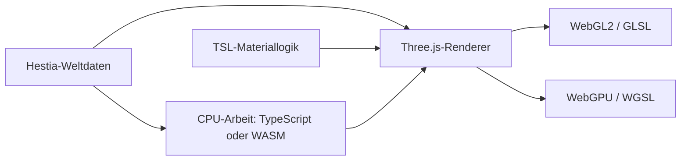
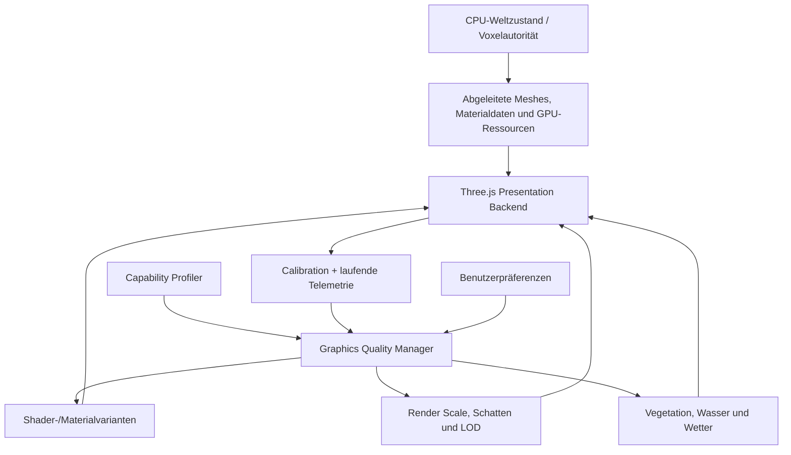
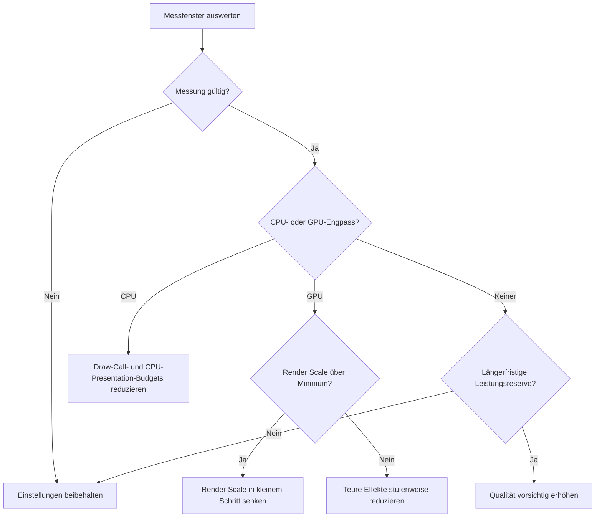
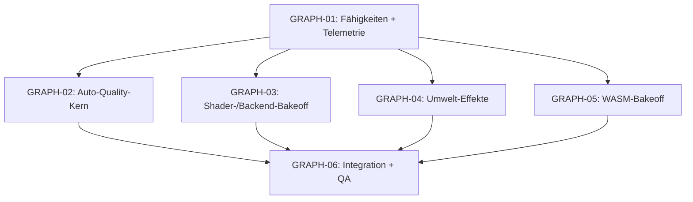

# Hestia: Adaptive Shader- und Grafikarchitektur

**Hardwareabhängige Grafikqualität mit Three.js, WebGL2, WebGPU und WebAssembly**  
*Technische Recherche, verständliche Architekturentscheidung und schrittweiser Umsetzungsplan für Weltraum-Spiel*

| Metadatum | Wert |
|---|---|
| Projekt | Weltraum-Spiel / Hestia |
| Dokumentstand | 9. Oktober 2026 |
| Dokumenttyp | Recherche und Architekturvorschlag |
| Status | **PROPOSED / REQUIRES_SPIKES** |
| Ausrichtung | Browser-first, hohe Performance, KISS, reproduzierbare Tests |
| Implementierungsstatus | Dieses Dokument beschreibt **keine bereits implementierte Grafikautomatik** und enthält **keine neuen Hestia-Benchmarks** |

> [!IMPORTANT]
> **Empfehlung auf einen Blick:** Three.js zunächst beibehalten. WebGL2 als belastbaren Referenzpfad sichern, WebGPU und TSL isoliert vergleichen und ein kleines System für Hardwarefähigkeiten, Performancekalibrierung, dynamische Renderauflösung und Effektbudgets einführen. WebAssembly nur an nachgewiesenen CPU-Engpässen einsetzen. Die physikalische und gespeicherte Voxelwelt darf sich durch eine Grafikeinstellung **niemals** ändern.

---

## Inhaltsverzeichnis

1. [Ziel und Grundidee](#1-ziel-und-grundidee)
2. [Wichtige Begriffe verständlich erklärt](#2-wichtige-begriffe-verständlich-erklärt)
3. [Welche Technik sollte Hestia verwenden?](#3-welche-technik-sollte-hestia-verwenden)
4. [Empfohlene Gesamtarchitektur](#4-empfohlene-gesamtarchitektur)
5. [Shader- und Materialmodelle](#5-shader--und-materialmodelle)
6. [Automatische Hardwareerkennung](#6-automatische-hardwareerkennung)
7. [Erstkalibrierung und Performance-Messung](#7-erstkalibrierung-und-performance-messung)
8. [Automatisches Qualitätsmanagement](#8-automatisches-qualitätsmanagement)
9. [Dynamische Renderauflösung](#9-dynamische-renderauflösung)
10. [Konkrete Grafikeffekte für Hestia](#10-konkrete-grafikeffekte-für-hestia)
11. [Grafikprofile und Benutzereinstellungen](#11-grafikprofile-und-benutzereinstellungen)
12. [Wo WASM sinnvoll ist](#12-wo-wasm-sinnvoll-ist)
13. [Code- und Modulstruktur](#13-code--und-modulstruktur)
14. [Tests, Benchmarks und Abnahmekriterien](#14-tests-benchmarks-und-abnahmekriterien)
15. [Arbeitspakete für parallele Agenten](#15-arbeitspakete-für-parallele-agenten)
16. [Risiken, offene Entscheidungen und Prioritäten](#16-risiken-offene-entscheidungen-und-prioritäten)
17. [Glossar](#17-glossar)
18. [Quellen und weiterführende Dokumentation](#18-quellen-und-weiterführende-dokumentation)

---

## 1. Ziel und Grundidee

### 1.1 Was soll erreicht werden?

Hestia soll auf möglichst unterschiedlichen PCs gut funktionieren:

- Ein Office-Laptop mit integrierter Grafik bekommt einfache, aber lesbare Materialien und begrenzte Effekte.
- Ein durchschnittlicher Gaming-PC zeigt gute Beleuchtung, Vegetation, Wasser und Wetter.
- Ein leistungsfähiger Desktop kann aufwendigere Schatten, Materialien und Postprocessing nutzen.

**Die Spielwelt bleibt in allen Fällen dieselbe.** Die Unterschiede betreffen die *Darstellung*, nicht die Physik, Zerstörung, Ressourcen oder den gespeicherten Weltzustand.

Ein gutes System beantwortet drei verschiedene Fragen:

| Frage | Technische Antwort | Beispiel |
|---|---|---|
| **Was kann der Browser?** | Capability Detection | WebGPU verfügbar? GPU-Timestamps erlaubt? |
| **Wie schnell ist das Gerät?** | Kalibrierung und Messung | Wie teuer sind Voxelterrain, Wald und Wasser? |
| **Was soll gerade reduziert werden?** | Adaptive Quality | Lieber Renderauflösung reduzieren als eine wichtige Gameplay-Anzeige entfernen. |

### 1.2 Warum die reine GPU-Erkennung nicht genügt

Der Name der Grafikkarte sagt nur begrenzt etwas über die tatsächlich verfügbare Leistung aus. Wichtige zusätzliche Faktoren sind:

- Monitorauflösung und Device Pixel Ratio (DPR)
- Browser, Treiber und Betriebssystem
- Energieprofil und thermische Drosselung
- Parallel laufende Programme
- Tatsächlicher Engpass: GPU, CPU, Speicher oder Datenübertragung
- Art der Szene, beispielsweise freier Himmel gegenüber dichtem Wald

**Daher: Hardwareeigenschaften zur Wahl eines sicheren Startpunkts verwenden, anschließend echte Frametimes messen.**

### 1.3 Spezielle Hestia-Anforderungen

Aus den bisherigen Projektentwürfen ergeben sich folgende Grenzen:

1. Hestia verwendet harte, klar erkennbare Block- beziehungsweise Microvoxel-Silhouetten.
2. Der CPU-seitige Voxel-/Materialzustand bleibt die Autorität. Geometrie, AO, Shader, Texturen und GPU-Puffer sind daraus abgeleitete Produkte.
3. Dynamische Zerstörung muss Beleuchtung und Darstellung korrekt invalidieren können.
4. Physik und Save-Daten dürfen nicht von der Renderqualität abhängen.
5. Performance ist **kein nachträgliches Tuning**, sondern ein Architekturmerkmal.
6. Neue Rendertechnologien werden erst nach einem reproduzierbaren Vergleich in den Produktpfad übernommen.

Die Berichte von August 2026 nennen Three.js `0.185.1` als damaligen Referenzstand. Im vorangegangenen Rechercheergebnis wurde Three.js `0.186.0` als veröffentlichter Stand im September 2026 genannt. **Vor einer tatsächlichen Umsetzung muss der installierte Stand am konkreten Repository-Commit erneut geprüft werden.**

---

## 2. Wichtige Begriffe verständlich erklärt

Viele Begriffe werden bei Grafikoptimierung vermischt. Für die Architektur sind sie aber unterschiedlich:

| Begriff | Einfache Erklärung | Aufgabe bei Hestia |
|---|---|---|
| **Renderer** | Organisiert, *wie* die GPU eine Szene zeichnet. | Three.js mit WebGL2 oder WebGPU |
| **Shader** | Kleines Programm auf der GPU, das beispielsweise Oberflächen färbt oder bewegt. | Gelände, Blätter, Wasser, Licht und Effekte |
| **Shading-Modell** | Beleuchtungsregel, etwa einfaches diffuses Licht oder PBR. | Materialfamilien abhängig vom Objekt |
| **Shader-Sprache** | Sprache, in der Shader beschrieben werden. | GLSL, WGSL oder TSL |
| **GPU Compute** | Allgemeine Rechenarbeit auf der GPU, nicht nur das Zeichnen von Pixeln. | Optional Partikel und bestimmte visuelle Berechnungen |
| **WASM** | Kompilierter Code, der im Browser auf der CPU läuft. | Potenziell Meshing, AO-Aufbereitung und Chunkverarbeitung |
| **LOD** | *Level of Detail*: entfernte Objekte billiger darstellen. | Geometrie, Vegetation und Darstellung nach Entfernung |
| **DPR** | Verhältnis zwischen CSS-Pixeln und physischen Renderpixeln. | Auflösung und Pixellast |
| **Render Scale** | Faktor für die interne 3D-Auflösung. | Erste dynamisch regelbare Qualitätsstufe |
| **Frametime** | Zeitaufwand für einen Frame. | Wichtigste Laufzeitmetrik für die Regelung |

### 2.1 WebGL2, WebGPU, TSL und WASM sind keine austauschbaren Alternativen



- **WebGL2 / GLSL:** etablierte Renderpipeline mit Vertex- und Fragmentshadern.
- **WebGPU / WGSL:** moderne GPU-Pipeline mit zusätzlichen Möglichkeiten wie Compute-Shadern.
- **TSL:** Three.js-Shading-Abstraktion, die Materiallogik für unterschiedliche Renderer-Backends beschreiben kann.
- **WASM:** beschleunigt möglicherweise CPU-Aufgaben; es ist kein Ersatz für WGSL oder GLSL.

**Merksatz:** Ein schnellerer Mesher erzeugt Rendergeometrie schneller. Ein effizienterer Shader zeichnet diese Geometrie schneller. Beides muss getrennt gemessen werden.

---

## 3. Welche Technik sollte Hestia verwenden?

### 3.1 Technologievergleich

| Ansatz | Stärken | Grenzen | Empfehlung |
|---|---|---|---|
| **Three.js + WebGL2** | Reifer, bekannter Produktpfad; GLSL, breite Browserunterstützung | Kein standardisierter allgemeiner GPU-Compute-Pfad | **Referenz und sicherer Fallback** |
| **Three.js + WebGPU** | Modernes Backend; Compute; moderne Ressourcen- und Shaderpipeline | Plattform-/Treiberunterschiede; migrationsbedürftiger Bestandscode | **Isolierter Vergleichspfad** |
| **Three.js + TSL** | Gemeinsame Beschreibung vieler Materialvarianten | Nicht jede bestehende GLSL-Anpassung ist direkt übertragbar | **Bevorzugt für neue portable Shader, nach Featureprüfung** |
| **Eigene WebGPU-Engine** | Maximale Kontrolle | Sehr hohe Wartungs- und Entwicklungsbelastung | **Nicht als nächsten Schritt** |
| **WASM + Three.js** | CPU-Performancepotenzial ohne Rendererwechsel | Transfers und FFI können Gewinne auffressen | **Nur gemessene Hotpaths** |

Three.js beschreibt `WebGPURenderer` weiterhin als experimentell. Die Existenz eines WebGPU-Adapters ist **kein Beweis**, dass derselbe Hestia-Inhalt damit schneller läuft. WebGL2 kann je nach Szene und Treiber sogar besser sein. Siehe [Three.js WebGPURenderer](https://threejs.org/docs/pages/WebGPURenderer.html).

### 3.2 Was bedeutet das praktisch?

**Kurzfristig:** Das existierende Renderbackend nicht unnötig umbauen. Zuerst messen und Auto-Quality als unabhängigen Kern implementieren.

**Mittelfristig:** Drei typische Shaderfamilien in einem kleinen WebGL2-/WebGPU-Vergleich aufbauen und identische Testgeometrie rendern.

**Langfristig:** Erst wenn die Bildqualität und Performance überzeugen, einen allgemeinen WebGPU-Pfad in die Spielruntime integrieren.

### 3.3 Migrationsfalle

Klassisches Three.js-`ShaderMaterial`, `RawShaderMaterial` und `onBeforeCompile()` können **nicht einfach unverändert** in den neuen `WebGPURenderer` übernommen werden. Alte Material- und Postprocessingpfade benötigen eine Inventur und oft eine gezielte Migration. TSL/NodeMaterial ist dafür ein möglicher neuer Baustein.

Das spricht gegen einen einzigen großen „Renderer auf WebGPU umstellen“-Commit.

---

## 4. Empfohlene Gesamtarchitektur

### 4.1 Datenfluss



### 4.2 Klare Verantwortlichkeiten

| Baustein | Erlaubt | Nicht erlaubt |
|---|---|---|
| **Capability Profiler** | Browser-/GPU-Funktionen abfragen | Aus GPU-Namen eine garantierte FPS-Zahl erfinden |
| **Calibration** | Repräsentative Szenen messen | Unkalibrierte Zahlen als allgemeingültigen Benchmark darstellen |
| **Adaptive Quality Manager** | Grafikbudgets kontrolliert anpassen | Physik-, Save- oder Weltsemantik ändern |
| **Shader-/Materialfabriken** | Passende Renderderivate erzeugen | Kanonische Material-IDs umdeuten |
| **Renderer-Adapter** | Three.js-Objekte und GPU-Ressourcen verwalten | Zweite Weltwahrheit führen |
| **Visual Effects** | Partikel, Wind und kosmetische Effekte darstellen | Entfernte Voxel wiederherstellen oder reale Zerstörung vortäuschen |
| **Telemetry** | Messwerte mit Kontext erfassen | Über fehlende Daten mit Nullwerten hinwegtäuschen |

### 4.3 Drei Qualitätsarten getrennt halten

1. **Fähigkeitsgrenzen:** Was ist technisch möglich? Beispiel: WebGPU-Compute nur auf kompatiblem Backend.
2. **Qualitätswunsch:** Was hat der Spieler gewählt? Beispiel: „Hoch“, aber dynamische Auflösung eingeschaltet.
3. **Effektive Laufzeiteinstellung:** Was verwendet der Renderer gerade? Beispiel: hohe Vegetationsqualität bei 80 % Render Scale.

Diese Trennung verhindert, dass das automatische System die Benutzerentscheidung unbemerkt überschreibt.

---

## 5. Shader- und Materialmodelle

### 5.1 Drei Materialfamilien statt ein Mega-Shader

| Familie | Inhalt | Warum getrennt? |
|---|---|---|
| **Terrain** | Erde, Gestein, Holz, Gras, Block-AO und Farbpalette | Viele Pixel; möglichst geringe Grundkosten |
| **Selektives PBR** | Metall, Glas, Eis, nasse technische Teile, Raumschiffe | Höhere Materialqualität dort, wo sie sichtbar nützt |
| **Spezialeffekte** | Wasser, Blattwind, Energie, Feuer, Regen, Schnee | Separate Budgets und Lebenszyklen |

Für normale, blockige Terrainflächen ist ein voller Physical-Materialpfad oft unnötig. Häufig liefern **saubere Farbpalette, Flat Normals, Block-AO, Sonnenlicht und atmosphärische Färbung** bereits einen großen Teil der gewünschten Wirkung.

### 5.2 Warum nicht alles per Uniform umschalten?

Ein einzelner Shader mit sehr vielen Schaltern kann durch komplizierte Verzweigungen und zusätzliche Berechnung teuer werden. Das Gegenextrem, für jede Kombination einen eigenen Shader zu kompilieren, führt zur **Shader-Variant-Explosion**.

Empfohlener Mittelweg:

```text
TerrainSimple
TerrainEnhanced
TerrainPBR

VegetationStatic
VegetationWindBasic
VegetationWindAdvanced

WaterSimple
WaterEnhanced
WaterReflective
```

**Kompilierungsrelevante Eigenschaften** bestimmen die begrenzte Shaderfamilie. **Kontinuierliche Werte** wie Windstärke oder Wasserfarbe werden über Uniforms angepasst, ohne die Pipeline neu zu erzeugen.

### 5.3 Shader-Warmup und Kompilierungsruckler

Komplexere Shader können beim ersten Einsatz ruckeln, auch wenn sie später schnell laufen. Daher:

- Alle für ein Profil notwendigen Varianten vorab bestimmen.
- Varianten asynchron vorbereiten, wo API und Renderer dies erlauben.
- Die Laufzeit nicht ständig zwischen Shaderfamilien hin- und herschalten lassen.
- Compiler- und Uploadspitzen nicht als normalen FPS-Mittelwert behandeln.

Three.js stellt dafür unter anderem `compileAsync()` zur Verfügung; unter WebGL2 ist `KHR_parallel_shader_compile` ein möglicher Beschleuniger. Siehe [WebGLRenderer](https://threejs.org/docs/pages/WebGLRenderer.html).

---

## 6. Automatische Hardwareerkennung

### 6.1 Was Browser üblicherweise erkennen können

| Information | API / Möglichkeit | Eignung für Auto-Quality |
|---|---|---|
| WebGL2 vorhanden | `getContext('webgl2')` | Zuverlässiger Fähigkeitscheck |
| WebGPU-Adapter verfügbar | `navigator.gpu.requestAdapter()` | Fähigkeitscheck, **kein Geschwindigkeitsbeweis** |
| GPU-Features und Limits | `GPUAdapter.features`, `.limits` | Gut für erlaubte Features |
| GPU-Timestamps | WebGPU-Feature oder WebGL2-Extension | Gut, falls verfügbar und gültig |
| CPU-Parallelität | `navigator.hardwareConcurrency` | Grober Hinweis; nicht zwingend physische Kernzahl |
| Grobe Gerätespeicherklasse | `navigator.deviceMemory` | Optional, ungenau und nicht überall verfügbar |
| GPU-/Treibername | Adapterinfo oder WebGL-Debug-Extension | Optional, möglicherweise aus Datenschutzgründen eingeschränkt |
| Tatsächlicher VRAM | Keine allgemeine verlässliche Browser-API | **Unbekannt** |
| Tatsächliche GPU-Auslastung | Keine einheitliche Browser-API | Nur indirekt erschließbar |

Wichtige Quelle: [MDN GPUAdapter](https://developer.mozilla.org/en-US/docs/Web/API/GPUAdapter), [MDN hardwareConcurrency](https://developer.mozilla.org/en-US/docs/Web/API/Navigator/hardwareConcurrency), [MDN deviceMemory](https://developer.mozilla.org/en-US/docs/Web/API/Navigator/deviceMemory).

### 6.2 Beispiel: Fähigkeitsvertrag

```ts
interface GraphicsCapabilitiesV1 {
  webgl2Available: boolean;
  webgpuAvailable: boolean;
  gpuTimestampsAvailable: boolean;
  maxTextureSize: number | null;
  logicalCpuThreads: number | null;
  approximateRamGb: number | null;
  crossOriginIsolated: boolean;
}
```

**Wichtig:** `null` heißt „nicht verfügbar oder nicht bekannt“, nicht „0 Leistung“.

### 6.3 Illustrative TypeScript-Erkennung

```ts
async function detectGraphicsCapabilities():
  Promise<GraphicsCapabilitiesV1> {

  // In der Produkt-Runtime möglichst den bereits
  // initialisierten Renderer-Kontext abfragen.
  const probe = document.createElement("canvas");
  const gl = probe.getContext("webgl2");

  let webgpuAvailable = false;
  let gpuTimestampsAvailable = false;

  if ("gpu" in navigator && navigator.gpu) {
    try {
      const adapter = await navigator.gpu.requestAdapter();
      webgpuAvailable = adapter !== null;
      gpuTimestampsAvailable =
        adapter?.features.has("timestamp-query") ?? false;
    } catch {
      // WebGPU ist optional. Fehler sind kein Spielabbruch.
    }
  }

  const memoryHint = navigator as Navigator & {
    deviceMemory?: number;
  };

  const result: GraphicsCapabilitiesV1 = {
    webgl2Available: gl !== null,
    webgpuAvailable,
    gpuTimestampsAvailable,
    maxTextureSize: gl
      ? gl.getParameter(gl.MAX_TEXTURE_SIZE) as number
      : null,
    logicalCpuThreads: navigator.hardwareConcurrency ?? null,
    approximateRamGb: memoryHint.deviceMemory ?? null,
    crossOriginIsolated: globalThis.crossOriginIsolated === true
  };

  // Ein nur zum Probing erzeugter Kontext gehört sauber
  // freigegeben. Noch besser: keinen zweiten Kontext erzeugen.
  return result;
}
```

> **Code-Status:** Architekturbeispiel, nicht getestet. WebGPU-Deklarationen müssen im Projekt verfügbar sein. Ein eigener Probe-Kontext ist für die echte Runtime nicht die bevorzugte Lösung, wenn bereits ein Renderer existiert.

### 6.4 Adapterwahl auf Laptops

`powerPreference: 'high-performance'` beziehungsweise `'low-power'` ist nur ein Hinweis an den Browser. Er garantiert keine konkrete iGPU oder dGPU. Ein Wechsel kann eine kontrollierte Renderer-Neuinitialisierung benötigen.

**Nicht empfohlen:** eine große, ständig gepflegte Tabelle „GPU-Modell X = Ultra“ als Hauptentscheidung. Solche Listen eignen sich eher für bekannte Treiberprobleme oder getestete Sonderfälle.

---

## 7. Erstkalibrierung und Performance-Messung

### 7.1 Warum eine Kalibrierung notwendig ist

Hardware-Features verraten nicht, wie teuer **unsere konkrete Szene** ist. Eine kleine Kalibrierung sollte deshalb repräsentative Aufgaben ausführen:

| Kalibrierungsszene | Prüft vor allem |
|---|---|
| **Voxelterrain** | Geometrie, Materialzugriffe, Block-AO |
| **Dichter Wald** | Instancing, Schatten, Wind, Alphatest und Overdraw |
| **Lagune / Wasser** | Pixelshader, Reflexionen, Transparenz, Postprocessing |
| **Zerstörung** | Meshing, Worker-Adoption, GPU-Uploads, Fragmente |
| **Orbit / Raum** | Sichtweite, Emission, Bloom, unterschiedliche Materialtypen |
| **Shader-Warmup** | Kompilierung und erste Pipeline-Verwendung |

Der Benchmark soll nicht als langer Startzwang erscheinen. Zunächst konservativ starten, wenige kurze Kalibrierungsabschnitte durchführen, danach im Spiel weiter messen und die Ergebnisse lokal wiederverwenden.

### 7.2 Welche Werte wirklich benötigt werden

**CPU-seitig:**

- Main-Thread-Arbeit pro Frame
- Simulation und Physik
- Meshing und Worker-Arbeit
- Renderer-Vorbereitung / Draw-Submission
- Uploadspitzen, Long Tasks und Garbage Collection

**GPU-seitig:**

- GPU-Zeit für relevante Renderpassagen, soweit Messung möglich
- Renderauflösung und Draw Calls
- Fragmentlast durch Wald, Wasser und Postprocessing
- Anzahl und Größe aktiver Texturen, Render Targets und Buffers soweit schätzbar

**Gesamt:**

- Frame-p50 und Frame-p95, nicht nur durchschnittliche FPS
- Stabilität über längere Szenenabschnitte
- Anzahl und Grund automatischer Qualitätswechsel
- Sichtbarkeit, Auflösung, Gerät, Browser und Settings zum Messzeitpunkt

Für GPU-Zeiten stehen beispielsweise [WebGL2 Timer Queries](https://developer.mozilla.org/en-US/docs/Web/API/EXT_disjoint_timer_query_webgl2) und WebGPU-`timestamp-query` zur Verfügung. Beide sind optional; Abfragen sollen asynchron erfolgen, um zusätzliche Stalls zu vermeiden.

### 7.3 CPU- oder GPU-Limit erkennen

| Vermutetes Limit | Häufige Ursache | Sinnvolle erste Reaktion |
|---|---|---|
| **GPU-bound** | Zu viele Pixel oder aufwendige Pixelshader | Render Scale, Schatten, AO und Postprocessing reduzieren |
| **CPU-bound** | Zu viele Draw Calls, Simulation, Meshing oder Uploadvorbereitung | Render-/Streamingarbeit und Draw Calls optimieren |
| **Speicher-/Ressourcendruck** | Viele Buffers, Texturen oder Render Targets | Residency und Ressourcenlebenszyklus begrenzen |
| **Shader-Kompilierung** | Neue Materialvarianten erscheinen erstmals | Warmup oder kontrollierte Übergänge |

**Wichtig:** Eine reduzierte Renderauflösung behebt nicht automatisch einen CPU-Engpass.

### 7.4 Messdisziplin

- Browser im Vordergrund, stabile Fenstergröße und Auflösung.
- Warmup und Shader-Kompilierung getrennt erfassen.
- Identische Kamerapfade und Welt-Fixures verwenden.
- GPU-Timer-Ausfälle als `unavailable` markieren.
- Browser-/Hardware-/Treiberversion und Build-Hash festhalten, soweit verfügbar.
- Messungen nicht aus einem einzelnen guten Frame ableiten.
- Ergebnisse getrennt nach Szenentyp und Backend auswerten.

Für Hestia sollten die bereits ausgearbeiteten Benchmark-/Telemetrieprinzipien aus BR01/BR02 und die QA-Regeln aus G17 wiederverwendet werden. **Ohne standardisierte Vergleichsläufe sind konkrete FPS-Verbesserungsversprechen nicht belastbar.**

---

## 8. Automatisches Qualitätsmanagement

### 8.1 Die Grundregel

**Schnelle Qualitätsregler zuerst, schwergewichtige Rendererwechsel selten.**

| Häufig regelbar | Eher selten wechseln |
|---|---|
| Interne Renderauflösung | Shaderfamilie / Shading-Modell |
| Partikelbudget | Rendererbackend |
| Begrenzte Effektintensität | Shadowmap-Layout / Rendergraph |
| Bestimmte zeitlich gestaffelte Arbeiten | Neue Material- und Pipelinekombinationen |

### 8.2 Hysterese verhindert ständiges Umschalten

Ohne Hysterese kann Folgendes passieren:

1. Eine Szene ist kurz zu langsam.
2. Die Qualität wird reduziert.
3. Die Szene ist plötzlich schnell genug.
4. Das System erhöht sofort wieder die Qualität.
5. Dasselbe wiederholt sich fortlaufend.

Stattdessen: **Überlast muss länger anhalten, eine Erhöhung benötigt noch längere stabile Reserven.** Zwischen Änderungen liegt eine Cooldown-Phase.

### 8.3 Vorgeschlagene Reaktionsreihenfolge



### 8.4 Beispiel-Pseudocode

```ts
type QualityAction =
  | { kind: "keep" }
  | { kind: "lower-render-scale" }
  | { kind: "lower-effect-tier" }
  | { kind: "lower-cpu-presentation-work" }
  | { kind: "raise-quality-gradually" };

function decideQuality(
  m: PerformanceMetrics,
  q: GraphicsSettingsV1
): QualityAction {
  if (!m.valid || !m.visible || !m.stableWindow) {
    return { kind: "keep" };
  }

  if (m.cpuBound && m.overBudgetSustained) {
    return { kind: "lower-cpu-presentation-work" };
  }

  if (m.gpuBound && m.overBudgetSustained) {
    if (q.resolution.dynamic &&
        q.resolution.currentScale > q.resolution.minScale) {
      return { kind: "lower-render-scale" };
    }
    return { kind: "lower-effect-tier" };
  }

  if (m.longTermHeadroom) {
    return { kind: "raise-quality-gradually" };
  }

  return { kind: "keep" };
}
```

> Der Code illustriert nur die Entscheidungsschicht. Gültige Samplingfenster, Cooldowns, Hysterese, Grenzwerte, CPU-/GPU-Diagnose und die tatsächliche Anwendung der Änderungen fehlen hier bewusst und sind eigene Implementierungsaufgaben.

### 8.5 Framebudget verständlich eingeordnet

| Ziel | Zeit pro Frame, rechnerisch |
|---|---:|
| 30 FPS | etwa **33,33 ms** |
| 60 FPS | etwa **16,67 ms** |
| 90 FPS | etwa **11,11 ms** |
| 120 FPS | etwa **8,33 ms** |

Dies sind reine Umrechnungen, **keine bereits gemessenen Hestia-Werte**. Die Regelung benötigt außerdem Reserve für Lastspitzen, Meshuploads und andere Programme.

### 8.6 Grenzen der Automatik

Die Automatik darf nicht:

- Gameplayentscheidende Effekte oder Warnungen unsichtbar machen.
- Benutzerseitig festgelegte Qualitätsgrenzen überschreiben.
- Während eines einzelnen kurzen Einbruchs hektisch umschalten.
- Qualitätswerte in einen kanonischen Weltsave schreiben.
- Eine schlechtere Hardwareklasse durch einen anderen Weltseed oder andere Physik „ausgleichen“.

---

## 9. Dynamische Renderauflösung

### 9.1 Warum zuerst die Auflösung?

Die interne 3D-Auflösung lässt sich oft verändern, ohne Shader neu zu kompilieren oder die Welt neu zu laden.

**Beispiel bei 4K-Ausgabe (3840 × 2160):**

| Render Scale | Interne Auflösung | Anteil der 4K-Pixelmenge |
|---|---|---:|
| 100 % | 3840 × 2160 | 100 % |
| 90 % | 3456 × 1944 | 81 % |
| 80 % | 3072 × 1728 | 64 % |
| 75 % | 2880 × 1620 | 56,25 % |
| 65 % | 2496 × 1404 | 42,25 % |

Die Pixelanzahl steigt quadratisch mit dem linearen Scale: `Pixelanteil = RenderScale²`. **Die GPU-Zeit sinkt jedoch nicht proportional**, weil Geometrie, CPU-Arbeit und einige Renderkosten unverändert bleiben.

### 9.2 Die Benutzeroberfläche muss scharf bleiben

Empfehlung:

- Die **3D-Szene** wird bei Bedarf in reduzierter interner Auflösung dargestellt.
- Das **HUD und die Menüs** bleiben unabhängig davon in normaler Browser-/DOM-Auflösung.
- Die Auflösung wird in kleinen Stufen verändert.
- Qualitätswechsel erzeugen keine langen Ressourcen-Rebuilds.

### 9.3 Upscaling: sinnvolle Reihenfolge

1. **Zuerst:** einfaches räumliches Upscaling, klare Bildqualität und stabile Steuerung.
2. **Danach:** Anti-Aliasing und Kantendarstellung verbessern.
3. **Später:** temporales Upscaling mit Motion Vectors, History und Depth vergleichen.

Three.js besitzt eine [WebGPU-TAAU-Demo](https://threejs.org/examples/webgpu_upscaling_taau.html). Das ist eine gute Forschungsreferenz, aber **keine bereits fertige, Hestia-kompatible Upcaler-Integration**.

Temporale Verfahren müssen besonders auf bewegte Voxelfragmente, Windanimation und Kamerawechsel achten, um Schlieren und Ghosting zu vermeiden.

---

## 10. Konkrete Grafikeffekte für Hestia

### 10.1 Prioritäten nach sichtbarem Nutzen

Für die visuelle Hestia-Identität sind die folgenden Bereiche besonders wichtig:

| Bereich | Erste Ausbaustufe | Späterer Ausbau | Besondere Gefahr |
|---|---|---|---|
| **Terrain** | Palette + Flat Normals + Block-AO + Sonne | Selektive hochwertige Materialeigenschaften | Zu glatte / unpassende Geometriewirkung |
| **Schatten** | Einfaches gerichtetes Licht und Shadowmap | Größere Reichweite, weichere Schatten, Kaskaden | Hohe Renderkosten und Shadowmap-Ressourcen |
| **Vegetation** | Instancing + einfacher Vertexwind | Unterschiedliche Bewegungsstufen | Geometrie und Physik widersprechen sich |
| **Wasser** | Farbverlauf, Fresnel, einfache Wellen | Schaum, Tiefenwirkung, Reflexionen | Teure zusätzliche Renderpasses |
| **Regen und Schnee** | Budgetierte kosmetische Partikel | Spritzer, Nässe, zusätzliche Atmosphäre | Renderüberlast oder falsche Physikimplikationen |
| **Atmosphäre** | Distanznebel und Himmelsfarben | Komplexere Streuung / Volumetrik | Hohe Pixel- und temporale Kosten |
| **Postprocessing** | Leichtes AA und Farbkorrektur | GTAO, Bloom, temporale Effekte | Übermäßige Kosten und Ghosting |

### 10.2 Terrain: Block-AO statt sofortiger Voll-PBR

**Empfohlener Start:**

1. Materialpalette und semantische Material-IDs sauber trennen.
2. Sichtbare Voxeloberflächen mit Flat Normals zeichnen.
3. Block-AO aus dem lokalen Voxelumfeld vorberechnen.
4. Sonnenlicht und atmosphärische Distanzfärbung hinzufügen.
5. Dynamische Schatten kontrolliert ergänzen.

Block-AO kann weitgehend aus den Voxel-Nachbarschaften abgeleitet werden. Dadurch muss nicht jede lokale Kontaktverschattung vollständig im Fragmentshader neu entstehen.

**Nach Zerstörung:** Betroffene AO-/Meshing-Derivate müssen revisionsgebunden neu berechnet und übernommen werden. Eine alte Darstellung darf entfernte Zellen nicht als neue Wahrheit zurückbringen.

Optional können leistungsfähige Geräte eine zusätzliche Screen-Space-AO nutzen, etwa über [Three.js GTAONode](https://threejs.org/docs/pages/GTAONode.html).

### 10.3 Vegetation: viel visuelle Wirkung für begrenzte Kosten

**Nahbereich:** Mehrschichtiger Vertexwind auf dekorativen Blatt-/Zweigkomponenten. Physikalische Hauptstruktur bleibt konsistent.

**Mittlere Entfernung:** Vereinfachte Bewegung vieler ähnlicher Instanzen mit gemeinsamer Geometrie, aber variierender Phase.

**Fernbereich:** Geringere Geometriedichte, weniger Animation oder geeignete Ersatzdarstellungen.

Technisch sind [InstancedMesh](https://threejs.org/docs/pages/InstancedMesh.html) und möglicherweise [BatchedMesh](https://threejs.org/docs/pages/BatchedMesh.html) Kandidaten, um Draw Calls zu reduzieren.

> **Kritisch für Hestia:** Windbewegung in einem Vertexshader ist zunächst *kosmetisch*. Wenn ein Ast physikalisch bricht oder ein Baum geschnitten wird, muss die Darstellung anschließend die neue Fragment- und Ownership-Struktur respektieren. Ein Animationsframe darf keine zerstörten Zellen wieder sichtbar machen.

### 10.4 Wasser: optische Plausibilität vor maximalem Realismus

| Profil | Wasser-Features |
|---|---|
| **Low** | Einfache Wasserfläche, Farbgradient und Blickwinkelaufhellung |
| **Medium** | Einfache Wellen, Fresnel, grundlegender Schaum |
| **High** | Bessere Tiefen- und Uferwirkung, selektive Reflexionen |
| **Ultra** | Experimentelle aufwendigere Reflexions- und atmosphärische Effekte |

Für die Hestia-Lagunen sind gute Farben, Uferübergänge und eine nachvollziehbare Unterwasser-/Tiefenwirkung zunächst wichtiger als sehr teure Spiegelungen.

### 10.5 Regen, Schnee und Nässe

- Autoritative Wetterzustände kommen aus der Simulation.
- Partikel und visuelle Effekte werden daraus als Präsentation abgeleitet.
- Partikelanzahl, Reichweite und Detailgrad sind budgetierbar.
- Nässe kann rein visuell ein Shaderparameter sein.
- Physikalische Folgen wie Traktion oder Schneeaufbau benötigen eigene Simulationszustände.

Die Three.js-WebGPU-Beispiele dienen als technische Anregung für Compute-basierte Partikel. Sie sollten **in einem separaten Spike** mit der vorhandenen Renderpipeline verglichen werden.

### 10.6 Licht nach einem echten Voxel-Eingriff

**Pflichtszenario:** Eine Öffnung wird in eine Überdeckung geschnitten. Danach müssen die neue Geometrie, die direkte Beleuchtung, Shadowmaps und lokale AO konsistent zusammenpassen.

Pragmatische Reihenfolge:

1. Dynamische Sonnen-Shadowmap.
2. Revisionsgebundene lokale Block-AO-Neuberechnung.
3. Optionale Screen-Space-AO.
4. Erst später SSGI oder umfassendere indirekte Beleuchtung prüfen.

Vollständige dynamische Global Illumination ist **keine Voraussetzung** für den ersten überzeugenden Prototyp.

---

## 11. Grafikprofile und Benutzereinstellungen

### 11.1 Vorgeschlagene Presets

Die Profile sind **Startregeln zur Kalibrierung**, keine bereits bewiesenen Hardwareklassen.

| Feature | Low | Medium | High | Ultra |
|---|---|---|---|---|
| Terrain | Palette + Block-AO | Erweiterte Beleuchtung | Selektive Materialdetails | Selektives PBR |
| Schatten | Aus / stark begrenzt | Einfach | Höhere Auflösung | Größere Reichweite, weichere Filterung |
| Zusätzliche AO | Aus | Aus / sparsam | Optional | Hochwertiger, falls schnell genug |
| Vegetationswind | Aus / gering | Einfach | Mehrschichtig | Erweiterte Details |
| Vegetationsdichte | Reduziert | Mittel | Hoch | Hoch, mit zusätzlicher Reichweite |
| Wasser | Einfach | Wellen + Fresnel | Tiefenwirkung + Reflexionen | Aufwendigere Reflexionen |
| Wetterpartikel | Wenig | Mittel | Hoch | Höhere Dichte und Zusatzdetails |
| Postprocessing | Minimal | AA | AA + selektive Effekte | Zusätzliche optionale Effekte |
| Render Scale | Adaptiv | Adaptiv | Adaptiv | Adaptiv, höhere Obergrenze |

**H1 / H2 / H3** können als Benchmark-Hardwareprofile weiterverwendet werden. Ein optionales **H4 Experimental** wäre lediglich eine Testkategorie, keine automatische Freigabe aller Effekte.

### 11.2 Sinnvolle Einstellungen im Spiel

**Einfacher Bereich:**

- Grafikqualität: `Automatisch`, `Niedrig`, `Mittel`, `Hoch`, `Ultra`, `Benutzerdefiniert`
- Ziel-Framerate: beispielsweise 30, 60, 90 oder 120 FPS
- Dynamische Auflösung: Ein/Aus
- Energieprofil: Effizient / Ausgeglichen / Maximale Leistung

**Erweiterter Bereich:**

- Renderer: Automatisch, WebGL2 oder WebGPU (nur wenn unterstützt)
- Render-Scale-Minimum und -Maximum
- Schattenqualität
- Terrainmaterialqualität
- Vegetationsdichte und Wind
- Wasserqualität
- Wetterpartikel
- AO und Postprocessing
- Schalter für experimentelle Features

**Bedienbarkeit:** Manuelle Werte sollen im Profil `Benutzerdefiniert` bleiben. „Automatisch“ darf nur innerhalb explizit erlaubter Grenzen eingreifen. Accessibility-Einstellungen wie reduzierte Bewegung oder reduzierte Lichtblitze sind **nicht bloß GPU-Qualitätsregler**.

### 11.3 Beispiel für einen Einstellungsvertrag

```ts
type GraphicsPreset =
  | "auto" | "low" | "medium"
  | "high" | "ultra" | "custom";

interface GraphicsSettingsV1 {
  schemaVersion: 1;
  preset: GraphicsPreset;
  targetFps: 30 | 60 | 90 | 120;
  preferredBackend: "auto" | "webgl2" | "webgpu";

  resolution: {
    dynamic: boolean;
    minScale: number;     // z. B. 0.65, nicht blind als Default fixieren
    maxScale: number;     // z. B. 1.00
    currentScale: number; // flüchtiger Laufzeitzustand
  };

  terrain: {
    shading: "simple" | "enhanced" | "pbr";
    voxelAo: boolean;
  };

  lighting: {
    shadows: "off" | "low" | "medium" | "high";
    screenSpaceAo: boolean;
    indirectLighting: boolean;
  };

  vegetation: {
    densityScale: number;
    windQuality: 0 | 1 | 2 | 3;
  };

  water: { quality: 0 | 1 | 2 | 3 };
  weather: { particles: 0 | 1 | 2 | 3 };
}
```

Der Code ist ein **Schemaentwurf**, kein bereits integrierter API-Vertrag. Persistierte Benutzerpräferenzen und aktueller flüchtiger Qualitätszustand sollten in der endgültigen Ausführung **getrennt** geführt werden. `currentScale` ist daher nicht als kanonischer Save-Wert zu interpretieren.

---

## 12. Wo WASM sinnvoll ist

### 12.1 Die wichtigste Abgrenzung

**WASM optimiert CPU-Code. GPU-Shader werden dadurch nicht automatisch schneller.**

| Aufgabe | WASM-Interesse | Begründung |
|---|---|---|
| Greedy Meshing | **Ja, Benchmark** | Rechenintensive, regelmäßige Datenverarbeitung |
| Block-AO-Aufbereitung | **Vielleicht** | SIMD kann profitieren; Transfers mitmessen |
| Chunk-Kompression | **Ja, Benchmark** | Größere Datenblöcke und klare Eingabe-/Ausgabegrenze |
| Voxel-Connectivity | **Vielleicht** | Abhängig von aktueller TS-Leistung und Datenmodell |
| Physik | **Bestehenden WASM-Pfad prüfen** | Keine parallele Physikengine einführen |
| Vertexwind | **Nein** | GPU-Vertexshader |
| Wasser-Pixelshader | **Nein** | GPU-Fragmentshader |
| GPU-Partikel | **Nicht primär** | WebGPU-Compute oder passende GPU-Rendertechnik |
| UI-/Grafiksettings | **Nein** | TypeScript ist ausreichend |

### 12.2 Was ein fairer Vergleich enthalten muss

Für jeden Kandidaten mindestens vergleichen:

- Produktnahe TypeScript-Implementierung
- WASM ohne SIMD
- WASM mit SIMD, sofern verfügbar
- Gesamtkosten einschließlich Transfers, Speicherverwaltung und Initialisierung
- Wiederholbarkeit und deterministische Ergebnisprüfung
- p50/p95-Laufzeiten und Speicherverbrauch

Ein isolierter `function benchmark()`-Mikrotest genügt nicht, wenn das spätere Produkt bei jedem Aufruf große Daten kopieren muss.

### 12.3 Threads und Browserisolierung

WASM-Threads bzw. `SharedArrayBuffer` benötigen in typischen Browserkonfigurationen Cross-Origin Isolation und passende COOP-/COEP-Header. Diese Entscheidung betrifft auch externe Assets, Framework-Integration und Deployment. Eine nachträgliche Aktivierung ohne Test der gesamten Anwendung wäre riskant. Referenz: [MDN SharedArrayBuffer](https://developer.mozilla.org/en-US/docs/Web/JavaScript/Reference/Global_Objects/SharedArrayBuffer).

---

## 13. Code- und Modulstruktur

### 13.1 Vorschlag, noch keine verbindliche Dateiliste

```text
apps/weltraum-browser/src/
  graphics/
    capabilities/
      detectCapabilities.ts
      capabilityTypes.ts
    telemetry/
      frameTelemetry.ts
      gpuTiming.ts
    quality/
      graphicsSettings.ts
      qualityPresets.ts
      calibration.ts
      adaptiveQualityController.ts
    materials/
      terrainMaterialFactory.ts
      vegetationMaterialFactory.ts
      waterMaterialFactory.ts
    effects/
      effectsBudget.ts
      weatherPresentation.ts
    backends/
      webgl2/
      webgpu/

  render/three/
    ... bestehende Adapter und Produktpfade ...
```

**Architekturregel:** Die Module unter `graphics/quality` sollten möglichst unabhängig von Three.js, DOM und GPU-Objekten testbar sein. Sie verarbeiten Messwerte und erzeugen deklarative Qualitätsentscheidungen.

### 13.2 Empfohlene Schnittstellen

```text
CapabilityProbe
    -> GraphicsCapabilities

CalibrationRunner
    -> CalibrationResult

FrameTelemetry
    -> PerformanceWindow

AdaptiveQualityController
    -> QualityDecision

GraphicsSettingsResolver
    -> EffectiveGraphicsSettings

PresentationBackend
    -> ApplyGraphicsSettingsResult
```

Die tatsächliche Rendereranwendung benötigt kontrollierte Übergänge und Resource-Lifecycle-Management. Der Quality Manager soll **keine Three.js-Materialien direkt manipulieren**.

### 13.3 GPU-Ressourcen

Zu begrenzen und zu beobachten sind:

- Shadowmaps und Render Targets
- Texturen und ggf. KTX2/Basis-Transkodierung
- Geometrie-/Instanzpuffer
- temporäre Compute- und Postprocessing-Buffer
- Chunk-Residency und GPU-Uploadqueues
- Freigabe ungenutzter Ressourcen nach Profilwechsel

[Three.js KTX2Loader](https://threejs.org/docs/pages/KTX2Loader.html) ist eine offizielle Grundlage für komprimierte Texturassets. Das ersetzt aber kein eigenes Residency- und Ressourcenbudget.

---

## 14. Tests, Benchmarks und Abnahmekriterien

### 14.1 Funktionale Mindesttests

| Testfall | Erwartete Abnahme |
|---|---|
| WebGPU fehlt | Zuverlässiger WebGL2-Start oder explizite begründete Fehlermeldung |
| Optionaler GPU-Timer fehlt | Funktion ohne erfundene Timingwerte |
| Hardwaremodell unbekannt | Konservativer Start und Kalibrierung statt Abbruch |
| Kurzer FPS-Einbruch | Kein hektischer Presetwechsel |
| Dauerhafte GPU-Überlast | Qualitätsreduktion innerhalb erlaubter Grenzen |
| CPU-Überlast | CPU-/Draw-Call-Arbeit adressieren, nicht nur Pixelzahl |
| Tab im Hintergrund | Keine verfälschende Kalibrierung |
| Benutzer stellt festen Wert ein | Kein automatisches Überschreiben |
| Zerstörung während Qualitätswechsel | Voxel-/Fragment-/Save-Resultat unverändert |
| Mehrfacher Presetwechsel | Keine dauerhaft steigenden GPU-Ressourcen |
| WebGL Context Loss / WebGPU Device Loss | Kontrollierte Wiederherstellung oder dokumentierter Fallback |
| Alte Shader-/Worker-Ergebnisse | Nur passende Revisionen übernehmen; stale Ergebnisse verwerfen |

### 14.2 Drei visuelle Referenzszenen

**A. Lagune und Küste**  
Prüft Wasserfarbe, Transparenz, Ufer, Tiefenwirkung, Schatten, Blickweite und LOD.

**B. Dichter Wald**  
Prüft Vegetationsdichte, Vertexwind, Schatten, Alphatest, Overdraw und Kamerabewegung.

**C. Echte Zerstörung**  
Prüft neue Meshes, neue AO-/Schattenbeziehungen, Fragmentdarstellung, Uploadspitzen und Korrektheit nach wiederholten Eingriffen.

Für jede Szene:

- Fester Startzustand, Kamerapfad und möglichst deterministischer Input.
- Gleiche Auflösung und vergleichbare Backend-Einstellungen.
- Rohsamples und Provenienz speichern.
- Screenshots für technische Regression sowie gesonderte visuelle Freigabe.
- Render-FPS darf die kanonischen Spielergebnisse nicht verändern.

### 14.3 Performance-Gates

**Vorgeschlagene Bewertungskriterien, noch zu kalibrieren:**

1. Gemessene Frame-p50 und p95 je Szenentyp und Hardwareklasse.
2. CPU-/GPU-Aufteilung, wenn verfügbar.
3. Stabile Quality-Steuerung ohne Wechsel-Oszillation.
4. Kein unerklärliches Anwachsen aktiver GPU-Ressourcen.
5. Keine unbounded Shader-Kompilierung im Spiel-Hotpath.
6. Sichtbare, nachvollziehbare Degradation statt plötzlichem Verschwinden wichtiger Informationen.
7. Bei identischen Gameplay-Inputs: identischer autoritativer World-/Save-Hash unabhängig vom Grafikprofil.

**Kein erfundener Performancegewinn:** In diesem Dokument werden keine Hestia-FPS-Steigerungen oder GPU-Eignungsklassen als bereits gemessen ausgegeben.

---

## 15. Arbeitspakete für parallele Agenten

Die Pakete lassen sich für den nächsten Entwicklungszyklus voneinander isolieren. Gemeinsame Produktdateien dürfen nicht gleichzeitig von mehreren Write-Agenten bearbeitet werden. Kein Paket führt ohne gesonderte Freigabe einen Merge aus.

| ID | Umfang | Erster prüfbarer Output | Voraussetzung / Grenze |
|---|---|---|---|
| **GRAPH-01** | Capability Profiler und Frame-/GPU-Telemetrie | Reproduzierbare Hardware- und Messreports | Read-only Inventur des aktuellen Rendererpfads |
| **GRAPH-02** | Qualitätsprofile und adaptiver Controller | Headless Policy-Tests mit synthetischen Messreihen | Auf GRAPH-01-Vertragsentwurf abstimmen |
| **GRAPH-03** | TSL-/GLSL-/WebGPU-Bakeoff | Gleiche Terrain- und Materialfixtures auf zwei Backends | Keine produktive Rendererumstellung |
| **GRAPH-04** | Vegetation, Wasser, Wetter | Separate Effect-Harnesses mit messbarer Qualität | Keine neue Voxel-/Physikautorität |
| **GRAPH-05** | TS/WASM/SIMD-Vergleiche | Fairer meshingnaher CPU-Benchmark | Keine Produktintegration ohne Nettovorteil |
| **GRAPH-06** | Integrations- und QA-Gate | Visuelle und Performance-Matrix, Regressionsergebnisse | Nach akzeptierten Schnittstellen |

### 15.1 Sinnvolle Reihenfolge



### 15.2 Konkrete Empfehlung für den nächsten Schritt

**Zuerst GRAPH-01 und den minimalen, headless Qualitätscontroller aus GRAPH-02 bauen.** Dadurch bekommen alle späteren Shader- und Effektpakete dieselbe Messsprache.

GRAPH-03, GRAPH-04 und GRAPH-05 können in isolierten Testanwendungen weitgehend parallel laufen. Sie sollten keine konkurrierenden Änderungen an `main.ts`, der zentralen Rendererinitialisierung oder aktuellen HVP-/Voxel-/Physics-Hotpaths durchführen.

### 15.3 Akzeptanz pro Paket

**GRAPH-01:** Fähigkeitsangaben haben einen dokumentierten Wahrheitsstatus; fehlende Features sind nachvollziehbar; CPU/GPU-Metriken können getrennt werden, wo APIs es erlauben.

**GRAPH-02:** Derselbe künstliche Messverlauf produziert deterministisch denselben Entscheidungsverlauf; Hysterese und Cooldowns verhindern Flattern; manuelle Grenzen bleiben erhalten.

**GRAPH-03:** Ein gemeinsames Fixture zeigt vergleichbare Darstellung; Build-/Shaderzeiten, p95, Uploads und Speicher werden gemessen; kein Backend erhält still veränderte Spielinhalte.

**GRAPH-04:** Wetter-, Wasser- und Windqualität ist unabhängig regelbar; Zerstörung und Fragmentbesitz bleiben korrekt; visuelle Freigabe erfolgt zusätzlich.

**GRAPH-05:** TS/WASM-Messung umfasst Transferkosten und einen identischen Ergebnisvertrag; bei fehlendem Nettogewinn bleibt TypeScript die einfachere Lösung.

**GRAPH-06:** Keine Regression bei Gameplay, Save, Welt-Hashes, Context Recovery und Shader-Pipeline-Lebenszyklen; dokumentierte Entscheidung pro Feature.

---

## 16. Risiken, offene Entscheidungen und Prioritäten

### 16.1 Größte technische Risiken

| Risiko | Warum es wichtig ist | Gegenmaßnahme |
|---|---|---|
| **WebGPU-Feature-Unterschiede** | Nicht jeder Rechner unterstützt alle Features | Capability-Gates + WebGL2-Referenz |
| **Shader-Variant-Explosion** | Lange Startzeiten und Kompilierungsruckler | Kleine, bewusst entworfene Materialfamilien |
| **Falsche GPU-Einschätzung** | GPU-Namen sagen wenig über reale Last | Laufende Messung und Kalibrierung |
| **Quality-Oszillation** | Unruhiges Bild und Performance | Hysterese, Cooldowns und getrennte Regler |
| **GPU-/CPU-Engpässe verwechselt** | Falsche Optimierung verschwendet Zeit | Getrennte Telemetrie und Szenenvergleiche |
| **VRAM-/Render-Target-Druck** | GPU-Speicher ist im Browser schwer genau zu messen | Indirekte Budgets und konsequente Freigabe |
| **Zerstörung bricht Darstellung** | Alte Schatten/AO/Animationen bleiben sichtbar | Revisionsgebundene Invalidierung |
| **WASM-Overhead** | Transfers können Rechengewinn auffressen | End-to-End-Benchmark statt Mikrobenchmark |
| **Schlechte Bildqualität bei Low** | Kleine Voxels werden unleserlich | Visuelle Mindestqualität und UX-Prüfung |

### 16.2 Noch zu entscheiden

1. Welche Zielhardwareprofile und Browser müssen offiziell unterstützt werden?
2. Ist WebGPU vorerst experimentell oder nach erfolgreich bestandenem Bakeoff automatisch auswählbar?
3. Welche Ziel-FPS werden als Default angeboten? Soll 30 FPS für Low-Hardware akzeptiert werden?
4. Wie weit darf Auto-Quality Sichtweite und Vegetationsdichte reduzieren, ohne Gameplay-Lesbarkeit zu beeinflussen?
5. Sollen rein kosmetische Mods später eigene Shader mitbringen dürfen? Der vorgeschlagene Content-Package-Vertrag G13 verbietet in V1 frei ausführbaren Shadercode.
6. Wie werden GPU-Settings-Änderungen, User-Prefs und experimentelle Render-Flags versioniert?

### 16.3 Prioritäten

| Rang | Initiative | Warum jetzt? |
|---:|---|---|
| **1** | Telemetrie + Render Scale | Geringer Architekturhebel, für alle Effekte nützlich |
| **2** | Materialfamilien und Shader-Bakeoff | Basis für langfristige Portable-Shader-Strategie |
| **3** | Vegetation, Wasser, Schatten, Wetter | Hoher sichtbarer Nutzen für Hestia |
| **4** | Optionaler WebGPU-Compute- und Upscaling-Ausbau | Erst nach verlässlicher Basis sinnvoll |
| **5** | WASM für gemessene CPU-Hotpaths | Nur wenn ein konkreter Engpass und Nettovorteil vorliegt |

### 16.4 Abschließende Entscheidungsempfehlung

**Three.js behalten, Renderer und Effektqualität klar entkoppeln, TSL/WebGPU empirisch vergleichen, die Renderauflösung adaptiv steuern und WASM nur gezielt einsetzen.**

Für einen bald spielbaren Hestia-Prototyp sind **stabile Performance, lesbares Blockterrain, konsistente Zerstörung, lebendige Vegetation, überzeugendes Wasser und solide Lichtstimmung** wichtiger als eine umfangreiche experimentelle GI-/Raymarching-Pipeline.

---

## 17. Glossar

| Begriff | Bedeutung |
|---|---|
| **Ambient Occlusion (AO)** | Näherung dafür, wie stark Bereiche durch umliegende Geometrie abgedunkelt werden. |
| **Block-AO** | Aus Voxel-Nachbarschaften abgeleitete lokale Eck-/Flächenverschattung. |
| **PBR** | *Physically Based Rendering*, materialabhängiges Beleuchtungsmodell mit Eigenschaften wie Rauheit und Metallizität. |
| **TSL** | *Three.js Shading Language*, höherwertige Shaderbeschreibung im Three.js-Ökosystem. |
| **GLSL** | Shader-Sprache für OpenGL/WebGL. |
| **WGSL** | Shader-Sprache für WebGPU. |
| **Compute Shader** | GPU-Programm für allgemeine Berechnungen außerhalb klassischer Vertex-/Fragmentpasses. |
| **DPR** | *Device Pixel Ratio*, physische Pixel pro CSS-Pixel. |
| **LOD** | *Level of Detail*, an Distanz oder Budget angepasste Darstellungsdetails. |
| **Overdraw** | Mehrfaches Zeichnen derselben Bildbereiche, oft problematisch bei dichter Vegetation. |
| **GPU-bound** | Die GPU begrenzt die Bildrate. |
| **CPU-bound** | Die CPU beziehungsweise CPU-seitige Arbeit begrenzt die Bildrate. |
| **p95** | 95. Perzentil: 95 % der Messwerte liegen bei oder unter diesem Wert. Bei Frametime ist ein niedriger Wert gut. |
| **Hysterese** | Unterschiedliche Schwellen zum Absenken und Erhöhen von Qualität, um Flattern zu verhindern. |
| **Upscaling** | Hochskalieren einer intern kleineren 3D-Auflösung auf die Ausgabeauflösung. |
| **WASM** | WebAssembly, kompiliertes Ausführungsformat für Code im Browser. |
| **Authority** | Einzig maßgebliche Quelle eines fachlichen Zustands, beispielsweise die CPU-Voxelwelt. |
| **Derived Product** | Rekonstruierbare Darstellung aus Authority-Daten, etwa Mesh, AO, Shadowmap oder GPU-Puffer. |

---

## 18. Quellen und weiterführende Dokumentation

### 18.1 Offizielle Three.js-Dokumentation

- [Three.js WebGPURenderer](https://threejs.org/docs/pages/WebGPURenderer.html)
- [Three.js TSL](https://threejs.org/docs/pages/TSL.html)
- [Three.js WebGLRenderer](https://threejs.org/docs/pages/WebGLRenderer.html)
- [Three.js MeshStandardNodeMaterial](https://threejs.org/docs/pages/MeshStandardNodeMaterial.html)
- [Three.js GTAONode](https://threejs.org/docs/pages/GTAONode.html)
- [Three.js InstancedMesh](https://threejs.org/docs/pages/InstancedMesh.html)
- [Three.js BatchedMesh](https://threejs.org/docs/pages/BatchedMesh.html)
- [Three.js KTX2Loader](https://threejs.org/docs/pages/KTX2Loader.html)
- [Three.js TAAU-Beispiel](https://threejs.org/examples/webgpu_upscaling_taau.html)
- [Three.js WebGPU-Beispiele](https://threejs.org/examples/?q=webgpu)

### 18.2 Browser-APIs und technische Standards

- [MDN WebGPU API](https://developer.mozilla.org/en-US/docs/Web/API/WebGPU_API)
- [MDN GPUAdapter](https://developer.mozilla.org/en-US/docs/Web/API/GPUAdapter)
- [MDN Navigator.hardwareConcurrency](https://developer.mozilla.org/en-US/docs/Web/API/Navigator/hardwareConcurrency)
- [MDN Navigator.deviceMemory](https://developer.mozilla.org/en-US/docs/Web/API/Navigator/deviceMemory)
- [MDN EXT_disjoint_timer_query_webgl2](https://developer.mozilla.org/en-US/docs/Web/API/EXT_disjoint_timer_query_webgl2)
- [MDN WEBGL_debug_renderer_info](https://developer.mozilla.org/en-US/docs/Web/API/WEBGL_debug_renderer_info)
- [MDN SharedArrayBuffer](https://developer.mozilla.org/en-US/docs/Web/JavaScript/Reference/Global_Objects/SharedArrayBuffer)
- [MDN WebGL Context Lost](https://developer.mozilla.org/en-US/docs/Web/API/HTMLCanvasElement/webglcontextlost_event)
- [MDN GPUDevice.lost](https://developer.mozilla.org/en-US/docs/Web/API/GPUDevice/lost)

### 18.3 Projektbezogene Grundlagen

Die folgenden Projektmaterialien wurden bereits für die vorherige Recherche beziehungsweise die Hestia-Zielarchitektur herangezogen. Ihre historischen Referenzstände dürfen nicht ungeprüft als aktueller `main`-Implementierungsstand ausgegeben werden:

- `G14_UX_MODES_EDITOR_SURFACE_CITY_SPACE_ABSCHLUSSBERICHT_2026-08-12` (Grafikdialog und UI-Grenzen)
- `G17_Editor_QA_Validation_Playwright_Automation_Abschlussbericht_2026-08-12` (QA-/Benchmarkdisziplin)
- `G13_Content_Data_Modding_Versioning_Hot_Reload_Abschlussbericht_2026-08-12` (Shader-/Mod-Grenzen)
- `G12_Blender_to_HVOX_Toolchain_Architekturbericht_2026-08-12` (Asset-/Voxel-Autorität)
- `G16_procedural_settlement_city_generation_abschlussbericht_2026-08-12` (abgeleitete Rendererprodukte und Revisionen)
- `Reddit Referenzen ergänzen.txt` (Look & Feel, dynamische Vegetation, Zerstörung und Licht)
- BR01/BR02-Benchmark- und Telemetrieverträge aus dem bestehenden Hestia-Research
- [Weltraum-Spiel Repository](https://github.com/BenjaminHornung/Weltraum-Spiel)

### 18.4 Einordnung der Aussagen

- **Dokumentationsfakten:** Offizielle Browser- und Three.js-APIs, soweit in den verlinkten Quellen beschrieben.
- **Projektgrundlagen:** Übernommene Constraints und Ziele aus den Hestia-Berichten; nicht automatisch bereits im aktuellen Produkt umgesetzt.
- **Architekturentscheidungen:** Empfehlungen dieses Dokuments; Status `PROPOSED`.
- **Zahlen und Profile:** Illustrationen, Rechenbeispiele oder Startannahmen, **keine neu gemessenen Hestia-Benchmarks**.
- **Codeblöcke:** Verständliche Entwürfe und Pseudocode; **keine getesteten Patches**.

---

**Ergebnis:** Ein hardwareadaptiver Grafikstack ist mit Three.js technisch plausibel, ohne die kanonische Hestia-Welt zu verändern. Ob und wann einzelne WebGPU-, Shader-, WASM- und Postprocessingpfade tatsächlich schneller und schöner sind, entscheidet ein reproduzierbarer Test auf den Zielgeräten, nicht der Name der Technologie.
