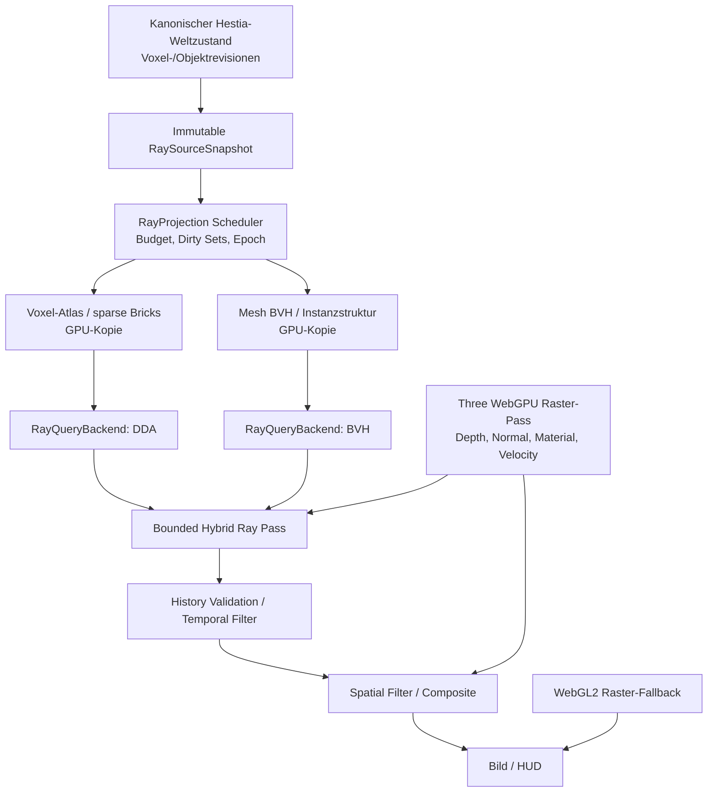

# Raytracing für Intel-, AMD- und NVIDIA-GPUs mit Three.js

## Forschungs- und Architekturkonzept für Weltraum-Spiel / Hestia

| Feld | Wert |
|---|---|
| Stand | 9. Oktober 2026 |
| Typ | Technische Recherche, Variantenvergleich, Architekturkonzept und ausführbarer Spike-Plan |
| Status | `PROPOSED / REQUIRES_SPIKE` |
| Ziel | Browserfähiges, herstellerunabhängiges Raytracing mit ehrlichem Fallback und hoher Laufzeitperformance |
| Referenzrenderer | Three.js `0.185.1` im öffentlich geprüften Browserpaket |
| Letzter über GitHub-Abfrage eingesehener `main`-Commit | `25bc7f5bbd2db6317c42193873eadeaf10a092c5` |
| Parallel verwendeter Nutzer-Basiscommit | `b3c6523a94cd050f5a9a22dc27f4777fcc03363e` ist die Basis anderer isolierter Arbeitspakete, **nicht** automatisch der aktuelle `main`-Head |
| Umfang dieser Arbeit | Read-only Web- und Repository-Recherche, keine Implementierung, Builds oder GPU-Benchmarks |

> **Kurzurteil:** Für ein Browser-Spiel können Intel-, AMD- und NVIDIA-GPUs mit WebGPU-Compute-Shadern Raytracing ausführen. Das bedeutet **nicht**, dass die speziellen Hardware-RT-Beschleuniger dieser GPUs aus Three.js beziehungsweise standardmäßigem Browser-WebGPU direkt angesprochen werden. Im Oktober 2026 fehlen im standardisierten WebGPU/WGSL-Browserpfad Ray-Query- und Acceleration-Structure-Primitiven. Für Hestia empfiehlt sich deshalb zuerst ein rasterisierter Three.js-Hauptpfad mit optionalen, lokal begrenzten, compute-basierten Ray-Effekten. Ein vollständiger Pathtracer gehört zunächst in den getrennten Screenshot-/Authoring-Modus.

---

## 1. Executive Summary und Entscheidung

1. **Keine künstliche Herstelleraufspaltung:** Eine WGSL-/WebGPU-Implementierung soll Intel, AMD und NVIDIA bedienen. Die Runtime wählt anhand verfügbarer Features, Ressourcenlimits und gemessener Leistung, **nicht** anhand des Herstellerstrings.
2. **Hardware-Raytracing wird nicht vorausgesetzt:** NVIDIA RTX-Cores, AMD Ray Accelerators und Intel Arc RT-Units sind reale Hardwarefähigkeiten. Die WebGPU-Browserschnittstelle gibt ihnen Stand Oktober 2026 keinen normativen, direkt programmierbaren Raytracing-Zugang. Desktop-APIs wie Vulkan Ray Tracing, DXR und experimentelles natives `wgpu` sind technisch andere Pfade.
3. **Three.js beibehalten:** `WebGLRenderer` bleibt der produktive Vergleichspfad. `WebGPURenderer` ist ein isolierter Kandidat, kein Vorwand für einen ungeprüften Gesamtrendererwechsel. Three.js weist ausdrücklich auf fehlende Funktionen und mögliche WebGL-Performancevorteile hin.
4. **Zwei Ray-Szenen experimentell vergleichen:** (A) BVH über abgeleitete Dreiecksmeshes (`three-mesh-bvh/webgpu`) und (B) native DDA-Rays durch die **abgeleiteten** GPU-Kopien der kanonischen Voxelbelegung. Für Hestias sehr häufige zerstörerische Edits ist B ein ernsthafter Kandidat, aber kein ungemessener Sieger.
5. **Zuerst kleine Lichtprobleme lösen:** Kontaktschatten, lokale Occlusion und Reflexionen in einem begrenzten Volumen. Danach erst diffuse indirekte Beleuchtung, robuste zeitliche Rekonstruktion und optional ein stehender Fotomodus mit Pathtracing.
6. **Licht muss der bestätigten Welt folgen:** Voxel-Authority, Mesh, Physics und Ray-Daten sind getrennte Produkte derselben bestätigten Revision. Alte GPU-Daten dürfen weder unbemerkt als aktuell ausgegeben noch in Save- oder Simulationszustand zurückgeschrieben werden.
7. **Fallback ist Pflicht:** WebGPU-unavailable, Browser-/Treiberproblem, Device-Loss, GPU-Budgetüberschreitung und problematische Shader müssen sauber auf den bisherigen Raster-Look zurückfallen.
8. **Ergebnis ist noch keine Produktfreigabe:** Alle Leistungsannahmen und Grenzwerte sind zu beweisende Ziele. Es wurden weder Hardwaretests noch Bildqualitätsabnahmen ausgeführt.

### Empfohlene Entwicklungsreihenfolge

`RT-00 technische Feature-Probe → RT-01 getrennte WebGPU-Testszene → RT-02 BVH-vs-voxel-DDA-Bakeoff → RT-03 dynamische Edits → RT-04 Hybrid-Lichtpass → RT-05 Denoising und History → RT-06 Intel/AMD/NVIDIA-Hardwarematrix → RT-07 begrenzte Produktadaption nach Freigabe → RT-08 optionaler Fotomodus`.

Die Arbeitspakete dürfen in isolierten Branches und Worktrees vorbereitet werden. Die Produktintegration ist jedoch ein eigener, explizit freizugebender Schritt. Parallel laufende HVP-, Cut-, Physics-, Save- und Renderer-Arbeiten dürfen nicht überschrieben werden.

---

## 2. Recherchebasis, Belegarten und Grenzen

### 2.1 Quellenarten

- **Extern bestätigt:** W3C-WebGPU/WGSL-Spezifikationen, GPU-Web-Arbeitsgruppendiskussion, Three.js-Handbuch, offizielle Intel-/AMD-/NVIDIA-Dokumentation, Maintainer-Repositorys und Releases.
- **Im Projekt belegt:** Öffentlich abgefragte `apps/weltraum-browser/package.json` mit `three: 0.185.1`, `@dimforge/rapier3d-compat: 0.12.0` sowie Einblick in `hvpBootstrap.ts`; bereitgestellte Abschlussberichte G02, G10, G12, G13, G14, G15, G16, G17 und das Dokument zu Reddit-Referenzen.
- **Technische Ableitung:** Bewertung der RT-Architekturen unter den Hestia-Invarianten.
- **Vorschlag:** Hier entworfene `RayScene`-, `RayBackend`-, History- und Messverträge.
- **Unbekannt:** Tatsächliche Performance auf H1/H2/H3, konkrete Herstellergeräte im Browser, aktueller Zustand der parallel geführten Entwicklungsbranches, Vollständigkeit der relevanten `WebGPURenderer`-Materialparität und genaue GPU-Arbeit nach einem Voxel-Cut.

Die bereitgestellten historischen Architekturberichte enthalten häufig `PROPOSED` oder `REQUIRES_OWNER_DECISION`. Eine dort entworfene API wird hier nicht als implementierte Produktfunktion ausgegeben. Ebenso ersetzen Committexte keine unabhängigen Laufzeitmessungen.

### 2.2 Relevante Hestia-Randbedingungen

- Browser- und Chromium-first; TypeScript; Three.js als aktuelle Darstellungsreferenz.
- Deutlich sichtbare, harte Mikrovoxel, keine geglättete Low-Poly-Ersatzwelt.
- Material-/Voxelbelegung ist CPU-seitige Authority. GPU-Meshes, BVHs, Ray-Atlanten und Licht-Cache sind abgeleitete, verwerfbare Daten.
- Die historisch definierte technische Standardreferenz ist ein 0,25-m-Raster, sparse 32³-Chunks und 34³-Meshinghalos. Konkrete HVP-Szenen oder künftige Auflösungsprofile können eigene, versionierte Werte haben; Raytracing darf keine globale Zellgröße still festschreiben.
- Voxel-Edits und Fragmenttransfers besitzen kanonische Commit-/Revisionsgrenzen. Rechenjobs müssen stale Ergebnisse verwerfen.
- Terrain, Bäume, Vegetation, Wasser, bewegte Fragmente, Schiffs-/Drohnenteile und später Städte gehören visuell zum Ziel. Nicht alle haben dieselbe Geometrie- oder Kollisionsemantik.
- Das Projektziel ist ein schnell spielbarer Prototyp, nicht maximaler Renderrealismus auf Kosten von Physics, Cut und Eingabelatenz.

### 2.3 Vorliegende Codebeobachtung, eingeschränkte Aussage

Am über GitHub zuletzt überprüften `main` ist `apps/weltraum-browser/package.json` mit Three.js `0.185.1` gepinnt. `hvpBootstrap.ts` referenziert eine bestehende Three.js-/RenderBackend-Presentation und HVP-Landschafts-, Vegetations-, Wasser- und Physikkomponenten. Aus dem vorhandenen Import allein wird **kein** bereits integrierter Raytracing-Pass und **kein** vollständiger aktueller Renderer-Vertrag abgeleitet. Im geplanten RT-Spike sind die tatsächliche Framepipeline und alle verwendeten Custom Materials direkt zu inventarisieren.

---

## 3. Begriffsklärung: Fünf technisch unterschiedliche Verfahren

| Verfahren | Technischer Kern | Braucht eigene RT-Hardware? | Eignung für Hestia |
|---|---|---|---|
| Rasterisierung und Shadow Maps | Dreiecke werden projiziert, Sicht- und Schattenbilder gerastert | Nein | Pflichtbaseline, bisheriger Spielbetrieb |
| Screen-Space-Verfahren (SSAO, SSR, SSGI) | Sucht Treffer in Bildtiefe und bildsichtbaren Daten | Nein | Gute niedrige bis mittlere Qualitätsstufe, begrenzte Offscreen-Information |
| Shader-Raytracing über BVH | Ray/AABB/Triangle-Tests in GLSL oder WGSL, mit GPU-Compute beziehungsweise Fragmentshadern | Nein | Cross-Vendor, aber BVH-Aufbau und Updatekosten |
| Voxel-Ray-Casting / 3D-DDA | Rays schreiten durch voxelbelegte Gitter, optional sparse und hierarchisch | Nein | Besonders relevant für blockige zerstörbare Welt, GPU-Datenrepräsentation entscheidend |
| Hardware-Raytracing | Treiber-/API-verwaltete Acceleration Structures und Hardware-Ray-Queries | Ja, für Hardwarebeschleunigung | Browser noch Zukunftsoption; native Desktopversion möglich |
| Progressive Pathtracing | Wiederholt Lichtpfade über mehrere Bounces/Samples und rekonstruiert ein Bild | Nicht zwingend, kann über Software-Traversierung laufen | Fotomodus, Vorschau, Offline-Golden; für bewegte Cut-Gameplaywelt zunächst teuer |

**Wichtig:** 3D-DDA auf harten Voxelzellen ist kein Sphere-Tracing auf einem Signed Distance Field. Ein SDF benötigt ein eigenes Feld, seine Aktualisierung nach destruktiven Edits ist zusätzlicher Aufwand. Das Gleiche gilt für Sparse Voxel Octrees: Sie sind eine mögliche GPU-Beschleunigungsstruktur, nicht die kanonische Weltautorität.

---

## 4. Herstellerkompatibilität und tatsächlicher API-Zugang

### 4.1 Die drei GPU-Hersteller

| Herstellerklasse | Typische Hardwarefähigkeit | Was ein regulärer Browser nutzen kann | Folgerung |
|---|---|---|---|
| **NVIDIA GeForce RTX** (ab Turing-Generation, modellabhängig) | RT-Cores für BVH-Traversierung und Ray/Triangle-Tests | WebGPU-Compute-Shader und klassisches Raster, nicht direkt DXR/OptiX/RT-Core-API | Gemeinsamen WGSL-Pfad verwenden, nativen RT-Core-Pfad nicht voraussetzen |
| **AMD Radeon RDNA 2+** (z. B. RX 6000, RX 7000, RX 9000 und geeignete APUs) | Ray Accelerators, im nativen API-Pfad Hardware-RT | WebGPU-Compute-Shader, keine direkte WebGPU-Browser-RTA-API | Auf Radeons mit und ohne RT-Hardware funktionaler Qualitätsfallback |
| **Intel Arc** (z. B. Arc A/B, Hardwaregeneration/-modell beachten) | Dedizierte Raytracing-Units | WebGPU-Compute-Shader, keine direkte DXR/Vulkan-RT-Nutzung über Three.js | Arc als unabhängige Zielklasse testen |
| **Ältere NVIDIA GTX / AMD RDNA1 / Intel integrierte Alt-Grafik** | Keine allgemein vorauszusetzende dedizierte RT-Hardware | WebGL2, gegebenenfalls WebGPU je Browser und Treiber | Raster-Fallback, bei hinreichender Compute-Leistung vielleicht reduzierte Software-Rays |

Auch bei GPU-Hardware mit nativer Raytracing-Einheit ist ein Software-BVH in WGSL nicht automatisch von dieser Einheit beschleunigt. Die GPU rechnet die Traversierung auf allgemeinen Shader-/Compute-Ressourcen. Ob eine konkrete Plattform und ein Treiber intern optimieren, ist kein WebGPU-Vertrag und kein verlässlicher Produktmechanismus.

### 4.2 Plattformen im Oktober 2026

| Laufzeitoberfläche | Raytracing-Technik | Native HW-Ray-Queries | Drei.js-Pfad |
|---|---|---|---|
| Browser `WebGL2` | Fragmentshader / Textur-BVH, Screen-Space | Nein | `WebGLRenderer`; langsamer Vergleich beziehungsweise Fallback |
| Browser `WebGPU` | WGSL-Compute, GPU-BVH, GPU-DDA, Raster + Ray-Compositing | **Nicht standardisiert verfügbar** | `WebGPURenderer` und TSL beziehungsweise eng begrenzte Shader-Adapter |
| Native Vulkan | Vulkan-Raytracing-Erweiterungen, je Gerät | Möglich | Erfordert eigene native Runtime/Rendererbrücke, nicht Standard-Three.js im Browser |
| Native Windows DX12 | DXR | Möglich | Separate Windows-Runtime, nicht per `THREE.WebGPURenderer` freigeschaltet |
| Experimentelles natives `wgpu` | Nicht standardisierte Ray-Query-Erweiterungen | Experimentell | Kein belastbarer Browser-Kompatibilitätsvertrag |

**Beleg:** GPU-Web-Issue `#535` ist offen und im Milestone `4+`. Die WGSL-Arbeitsgruppe diskutierte im Juli 2026 Ray Queries und Acceleration Structures als künftige Themen. Die W3C-WGSL-Spezifikation vom 21.09.2026 enthält keine standardisierten `ray_query`-Primitiven. Natives Rust-`wgpu` weist dagegen ausdrücklich auf eine experimentelle und potenziell inkompatible Erweiterung hin. [S01, S02, S03, S04]

**Nicht auf einen hypothetischen Standard warten:** Ein Browser-Spiel soll heute mit WGSL-Softwaretraversierung experimentieren und eine saubere austauschbare `RayQueryBackend`-Grenze beibehalten. Ein späterer Hardwarepfad kann dort aufgenommen werden, falls **alle** Bedingungen erfüllt sind: Standard oder stabiler browserweiter Vertrag, nachgewiesene Verfügbarkeit, Lieferbarkeit auf Intel/AMD/NVIDIA und Qualitäts-/Leistungsnachweis.

### 4.3 Runtime-Feature-Probe statt Hersteller-Blacklist

Der Browser kann eine WebGPU-Implementierung verweigern, `requestAdapter()` kann `null` liefern, Features und Limits können anders als erwartet ausfallen. Browser können bewusst grobe Grenzwert-Tiers melden. Adapter-Namen sind nicht als Leistungsorakel geeignet.

Vorgeschlagener Prüfablauf:

1. Sicheren Kontext und `navigator.gpu` prüfen.
2. Adapter mit normaler Präferenz anfordern; `null` behandeln.
3. Features, insbesondere optionale Zeitmessung, und Limits lesen.
4. Geräteanfrage mit tatsächlich vorhandenen Anforderungen durchführen, nicht blind alle Features aktivieren.
5. Shader- und Texture/Buffer-Creation-Smoke in einer **isolierten** Testszene prüfen.
6. Kleinbenchmark mit bekannten fixierten Ray-Inputs ausführen; dessen Ergebnis nur als Sitzungs-Tuning, nicht als beweisbarer GPU-Katalog verwenden.
7. Device Loss, Out-of-Memory und uncaptured Fehler erfassen und den Renderer sicher degradieren.
8. In der Grafik-UI `Off`, `Auto`, `Hybrid` und `Photo` erlauben, wobei `Auto` nie mehr Budget beanspruchen darf als ein gemessener Profilschwellenwert.

Beispiel für eine **WebGPU-Verfügbarkeitsprüfung**, kein Drop-in für die heutige Produktpipeline:

```ts
async function probeWebGpu(): Promise<
  | { supported: false; reason: string }
  | { supported: true; features: string[]; limits: Record<string, number> }
> {
  if (!globalThis.isSecureContext || !navigator.gpu) {
    return { supported: false, reason: 'webgpu-unavailable' };
  }
  const adapter = await navigator.gpu.requestAdapter();
  if (!adapter) return { supported: false, reason: 'adapter-unavailable' };
  return {
    supported: true,
    features: [...adapter.features],
    limits: {
      maxStorageBufferBindingSize: adapter.limits.maxStorageBufferBindingSize,
      maxBufferSize: adapter.limits.maxBufferSize,
      maxComputeInvocationsPerWorkgroup: adapter.limits.maxComputeInvocationsPerWorkgroup,
      maxComputeWorkgroupStorageSize: adapter.limits.maxComputeWorkgroupStorageSize,
    },
  };
}
```

Die Funktion prüft nicht die Leistungsfähigkeit eines Raytracers, keine dedizierte RT-Hardware und keine Materialparität. Sie ist ausschließlich ein Preflight. Die konkrete GPU-Instanz erzeugt der gewählte Renderer-Adapter.

---

## 5. Aktueller Three.js-Ökosystemstand

### 5.1 Three.js `WebGPURenderer`

Die offizielle Dokumentation nennt WebGPU als primäres Backend und einen automatischen WebGL2-Fallback. Der automatische WebGL2-Backend-Fallback von `WebGPURenderer` bedeutet **nicht**, dass ein WebGPU-Compute-Raypass dort weiterläuft. Beim Backend-Fallback müssen Compute-Raytracing und daran gebundene GPU-Pässe explizit deaktiviert werden. Die Custom-Material- und Postprocessing-APIs sind **nicht** dieselben wie beim alten `WebGLRenderer`: `ShaderMaterial`, `RawShaderMaterial` und `onBeforeCompile()` sind nicht direkt kompatibel. Ein Renderwechsel erzwingt in diesen Bereichen eine Portierung zu Node-Materialien/TSL. Three.js bezeichnet `WebGPURenderer` weiterhin als experimentell und weist auf mögliche Lücken und geringere Geschwindigkeit gegenüber WebGL hin. [S05]

Neu relevant ist das `RenderPipeline`-/TSL-Postprocessing-System mit MRT, Normalen, Tiefen- und Velocity-Ausgaben. Diese Pässe sind nützlich für temporale Ray-Rekonstruktion; allerdings muss die konkrete Pufferkonfiguration und deren Bandbreite gemessen werden. [S06]

**Integrationsgrenze:** Für den Spike eine eigene Route beziehungsweise einen eigenen Einstieg bauen. Den bestehenden HVP-Renderpfad nicht gleichzeitig auf WebGPU umschalten.

### 5.2 `three-gpu-pathtracer`

- Offizieller Maintainer und Lizenz-/Versionsstand sind am exakten Tag zu pinnen.
- Release `0.0.25` vom 28.09.2026 führte `WebGPUPathTracer` unter `three-gpu-pathtracer/webgpu` ein.
- Release `0.0.26` vom 29.09.2026 reparierte einen CDN-Import. Die Paketfreigabe setzt nun mindestens Three.js r185 voraus.
- `WebGLPathTracer` ist seit `0.0.25` deprecated; die Entfernung ist angekündigt. Er ist keine empfehlenswerte neue Produktbasis.
- Die WebGPU-Dokumentation zeigt `WebGPUPathTracer(renderer)`, `setScene(scene, camera)` und `renderSample()`.
- Der Maintainer nennt aktuell Einschränkungen bei Materialien, Emissions-MIS, transparentem Upscaling und verbleibender Performancearbeit. [S07, S08, S09]

Ein **separater Referenz-Fotomodus** kann wie folgt anfangen:

```ts
// Konzeptbeispiel, nur in isoliertem Spike und nach exaktem Dependency-Pin.
import * as THREE from 'three/webgpu';
import { WebGPUPathTracer } from 'three-gpu-pathtracer/webgpu';

const renderer = new THREE.WebGPURenderer({ antialias: false });
await renderer.init();

const tracer = new WebGPUPathTracer(renderer);
tracer.setScene(scene, camera);
renderer.setAnimationLoop(() => tracer.renderSample());
```

Dies ersetzt weder Hestias `RenderBackend`, noch beweist es Echtzeitfähigkeit in einer veränderlichen Szene. Sobald Kamera, Materialien oder Szenengeometrie sich ändern, müssen deren Update- und Reakkumulationskosten separat ermittelt werden. Ein bewegter Spieler würde bei dauerndem Reset typischerweise nicht dieselbe Konvergenz wie eine stehende Kamera erreichen.

### 5.3 `three-mesh-bvh` und `three-mesh-bvh/webgpu`

- MIT-lizenziertes Bibliotheksprojekt für hierarchische räumliche Abfragen über Three.js-Geometrie.
- Seit `0.9.2` existieren WebGPU-Compute-/TSL-Funktionen.
- `BVHComputeData` kann Szeneobjekte in GPU-BVH-Puffer für WebGPU-Compute bereitstellen, einschließlich Szene-/Objekthierarchie.
- Die WebGPU-API ist vom Maintainer ausdrücklich **instabil** und setzt Three.js r185 oder neuer voraus.
- Geometrieänderungen benötigen BVH-Refit oder Rebuild; dessen Korrektheit und Kosten sind für Hestia zentral. [S10, S11]

**Wichtige Unterscheidung:** `three-mesh-bvh` auf der CPU zum beschleunigten Three.js-Raycasting ist nicht automatisch ein GPU-Raytracer. Erst die GPU-Datenstruktur mit Shader-/Compute-Traversierung ist die zu vergleichende Rendertechnik. Die BVH-Tests dürfen niemals den Physics- oder Voxel-Authority-Vertrag ersetzen.

### 5.4 Was vor einer Bibliotheksübernahme zu prüfen ist

Exakte Tag-SHA, Paket-/Peer-Dependency-Lock, Lizenz + Dritt-Lizenzen, installierte Bytes, verwendete Shader, transitive Abhängigkeiten, minifizierter Bundlezuwachs, Shader-Compilezeit, Treiberverhalten, BVH-Updatevertrag, Szenebeherrschung und Teardown. Der erste Spike ist als Bibliotheks-Bakeoff zu kennzeichnen, nicht als akzeptierte Produktautorität.

---

## 6. Variantenvergleich für Hestia

Bewertungen sind **Architektururteile**, keine Benchmarks.

| Variante | Bildqualitätspotenzial | Dynamische Voxel-Edits | Browser-/Herstellerportabilität | Implementierungsrisiko | Empfohlene Rolle |
|---|---|---|---|---|---|
| A: Raster + Shadowmaps + SSAO/SSR | Gut, begrenzt bei indirektem Licht | Hoch, keine zusätzliche RT-Struktur | Sehr hoch | Niedrig bis mittel | Pflichtbaseline und Low-Profil |
| B: Three-WebGPU + compute BVH auf Render-Meshes | Sehr gut für geometrische Rays | Mittel, lokale Refit-/Rebuildkosten unklar | Hoch mit WebGPU | Mittel bis hoch | **Vergleichskandidat 1** |
| C: Three-WebGPU + sparse Voxel-DDA | Sehr gut für blockige Terrain-Rays | Potenziell gut, dirty Brick-Uploads | Hoch mit WebGPU | Mittel bis hoch | **Vergleichskandidat 2, Hestia-spezifisch** |
| D: WebGPU + SDF/Sphere-Tracing | Gut für bestimmte Volumeneffekte | Feldaktualisierung nach Cut anspruchsvoll | Hoch mit WebGPU | Hoch | Forschungsreferenz, nicht v1 |
| E: WebGPU + komplettes Pathtracing pro Gameplayframe | Sehr hoch bei genügend Samples | History-Reset und BVH-Updates teuer | Hoch, aber nur auf ausreichend starken GPUs | Sehr hoch | Nicht für den ersten Spielslice |
| F: Progressive WebGPU-Pathtracing für Standbilder | Sehr hoch | Szene vor Aufnahme konsistent einfrieren | WebGPU-GPU erforderlich | Mittel | Getrennter Fotomodus/Editor |
| G: Native Vulkan/DXR-RT | Sehr hoch | Treiber-BLAS/TLAS-Updates nötig | GPU-übergreifend, aber nicht browsernativ | Sehr hoch | Nur separate spätere Desktop-Strategie |

**Auswahlentscheidung für den Spike:** B und C müssen **dieselbe visuelle Aufgabe** auf identischen autoritativen Fixturebytes erfüllen. Kein Wechsel zu C allein wegen der theoretischen Nähe zu Voxeln. Kein Wechsel zu B allein, weil eine Bibliothek bereits existiert. Der durch echte Schnitte geänderte Anteil und die Kosten der abgeleiteten Szenenaktualisierung zählen genauso wie Rays/s.

---

## 7. Vorgeschlagene Laufzeitarchitektur



Das Diagramm beschreibt **alternative RayQueryBackends**, keine Pflicht, beide für jeden Ray parallel zu durchlaufen. Ein späteres hybrides Terrain-/Asset-Verfahren muss eindeutige Prioritäts-, Masken- und Distanzregeln festlegen. Ein Ray darf dieselbe Voxeloberfläche nicht doppelt treffen, nur weil sie sowohl Mesh als auch Voxelquelle besitzt.

### 7.1 Vier Hauptschichten

**Authority:** unveränderte Voxel-/Objekt-/Simulationseigentümer. Sie liefern eine bestätigte Revision und nicht mutierbare Snapshots.

**Projection:** baut für Raytracing ausgelegte GPU-Puffer, Bricks und BVHs. Sie dürfen jederzeit verworfen werden. Jeder GPU-Puffer kennt seinen Quell-Digest beziehungsweise die maßgeblichen Revisionsschlüssel.

**Render:** Three-WebGPU Raster-Pipeline, optionaler Compute-Ray-Pass, History, Filter, Composite. Material-/Ray-Resultate sind Darstellung und dürfen nicht in Gameplaytransaktionen zurückwirken.

**Observability:** Bild-/Performancebelege, per-Frame-Budgets, Pending-Revisionen, GPU-Residency, Fallback-Gründe, Compile-/Transferzeiten und Failurecodes.

### 7.2 Vorgeschlagene Verzeichnisstruktur, **noch nicht anlegen**

```text
apps/weltraum-browser/src/raytracing/
  contracts/
    raySceneTypes.ts
    rayPresentationProfile.ts
  adapter/
    raySnapshotAdapter.ts
    rayGpuResidency.ts
  query/
    bvhRayQuery.ts
    voxelDdaRayQuery.ts
  passes/
    hybridRayPass.ts
    historyValidation.ts
    spatialFilter.ts
    composeLighting.ts
  diagnostics/
    rayTracingTelemetry.ts
  spike/
    entry.ts
    fixtures.ts
    comparisonHarness.ts
```

Die tatsächliche Paket-/Dateistruktur muss sich am aktuellen HVP-RenderBackend orientieren. Das ist eine Verantwortungsmatrix, kein Freibrief zum neuen parallelen Rendererframework.

### 7.3 Minimale abstrakte Vertragsgrenze

```ts
// PROPOSED. Kein vorhandener Hestia-Vertrag.
type RevisionKey = string;
type RayStatus = 'hit' | 'miss' | 'unknown-coverage' | 'budget-exceeded';

type RaySourceBinding = Readonly<{
  authorityEpoch: string;
  worldRevision: RevisionKey;
  sceneOriginEpoch: string;
  materialRegistryDigest: string;
  contentDigest: string;
  dependencyRevisions: ReadonlyArray<{
    ownerId: string;
    revision: RevisionKey;
  }>;
}>;

type RaySceneSnapshot = Readonly<{
  binding: RaySourceBinding;
  localFrameId: string;
  voxelMeters: number;       // aus Quellprofil, niemals global hartkodiert
  chunkEdgeCells: number;    // aus Quellprofil
  regionBoundsMeters: readonly [number, number, number, number, number, number];
  chunks: ReadonlyArray<{
    chunkId: string;
    revision: RevisionKey;
    coverage: 'complete' | 'unknown';
    cells?: Uint8Array;     // immutable Kopie / transferable Snapshot, nicht Live-Authority
  }>;
  movingVolumes: ReadonlyArray<{
    ownerId: string;
    revision: RevisionKey;
    transformRevision: RevisionKey;
    frameId: string;
  }>;
}>;

interface RaySceneProjection {
  readonly source: RaySourceBinding;
  readonly backendKind: 'bvh-compute' | 'voxel-dda-compute';
  readonly residentBytes: number;
  dispose(): void;
}

interface RaySceneProjector {
  prepare(snapshot: RaySceneSnapshot): Promise<RaySceneProjection>;
  // Durch den Coordinator nur bei vollständig passender Source-Bindung adoptieren.
}
```

Der TypeScript-Vertrag zeigt die relevanten Informationsgrenzen und ist absichtlich **nicht** direkt produktkompilierbar: Er enthält noch keine vollständige Authority-, Objekt-, Material-, Raymask-, Frame- oder GPU-Resource-Implementierung. Das erste Gate muss ihn an die realen Pakete und deren existierende Typen anpassen, statt eine zweite Autorität aufzubauen.

---

## 8. Beschleunigungsstruktur I: Mesh-BVH

### 8.1 Datenmodell

1. Greedy-Meshes und Renderartefakte bleiben Ableitungen des bestätigten Voxelzustands.
2. Pro immutable Geometry-Generation entsteht eine BVH beziehungsweise BLAS-artige Struktur.
3. Eine übergeordnete Szene-/Instanzstruktur verweist auf Ortsrahmen, Transform, Geometry-Key und Masks.
4. Moving Volumes und fallende Fragmente aktualisieren in erster Linie Transformdaten. Bei tatsächlichem Cut ändern sie ihre Geometrie und benötigen neue beziehungsweise refittete lokale Strukturen.
5. GPU-Puffer tragen Quellrevisionen. Bei verspätetem Worker-Resultat bleibt die aktuelle Szene verbindlich.

### 8.2 Kostenstellen

- CPU-BVH-Bauzeit; Worker-Start und Puffermigration.
- Mögliche Neugenerierung bei jeder geänderten Greedy-Fläche.
- GPU-BVH-Upload, GPU-Gesamtspeicher, Build-/Traversal-Qualität.
- Dynamische Fragment-TLAS-/Object-BVH-Updates.
- Shader-Kosten durch divergente Rays, lange Traversierung und große Materialtabellen.

**Prüfhypothese:** Bei wenigen bearbeiteten Geometrie-Clustern mit vielen Dreiecken könnte inkrementelles Rebuild/Refit günstig sein. Bei häufig wechselnder Microvoxel-Topologie kann die erneute Meshing-/BVH-Kette teurer werden als ein einfaches Dirty-Brick-Update. Das ist ein Testfall, keine Tatsache.

### 8.3 Korrektheitsregeln

Render-LOD muss beim BVH-Aufbau explizit dokumentiert sein. Grobes visuelles Mesh kann für indirekte Fernbeleuchtung zulässig sein, nicht aber unbemerkt für Nahkontaktschatten gegen hochauflösende kanonische Voxels. Ein Ray-LOD kann eine separate **Presentation**-Qualitätsentscheidung sein. Er darf keine Treffer-/Mining-/Kollisionstests autorisieren.

---

## 9. Beschleunigungsstruktur II: Native Voxel-DDA

### 9.1 Grundidee

Der Shader erhält eine vollständige, revisionsgebundene GPU-Kopie nur der **residenten** relevanten Voxelbereiche. Statt jedes Greedy-Dreieck zu schneiden, schreitet der Ray entlang der durchlaufenen Zellgrenzen. Die klassische Fast-Voxel-Traversal-Idee ist eine 3D-DDA mit `tMax`, `tDelta` und einem ganzzahligen Zellindex. Das passt direkt zu harten voxelachsparallelen Flächen und Material-IDs.

### 9.2 Sparse Datenhaltung

Empfohlene erste Darstellung zum Vergleichen:

```text
ChunkLookup / PageTable:
  (local chunk coordinate) -> Brick-ID | UNKNOWN | KNOWN_EMPTY

BrickTable:
  world chunk coordinate, source revision, material offset, occupancy summary

MaterialPayload:
  dense Uint8 material cells in resident chunks, optional palette remap

Optional acceleration:
  occupancy mip / hierarchical skip, not a new world authority
```

Ein vollständig residenter `32³`-Chunk benötigt als reiner `Uint8`-Materialpayload 32 KiB vor Alignment/Metadaten. **Das ist keine tatsächliche GPU-Residentengröße** und sagt nichts über Texturen, PageTables, Mips, History oder Kopien aus. Ein `34³`-Halo wird beim Meshing verwendet, aber muss für eine separate DDA-Struktur nicht blind gespeichert werden, sofern die Traversierung bei Zell-/Chunkübergängen korrekt ist.

### 9.3 Ray-DDA im Detail

1. Den Ray in den lokalen metrischen Renderrahmen überführen; planetare und kamerarelative Ursprünge bleiben explizit.
2. Für negative Koordinaten mathematisches `floor` verwenden, nicht truncation toward zero.
3. Den betroffenen Chunk über eine begrenzte PageTable-Abfrage ermitteln.
4. `UNKNOWN` ist **kein** `AIR`. Fehlende Residency liefert ein explizites Invalid-/Unknown-Resultat, das den Lichtpass auf Fallback oder History-Verwerfung umschaltet.
5. Leere Chunks dürfen als bestätigtes `KNOWN_EMPTY` übersprungen werden; innerhalb eines belegten Bricks arbeitet die DDA oder ein hierarchischer Skip.
6. Intersection-Normal kommt aus der gekreuzten voxelachsparallelen Zellfläche. Bei exakt gleichzeitiger Achsgrenzkreuzung gilt eine dokumentierte, robuste Tie-Policy.
7. `maxDistance` und `maxSteps` begrenzen jeden Ray. Budgetabbruch ist **kein** bestätigter Miss.
8. Startpunkt-Bias muss Selbsttreffer vermeiden, ohne dünne 0,25-m-Strukturen verschwinden zu lassen.
9. Alle gültigen Hitdaten adressieren die gleiche Materialregistry wie das Rastermaterial. GPU-Palettenindex ist keine physische oder wirtschaftliche Materialidentität.

**Harte Integrationsregel:** Eine Voxel-Zelle kann beim Mining entfernt, beim Fragmenttransfer an einen anderen Owner übergeben oder als Objektzelle erneut bearbeitet werden. Ray-Projektionen dürfen eine Zelle nie zugleich im alten Terrain und im neuen Fragment als aktuell ausgeben.

### 9.4 Bewegte Objekte und Vegetation

- **Terrain/Stein:** primär statische oder geänderte globale Chunkvolumen.
- **Abgetrennte Fragmentkörper:** transformierte lokale Voxelvolumen, Revision + Transformrevision separat. Kein vollständiger Brick-Upload bei reiner Bewegung.
- **Strukturelles Holz:** lokale Materialzellen; nach bestätigter Trennung nur der richtige Owner.
- **Dekoratives Laub/Gras:** gesondertes Verfahren, da Material-`Air`/Voxel-Physics nicht notwendigerweise Deckung/Transparenz des Laubs beschreiben. Erster Spike darf es vereinfachen, muss die Vereinfachung sichtbar deklarieren.
- **Bewegter Windbewuchs:** animierte Rasterdarstellung und ggf. begrenzte Shadow-Proxies; keine Voll-BVH-Neuberechnung jedes Blattes im ersten Slice.
- **Wasser:** zunächst rasterbasierte Hauptoberfläche. Fresnel, Reflexion und Transmission können ein späterer getrennt begrenzter Ray-Pass sein.

### 9.5 Warum keine vollständig raygemarchte Planetendarstellung als erster Schritt

Primäre Camera-Rays für alle Bildpixel zu berechnen, ersetzt nicht die bestehenden Vorteile von Greedy-Meshing, Sichtbarkeitsverwaltung, Materialsystem und hardwareoptimierter Rasterisierung. Ein vollständiger Primärstrahlrenderer müsste Kamera, Transparenz, Wasser, Vegetation, LOD, Editor-Picking, Schatten, Effekte und Screen-Space-Integration erneut lösen. Zusätzlich sind planetare Distanzen und lokale hochauflösende Zellen numerisch widersprüchliche Skalen. **Secondary Rays** als Ergänzung der vorhandenen rasterisierten Oberfläche sind der kleinere, besser isolierbare Versuch.

---

## 10. Hybrid-Renderpipeline in Three.js WebGPU

### 10.1 Grundlegender Framegraph

```text
World/Presentation snapshot
  -> Three WebGPU raster main pass
       color / depth / normal / roughness / material role / velocity / object ID
  -> limited ray query pass (local viewport, half/quarter resolution)
       hit distance, occlusion / indirect contribution, validity, revision mask
  -> history reprojection & rejection
       motion vectors + depth + normal + owner ID + world/transform revisions
  -> edge-aware spatial filter
  -> lighting composite in linear HDR
  -> tonemapping and output transform
  -> DOM HUD outside the ray pipeline
```

Die tatsächliche MRT-API und Node-Namen müssen an der exakt gepinnten Three-Version geprüft werden. Die offizielle Three.js-Anleitung zeigt MRT für `output`, `velocity`, `normalView`, `metalness`, `roughness` und automatische Depth-Texturen, aber keine fertige projektspezifische Hestia-GI-Pipeline. [S06]

### 10.2 Effektstufen

| Stufe | Effekt | Ray-Budgethypothese | Kommentar |
|---|---|---|---|
| 0 | Raster + vorhandene Shadow Maps/AO | Keine zusätzlichen Rays | Jederzeit korrekt und schnell als Referenz |
| 1 | Lokale Ray-Contact-Occlusion | 1 kurzer Ray pro ausgewähltem Low-Res-Pixel | Erster objektiv prüfbarer Treffer-/Invalidationsfall |
| 2 | Selektive Reflexion an Wasser/Metall | 1 Ray nur für reflektierende Pixel | Starke visuelle Wirkung, großes Ghosting-Risiko |
| 3 | Bounded Diffuse Bounce | 1 sekundärer Ray pro Low-Res-Pixel, begrenzte Entfernung | Benötigt temporale Stabilisierung, Sample-Vergleich |
| 4 | Mehrere Bounces / Pathtracing | Iterativ, pro Standbild oder Editor-Capture | Kein erstes Gameplay-Gate |

Der Raster-Pfad bleibt primäre Sichtbarkeit. Der Ray-Pass wird über Render-Masks, Materialrollen, Kameradistanz und GPU-Budget eingeschränkt. In Hestias First-Person-Nahfeld können kurze Schatten und indirekte Lichtkanten aus Wurzeln, Höhlen und Wrackteilen mehr bewirken als ein globaler Pathtracer über den ganzen Planeten.

### 10.3 Material- und Lichtsemantik

- Kanonische `MaterialId` und visuelles Palette-Profil getrennt halten.
- Für den Ray-Shading-Look explizit `albedo`, `roughness`, `metalness`, `emissive`, `opacityMode`, `twoSided` und ggf. `transmission` aus **versionierter Präsentation** ableiten.
- Nicht unbemerkt echte PBR-Oberflächen für Materialien behaupten, deren Gameplaywerte keine PBR-Information enthalten.
- Komposition in linearer Licht-/HDR-Domäne; einmaliges Tone Mapping am Ende.
- Kein doppelt angewendetes SSAO, Shadowing oder GI. Der Composite muss definieren, welcher Pass welche Energie-/Occlusion-Komponente ersetzt oder ergänzt.
- Mikrovoxelkanten bleiben geometrisch hart und erkennbar; Filter dürfen die Silhouette nicht glattbügeln.

### 10.4 Surface-to-Orbit und astronomische Skalierung

Die indirekte lokale Ray-Szene enthält begrenzte metrische Bereiche und camera-relative GPU-Koordinaten. Die CPU-World- und Orbit-Authority darf absolute `Float64`-Positionen haben; GPU-Ray-Queries verwenden abgeleitete lokale `Float32`-Frames. Wenn die Kamera einen Floating-Origin-Sprung durchführt, wird die History für unzuverlässige Pixel invalidiert. Sonnenrichtung darf aus astronomischem Modell kommen; ein Sonnen-Ray durch Millionen Kilometer leere Welt gehört nicht in die lokale Raystruktur. Weit entfernte Himmelskörper nutzen LOD-/analytische Lichtmodelle und Rasterdarstellung.

---

## 11. Temporal Accumulation, Denoising und Qualitätskontrolle

### 11.1 Problem

Ein Ray pro Low-Res-Pixel ist verrauscht. Klassische temporale Akkumulation nutzt frühere Bilder und Motion Vectors, aber Hestia ändert die Geometrie tatsächlich. Nach einem Cut kann ein zuvor dunkel verdeckter Pixel plötzlich direkt beleuchtet werden. Ein alter History-Cache würde fälschlich den alten Schatten konservieren.

### 11.2 Validitätsregeln

Ein History-Sample darf nur weiterverwendet werden, wenn mindestens gelten:

- projizierte Pixelposition liegt in einem gültigen Bildbereich;
- aktuelle und historische Tiefen/Normalen sind kompatibel;
- Materialrolle und tatsächlich sichtbarer Owner beziehungsweise Objekt-ID stimmen nach gültiger Reprojektion überein;
- das für die Strahlstrecke relevante `dirtyRegionSet` betrifft die historische Lichtantwort nicht oder der Verlauf wird verworfen;
- Licht-/Tageszeitänderung überschreitet keinen dokumentierten Schwellwert;
- Kamera-Frame-/Origin-Epoch stimmen;
- neue GPU-Residency meldet nicht `unknown-coverage`;
- kein Teleport, Cut, Fragmenttransfer oder Save/Load hat eine unerkannte Revision erzeugt.

Im ersten Gate lieber **zu viel** History invalidieren als beleuchtungstechnisch falsche Weltzustände stehenlassen. Später dürfen lokale Dirty-Bounds die Invalidierung präzisieren.

### 11.3 Algorithmischer Aufbau

1. Räumlich korrekte G-Buffer-Normalen, Tiefen und Bewegung.
2. Shadow-/GI-Ray-Output mit separatem Hitstatus und passender Source-Bindung.
3. Temporale Reprojektion, Tiefe-/Normal-/Owner-Tests, History-Längenlimit.
4. Luminanz-/Varianzschätzung; adaptive Gewichtung bei Änderungen.
5. Edge-aware spatial filter, z. B. SVGF-inspirierte A-Trous-Stufen.
6. Nachfilter gegen harte Voxel-Silhouetten und Temporal Ghosting testen.

SVGF ist eine gut dokumentierte Forschungsreferenz für Spatiotemporal-Reconstruction aus wenigen Samples, keine Plug-and-play-Bibliothek für Hestia. [S12]

### 11.4 Nicht als v1-Lösung voraussetzen

- NVIDIA DLSS, RTX-Denoiser oder OptiX direkt aus Three.js im Standardbrowser.
- AMD FSR/XeSS als automatisch und überall verfügbare native Browserdienste.
- `OIDN`-CPU/WASM oder On-GPU-ML ohne gemessene Latenz-/Speicher-/Downloadkosten.
- ReSTIR GI oder aufwendige Reservoir-Pipelines vor einem funktionierenden 1-Ray-Pass.

Plattformneutrales Upscaling und einfache temporale Filter dürfen gesondert verglichen werden. Ansonsten bleibt zunächst der vorhandene Antialiasing-/Tonemappingpfad.

---

## 12. Dynamische Weltänderung: Revisions- und GPU-Update-Vertrag

### 12.1 Zustandskette

```text
Cut / Build Command
  -> Authority validates and commits at revision R+1
  -> Dirty cell and owner/fragment sets with receipt
  -> Mesh, Physics and Ray projection each request R+1
  -> ray upload / BVH rebuild or refit
  -> GPU result includes exact source binding
  -> renderer adopts only matching revisions
  -> spatial/temporal history invalidated where required
  -> new ray contribution becomes visible
```

Nicht alle abgeleiteten Subsysteme müssen exakt im selben Frame fertig werden. **Die Darstellung muss aber ihren Konsistenzzustand offenlegen.** Beispielsweise kann der Raster-Hauptpfad schon `R+1` zeigen, während Ray-Illumination noch `R` enthält. In diesem Fall darf der Renderer die alte GI nicht als sicher aktuell verwenden. Zulässig ist temporär ein rasterbasierter Rückfall oder eine explizit definierte konservative Beleuchtung.

### 12.2 Stale Adoption

Ein fertiggestellter Ray-Projektionsjob `J` wird nur adoptiert, wenn sein `worldEpoch`, alle relevanten `ownerId`/`dependencyRevision`, `frameId`/`originEpoch`, Material- und Präsentationsprofil und sein erwarteter GPU-Resource-Kontext noch aktuell sind. Sonst werden Ergebnis und Ressourcen ordnungsgemäß verworfen. Nach Save/Load oder Szenenwechsel ist eine vollständige neue Epoch verpflichtend.

### 12.3 Inkrementell statt Vollwelt-Neubau

- Dirty-Chunks für Voxel-DDA selektiv ersetzen.
- PageTable und Brickresidenten als Generation austauschen, damit Rays nie halb aktualisierte Tabellen sehen.
- Bei BVH nur wirklich veränderte Geometrie refitten/rebuilden; Top-Level-Transforme getrennt behandeln.
- Durch dynamische Szene entstandene Dirty-Regionen und History-Projektionsmasken in **bounded Queues** bearbeiten.
- Bei Überlast selektive Ray-Effekte reduzieren oder deaktivieren, statt die physikalische Simulation oder Schnittbestätigung aufzuhalten.

### 12.4 Keine zweite World Authority

Die GPU entscheidet niemals, ob eine Zelle wirklich zerstört, ein Fragment abgelöst, Kollision entstanden, Erz gewonnen oder ein Save gültig ist. Sie kann **nur** die durch die Authority bestätigten Daten visualisieren. Ein Shader-Treffer ist keine autoritative Mining-Zelle, selbst wenn dieselbe DDA-Mathematik verwendet wird.

---

## 13. GPU-Performance, VRAM und Adaptive Quality

### 13.1 Warum ein einzelner FPS-Wert nicht reicht

Ein 1920×1080-Bild enthält 2.073.600 Pixel. Ein Halb-Resolution-Raybuffer hat bei exakt halber Breite und Höhe 960×540 = 518.400 Samples, also ein Viertel der Pixelzahl. Ein Ray kann trotzdem dutzende oder hunderte DDA-/BVH-Schritte benötigen. Qualität ist deshalb nicht schlicht "1 Ray = günstig". Bandbreite, Divergenz, Cache-Lokalität, Ray-Länge, Datenlayout und GPU/CPU-Synchronisation bestimmen den tatsächlichen Aufwand.

### 13.2 Startbudgets, **ausschließlich Hypothesen**

| Größe | Vorgeschlagenes erstes Prüfprofil | Bedeutung |
|---|---|---|
| Zielauflösung | 1920×1080, DPR explizit fest | Reproduzierbare H2-Testbasis |
| Bildratenziel | 60 FPS im Zielprofil; gesamte Framezeit unter 16,67 ms als grobe Grenze | Kein gemessener Istwert |
| Ray-Resolution | 0,5 linear je Achse, adaptiv bis 0,25 | Pixel-/Workloadbegrenzung |
| Effekt | zunächst ein begrenzter Ray pro Low-Res-Pixel | Erst Korrektheit, dann GI |
| Maximaldistanz | 32 bis 64 m im ersten Surface-Spike | Kein Planetenscale-Ray |
| MaxSteps | aus Scene-/LOD-Profil, hard cap mit Status `budget-exceeded` | Kein ungebundener Shader-Loop |
| Ray-Pass-Budget | explorativer Richtwert p95 ≤ 2 ms auf mittlerer **explizit ausgewählter** Desktop-Zielklasse | Muss kalibriert werden, nicht universell |
| Main-Thread-Mehrarbeit | Ziel p95 ≤ 0,5 ms für Ray-Projektionsverwaltung ohne Worker/Upload | Hypothese, Messung erforderlich |
| First-frame / compilation | getrennt vom steady-state erfassen | Verhindert versteckte Shader-Stalls |
| Ressourcennutzung | strikter aus adapter limits und Szenenprofil abgeleiteter Cap | Kein pauschal versprochener VRAM-Wert |

`p95` allein schützt nicht vor gelegentlichen großen Stalls. Zusätzlich p99, Max-Framezeit, lange Frames, `requestAnimationFrame`-Aussetzer, Total-GPU-Memory-Proxies, Geräteverlust und große Dirty-Bursts erfassen. Das normale Spiel ohne Raytracing muss unverändert funktionsfähig bleiben.

### 13.3 Dynamische Qualitätsschaltung

Empfohlene Presets:

| Modus | Raytracing | Zielgruppe |
|---|---|---|
| `Off` | kein Ray-Pass, derzeitiger Rasterstil | Alle WebGL2-Geräte |
| `Auto` | kleiner Probepass, Budgetsteuerung, sonst Off | Standard |
| `Contact` | kurze Low-Res-Occlusion-/Shadow-Rays | WebGPU-Mittelklasse |
| `Hybrid` | kurze Shadows plus selektive Reflection oder GI | Ausreichend starke WebGPU-GPUs |
| `Photo` | progressive Samples, Kamera still, interaktive Simulation definiert pausiert/isoliert | High-End / Developer Preview |

Bei erkannten wiederholten Budgetüberschreitungen zuerst Ray-Distanz reduzieren, dann Ray-Auflösung, dann Abtastrate, zuletzt Effekt deaktivieren. Nicht unkontrolliert am selben Frame zwischen Raster- und Ray-Renderer wechseln. Presetwechsel müssen GPU-Puffer und History korrekt zurücksetzen.

### 13.4 Herstellerneutrale Optimierungen

- Kohärente kurze Rays bevorzugen, Material-/Region-Masks früh prüfen.
- Occlusion-Mips oder BVH weiträumig leere Bereiche überspringen lassen.
- Bufferlayouts kompakt halten; `rgba16float` nicht automatisch für alle MRT-Targets verwenden.
- GPU-Ressourcen mit Pool/Recycling und klaren Lifetime-Grenzen verwalten.
- Keine synchronen Readbacks im Gameplayframe.
- Shader-Varianten und Pipeline-Caches vor kritischen Spielsituationen vorbereiten, dabei Startkosten messen.
- Große Dirty-Uploads budgetieren und coalescen.
- Unterstützte Adapterlimits abfragen, niemals NVIDIA-spezifische Annahmen über Workgroup/Storage-Budget festschreiben.
- Optional `timestamp-query` nur verwenden, wenn das Gerät dieses Feature tatsächlich unterstützt; sonst CPU-Frames, instrumentierte Pass-Grenzen und `unavailable` statt erfundener GPU-Timings ausgeben. [S13]

---

## 14. Beispiel-Testszene und Vergleichs-Szenarien

**Identische, immutable Fixturebytes** werden in allen Varianten mit exakt gepinntem Three.js-, Shader- und Bibliotheksstand genutzt. Alle Presets, Seedwerte, Kameratransforms, Material-Profile, Lichtquellen, Sichtweiten und Deviceinformationen stehen im Evidence-Manifest.

| ID | Szene / Operation | Visuelles Oracle | Semantisches Oracle | Leistungsoracle |
|---|---|---|---|---|
| RTF-01 | Statischer Blockraum, punktförmiger Occluder | Offscreen-Schatten korrekt | Ray vs CPU-DDA/BVH auf 1000 Goldens | Warm GPU ms, Speicher |
| RTF-02 | Wurzelbaum, Sicht aus Spielerhöhe | Blocksilhouette und Kontaktschatten | Holz/Laub-Rollen getrennt | Ray p50/p95 |
| RTF-03 | Höhle öffnen, dunkler Bereich erhält Sonne | Licht reagiert nach bestätigtem Cut | Revision R→R+1, no stale adoption | Cut-to-light-visible Latenz |
| RTF-04 | Chunkgrenze inklusive negativem Ursprung | Kein Shadow Seam | Same hit/miss across chunk edges | Dirty-Upload-Bytes |
| RTF-05 | Fehlender Streamingnachbar | Kein fiktives Lichtleck | `unknown-coverage != air` | Fallback-Framezeit |
| RTF-06 | Fallender fragmentierter Fels, später erneut schneiden | Schatten folgt beiden Phasen | Owner-/Transform-/Cut-Revision | BVH Update vs DDA update |
| RTF-07 | Kameraunterwurzeln, Third Person | Kein falsches Sichtloch | Cutout ist Präsentation, nicht echte Luft | Ray-Reprojektion/History |
| RTF-08 | Bewegtes Blattwerk + Wind | Schattenflackern/Geisterbilder dokumentieren | Kein wiederkehrendes entferntes Holz | GPU ms und History invalidations |
| RTF-09 | Wasserspiegel + metallischer Gegenstand | Reflektion, Offscreen-Objekte korrekt oder deklarierter Fallback | Identische Präsentations-Materialdefinition | Mehrkosten pro Materialtyp |
| RTF-10 | 20 wechselnde Regionen / Save & Load | Licht nach Restore korrekt | neue Epoch, keine alte Residency | Peak Alloc/GC/device loss |
| RTF-11 | Surface → Orbit → Surface | Lokales Rayvolumen folgt Kameraursprung | Frame-/Origin-Revisionsbindung | Transition und Aufbaustall |
| RTF-12 | Worst-case 100 Edits in Folge | Kein festhängender alter GI-Cache | All results match final WorldRevision | p99, Backlog, Memory Plateau |
| RTF-13 | Unbewegte Fotokamera 32/128/512 spp | visuelle Konvergenz sichtbar | identische Szene und Seed | spp/s, convergence, memory |

Die Akzeptanz hängt an **beiden** Oracles. Ein Screenshot darf keine fehlende Revision verschleiern, und semantische Gleichheit allein beweist keinen überzeugenden Hestia-Look.

---

## 15. Hardware-/Browser-Testmatrix

Mindestens die folgenden **Hardwareklassen**, reale Modelle nach Verfügbarkeit. Modellbeispiele sind keine Behauptung über vorhandene Testgeräte:

| Klasse | Beispiele | Schwerpunkt |
|---|---|---|
| Intel integriert, ohne vorausgesetzte RT-Hardware | Iris Xe / ältere UHD, je Browser | Raster-Fallback, sichere Featureablehnung |
| Intel Arc Desktop | Arc A750, B580 | WGSL-Shaderkorrektheit, Bufferlimits, Raytempo |
| AMD RDNA 2 Mittelklasse | RX 6600 | niedrigeres WebGPU-Budget, Shader-Divergenz |
| AMD RDNA 3 High-End | RX 7900 XTX | große Residency und viele dynamische Edits |
| NVIDIA RTX ältere Mittelklasse | RTX 2060/3060 | GPU-Compute-Baseline mit begrenztem Speicher |
| NVIDIA RTX neuere Mittel-/Oberklasse | RTX 4070 und höher | High-Profil, Fotomodus |
| Ältere GPU ohne kompatibles WebGPU | diverse | verlässliches WebGL2-only |

Browser-/OS-Felder im Manifest: Browsername und exakte Version, OS, Treiber soweit verfügbar beziehungsweise manuell protokolliert, WebGPU-Backend, GPUAdapterInfo sofern Browser freigibt, Adapterfeatures/-limits, Rasterrenderer, Displaygröße, DPR, Power Policy, Profil, exakt gepinnte Paketversions- und Shaderdigests.

**Browserunterstützung ist keine einfache Intel-/AMD-/NVIDIA-Frage.** `navigator.gpu` gilt laut MDN noch nicht als universell Baseline, und die WebGPU-Features können nach Plattform und Freigabestatus variieren. Für Hestia gilt Chromium auf Windows als prioritäre erste Messstrecke, weitere Browser werden als getrennte Ergebnisse erfasst statt angenommen. [S14]

### 15.1 Vergleichsmethodik

- Zuerst Build-/Shader-/Szenenwarmup, danach wiederholte Sessions und Rohsamples.
- Raster/WebGPU-Raster/BVH/DDA jeweils mit identischem Bild, gleichen Kamerawegen und demselben Cut-Commandstream.
- GPU-Zeiten nur mit wirklich verfügbarer Query-Unterstützung; andernfalls separat deklarierte Näherungen.
- Messung von `t_authority_commit`, `t_mesh_visible`, `t_ray_projection_accepted`, `t_lighting_current_visible` getrennt, damit verspätete Lichtupdates nicht übersehen werden.
- Framezeit CPU und GPU, p50/p95/p99/Max, Shadercompile, BVH-Bau/Refit, Brickupdate, Transferzeit, Peak Residency, Memory Plateau, Device-Loss-Rate und Screenshotreferenzen.
- Mehrere Runs in alternierender Reihenfolge, damit thermische Erwärmung und Warmup nicht systematisch nur eine Variante begünstigen.
- Niedrige Konfidenz und fehlende Samples werden `UNAVAILABLE`/`INCONCLUSIVE`, nicht `PASS`.
- CI ohne passende GPU darf nur Build/Contracts/CPU-Oracle validieren und keine FPS-Gates grün deklarieren.

---

## 16. Präzise Akzeptanzkriterien und Stop-Regeln

### 16.1 Semantik, verbindlicher Startstandard

1. **Hit-Parität:** 100 % Übereinstimmung bei diskreten, unstrittigen Test-Rays auf vollständig residenten Fixtures; bei numerischen Grenzfällen gilt eine vorab definierte und separat geprüfte Toleranz/Tie-Policy.
2. **Unknown korrekt:** Ein nicht geladener Chunk erzeugt keinen bestätigten `miss`. Alle Lichtpässe behandeln ihn konservativ.
3. **Konsistenz nach Cut:** In einem Frame, der Raster `R+1` zeigt, darf Raylighting von `R` nicht still als `R+1` gekennzeichnet werden.
4. **Keine Authority-Mutation:** Keine GPU-Abfrage beeinflusst Zellen, Fragmente, Physics, Missionen oder Saves.
5. **Save/Load:** Kein persistierter RT-Cache erforderlich; Reload kann die korrekte RayProjection rein aus kanonischem Zustand wieder aufbauen.
6. **Fallback:** Bei WebGPU-Mangel oder Geräteverlust bleibt die Basisszene spielbar; keine doppelte Hauptschleife und keine verloren gehenden Commands.
7. **Frame-/Origin-Regeln:** Kamerarelative Koordinaten und Chunkgrenzen bewirken keine unkontrollierten Shadow Seams.

### 16.2 Performance: vorgeschlagener Gate-Mechanismus

- Bevor Timing-Zahlen zum Merge-Gate werden, wird eine explizite H1/H2/H3-Hardwarematrix vereinbart.
- Für eine konkret bezeichnete H2-Klasse ist das **Startziel** `p95 ray pass ≤ 2 ms` bei Halb-Auflösung/kurzen Rays und 1080p, **nicht** die Behauptung, dass WebGPU das derzeit erreicht.
- Ein Hybridprofil darf die gesamte p95-Framezeit nicht über das vorab kalibrierte Framebudget heben. Bei 60-FPS-Ziel sind nominal 16,67 ms pro Frame verfügbar, doch CPU-/GPU-Pipelining erfordert eine saubere getrennte Messung.
- Keine zusätzliche Worst-case-Cut-Latenz ohne explizite Toleranzfreigabe. Die Ray-Projektion erhält niedrigere Priorität als bestätigte Weltmutation und physische Interaktion.
- Ein wiederholter RTF-12-Stresstest muss stabile Resource Counts und einen fallenden beziehungsweise bounded Backlog zeigen. Ein stetig wachsender Buffer-/Texturebestand ist Fail.
- Bei nicht bestandenem Leistungs-Gate bleibt das Ergebnis als experimentelles Profil erhalten, aber das Standardspiel nutzt weiter Raster.

### 16.3 Visuelle Abnahme

- Feste Kamerapresets aus Spielerhöhe, Lagune, Wurzelwald, Höhle, Wrack und Wasserkante.
- Technischer ROI-Image-Diff auf Shadow Seams, Ghosting, Light Leaks, Reflections und Silhouette.
- Unabhängige menschliche Art-Direction-Prüfung: Bewuchs, Materialpalette und harte Voxel sollen weiterhin das gewünschte Hestia-Bild ergeben.
- Lichtveränderung nach Cut muss erkennbar und kausal sein, darf aber nicht mittels erfundener Geometrie oder falschem Occlusioncache erkauft werden.

---

## 17. Arbeitsprogramm als isolierte, paralleltaugliche Pakete

### RT-00: Recherche-Freeze, Laufzeitinventur, Messvertrag

**Scope:** read-only Audit, keine Produktänderung. **Ergebnis:** festgepinntes Quellen- und Dependencyregister, gehashte Source-/Shader-Inputs, Renderer-/Custom-Material-Inventar, konkrete GPU-Profile, Messskript. **Tests:** Build/Test-Kommandos dokumentiert, keine erdachten Ergebnisse. **Gate:** Owner kann exakt die Kosten/Nebenwirkungen von WebGPU im aktuellen Browserpaket beurteilen.

### RT-01: Standalone Three-WebGPU-Smoke

**Write-Scope:** neue isolierte Test-App oder separate Route ohne Zugriff auf HVP Authority/Save/Physics. **Implementieren:** WebGPU initialization, identische statische Three-Szene auf WebGL und WebGPU, MRT/TSL, DeviceLoss/Fallback, Probe-Overlay. **Tests:** Adapter vorhanden/nicht vorhanden, Shadercompile, resize, cleanup, Context/DeviceLoss-Injection. **Gate:** Pixel-basierte und semantische Basiskorrektheit mit expliziten Unsupported-Ergebnissen.

### RT-02A: BVH Compute Bakeoff

**Write-Scope:** nur eigener Spike-BVH-Adapter und Fixturetests. **Implementieren:** `three-mesh-bvh/webgpu`, einfache ClosestHit/AnyHit-Rays, separate Bau- und Rayzeiten, GPU-Buffersize, verschiedene Greedy-Szenen. **Tests:** Ray-Oracle, negative Koordinaten, Chunkübergänge, Geometrieänderung mit Rebuild/Refit, Teardown. **Gate:** reproduzierbarer Leistungs- und Genauigkeitsbericht.

### RT-02B: Voxel-DDA Bakeoff

**Write-Scope:** nur eigener Spike-Atlas-/Compute-Adapter und Tests. **Implementieren:** `Uint8`-Bricks aus immutable Fixtures, sparse PageTable, Ray traversal, Unknown, Materialhit. **Tests:** exakt gleiche Goldens wie RT-02A; Air vs Unknown; Halbräume; lange Strahlen; tie axes; Dirty-Bricks; FrameOrigin. **Gate:** vergleichbare Rohdaten.

**RT-02A und RT-02B können wirklich parallel laufen**, sofern beide dieselben bereits abgeschlossenen Fixtures und den unveränderlichen Oracle-/Telemetryvertrag aus RT-00/01 lesen und getrennte Ordner/Worktrees bearbeiten.

### RT-03: Dynamic Destruction & Fragment Integration Spike

**Write-Scope:** ausschließlich eigenständige Testprojektion, keine Änderungen an HVP Cut-/Physics-Kern. **Implementieren:** Replay eines übernommenen oder synthetischen Cut-Commandstreams, Dirty-Revisions, fragment transform updates, GPU Resource Generation Swap. **Tests:** RTF-03/04/05/06/10/12, stale worker adoption, save/load origin restart. **Gate:** korrektes aktuelles Licht nach Weltänderungen, messbare Updatekosten, kein Memory Leak.

### RT-04: Low-Res Hybrid Lighting

**Write-Scope:** separate WebGPU-Pipeline im Spike. **Implementieren:** Raster G-Buffer, ein kurzer selektiver Ray, Occlusion-/Hit-Ausgabe, Composite, optional Materialmaske. **Tests:** Rasterparität, Test ohne Ray, linear/HDR/tone mapping, Framebuffers korrekt disposed. **Gate:** visuell nachweisbarer Mehrwert gegenüber SSAO/Shadowmaps.

### RT-05: Temporal + Spatial Reconstruction

**Write-Scope:** History-/Filter-/Diagnosepfad der Test-App. **Implementieren:** Velocity/Depth/Normal/Revision-History, conservative discard, optional SVGF-inspirierter Filter. **Tests:** Kamerawechsel, schnelle Rotation, Schnitt und Fragmentbewegung, Sonnenbewegung, Unknown, History-Overflow. **Gate:** kein relevanter Ghosting-/Light-Leak-Regressionsblocker.

### RT-06: Hersteller-Matrix und Entscheidungsvorlage

**Write-Scope:** Benchmarks, E2E, Captures und Researchbericht. **Implementieren:** reproduzierbares Messharness, WebGPU-Limits und Fallbackprotokoll, alle erreichbaren Intel/AMD/NVIDIA-Klassen. **Tests:** reproduzierbare A/B Runs, Artefaktdigests und Rohsamples. **Gate:** `ACCEPT BVH` / `ACCEPT DDA` / `ACCEPT HYBRID` / `REJECT FOR GAMEPLAY` mit ausgewiesener Datenlage.

### RT-07: Minimaler Produkthandoff (nur nach Freigabe)

**Voraussetzung:** RT-06 und explizite Ownerfreigabe; keine aktive konkurrierende Arbeit an denselben Files. **Scope:** die engste erlaubte Presentation-/Renderer-Adaptergrenze, explizite Feature Flags und Fallback. **Nicht ändern:** Gameplay-Saves, World Authority, Cut-, Physics- und Materialsemantik. **Tests:** bestehende HVP-E2E vollständig, Mode-/Route-Isolation, negative Featurefälle, Frame- und Art-Gates. **Gate:** jederzeit reversibel, kein Standard-On ohne Beleg.

### RT-08: Autorender-/Fotomodus mit `three-gpu-pathtracer`

**Scope:** nur Developer Preview/Photo, eingefrorener konsistenter SourceSnapshot. **Implementieren:** setScene/update policy, fixed camera, 32/128/512 Samples, Import von MeshProjektionen, Material-Adapter, deterministische Aufnahmeprovenienz. **Tests:** Pixelqualität, Convergence, Speicher, CPU-/GPU-Stall, nicht unterstützte Materials, Exit. **Gate:** nachweisbare Capturequalität ohne Gameplay-Eingriff.

---

## 18. Risiken und Maßnahmen

| Risiko | Bewertung | Maßnahme |
|---|---|---|
| Direkte RT-Core-Nutzung im Browser wird fälschlich angenommen | Blockierend | Durch Standardspezifikation abgrenzen, kein CUDA/DXR-Pfad im Browser anbieten |
| WebGPU-Rendereinführung verändert HVP unkontrolliert | Hoch | Separate Route und Bundle, keine HVP-Core-Imports im normalen Flight-Start |
| Drei.js ShaderMaterial/Custom-Pass inkompatibel | Hoch | Vollständiges API-Inventar und TSL-Portierung nur nach Spike-Entscheidung |
| BVH für dynamisches Greedy-Mesh zu teuer | Hoch | Dirty-Rebuild separat messen und Voxel-DDA dagegenstellen |
| Voxel-Atlas verwendet unbekannte Nachbarn als Luft | Kritisch | Explicit `UNKNOWN`, conservative ray status, semantische Tests |
| GI-Kamera-History nach Cut falsch | Hoch | Revision-/Dirty-region-sensitive Reprojection, lieber konservativ verwerfen |
| Vegetation und Wasser erfordern Sonderfälle | Hoch | Material-/Geometry-Masks, Stufenplan, zunächst rasterbasierter Spezialpfad |
| GPU-/VRAM-Spitzen stören Physics oder Cut | Hoch | bounded uploads, low priority ray pass, adaptive quality, early Off |
| Bild verliert Hestias harte Blockästhetik | Mittel bis hoch | Owner-Art-Gates, pixelgenaue Silhouette, Materialpalette statt generischem PBR |
| Browser-/Treiberdivergenz und DeviceLoss | Hoch | capabilities statt vendor heuristics, sichere degradierende Failover-Policy |
| Library-API und Version driften | Mittel | genaue Tags, npm-lock, eigene Adapter, begrenzter Surface |
| Native Desktop-RT wird als leichter Browser-Patch betrachtet | Hoch | eigenes späteres Architekturprojekt, anderer Renderer-/Deployment-Stack |
| Mod-Inhalt injectet Shadercode | Kritisch | Präsentationsprofile und Shader im Trusted Core, keine frei ausführbaren WGSL-Mods |

---

## 19. Offene Ownerentscheidungen

1. **Soll RT primär Gameplay-Licht verbessern oder zuerst Editor-Fotos ermöglichen?** Empfehlung: Gameplay-Bakeoff für lokale Licht-/Schatteneffekte, Fotomodus parallel und unabhängig.
2. **Ist WebGPU als optionaler separater Rendererpfad im Prototyp erlaubt?** Empfehlung: Ja, ausschließlich in isolierter Spike-Route bis A/B-Messung und Visual Gate.
3. **Welche Hardware ist die Mindestzielklasse?** Ohne definierte H2-Klasse keine seriöse 2-ms-Abnahme.
4. **Welche Hestia-Lichtszenen sind visuell priorisiert?** Empfehlung: Wurzeln/Höhle/Wrack vor globalem Planeten-GI.
5. **Wie viel GPU-Speicher und Mehrkosten darf RT maximal belegen?** Profilabhängig festlegen, nicht pauschal.
6. **Ist Photo Mode ein eigenes Developer-Produkt oder optionaler Spielmodus?** Empfehlung: zunächst Developer-/Screenshot-Route.
7. **Welche Akzeptanz erhält eine leicht verzögerte Lichtaktualisierung nach Edit?** Empfehlung: keine stille falsche Revision; Fallback bis aktuelles RT-Produkt bereit ist.
8. **Unter welchen Bedingungen darf ein späterer nativer Vulkan/DXR-Pfad entwickelt werden?** Nur wenn Plattformstrategie über reinen Browser hinaus erweitert wird.

---

## 20. Konkretes Urteil für die nächste Entscheidung

**Jetzt nicht:** vollständigen Pathtracer ins Spiel integrieren, Three.js austauschen, auf nativen RTX-/DXR-Zugriff hoffen, den HVP-Cut-Kern für Lichtoptimierungen ändern oder Render-Rays für Gameplaytreffer autorisieren.

**Jetzt tun:** in einem eigenen Worktree zwei kleine GPU-Ansätze bauen, einmal `three-mesh-bvh/webgpu` und einmal eine simple GPU-3D-DDA für bestätigte Voxelbricks. Beide erhalten exakt denselben Kamera-/Ray-/Cut-Fixturestream. Mit dem WebGPU-Pathtracer `0.0.26` kann daneben ein abgetrennter Qualitätsreferenzpfad erstellt werden. Danach entscheiden reale Hersteller-/Browserbenchmarks und Hestia-Captures, ob ein optionaler Hybridpass überhaupt sinnvoll ist.

**Vorläufige Architekturentscheidung:** `Three.js raster baseline + optional WebGPU hybrid ray effects + independent WebGPU photo path`, mit verbindlicher `RaySceneProjection`- und `RayQueryBackend`-Grenze. Ein Native-RT-Backend bleibt als theoretische, nicht freigegebene Zukunftsoption sauber separat.

---

## 21. Quellenregister, Stand 09.10.2026

### W3C, Browser und GPU-Web

- **[S01]** GPU-Web: Ray Tracing extension, Issue #535, offen / Milestone 4+, https://github.com/gpuweb/gpuweb/issues/535
- **[S02]** GPU-Web WGSL Meeting 14.07.2026, Diskussion über Ray Queries und Acceleration Structures, https://github.com/gpuweb/gpuweb/wiki/GPU-Web-2026%E2%80%9007%E2%80%9014-WGSL
- **[S03]** W3C WGSL Candidate Recommendation Draft, 21.09.2026, https://www.w3.org/TR/WGSL/
- **[S04]** Rust `wgpu`: experimental ray query spec, keine Browser-WebGPU-Norm, https://github.com/gfx-rs/wgpu/blob/trunk/docs/api-specs/ray_tracing.md
- **[S13]** WebGPU `GPUQuerySet`, optional timestamp query, https://developer.mozilla.org/en-US/docs/Web/API/GPUQuerySet
- **[S14]** MDN: WebGPU API und `requestAdapter`, sichere Kontexte und limitierte Verfügbarkeit, https://developer.mozilla.org/en-US/docs/Web/API/WebGPU_API und https://developer.mozilla.org/en-US/docs/Web/API/GPU/requestAdapter
- **[S15]** MDN: GPUAdapter limits, teilweise grobe veröffentlichte Tiers, https://developer.mozilla.org/en-US/docs/Web/API/GPUAdapter/limits
- **[S16]** MDN: `GPUDevice.lost`, https://developer.mozilla.org/en-US/docs/Web/API/GPUDevice/lost

### Three.js und Bibliotheken

- **[S05]** Three.js: `WebGPURenderer`-Handbuch, inkl. Migration und Fallback, https://threejs.org/manual/pages/webgpurenderer.html
- **[S06]** Three.js: WebGPU-Postprocessing, RenderPipeline, MRT, Velocity, Depth, https://threejs.org/manual/pages/webgpu-postprocessing.html
- **[S07]** `three-gpu-pathtracer` Releases v0.0.25/0.0.26, https://github.com/gkjohnson/three-gpu-pathtracer/releases
- **[S08]** `three-gpu-pathtracer` WebGPU-Dokumentation und README, https://github.com/gkjohnson/three-gpu-pathtracer/blob/main/README.md und https://gkjohnson.github.io/tools/docs/three-gpu-pathtracer/
- **[S09]** Maintainer: Remaining WebGPU features, Juli 2026, https://github.com/gkjohnson/three-gpu-pathtracer/issues/777
- **[S10]** `three-mesh-bvh` WebGPU-API `BVHComputeData` und TSL, https://github.com/gkjohnson/three-mesh-bvh/blob/master/WEBGPU_API.md
- **[S11]** `three-mesh-bvh` Repository, Changelog und MIT-Lizenz, https://github.com/gkjohnson/three-mesh-bvh und https://github.com/gkjohnson/three-mesh-bvh/blob/master/CHANGELOG.md

### Hardwareanbieter und Verfahren

- **[S17]** Intel Arc Developer Guide for Real-Time Ray Tracing, https://www.intel.com/content/www/us/en/developer/articles/guide/real-time-ray-tracing-in-games.html
- **[S18]** Intel Arc Raytracing-FAQ, https://www.intel.com/content/www/us/en/support/articles/000090081/graphics/intel-arc-dedicated-graphics-family.html
- **[S19]** AMD RX 6000 RDNA2 Hardware-Raytracing, https://www.amd.com/en/products/graphics/desktops/radeon/6000-series.html
- **[S20]** AMD GPUOpen: RDNA Performance Guide, Raytracing-Kapitel, https://gpuopen.com/learn/rdna-performance-guide/
- **[S21]** NVIDIA Turing Architecture In Depth, RT-Cores und DXR/Vulkan/OptiX, https://developer.nvidia.com/blog/nvidia-turing-architecture-in-depth/
- **[S12]** Schied et al.: Spatiotemporal Variance-Guided Filtering (SVGF), https://research.nvidia.com/labs/rtr/publication/schied2017spatiotemporal/

### Projektgrundlagen, bereitgestellt und separat überprüft

- `G02_unified_ingame_authoring_platform_abschlussbericht_2026-08-12(2).md` (Authority-/Presentation-Grenze)
- `G10_Planet_System_Orbit_Editor_Abschlussbericht_2026-08-12(2).md` (Frames, Kamera-relative Float32-GPU-Darstellung)
- `G12_Blender_to_HVOX_Toolchain_Architekturbericht_2026-08-12(2).md` (HVOX, Material-IDs, Geometrie als Ableitung)
- `G13_Content_Data_Modding_Versioning_Hot_Reload_Abschlussbericht_2026-08-12(2).md` (Shadercode nicht frei im untrusted Content)
- `G14_UX_MODES_EDITOR_SURFACE_CITY_SPACE_ABSCHLUSSBERICHT_2026-08-12(2).md` (UI-/Renderer-/Mode-Grenze)
- `G15_Combat_Mining_Drone_Operations_Abschlussbericht_2026-08-12(3).md` (Voxel-Edits, Treffer-/Mining-Authority)
- `G16_procedural_settlement_city_generation_abschlussbericht_2026-08-12(4)(1).md` (Dirty Revision und Derived Products)
- `G17_Editor_QA_Validation_Playwright_Automation_Abschlussbericht_2026-08-12(1).md` (Screenshot-, Test- und Evidence-Protokolle)
- `Reddit Referenzen ergänzen.txt` (Raymarching, Destruktion, Vegetation und Licht als ergänzende **Wirkungsreferenzen**)
- GitHub `main` letzter beobachteter Commit: https://github.com/BenjaminHornung/Weltraum-Spiel/commit/25bc7f5bbd2db6317c42193873eadeaf10a092c5
- Browserpaket: https://github.com/BenjaminHornung/Weltraum-Spiel/blob/main/apps/weltraum-browser/package.json

---

## 22. Kopierbarer Handoff für einen Forschungs-/Implementierungsagenten

> Du bist ein isolierter, read-only planender und anschließend in **einem eigenen Branch/Worktree ausschließlich am RT-Spike schreibender** Graphics-/GPU-Research-Agent für `BenjaminHornung/Weltraum-Spiel`. Lies zuerst dieses Konzeptdokument und prüfe den tatsächlich aktuellen Stand, die Branches, `package.json`, HVP-RenderBackend, Custom Materials, Cut-/Revisionsevents und bestehende Tests. Übernimm keine alten Commitbefunde ungeprüft. Implementiere nur RT-00 und RT-01 sowie nach sauberem Interface-Freeze entweder RT-02A **oder** RT-02B. Erzeuge keine Produktintegration, keinen Merge, keine Änderungen an Physics, Cut, Save, Authority, Gameplay oder parallel bearbeiteten HVP-Dateien. Pinne Three.js, `three-mesh-bvh` und `three-gpu-pathtracer` exakt, dokumentiere Lizenz, Version und SHA. Halte WebGL2 als unveränderten Fallback. Jede GPU-Aussage muss eine echte Hardware-, Browser-, Auflösungs-, DPR-, Treiber-, Frame- und Evidencebindung haben. Dokumentiere `unsupported` statt Tests als bestanden auszugeben. Liefere kleine reproduzierbare Tests, Captures, Rohmessungen, vollständige Ressourcensäuberung, klare Revisionsregeln und einen unabhängigen Review-Bericht. Keine automatische Produktadoption und kein Push/Merge ohne die für den jeweiligen Arbeitsauftrag erteilte Freigabe.

**Dokumentende.**
