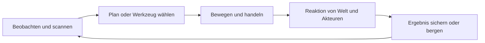
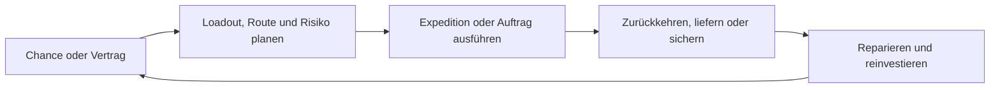
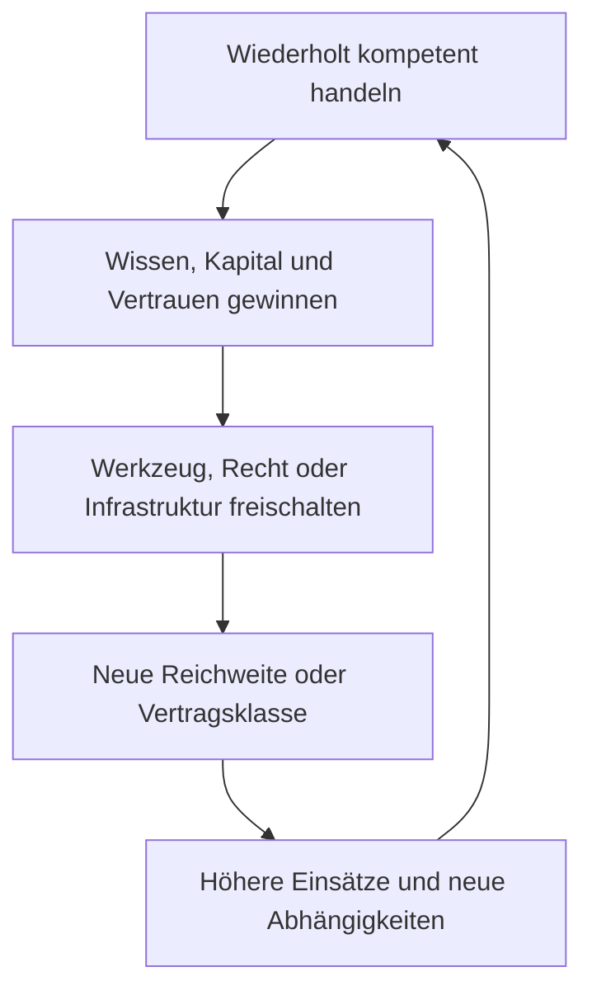
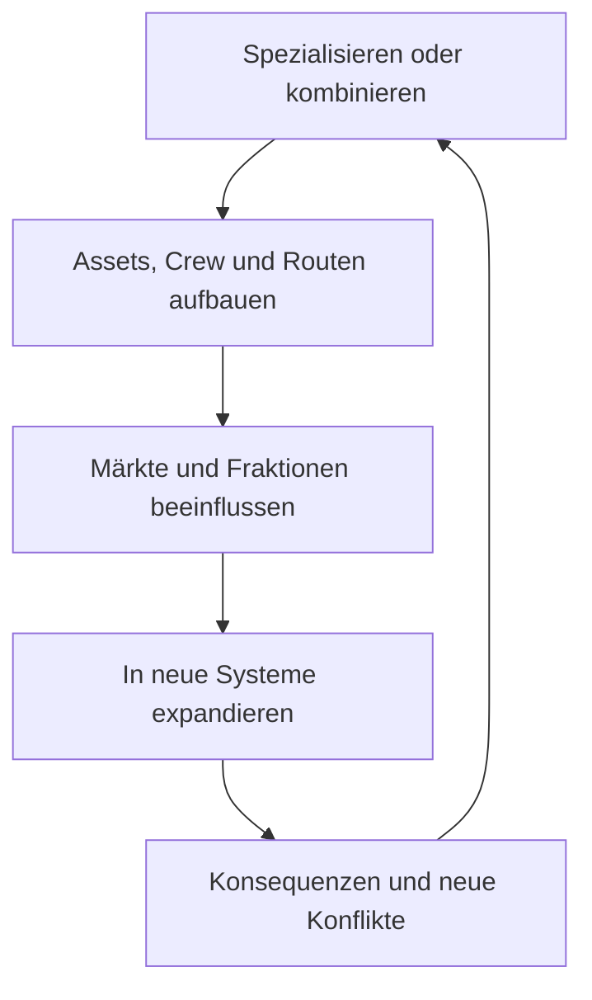
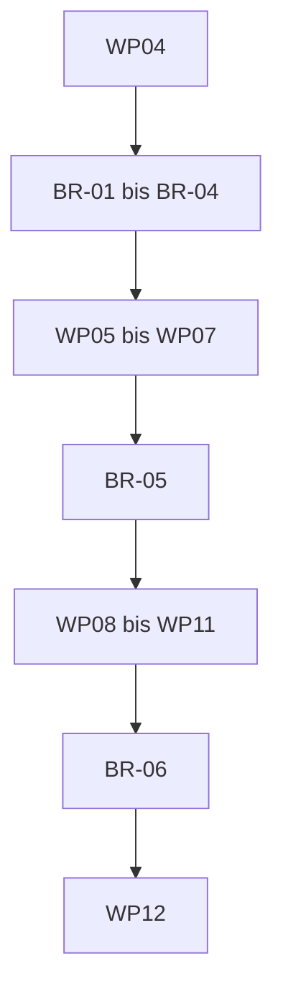
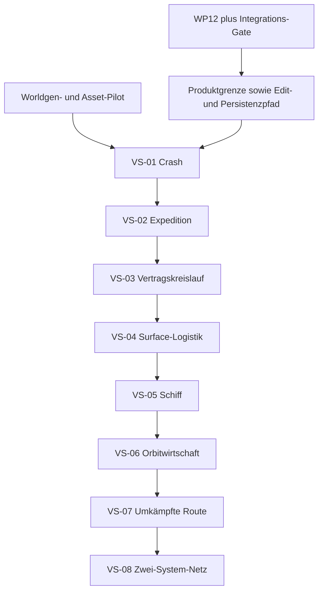

# G01 Abschlussbericht: Core Game Loop, Progression und Vertical-Slice-Roadmap

**Projekt:** Weltraum-Spiel / Hestia  
**Stand:** 2026-08-12  
**Revisionsstand:** v1.1, unabhängiger Schlussaudit eingearbeitet  
**Kanonische technische Referenz:** [`BenjaminHornung/hestia-voxel-kernel-lab@d95992df05952ac4be6221ca1809c1c9e3c0ac9d`](https://github.com/BenjaminHornung/hestia-voxel-kernel-lab/commit/d95992df05952ac4be6221ca1809c1c9e3c0ac9d)  
**Arbeitsmodus:** Cloud, Recherche und Synthese read-only; keine Implementierung, kein Repository-Checkout, kein Build, kein Testlauf und kein Benchmark  
**Gesamtstatus:** `REQUIRES_OWNER_DECISION`  
**Synthesis-Reife:** bedingt bereit, sobald die P0-Ownerfragen in Abschnitt 22 beantwortet sind

> Dieser Bericht ist ein Game-Design-System und eine Roadmap, kein Beleg für bereits implementierte Produktfeatures. Technische Aussagen zum Voxel-Lab beziehen sich ausschließlich auf den oben festgelegten Commit. Sämtliche Gameplay-Loops, Progressionswerte, Zeitfenster und Vertical Slices sind `PROPOSED`, bis sie durch Ownerentscheidung und Playtests akzeptiert werden.

---

## 0. Entscheidung in einem Satz

Das Spiel sollte nicht als Addition aus Survival, RPG, City Builder, Space Sim und RTS gebaut werden, sondern als eine durchgängige Entwicklung von **lokaler physischer Handlungsfähigkeit zu intersystemischer Gestaltungsmacht**: Der Spieler untersucht, gewinnt, verändert, transportiert und verpflichtet stets dieselben materiellen, energetischen, wirtschaftlichen und sozialen Ressourcen, nur mit wachsender Reichweite, Automatisierung und politischer Wirkung.

Die empfohlene zentrale Spielerfantasie lautet:

> **Vom gestrandeten Überlebenden zum selbstbestimmten interstellaren Akteur werden, indem man eine physisch glaubwürdige, persistente Welt versteht, verändert und über immer größere Entfernungen organisiert.**

Der entscheidende Zusammenhalt entsteht nicht durch eine feste Heldenklasse oder eine lineare Questkette, sondern durch ein gemeinsames Kausalmodell:

```text
Wissen → Ressourcen → Verarbeitung → Transport → Leistung/Vertrag
       → materielle und soziale Konsequenz → neue Reichweite und Verantwortung
```

---

## 1. Forschungsrahmen und Wahrheitsstatus

### 1.1 Vollständig berücksichtigte kanonische Projektquellen

- `WELTRAUM_PROJECT_INSTRUCTIONS_ADDENDUM(1).md`
- `WELTRAUM_PROJECT_MEMORY(1).md`
- `WELTRAUM_RESEARCH_REGISTER(1).md`
- `WELTRAUM_RESEARCH_SYNTHESIS_2026-08-12.md`
- `WELTRAUM_RESEARCH_DECISION_LOG_2026-08-12.md`
- `WELTRAUM_GAMEPLAY_EDITOR_VISION_ADDENDUM_2026-08-12.md`
- der G01-Auftrag
- die bereitgestellten Abschlussberichte R01 bis R10
- die bereitgestellten BR-01- und BR-02-Spezifikationen

Die zwei Dateien `05_destruction_connectivity_physics_research_report(1).md` und `(2).md` sind byteidentisch und besitzen beide SHA-256 `79ccccb489e01a1d2858979a3983f4b6073fee48e5c876ae256bb653b0b363f0`. Sie wurden als eine kanonische Quelle behandelt.

Die drei im Attachment-Satz nicht enthaltenen, aber vom Auftrag verpflichtend verlangten Projektdateien wurden über ihre stabilen ChatGPT-Library-Identitäten aufgelöst und vollständig gelesen:

| Quelle | Stabile Projektdatei-Identität und gelesene Version | SHA-256 der gelesenen Bytes | Vollständigkeitsnachweis |
|---|---|---|---|
| `WELTRAUM_RESEARCH_SYNTHESIS_2026-08-12.md` | `libfile_e795954766148191a068c92f4cc97d67`, Version `0` | `44c96c37187f7a821ca50161bf22ed336d043b38146b89ab9b99ecd55add39f1` | 301 Zeilen vollständig gelesen |
| `WELTRAUM_RESEARCH_DECISION_LOG_2026-08-12.md` | `libfile_bdb819aaceac819194092bd496a60d47`, Version `0` | `b73921f145f66b26cccb70eab973d79c705648ee9d934606b1d08288f9ac753e` | 59 Zeilen vollständig gelesen |
| `WELTRAUM_GAMEPLAY_EDITOR_VISION_ADDENDUM_2026-08-12.md` | `libfile_250cd47ee6008191a4ec0585af9fb763`, Version `0` | `f9b866329a8766d25313854a913d944ad2120c28863ab7a2b50b8b55d530b526` | 196 Zeilen vollständig gelesen |

### 1.1.1 Auflösung des Roadmap-Widerspruchs

`WELTRAUM_PROJECT_MEMORY(1).md` §6 zeigt noch die ältere Folge `WP04 → WP05 → … → WP12`. Der vollständig gelesene Decision Log trifft mit D-005 dagegen die spezifische, ausdrücklich `ACCEPTED` gesetzte Entscheidung, `BR-01` bis `BR-04` zwischen WP04 und WP05, `BR-05` vor WP08 und `BR-06` vor WP12 einzufügen. Die Research Synthesis §7 wiederholt diese revidierte Folge.

G01 folgt deshalb D-005 als genauerer akzeptierter Roadmap-Entscheidung. Für die Roadmap-Frage wird Project Memory §6 formal als `SUPERSEDED_BY_D-005` behandelt. Der Widerspruch wird nicht still übergangen: Project Memory §6 ist diesbezüglich noch nicht synchronisiert und sollte beim nächsten Memory-Update berichtigt werden. Bis dahin ist D-005 die maßgebliche Begründung für die in Abschnitt 12 verwendete Folge.

### 1.2 Source Claims

Aus den kanonischen Projektdokumenten sind folgende Produktabsichten belegt:

1. Der geplante Spielerbogen führt von einem Crash auf Hestia über Wildnis, Stadt, Gilde/Fraktion, Infrastruktur und Raumschiff bis zu orbitaler und später intersystemischer Wirtschaft und Macht.
2. Harte quadratische Block-/Microvoxels, persistente Veränderung und physisch nachvollziehbare Interaktion sind Teil der Produktvision.
3. Browser-/Chromium-first, CPU-Zellauthority und eine strikt serielle Technologieentwicklung sind akzeptierte Architekturregeln.
4. Three.js ist gegenwärtig Mesh-Referenzpfad, aber nicht als endgültige Produktengine entschieden.
5. Vor WP12 ist keine Integration des neuen Voxel-Lab-Kerns in das Produkt erlaubt.
6. Story, Survivalhärte, Stadt-Timing, Fraktionsstruktur, Wirtschaftstiefe und NPC-Simulationsgrad sind ausdrücklich offen.

### 1.3 Commitgenaue Code-Evidence

Der read-only geprüfte Lab-Commit `d95992d...` belegt:

- Commitnachricht `#VOXEL-LAB-003 Add deterministic greedy meshing comparison`;
- unabhängiges Browser-Technologielab, noch kein Spiel, Worldgen- oder Physiksystem;
- TypeScript/Vite/Vitest/Playwright und Three.js `0.185.1`;
- harte quadratische Voxels, `0,25 m` Referenzgröße, sparse `32³`-Chunks und `34³`-Halos;
- deterministische Visible-Face- und Greedy-Meshing-Verträge für eine Golden-Welt;
- keine dort belegten Runtime-Edits, Gameplay-Loops, Missionen, Wirtschaft, NPCs, Connectivity oder Rigid-Body-Fragmente.

Weitere commitgebundene Paketstände sind Three.js `0.185.1`, Playwright `1.62.1`, TypeScript `7.0.2`, Vite `8.2.1` und Vitest `4.1.10`. Diese Angaben beschreiben den Referenzcommit, nicht automatisch einen späteren Implementierungsstand.

### 1.4 Inference und Empfehlung

Alle folgenden Game-Pillar-, Loop-, Progressions-, Rollen-, Slice- und Telemetrieverträge sind aus der Produktvision und den technischen Grenzen abgeleitete Designempfehlungen. Sie sind keine fremden Fakten und keine Behauptungen über den aktuellen Produktcode.

### 1.5 Unavailable / Unknown

Nicht ausreichend belegt oder noch nicht entschieden sind:

- aktueller, für G01 geprüfter Produkt-SHA und Feature-Reife des Weltraum-Spiel-Repositories;
- finale Story, Tonalität und Antagonisten;
- genaue Survivalhärte, Tod-/Verlustregeln und Zielalter;
- Zeit bis zur Stadt, bis zum ersten Schiff und bis zum Orbit;
- Pflicht- oder Optionalitätsgrad von Kampf;
- Einzelspieler-, Koop- oder Multiplayer-Ziel für die erste Veröffentlichung;
- Tiefe von NPC-, Stadt-, Wirtschafts- und Politiksimulation;
- konkrete intersystemische Reisetechnologie;
- Zielhardware H1 bis H3 und darauf kalibrierte Budgets;
- endgültige Engine, Planetarchitektur und Asset-Toolchain.

### 1.6 Lizenz- und Provenienzgrenze

Dieser Bericht übernimmt keine fremden Code-, Shader-, Asset- oder Fragebogeninhalte. Vergleichsspiele werden nur über öffentliche Hersteller-/Entwicklerquellen referenziert. Der Lab-Commit enthält nach den vorliegenden Audits keine `LICENSE`-Datei; seine externe Wiederverwendung und Contribution-Strategie bleibt eine Ownerentscheidung. Der PENS-Fragebogen ist für kommerzielle Nutzung nicht automatisch frei verwendbar. Dieser Bericht nutzt nur die publizierten Konzepte Autonomie, Kompetenz und soziale Eingebundenheit und übernimmt keine Items.

---

## 2. Entscheidungsmatrix

| ID | Designfrage | Empfehlung | Status | Begründung / notwendiges Gate |
|---|---|---|---|---|
| G01-D01 | Zentrale Fantasie | Vom Gestrandeten zum interstellaren Akteur durch Beherrschung derselben physischen und sozialen Kausalketten | `PROPOSED` | Verbindet alle Maßstäbe und Rollen ohne Genrewechsel |
| G01-D02 | Anzahl Gameplay-Pfeiler | Fünf Pfeiler, siehe Abschnitt 3 | `PROPOSED` | Mehr würde Priorisierung verwässern; weniger deckt Beziehungen und Persistenz nicht ab |
| G01-D03 | Frühspiel-Survival | Expeditionsdruck statt permanenter Bedürfniswartung | `REQUIRES_OWNER_DECISION` | Verhindert Hunger-/Durst-Tretmühle und lässt Engineering im Zentrum |
| G01-D04 | Stadt-Timing | Erster bewohnter Kontakt/Außenposten nach etwa 60–90 Minuten; funktionaler Stadtsektor nach etwa 105–140 Minuten | `REQUIRES_OWNER_DECISION` | Trennt den sozialen Erstkontakt vom vollständigen Vertrags-/Servicezugang und stimmt mit Abschnitt 14 überein |
| G01-D05 | Orbit-Timing | Erster selbst ausgeführter Orbitflug ungefähr in Stunde 15–20 | `REQUIRES_OWNER_DECISION` | Orbit wird verdient, ohne dass die Oberflächenphase zum separaten Vollspiel wächst |
| G01-D06 | Rollenmodell | Weiche Spezialisierung ohne Klassenlock | `PROPOSED` | Rollen teilen Ressourcen, Rechte und Vertragsmarkt; Wechsel bleibt möglich |
| G01-D07 | Kampf | Relevante, aber weitgehend umgehbare Problemlösung | `REQUIRES_OWNER_DECISION` | Händler, Explorer und Ingenieure bleiben vollwertig; Konflikt behält Bedeutung |
| G01-D08 | Erstes Schiff | Vorhandenes Wrack/Kernschiff reparieren und schrittweise zertifizieren | `PROPOSED` | Bindet Crash, Salvage, Engineering, Reputation und späteren Orbit kausal zusammen |
| G01-D09 | Stadtbau | Zunächst Werkstatt, Parzelle und Außenposten, kein freier City Builder | `PROPOSED` | Verhindert einen zweiten Haupttitel im Hauptspiel |
| G01-D10 | Wirtschaft | Lokale transaktionale Wahrheit, entfernte Produktion als deterministische diskrete Ereignisse | `PROPOSED / REQUIRES_SPIKE` | Auditierbare Konsequenzen ohne Vollsimulation jedes NPCs |
| G01-D11 | Physik | Aktive lokale Ursachen genau, entfernte Zustände analytisch oder aggregiert | `PROPOSED / REQUIRES_SPIKE` | Entspricht R05/R08 und schützt Browserbudgets |
| G01-D12 | Story/Sandbox | Feste Story-Spine, systemisches Lösungsnetz | `PROPOSED` | Story setzt Einsätze und Wendepunkte; dieselben Sandbox-Verben lösen sie |
| G01-D13 | Erster zukunftstypischer Slice | VS-03 „Erster Vertragskreislauf“ | `PROPOSED` | Erstmals Planung, Weltinteraktion, Lieferung, Reputation und Reinvestition in einem Loop |
| G01-D14 | MVP-Grenze | VS-01 bis VS-03 in einer begrenzten Hestia-Region | `PROPOSED` | Beweist Produktidentität vor Schiff, Orbit und globalem Maßstab |
| G01-D15 | Intersystemischer Umfang | VS-08 nur als Zwei-System-End-to-End-Beweis, keine Galaxiesimulation | `PROPOSED` | Testet Architektur und Karrierebogen bei kontrolliertem Contentumfang |
| G01-D16 | Multiplayer | Bis nach bewiesenem Singleplayer-Kern verschieben | `REQUIRES_OWNER_DECISION` | Autorität, Persistenz, Wirtschaft und Zerstörung sind allein bereits Hochrisiko |

---

## 3. Game Pillar Contract

Die sechs Produktpfeiler des Vision Addendums enthalten auch Authoring- und Entwicklungsziele. Für das eigentliche Spiel werden daraus fünf überprüfbare Gameplay-Pfeiler. Ein Feature, das keinen Pfeiler stärkt oder einen anderen ohne klare Entscheidung beschädigt, erhält keinen Platz in der aktiven Roadmap.

| Pfeiler | Spielerversprechen | Wiederkehrende Verben | Systemischer Beweis | Verletzung des Vertrags |
|---|---|---|---|---|
| **P1: Physisch lesbare Handlungsfähigkeit** | Materie, Masse, Energie, Impuls und Struktur reagieren nachvollziehbar | untersuchen, schneiden, bergen, reparieren, bewegen, verstärken | Gleiche Eingabe und gleicher Zustand erzeugen erklärbare, persistente Folgen | Voxelzerstörung ist nur Effekt; unsichtbare Regeln überschreiben Physik ohne Feedback |
| **P2: Verdiente Reichweite** | Jede neue Mobilitätsstufe erweitert echte Möglichkeiten und Verantwortung | navigieren, planen, ausrüsten, starten, ankoppeln, routen | Zu Fuß → Fahrzeug → Schiff → Orbit → Systemroute verwendet verwandte Planungsgrößen | Neue Regionen sind nur schnellere Kulisse oder Teleport-Menüs ohne neue Entscheidungen |
| **P3: Logistik und Engineering als Machtquelle** | Fortschritt entsteht durch bessere Flüsse, Werkzeuge und Infrastruktur, nicht nur größere Zahlen | gewinnen, raffinieren, lagern, konfigurieren, automatisieren, liefern | Ressourcen-, Energie-, Kapazitäts- und Wartungsentscheidungen bleiben über alle Phasen relevant | Craftingrezepte und Upgrades sind isolierte Listen ohne räumliche oder wirtschaftliche Konsequenz |
| **P4: Zugehörigkeit, Rechte und Konsequenzen** | Beziehungen öffnen und schließen reale Handlungsmöglichkeiten | verhandeln, verpflichten, helfen, betrügen, lizenzieren, vermitteln | Reputation, Eigentum, Verträge, Gesetze und Fraktionslagen verändern Preise, Zugang und Risiken | Ruf ist nur XP-Farbe; Storyentscheidungen ändern keine Systeme |
| **P5: Persistente, selbst gewählte Geschichte** | Die Welt erinnert sich an Bau, Schaden, Routen und Verpflichtungen | wählen, bauen, markieren, schützen, dokumentieren, zurückkehren | Frühere Eingriffe verändern spätere Wege, Aufträge, Kosten und Beziehungen | Weltzustand setzt sich beliebig zurück oder Spielerentscheidungen werden durch lineare Skripte entwertet |

### 3.1 Prioritätsregel bei Konflikten

Wenn Pfeiler kollidieren, gilt für die erste Produktphase:

1. verständliche und faire Spielerentscheidung;
2. persistente kausale Wahrheit;
3. physische Plausibilität im aktiven Bereich;
4. Rollenvielfalt;
5. Simulationsbreite und Spektakel.

Realismus darf also vereinfacht werden, wenn die Vereinfachung konsistent, sichtbar und für alle Beteiligten gleich ist. Er darf nicht durch beliebige Sonderregeln ersetzt werden.

---

## 4. Kohäsionsvertrag gegen das „Fünf-Spiele-Problem“

### 4.1 Ein gemeinsamer Transformationsloop

Survival, Stadt, Wirtschaft, Raumfahrt und Politik dürfen keine separaten Progressionsspiele erhalten. Jede Phase verwendet denselben Kern:


Die Bedeutung erweitert sich:

| Kernschritt | Crash/Wildnis | Stadt/Gilde | Oberfläche/Orbit | Andere Systeme |
|---|---|---|---|---|
| Verstehen | Wrack, Wetter, Material | Bedarf, Preise, Rechte | Masse, Delta-v, Route, Risiko | politische Lage, Versorgungslücken |
| Sichern | Nahrung, Energie, Salvage | Auftrag, Kredit, Lizenz | Erz, Fracht, Daten, Bergung | Handelsrechte, Bündnisse, strategische Ressourcen |
| Verarbeiten | Werkzeug, Reparatur | Werkstatt, Komponenten | Raffinerie, Schiffskonfiguration | Produktionsnetz, Flotten-/Drohnenauftrag |
| Transportieren | tragen, ziehen | Fahrzeug, Lager | Start, Docking, Transferorbit | Sprung-/Transferkorridor, Relais |
| Erfüllen | Schutz, Signal | Mission, Lieferung | Mining-, Handels-, Eskorteinsatz | Vertrag, Embargo, Bündnisziel |
| Folgen | verändertes Terrain | Ruf, Preis, Zugang | beschädigte Route, Marktreaktion | Fraktionsmacht, Versorgung, Konflikt |

### 4.2 Feature-Admission-Test

Ein neues Feature darf erst in einen Slice, wenn alle folgenden Fragen beantwortet sind:

1. Welches vorhandene Kernverb vertieft es?
2. Welche kanonische Ressource, Fähigkeit, Berechtigung oder Beziehung verändert es?
3. Welche Entscheidung mit mindestens zwei verständlichen Optionen erzeugt es?
4. In welchem späteren Maßstab bleibt diese Entscheidung relevant?
5. Welche Failure-/Recovery-Schleife besitzt es?
6. Welcher bestehende Slice wird dadurch besser, statt nur länger?
7. Welche Telemetrie und welche Beobachtung würden zeigen, dass es verstanden wird und Spaßpotenzial hat?

Kann ein Feature nur mit einer eigenen Währung, einem eigenen Menü, einem eigenen XP-Baum und einem eigenen Contentstrom funktionieren, ist es bis zum Gegenbeweis ein separates Spiel und wird verschoben.

### 4.3 Gemeinsame Ledgers statt Genreinseln

Alle Systeme schreiben in wenige gemeinsame Wahrheiten:

- **Materialledger:** Stoffe, Komponenten, Ladung, Eigentum und Herkunft;
- **Energie-/Kapazitätsledger:** Leistung, Treibstoff, Masse, Volumen, Zeit und Wartung;
- **Wissensledger:** Karten, Messdaten, Rezepte, Baupläne, Routen und Intel;
- **Rechteledger:** Lizenzen, Zugang, Eigentum, Gesetze und Vertragsstatus;
- **Beziehungsledger:** Vertrauen, Verlässlichkeit, Schuld, Ruf und Bündnis;
- **Weltledger:** persistente Edits, Bauwerke, Schaden, Assets und Ereignisse.

Kein Renderingmesh, LOD-Proxy, Physikhandle oder UI-Wert darf eine zweite Gameplay-Wahrheit erzeugen.
Insbesondere sind RGB-Werte und lokale Render-Palettenslots weder Waren- noch Rezept- oder Materialidentität. Wirtschaft und Physik referenzieren stabile semantische Materialkeys und Verarbeitungszustände; die Palette bleibt eine abgeleitete Darstellungszuordnung.

---

## 5. Verschachtelte Core Loops

### 5.1 Minute-to-minute, etwa 20 Sekunden bis 5 Minuten



**Pflichtqualität:** Jede Runde erzeugt sichtbares Feedback, eine kleine Zustandsänderung und eine neue Entscheidung. Laufen, Inventarsortieren oder Warten allein zählen nicht als Loop.

Beispiele:

- eine Wrackplatte prüfen, geeignetes Werkzeug wählen, öffnen, Material bergen, strukturelle oder rechtliche Konsequenz erkennen;
- einen Erzgang scannen, sicheren Ansatz wählen, abbauen, Last/Masse verwalten und Rückweg neu bewerten;
- ein Leck lokalisieren, Stromkreis isolieren, Material einsetzen, Druckzustand stabilisieren und Restschaden prüfen;
- einen Konflikt lesen, Position und Einsatz wählen, handeln, Schaden/Ruf übernehmen und Fracht sichern.

### 5.2 Session-Loop, etwa 30 bis 120 Minuten



Eine Session soll einen vollständigen Bogen erlauben, auch wenn ein Langzeitprojekt offen bleibt. Abbruchpunkte liegen vor Abreise, an sicheren Zwischenstationen und nach Lieferung. Spieler dürfen eine Session nicht regelmäßig mit 20 Minuten Verwaltungsarbeit beenden müssen.

### 5.3 Mehrere Spielstunden



Progression entfernt alte Arbeit nicht vollständig. Sie wandelt manuelle Routine in Planung um. Beispiel: Erst trägt der Spieler Erz, später fährt er es, danach disponiert er Drohnen. Die Ressource und ihr Risiko bleiben verständlich.

### 5.4 Langfristige Karriere



Langfristiger Fortschritt besteht aus **Reichweite, Resilienz, Informationsvorsprung und Verhandlungsmacht**, nicht nur aus Schadens- und Einkommensmultiplikatoren.

---

## 6. Progression Ladder

Die folgende Ladder ist ein Designvertrag, keine lineare Storyliste. Ein Spieler kann Rollen unterschiedlich gewichten, aber jeder Übergang muss beweisen, dass die vorherigen Systeme verstanden und wirtschaftlich getragen werden.

| Phase | Primäres Ziel | Neue Ressourcen / Wissen | Neue Fähigkeiten | Neue Rechte | Neue Beziehungen | Recovery-Basis | Exit-Proof |
|---|---|---|---|---|---|---|---|
| **P0 Crash** | Leben, Energie und Orientierung stabilisieren | Wracksalvage, Notenergie, lokale Karte | scannen, schneiden, bergen, einfache Reparatur | Notrecht auf Crashmaterial | unbekannte Signalquelle / erster Kontakt | sichere Wrackzone, Notreserve, reproduzierbares Basistool | Signal aktiviert und gewählte Stabilisierung abgeschlossen |
| **P1 Wildnis** | Reichweite bis zu bewohntem Gebiet aufbauen | Nahrung/Umweltwissen, Materialproben, Routen | Feldcrafting, Schutz, Navigation, Lastplanung | temporärer Zugang zu Außenposten | Retter, Händler, lokaler Kontakt | Camp, Rückwegmarken, Rettungsruf | wiederholbare Expedition mit Rückkehr und Nettoertrag |
| **P2 Stadtsektor** | Teil der lokalen Ökonomie werden | Geld/Kredit, Marktpreise, Services | handeln, reparieren lassen, Verträge lesen | Aufenthalt, Werkbank, Lager, einfache Arbeitslizenz | Händler, Auftraggeber, Stadtverwaltung | Basisausrüstung auf Kredit, öffentliche Arbeit | erster Vertrag erfüllt, ohne Tutorialsonderregel |
| **P3 Gilde/Fraktion** | Vertrauen in privilegierten Zugang umwandeln | Spezialbaupläne, Intel, bessere Aufträge | Spezialisierung, Crewkontakt, komplexe Planung | Gildenrang, Bergungs-/Abbaurecht, gesperrte Zonen | Mentor, Rivalen, Fraktionsschuld | Wiedergutmachungsauftrag, alternative Auftraggeber | zwei unterschiedliche Auftragswege mit echten Trade-offs |
| **P4 Infrastruktur** | Manuelle Arbeit in ein belastbares Netz verwandeln | Grundstück, Fahrzeug, Lager, Produktionsmittel | bauen, konfigurieren, warten, automatisieren | Eigentum, Versorgungsanschluss, Fahrzeugzulassung | Arbeiter, Lieferanten, Nachbarn | versicherter Kernbestand, Reparatur-/Towdienst | eine kleine Kette produziert und liefert wiederholbar |
| **P5 Raumschiff** | Ein Schiff betriebs- und rechtsfähig machen | Flugteile, Treibstoff, Zertifikate, Navigationsdaten | Systemdiagnose, Schiffsengineering, Pilotentraining | Registrierung, Startfreigabe, Dockingrecht | Werft, Prüfer, Crew | Testmodus, Abschlepp-/Abbruchpfad, Reservebudget | Bodenstart, sichere Rückkehr und nachvollziehbare Kosten |
| **P6 Orbit/Systemwirtschaft** | Oberflächen- und Orbitalmärkte verbinden | Erz/Fracht, Stationsdienste, Delta-v-/Routendaten | Docking, Mining, Handel, Eskorte, Bergung | Stationszugang, Handels-/Mininglizenz | Stationen, Reedereien, Piraten, Sicherheitskräfte | Treibstoffreserve, Notsignal, Versicherung, Umleitung | vollständiger Orbitvertrag mit positiver Lern-/Wirtschaftsbilanz |
| **P7 Andere Systeme** | Ein resilientes Netz und politische Handlungsfähigkeit aufbauen | Fernrouten, strategische Güter, Fraktionsintel | delegieren, verhandeln, sanktionieren, Netz optimieren | Transit-, Handels-, Bündnis- oder Regierungsrechte | mehrere politische Blöcke, langfristige Partner/Gegner | Rückzugssystem, Stellvertreter, Neuverhandlung, Diversifikation | zweite Systemökonomie beeinflusst erste nachweisbar und reversibel |

### 6.1 Progressionsachsen

Fortschritt wird nicht in einem Gesamtlevel zusammengezogen. Fünf Achsen bleiben sichtbar:

1. **Kompetenz:** Was kann der Spieler zuverlässig ausführen?
2. **Werkzeug und Infrastruktur:** Was kann er materiell leisten?
3. **Wissen:** Was kann er erkennen, planen und vorhersagen?
4. **Rechte:** Wo und unter welchen Bedingungen darf er handeln?
5. **Beziehungen:** Wer vertraut, hilft, duldet oder bekämpft ihn?

Ein neues Gebiet darf nicht nur durch eine höhere Spitzhackenzahl gesperrt sein. Gute Gates kombinieren höchstens zwei bis drei Achsen, etwa passendes Werkzeug, Bergungslizenz und Kenntnis eines sicheren Zugangs.

### 6.2 Progression ohne Grind

- Wiederholung darf Effizienz, Routine und Kapital aufbauen, aber keine große Zahl identischer Pflichtaufträge verlangen.
- Der erste klare Kompetenzbeweis schaltet die nächste Auftragsklasse frei; weitere Wiederholung verbessert Preise, Wahlmöglichkeiten und Sicherheit.
- Reputation wird stärker durch Verlässlichkeit, Risiko und Folgen als durch bloße Missionsanzahl bestimmt.
- Baupläne werden durch nachvollziehbare Quellen gewonnen: Analyse, Beziehung, Kauf, Bergung oder Forschung.
- Höhere Technik verschiebt Arbeit von Handarbeit zu Planung, ohne Rohstoffe, Energie und Transport aus dem Spiel zu entfernen.

---

## 7. Spielerrollen

Rollen sind **Tätigkeitsprofile**, keine unwiderruflichen Klassen. Ein Spieler darf mehrere Rollen kombinieren. Spezialisierung entsteht aus Werkzeugbesitz, Wissen, Beziehungen, Ruf und Infrastrukturkosten.

| Rolle | Kernbeitrag zum gemeinsamen System | Früher Einstieg | Späterer Hebel | Abhängigkeit von anderen Rollen | Zu vermeidende Insel |
|---|---|---|---|---|---|
| Explorer | erzeugt Karten, Messdaten, Routen und Fundorte | Wildnis-Scans und sichere Wege | Anomalien, Fernrouten, politische Intel | Händler/Logistiker monetarisieren; Ingenieur erschließt | Sammelobjekte ohne wirtschaftlichen oder narrativen Wert |
| Händler | verbindet Preis-, Zeit-, Rechts- und Risikounterschiede | Stadtlieferung und Einkauf | Arbitrage, Verträge, Kredit, Marktgestaltung | Explorer liefert Wissen; Logistik bewegt; Politik öffnet Rechte | Menühandel ohne physische Fracht und Konsequenz |
| Miner/Berger | wandelt gefährliche Orte in Materialfluss | Wrack und kleine Lagerstätte | Asteroid, Großbergung, Extraktionsstandort | Engineer verarbeitet; Händler/Logistiker verteilt | endloses Halten eines Lasers ohne Standortentscheidung |
| Ingenieur | stellt Funktion wieder her und optimiert Systeme | Werkzeug, Leck, Strom, Shelter | Schiff, Infrastruktur, Automatisierung, Struktur | alle Rollen liefern Anforderungen und Ressourcen | Craftingliste ohne Diagnose, Raum oder Trade-off |
| Kämpfer/Sicherheitsakteur | schützt, erzwingt oder verhindert Flüsse | optionale Gefahrenabwehr | Eskorte, Verteidigung, Interdiction, Fraktionskampf | Händler/Logistiker schaffen Wert; Politik definiert Legitimität | separater Arena-Shooter ohne Weltfolgen |
| Logistiker | organisiert Kapazität, Lager, Zeitfenster und Ausfallsicherheit | Last- und Fahrzeugplanung | Drohnen, Stationen, Mehrknoten-Netz | Miner/Händler/Engineer erzeugen Flüsse | Spreadsheet ohne räumliche Ausführung oder Störung |
| Politischer Akteur | verändert Rechte, Prioritäten und Beziehungen | lokale Vermittlung | Verträge, Sanktionen, Bündnisse, Gebietspolitik | benötigt wirtschaftliche und soziale Glaubwürdigkeit | Dialogbaum mit abstrakten Pluspunkten ohne Systemwirkung |

### 7.1 Rollen-Balance-Regeln

- Jeder große Auftrag benötigt mindestens zwei sinnvolle Lösungsprofile, aber nicht jede Rolle.
- Keine Rolle erhält eine exklusive Hauptwährung.
- Kämpfen ist ein möglicher Umgang mit Risiko, nicht die universelle Abschlussprüfung.
- Informationen, Transportkapazität, Reparatur und Beziehungen müssen genauso handelbaren Wert besitzen wie Rohmaterial.
- Automatisierung ersetzt Routine, aber erzeugt Wartungs-, Kapital- und Schutzentscheidungen.
- Rollenwechsel kostet Umrüstung und Beziehungspflege, aber keinen Neustart.

---

## 8. Was vollständig simuliert und was abstrahiert werden sollte

„Vollständig“ bedeutet hier **innerhalb einer klar begrenzten aktiven Domäne autoritativ**, nicht eine atomgenaue Simulation des Universums.

| System | Autoritätsgrad | Empfohlene Behandlung | Warum |
|---|---|---|---|
| Aktive Voxelzellen, Material und Edits | hoch / kanonisch | deterministische lokale Zell- und Command-Wahrheit | direkte Spielerhandlung, Persistenz und Zerstörung hängen daran |
| Inventar, Ladung, Eigentum und Herkunft | hoch / kanonisch | transaktionales Ledger | verhindert Duplikation, erklärt Handel und Recht |
| Masse, Treibstoff, Energie und Kapazität aktiver Fahrzeuge/Schiffe | hoch | nachvollziehbare Bilanz und Kräfte im aktiven Bereich | Kern von Engineering und Raumfahrt |
| Aktive Flugbahn, Kollision und Projektilwirkung | hoch, aber vereinfacht | physikalische Kräfte, feste Integrations-/Sicherheitsregeln | Entscheidungen müssen reproduzierbar sein |
| Lokale Struktur/Connectivity | konservativ exakt | Face-6, begrenzte Beweise, `Unknown` statt falscher Trennung | R05 schützt vor falscher Fragmentierung |
| Verträge, Zahlungen, Ruf, Rechte und Besitz | hoch / kanonisch | atomare Zustandsübergänge | soziale Konsequenzen sind Gameplay-Wahrheit |
| Save, Welt-Events und Generatorversion | hoch / kanonisch | versionierte Events plus Checkpoints | langfristige Persistenz und Recovery |
| Lokaler Markt | mittel bis hoch | echte Lager-/Auftragsbewegungen für relevante Güter | Spieler soll Ursachen prüfen können |
| Entfernte Produktion und Transporte | mittel | diskrete Ereignisse, Kapazitäten und Ausfallwahrscheinlichkeiten | Kausalität ohne jede Maschine pro Tick zu simulieren |
| Entfernte Schiffe/Orbits | mittel | analytische Bahnen, „on rails“, Ereignisauflösung | lokale Physik nur bei Interaktion nötig |
| NPC-Tagesabläufe | niedrig bis mittel | Rollen-, Verfügbarkeits- und Ereigniszustände statt Vollleben | Beziehung und Zugang zählen, nicht Toilettengänge |
| Stadtbevölkerung | aggregiert | Nachfrage, Arbeitskraft, Stimmung, Dienste je Bezirk | vermeidet City-Sim als zweites Kernspiel |
| Politik und Krieg | zunächst aggregiert | Fraktionszustände, Ziele, Ressourcen und kontrollierte Ereignisse | strategische Wirkung ohne RTS-Vollsimulation |
| Ökologie, Wetter, Hydrologie | deterministische Felder plus lokale Ereignisse | Worldgen/Regionzustand; nur spielrelevante Dynamik aktiv | visuelle Glaubwürdigkeit bei kontrollierten Kosten |
| Fernterrain, Atmosphäre, Orbitansicht | abgeleitet | LOD-/Proxyprodukte mit Source-Revision | Darstellung darf keine Gameplay-Wahrheit werden |
| Kleinstdebris, Staub und kosmetische Schäden | visuell / budgetiert | Pooling und deterministische Degradation | Spektakel ohne Body-/Colliderexplosion |

### 8.1 Simulationsregel

> **Simuliere genau die Ursachen, die der Spieler beobachten, beeinflussen oder wirtschaftlich ausnutzen kann. Abstrahiere entfernte Folgen, aber rekonstruiere sie bei Aktivierung aus versionierten, kausalen Zuständen.**

Diese Regel verhindert sowohl eine leere Kulisse als auch den Versuch, jeden Bürger, jeden Asteroiden und jedes Molekül permanent zu simulieren.

---

## 9. Story und systemischer Sandbox-Content

### 9.1 Story-Spine

Authoring sollte feste Knoten liefern:

- Crash und unmittelbare Ursache als Inciting Incident;
- erste Signale, Kontakte und Hestia-Konfliktlinien;
- Zugang zu Stadt, Gilde/Fraktion und Schiffprojekt;
- erster Orbitflug und ein bedeutender Systemkonflikt;
- Enthüllungen, die Reisen zu anderen Systemen motivieren;
- charakterbasierte Beziehungen und Konsequenzen, die nicht beliebig generiert werden sollten.

### 9.2 Systemisches Lösungsnetz

Sandbox-Systeme liefern:

- Routen, Wetter, Fundorte, Ressourcen und Bergungslagen;
- Marktbedarf, Lieferverträge, Mining, Reparatur und Transport;
- Bau, Wartung, Eigentum und Automatisierung;
- Fraktionsreaktionen, Gesetze, Ruf und lokale Konflikte;
- persistente Schäden, Umleitungen und Wiederaufbau;
- optionale Rollen- und Lösungswege.

### 9.3 Binderegel

Storymissionen dürfen keine einmaligen Sonderverben verlangen, die danach verschwinden. Ein Storyziel beschreibt **warum** etwas wichtig ist und verändert Einsätze, Beziehungen oder Kontext. Gelöst wird es mit den bereits geübten Systemen.

Beispiele:

- Statt „drücke im Storyraum drei Spezialknöpfe“: Diagnostiziere, beschaffe, route Energie und repariere mit normalem Engineering.
- Statt „besiege Pflichtboss“: sichere einen Korridor durch Eskorte, Verhandlung, Sabotage, Umleitung oder wirtschaftlichen Druck.
- Statt „kaufe Storyschiff für Sonderwährung“: kombiniere Salvage, Geld, Rechte, Werftbeziehung und technische Abnahme.

### 9.4 Prozeduralität darf Bedeutung nicht ersetzen

Prozedurale Aufträge variieren Ort, Menge, Frist, Risiko und Beteiligte. Motive, Wendepunkte, zentrale Charaktere und moralische Konflikte brauchen authored Regeln und Review. Generatoren dürfen keine Storyentscheidung vortäuschen, deren Konsequenz nur ein zufälliger Text ist.

---

## 10. Failure- und Recovery-Loops

Der Vertrag lautet:

> **Ein Fehlschlag erzeugt ein neues lösbares Problem, erhält Handlungsfähigkeit und verursacht einen begrenzten, verständlichen Preis.**

| Failure | Unmittelbare Folge | Recovery-Loop | Harte Softlock-Sicherung |
|---|---|---|---|
| Gesundheit/Ausrüstung versagt | Rückzug, Verletzung, Zeit-/Materialverlust | Notfallbehandlung, Bergung, Ersatzarbeit | Basistool und minimale Mobilität bleiben oder werden kostenlos gestellt |
| Expedition ohne Vorrat | Reichweite sinkt | Lager anlegen, Route verkürzen, Hilfe rufen | Notreserve plus sichtbarer Rückweg vor kritischem Punkt |
| Fahrzeug defekt | Fracht/Spieler sitzt fest | Feldreparatur, Abschleppen, Teile bergen | Beacon/Tow ist immer verfügbar; Preis wird notfalls Schuld |
| Schiff treibstoffarm | Missionsziel scheitert | Reserve, Tanker, Docking-/Rettungsvertrag, Umleitung | Route Planner warnt und hält unverbrauchbare Notreserve |
| Schiff kampfunfähig | Ladung/Vertrag gefährdet | Surrender, Notsignal, Bergung, Versicherung, Reparaturquest | keine Pflichtselbstzerstörung; Crew/Progression nicht total verlieren |
| Geld/Schuldkrise | Services eingeschränkt | öffentliche Arbeit, Kreditumschuldung, Materialarbeit | schuldenfreie Basistätigkeit bleibt; kein negativer Zins-Todeskreislauf |
| Ruf fällt | Zugang/Preise schlechter | Wiedergutmachung, Vermittler, Gegenfraktion, Zeit | keine einzelne Fraktion kontrolliert alle Progressionspfade |
| Schlüsselgegenstand verloren | Quest kann nicht direkt fortgesetzt werden | Spurensuche, Reproduktion, alternativer Beleg | keine einzigartige zerstörbare Pflichtressource ohne Ersatzweg |
| Basis beschädigt | Produktion stoppt teilweise | sichern, priorisiert reparieren, Versicherungs-/Hilfsvertrag | Kernlager und Respawn-/Saveanker redundant oder recoverable |
| Bau-/Terraformfehler | Material und Struktur gefährdet | Preview, Undo vor Commit, Rückbau und Recycling | Authoring Commands sind transaktional; kein halber Weltzustand |
| Markt-/Routenfehler | Lieferung unrentabel oder verspätet | neu verhandeln, Teil liefern, umleiten, Verlust begrenzen | Pflichtfortschritt verlangt keinen einzelnen Marktpreis |
| Save-/Versionsfehler | Weltzustand nicht sicher ladbar | letzter konsistenter Checkpoint, Export, klare Migration/Ablehnung | atomare Manifeste, Event-Hashes und niemals stiller Datenverlust |

### 10.1 Globale Anti-Softlock-Invarianten

1. Zu jedem Zeitpunkt existiert mindestens eine risikoarme Tätigkeit ohne höheres Lizenz-, Kapital- oder Kampfgate.
2. Kein einzelner NPC, Markt, Gegenstand oder Rufwert ist alleinige Autorität für einen Hauptfortschritt.
3. Pflichtreisen prüfen Reserve, Rückkehrpfad und Rettungsoption vor Start.
4. Basisausrüstung, Identität und minimale Fortbewegung können nicht dauerhaft verloren gehen.
5. Story- und Wirtschaftstransaktionen sind atomar oder eindeutig wiederaufnehmbar.
6. Abstrakte Offscreen-Simulation darf bei Rückkehr keinen unbegründeten Totalverlust erzeugen.
7. Spieler bekommt Ursache, Preis und mindestens einen Recovery-Weg angezeigt, ohne die optimale Lösung zu verraten.

---

## 11. Voxelzerstörung und echte Physik im Gameplay-Loop

Voxel und Physik sind dann sinnvoll, wenn sie Entscheidungen verändern. Sie sind kein eigenständiger Effektmodus.

### 11.1 Gameplay-Funktionen

| Funktion | Frühes Beispiel | Spätes Beispiel | Gemeinsame Konsequenz |
|---|---|---|---|
| Zugang | Wrackplatte öffnen, kleine Barriere entfernen | Schiffshülle breachen, verschüttete Route öffnen | Werkzeug, Zeit, Lärm, Recht, Struktur |
| Bergung/Mining | Material aus Wrack oder Gang lösen | Asteroid selektiv abbauen | Masse, Qualität, Transport, Marktwert |
| Reparatur/Bau | Shelter abdichten, Stütze setzen | Modul, Außenposten oder Schiff reparieren | Materialbilanz, Integrität, Energie |
| Navigation | Stufen, Tunnel, Deckung schaffen | Ladeweg, Dock-/Bergungskorridor anpassen | persistente Route und Folgeaufträge |
| Taktik | Deckung schwächen oder verstärken | gezielte System-/Strukturschäden | nicht nur Trefferpunkte, sondern Funktion |
| Engineering | Lastpfad verstehen und sichern | Fragment, Fahrzeug- oder Stationsstruktur | Connectivity, Masse, Schwerpunkt, Collider |
| Recht/Wirtschaft | fremdes Material beschädigen | Bergungsrecht, Sabotage, Versicherungsfall | Eigentum, Ruf, Vertrag und Kosten |

### 11.2 Stufenweise Integration

1. **Edits mit fester Wirkung:** einzelne Zellen und kleine Brushes; Materialkosten und Persistenz; keine Fragmente.
2. **Strukturelle Diagnose:** Supportstatus markieren; kein Zelltransfer und keine Physik.
3. **Statisches Fragment:** genau eine bestätigte Komponente atomar übertragen; weiter statisch.
4. **Ein kontrolliertes dynamisches Fragment:** begrenzter Rapier-Spike mit voxelbasierten Mass Properties und greedy 3D-Cuboids.
5. **Budgetierte Mehrfragment-Ereignisse:** harte Body-/Collider-/Debriscaps und deterministische Degradation.

Diese Reihenfolge folgt R05 und darf durch Gameplaydruck nicht übersprungen werden. In den frühen Slices kann ein beschädigtes Teil sichtbar als „instabil“ markiert, abgestützt oder scripted sicher abgelegt werden, ohne eine nicht belegte Vollfragmentphysik vorzutäuschen.

### 11.3 No-Go

- kein Rigid Body oder Collider pro Voxel;
- kein Render-Mesh als Material-, Massen- oder Persistenzwahrheit;
- keine unbegrenzte synchrone Connectivity auf dem Main Thread;
- kein Abtrennen bei unbekannter Analysegrenze;
- keine Explosion als Standardwerkzeug für jede Ressource;
- keine unbeschränkte Zerstörung in Stadt-/Storybereichen ohne Eigentums-, Recovery- und Contentregeln;
- keine Änderung planetarer Rotation oder Umlaufbahn durch kleine Edits, bevor R08s Massenledger und Fehlerbudgets belegt sind.

---

## 12. Feature-Dependency-Graph

Die technische Lab-Roadmap und die Gameplay-Slices sind getrennte Ebenen. Die durch Decision Log D-005 revidierte Folge von WP04 bis WP12 bleibt die beschlossene Technologiefolge. Erst nach WP12 und einer expliziten Integrationsentscheidung beginnen Produkt-Slices mit dem neuen Kernel. Der noch abweichende ältere Stand in Project Memory §6 ist in Abschnitt 1.1.1 offengelegt.

Die akzeptierte serielle Technologiefolge lautet derzeit exakt:

```text
WP04
→ BR-01 → BR-02 → BR-03 → BR-04
→ WP05 → WP06 → WP07
→ BR-05
→ WP08 → WP09 → WP10 → WP11
→ BR-06
→ WP12
```

G01 ändert diese Folge nicht. Die Gameplay-Slices beschreiben Produktbeweise nach den jeweils nötigen technischen Acceptance-Gates.

### 12.1 Technologiefolge

Die obige Textfolge ist normativ. Das folgende Diagramm gruppiert nur benachbarte Gates, ohne ihre Reihenfolge zu ändern:



### 12.2 Produkt- und Slice-Abhängigkeiten



### 12.3 Querschnittsabhängigkeiten

Folgende Fähigkeiten sind kein eigener Slice und müssen jeden Slice begleiten:

- deterministische Save-/Load- und Migrationsgrenze;
- barrierearme Eingaben, lesbares Feedback und remappbare Steuerung;
- Telemetrie mit Datenminimierung plus qualitative Playtests;
- reproduzierbare Szenario-Snapshots;
- Performance-/Liveness-Gates nach akzeptiertem Benchmarkprotokoll;
- Human Art Review;
- Failure-/Recovery-Tests;
- Provenienz, Rechte und Lizenzprüfung für Inhalte.

---

## 13. First 30 Minutes

**Ziel:** Der Spieler erlebt innerhalb einer halben Stunde die spätere Identität in Miniatur: verstehen, physisch verändern, Ressourcen abwägen, ein System reparieren, eine Konsequenz erzeugen und eine selbst gewählte nächste Route erkennen.

| Zeitfenster | Erfahrung | Spielerentscheidung | Freigeschaltetes Verständnis | Stop-Signal |
|---|---|---|---|---|
| 0–3 min | Aufwachen im beschädigten Lande-/Schiffsbereich | zuerst Umgebung, Körperstatus oder Energie prüfen | Welt ist physisch und lesbar, nicht nur Questmarker | erste sinnvolle Eingabe ist unklar; HUD überfordert |
| 3–8 min | Blockierter Zugang und instabile Versorgung | Platte schneiden, Umweg suchen oder Energie priorisieren | Voxelinteraktion und Systeme sind gekoppelt | Zerstörung wirkt beliebig oder optimaler Weg ist alternativlos |
| 8–15 min | Salvage und Reparatur | Material in Schutz, Funk oder Werkzeug investieren | Material hat Herkunft, Masse und konkurrierende Verwendung | Inventar wird Sortierarbeit; kein Trade-off verstanden |
| 15–22 min | Außenraum / unmittelbare Wildnis | Signalquelle, Wasser/Schutz oder Höhenpunkt priorisieren | Navigation und Risiko statt Markerfolge | Überleben wird passives Balkenfüllen |
| 22–30 min | Stabilisierung und Ausblick | Notsignal senden, Camp sichern oder Route vorbereiten | eigener Plan plus klarer nächster Horizont | Cutscene erledigt Kernleistung; Spieler kann nächsten Schritt nicht benennen |

### 13.1 Was in den ersten 30 Minuten nicht vorkommt

- kein großer Craftingbaum;
- keine Gildenwahl;
- keine freien City-Builder-Werkzeuge;
- kein vollwertiger Kampfzwang;
- keine lange Dialogsequenz vor dem ersten Handeln;
- keine permanente Hunger-/Durstverwaltung;
- kein Tutorial, das andere Physik- oder Kostenregeln als das spätere Spiel benutzt.

---

## 14. First 3 Hours

**Vorgeschlagenes Pacing, Ownerentscheidung erforderlich:**

| Spielzeit | Bogen | Neues System | Beweis |
|---|---|---|---|
| 0:00–0:30 | Crash stabilisieren | Scan, Voxelzugang, Salvage, Reparatur | Spieler erzeugt erste persistente, verständliche Änderung |
| 0:30–1:15 | erste Expedition | Navigation, Umwelt, Last, Camp, Rückkehr | Spieler plant Hin- und Rückweg statt Questlinie abzulaufen |
| 1:15–1:45 | erster Kontakt / Außenposten | Dialog, Tausch, Vertrauen, Hilfe | Beziehung verändert eine reale Option |
| 1:45–2:20 | Stadtsektor erreichen | Services, Geld, Lager, Regeln | Wildnisressource wird Teil lokaler Ökonomie |
| 2:20–3:00 | erster freier Vertrag | Auftrag, Loadout, Lieferung/Bergung, Ruf, Reinvestition | vollständiger Session-Loop ohne Tutorialsonderregel |

Am Ende der dritten Stunde soll der Spieler nicht „mit Survival fertig“ sein. Er soll verstehen, dass Survival-, Engineering- und Transportentscheidungen nun in Wirtschaft und Beziehungen hineinreichen.

---

## 15. First 20 Hours

**Vorgeschlagene Baseline, nicht akzeptierte Zusage:**

| Spielzeit | Schwerpunkt | Erwartete Veränderung der Spieleragency |
|---|---|---|
| 0–3 h | Crash, Wildnis, Stadtzugang | von Reaktion zu eigener kurzfristiger Planung |
| 3–6 h | Stadtverträge und weiche Spezialisierung | von Einzelressourcen zu Preis, Recht und Beziehung |
| 6–10 h | Gilde/Fraktion und Werkstatt | von Auftragnehmer zu verlässlichem Spezialisten |
| 10–14 h | Fahrzeug, Außenposten, kleine Logistikkette | von Handarbeit zu wiederholbarem Materialfluss |
| 14–18 h | Schiffprojekt, Abnahme und Training | von lokaler Infrastruktur zu mobil gebundener Großinvestition |
| 18–20 h | Start, Orbit und erster Stationskontakt | neue Reichweite; bisherige Masse-, Energie-, Vertrags- und Recoveryregeln bleiben gültig |

Der erste Orbitflug ist ein **Payoff der Oberflächenentscheidungen**, kein Abbruch des alten Spiels. Werkstatt, Lieferanten, Ruf, Fracht, Schaden und Hestia-Routen bleiben nach dem Start relevant.

---

## 16. Acht serielle Vertical Slices

### Gemeinsamer Slice-Vertrag

Jeder Slice:

- ist auf einen räumlich und systemisch kleinen Ausschnitt begrenzt;
- beginnt nur nach akzeptiertem Vorgängerslice;
- verwendet reale spätere Daten- und Gameplayverträge statt Wegwerf-Minispiele;
- besitzt mindestens eine erfolgreiche, eine gescheiterte und eine recoverte Route;
- enthält qualitative Playtests und anonymisierte Ereignistelemetrie;
- endet mit Owner-Gate und schriftlicher Cut-/Keep-Entscheidung;
- erweitert höchstens zwei große neue Systemfamilien.

Playtest-Schwellen unten sind **Kalibrierungswerte**, keine statistisch bewiesenen Qualitätsgrenzen. Kleine Kohorten dienen zur Problemfindung; wiederholte Kohorten prüfen, ob Änderungen tatsächlich helfen.

Die Scope-Grenze „höchstens zwei neue große Systemfamilien“ wird pro Slice wie folgt operationalisiert. Eine Voraussetzung muss bereits vor Slice-Eintritt akzeptiert sein. Fehlt sie, wird sie zu einem eigenen Foundation-Gate und darf nicht still im Slice mitentwickelt werden. Schauplätze wie Stadtsektor, Station oder Außenposten sind Content-Scope, keine zusätzliche Systemfamilie.

| Slice | Genau zwei neue Systemfamilien | Wiederverwendete beziehungsweise vorab akzeptierte Grundlage |
|---|---|---|
| VS-01 | 1. Voxel-/Materialinteraktion; 2. Stabilisierung und Reparatur | Bewegung, Eingabe/Kamera, kleines Inventar, Save-Grundlage, authored Region |
| VS-02 | 1. Expeditionsnavigation und Umweltgefahr; 2. Loadout- und Rückkehrlogistik | Scan, Edits, Material, Reparatur, Save/Recovery aus VS-01 |
| VS-03 | 1. Vertragsökonomie einschließlich Annahme, Lieferung, Zahlung und Teilfehler; 2. institutioneller Zugang über Services, Ruf und Rechte | Inventar/Ownership, Expedition, Recovery; Stadtbezirk als begrenzter Content-Scope |
| VS-04 | 1. Spielerbau und Utilities; 2. fahrzeugbasierte Oberflächenlogistik | Vertragsökonomie, Ownership, Materialien und Recovery |
| VS-05 | 1. Schiffsengineering und Konfiguration; 2. Zertifizierung, Test und Abbruch | Beschaffung, Verträge, Rechte, Materialien; geprüfte Flugphysik als Entry-Prerequisite |
| VS-06 | 1. Orbitalflug und Docking; 2. orbitale Ressourcenökonomie | Schiffssysteme, Vertragsökonomie, Fracht und Recovery |
| VS-07 | 1. Konflikt-, Eskorten- und Umleitungsentscheidung; 2. funktionaler Schiffsschaden und Rettung | Rechte, Ruf, Markt, Flug und Logistik |
| VS-08 | 1. intersystemischer Transit und Zeit; 2. Remote-Systemzustand und systemübergreifende Konsequenz | Verträge, Rollen, Märkte, politischer Zustand und Logistik |

### VS-01: Crash Site – Breach, Stabilize, Signal

**Dauer:** 20–40 Minuten  
**Spielerversprechen:** „Ich kann diese beschädigte Welt lesen und mit echten Folgen verändern.“

**Scope:** ein Crashareal, ein kleiner Außenbereich, wenige Materialien, ein Mehrzweckwerkzeug, drei konkurrierende Reparaturziele, kein freier Kampfzwang.

**Entry Criteria:**

1. WP12-Entscheidung und explizite Produktintegrationsfreigabe liegen vor.
2. Rendererneutraler read-only Fixture-Slice, DDA und begrenzter Edit-/Persistenzpfad sind separat akzeptiert.
3. Ein kleiner visueller Hestia-Asset-/Terrain-Kit besitzt Human Review.
4. Owner hat Survivaldruck, Verlustregel und Tonalität für VS-01 entschieden.

**Exit Criteria:**

- alle Pflichtaktionen verwenden spätere Scan-, Material-, Edit-, Energie- und Saveverträge;
- mindestens zwei verständliche Stabilisierungsreihenfolgen funktionieren;
- kein Zustand nach Fehlentscheidung ist unrecoverable;
- in wiederholten Erstspielerkohorten erreicht die klare Mehrheit die erste sinnvolle Weltänderung in höchstens fünf Minuten;
- die klare Mehrheit kann danach erklären, warum sie welches Material wofür verwendet hat;
- der Slice bleibt ohne Fragmentphysik korrekt und ehrlich.

### VS-02: Wilderness Expedition – Plan, Extract, Return

**Dauer:** 35–60 Minuten  
**Spielerversprechen:** „Meine Vorbereitung und mein Weg sind genauso wichtig wie der Fund.“

**Scope:** Crashcamp plus ein Zielkorridor, zwei Biome/Mikroregionen, eine Ressource, eine Bergung, ein Umweltproblem, ein Kontakt-/Signalereignis.

**Entry Criteria:**

- VS-01 akzeptiert;
- deterministische kleine Region, Navigation, Lager/Last, sichere Rückkehr und Recovery-Beacon;
- keine planetenweite Streamingbehauptung, nur bounded Region.

**Exit Criteria:**

- Hinweg, Tätigkeit und Rückweg bilden einen vollständigen Session-Loop;
- mindestens zwei Loadouts und zwei Routen besitzen reale Trade-offs;
- Ressourcenertrag hängt von Wissen, Werkzeug, Masse und Risiko ab, nicht nur von Zeit;
- Spieler erkennen vor dem kritischen Punkt Rückkehrreserve und Recovery;
- persistente Edits verändern mindestens eine spätere Route oder Handlung;
- Warte-, Lauf- und Inventarzeit verdrängen nicht die Entscheidungszeit.

### VS-03: First Contract Circuit – City, Reputation, Reinvestment

**Dauer:** 45–90 Minuten  
**Spielerversprechen:** „Mein physisches Handeln hat wirtschaftliche und soziale Bedeutung.“  
**Besondere Rolle:** erster Slice, der bereits wie das spätere Spiel wirken muss.

**Scope:** ein aktiver Stadtsektor, drei Services, zwei Auftraggeber, ein freier Vertrag mit mindestens zwei Lösungswegen, lokaler Markt, Ruf und eine konkrete Reinvestition.

**Entry Criteria:**

- VS-02 akzeptiert;
- transaktionales Inventar/Ownership, Vertrag, Zahlung, Ruf, Recht und Recovery;
- Stadt ist authored Kulisse plus kleiner funktionaler Bezirk, keine Vollsimulation.

**Exit Criteria:**

- Plan → Ausrüstung → Expedition → Lieferung → Bezahlung/Ruf → Upgrade funktioniert ohne Tutorialsonderregeln;
- physische Ressource und Wissen besitzen beide wirtschaftlichen Wert;
- mindestens zwei Rollenprofile lösen denselben Vertrag sinnvoll;
- Vertragsbruch, Teilverlust und verspätete Lieferung haben verständliche, recoverable Folgen;
- Spieler können nach Abschluss ein selbst gewähltes nächstes Ziel und dessen Nutzen nennen;
- keine separate Questwährung oder isolierte Ruf-XP-Schleife nötig.

**Einordnung:** VS-03 ist der erste **loop-repräsentative** Slice des späteren Spiels. VS-06 ist der erste **maßstabsübergreifende Promise-Slice**, weil er Oberfläche und Orbit in demselben Ressourcen-, Vertrags- und Recovery-System verbindet. Diese Unterscheidung verhindert, dass der Kernloop bis zur aufwendigen Raumfahrt ungeprüft bleibt.

### VS-04: Surface Logistics – Workshop, Vehicle, Outpost

**Dauer:** 60–120 Minuten pro Vertragszyklus  
**Spielerversprechen:** „Ich verwandle mühsame Handarbeit in ein Netz, das ich entworfen habe.“

**Scope:** eine Werkstattparzelle, ein Bodenfahrzeug, ein Außenposten, eine Quelle, ein Verarbeitungsschritt, ein Ziel, begrenzte Baucommands und Wartung.

**Entry Criteria:**

- VS-03 akzeptiert;
- Bau-/Editcommands teilen Kern mit späterem Player Construction Mode;
- Eigentum, Energie, Lager, Fahrzeugkapazität und Wartung sind definiert;
- Preview, Validierung und Recovery für Bauaktionen.

**Exit Criteria:**

- eine kleine Kette liefert wiederholbar und kann sichtbar ausfallen;
- Spieler kann zwischen Kapazität, Zuverlässigkeit, Kosten und Geschwindigkeit abwägen;
- Automatisierung reduziert Routine, erzeugt aber keine passive Geldmaschine;
- Fahrzeugdefekt, blockierte Route und Lagerengpass besitzen unterschiedliche Recovery-Wege;
- Außenposten und Stadt bleiben wirtschaftlich gekoppelt;
- kein City Builder, Stromnetzsimulator oder Fabrikspiel außerhalb dieses Kerns nötig.

### VS-05: Ship Project – Repair, Certify, Launch

**Dauer:** mehrstündiges Projekt, 45–90 Minuten Finalszenario  
**Spielerversprechen:** „Dieses Schiff ist das Ergebnis meines Netzes, meiner Beziehungen und meiner Engineering-Entscheidungen.“

**Scope:** ein Kernschiff/Wrack, wenige modulare Entscheidungen, Werft/Prüfer, Bodenprobelauf, Start und sichere Rückkehr. Kein freier Schiffseditor mit hunderten Teilen.

**Entry Criteria:**

- VS-04 akzeptiert;
- geprüfte Flight-/Gravity-/Mass-/Fuel-/Energy-Grenze für den Slice;
- Registration, Startrecht, Versicherung und Abbruchpfad;
- bestehende Produktfunktionen werden erst nach separater SHA-/Readiness-Prüfung als Grundlage akzeptiert.

**Exit Criteria:**

- Schiffprojekt verbraucht Materialien, Geld, Wissen und Beziehungen aus vorherigen Slices;
- mindestens zwei sinnvolle Konfigurationen beeinflussen Masse, Reichweite, Fracht oder Sicherheit;
- Start ist kraft-/treibstoffbasiert und verständlich, nicht Antigrav-Abkürzung;
- misslungener Test führt zu Diagnose/Reparatur statt Save-Lock;
- Spieler versteht vor Start Reserve, Abbruch und Rückkehr;
- Bodeninfrastruktur bleibt nach Orbitzugang wertvoll.

### VS-06: Orbital Economy – Dock, Mine/Salvage, Trade

**Dauer:** 60–120 Minuten  
**Spielerversprechen:** „Oberfläche und Orbit sind ein zusammenhängender Wirtschafts- und Risikoraum.“

**Scope:** Hestia, eine Orbitalstation, ein kleines Asteroiden-/Bergungsfeld, zwei Waren, ein Liefervertrag, Route Planner, Docking und Nothilfe.

**Entry Criteria:**

- VS-05 akzeptiert;
- Übergang Boden–Orbit innerhalb klarer visueller und physischer Grenzen;
- Stationservices, Fracht, Mining/Bergung, Markt und Save/Resume;
- kein gesamter Planet und keine dynamische Galaxie erforderlich.

**Exit Criteria:**

- ein kompletter Oberflächen-Orbit-Oberflächen- oder Stationszyklus funktioniert;
- Masse, Delta-v/Reserve, Zeit, Preis und Risiko erzeugen nachvollziehbare Trade-offs;
- Miner, Händler, Explorer und Engineer besitzen jeweils wirtschaftlich brauchbare Beiträge;
- Dockingfehler, Treibstoffmangel und Frachtschaden sind recoverable;
- Spieler erkennt Zusammenhang zwischen Oberflächenbedarf und Orbitalangebot;
- Reisezeit enthält Entscheidungen, keine bloße Leerlaufstrecke.

### VS-07: Contested Route – Escort, Damage, Rescue

**Dauer:** 45–90 Minuten  
**Spielerversprechen:** „Konflikt bedroht reale Flüsse, und Schaden verändert Pläne statt nur Trefferpunkte.“

**Scope:** eine bekannte Route, ein Konvoi/Transport, ein Gegner-/Gefahrentyp, Verhandlung/Umleitung/Eskorte als Lösungen, begrenzter Schiffsschaden und Bergung.

**Entry Criteria:**

- VS-06 akzeptiert;
- Kampf-, Flucht-, Surrender-, Rettungs- und Rechtszustände;
- begrenzte strukturelle Schadensdarstellung; dynamische Fragmente nur nach akzeptiertem R05-Gate;
- Kampfoptionalität durch Owner entschieden.

**Exit Criteria:**

- mindestens eine nicht kämpferische und eine kämpferische Lösung sind wirtschaftlich glaubwürdig;
- Schaden betrifft Funktion, Masse, Route oder Fracht und bleibt erklärbar;
- Niederlage erzeugt Rettung/Bergung/Schuld/Reparatur, keinen Karriere-Reset;
- Fraktion und Markt reagieren auf Ergebnis und Kollateralschaden;
- Kämpfer schützt einen realen Wertstrom, statt ein separates Arenaevent zu spielen;
- Body-/Colliderbudgets können durch das Szenario nicht überschritten werden.

### VS-08: Two-System Network – Trade, Alliance, Consequence

**Dauer:** mehrere Sessions, begrenzter End-to-End-Beweis  
**Spielerversprechen:** „Meine Entscheidungen in einem System verändern Chancen und Beziehungen in einem anderen.“

**Scope:** Ausgangssystem plus ein zweiter Systemknoten, eine Transfermethode, je ein Markt-/Fraktionskonflikt, eine delegierbare Route und eine politische Entscheidung. Keine prozedurale Galaxie.

**Entry Criteria:**

- VS-07 akzeptiert;
- Ownerentscheidung zur intersystemischen Reisefiktion und Zeitbehandlung;
- deterministische Remote-Produktion/Transport, Transitrecht, Kommunikations-/Informationsverzug und Recovery;
- keine flotteweise Echtzeitphysik außerhalb aktiver Bereiche.

**Exit Criteria:**

- ein materieller Fluss über beide Systeme ist kausal und auditierbar;
- lokale Handlung, Remote-Ereignis und Rückkehr rekonstruieren konsistent;
- Explorer, Händler, Logistiker, Engineer, Kämpfer und politischer Akteur besitzen mindestens je einen echten Hebel im Gesamtnetz, ohne Pflichtrotation durch alle Rollen;
- Bündnis, Embargo oder Vertragsbruch verändert Rechte, Preise oder Risiko in beiden Systemen;
- Verlust eines Knotens ist durch Diversifikation, Neuverhandlung oder Rückzug recoverable;
- Save-/Replay-, Zeit- und Wirtschaftssimulation bleiben innerhalb später kalibrierter Budgets.

---

## 17. MVP, Alpha, Beta und Later

### 17.1 MVP: Produktidentität beweisen

**Enthält VS-01 bis VS-03:**

- begrenzte Hestia-Region;
- Crash, Wildnisexpedition und ein funktionaler Stadtsektor;
- Scan, Bewegung, Inventar, Salvage, kleine Voxel-Edits, Reparatur und Persistenz;
- ein Vertrag, lokaler Markt, Ruf/Rechte und Reinvestition;
- mindestens zwei Rollenprofile;
- vollständige Recovery-Pfade und Playtest-/Telemetry-Grundlage.

**Nicht im MVP:** freier Fahrzeugbau, Schiff, Orbit, Vollstadt, dynamische Fragmente, globale Wirtschaft, Multiplayer.

### 17.2 Alpha: Oberfläche bis Orbit

**Fügt VS-04 bis VS-06 hinzu:**

- Werkstatt, Fahrzeug, Außenposten und kleine Logistikkette;
- Kernschiffprojekt, Zulassung, Start, Orbit und Station;
- begrenztes Mining/Bergung und Handel;
- Oberfläche–Orbit-Kohärenz;
- mehrere brauchbare Rollenpfade;
- Performance-, Save-, Migration- und Accessibility-Härtung für diesen Umfang.

### 17.3 Beta: Konflikt und vollständiger Karrierebogen

**Fügt VS-07 und einen begrenzten VS-08-Beweis hinzu:**

- umkämpfte Route, Schaden, Rettung und Fraktionsfolgen;
- ein zweiter Systemknoten statt Galaxiesimulation;
- Remote-Logistik und eine politische Entscheidung;
- Balancing, Onboarding, Recovery, Contentvariation und langfristige Save-Stabilität;
- keine unbewiesene Skalierung auf viele Systeme.

### 17.4 Later

- mehrere vollständig ausgearbeitete Städte und Systeme;
- tiefe Fraktionspolitik, Sanktionen, Diplomatie und territoriale Konflikte;
- große Flotten-/Drohnenoperationen;
- umfangreicher Schiff-/Fahrzeugbau;
- dynamischere Wirtschaft und Produktionsnetze;
- fortgeschrittene Zerstörung, Connectivity und budgetierte Mehrfragmente;
- planetarer Maßstab mit adaptiver Auflösung und langfristigem Eventlog;
- modbares Content-/Mission-Authoring;
- Koop/Multiplayer nur nach eigener Authority- und Netzwerkroadmap;
- umfassender Player Construction Mode und gegebenenfalls Stadtentwicklung.

---

## 18. Verführerische Features, die vorläufig zu streichen sind

| Feature | Warum verführerisch | Warum jetzt streichen | Früheste Rückkehrbedingung |
|---|---|---|---|
| Vollständig simulierter Planet | passt zur Vision | verschlingt Worldgen, Streaming, LOD, Save und Content zugleich | R08 G0–G2 belegt und VS-03 macht bereits Spaß |
| Große prozedurale Stadt | sichtbarer Umfang | NPC-, Verkehrs-, Bau- und Contentproblem vor Kernloop | ein Stadtsektor trägt VS-03; dann gezielter Stadtspike |
| Freier City Builder | hohe Agency | neues Hauptgenre, UI- und Simulationslast | VS-04 beweist begrenzte Parzelle/Außenposten |
| Vollschiffseditor | langfristig attraktiv | Asset-, Physik-, UI-, Balance- und Zulassungsproblem | VS-05 mit wenigen Modulen erfolgreich |
| Vollökonomie aller NPCs | systemisch reizvoll | teuer, schwer verständlich, manipulierbar | lokale Ledgers plus Remote-Events bestehen Playtests |
| Realzeit-NPC-Tagesleben | Immersion | geringe Wirkung pro Aufwand | Beziehungen scheitern nachweislich an fehlender Verfügbarkeit/Präsenz |
| Unbegrenzte Voxelzerstörung | starke Techdemo | zerstört Content, Save, Performance und Recovery | R05 WP14–16 plus Eigentums-/Versicherungsregeln |
| Flüssigkeits-/Gasvollsimulation | physikalisch passend | hochkomplex, selten Kernentscheidung | isolierter späterer Gameplay-Spike mit klarer Rolle |
| Planetmasse verändert sofort Orbit | außergewöhnliche Vision | R08 nennt mehrjährige, hochriskante Forschung | Massenledger und Fehlerbudgets belegt |
| Mehrere Engines parallel im Produkt | reduziert Entscheidungsangst | vervielfacht Adapter, Tests und Bugs | WP12 entscheidet einen Produktpfad plus begründeten Fallback |
| Multiplayer/Shared World | soziale Langzeitwirkung | vervielfacht Authority, Cheating, Save, Economy und Zerstörung | Singleplayer-Beta stabil und separate Netzentscheidung |
| KI-generierte Missionen ohne Authoring-Gate | schneller Content | inkonsistent, unprüfbar, schwache Konsequenz | versionierte Commands, Preview, Validation, Human Approval |
| Umfangreiche Craftingbäume | leicht erweiterbar | Grind und UI statt Engineering | echte Material-/Systementscheidungen reichen nicht aus, nachgewiesen durch Playtests |
| Viele Sonnensysteme | Marketinggröße | dünner Content und unbewiesene Remote-Sim | VS-08 Zwei-System-Beweis akzeptiert |

---

## 19. Telemetrie und Playtests für Spaß und Verständlichkeit

Technische FPS-, Queue- und Long-Task-Werte sind notwendig, beantworten aber nicht, ob der Kernloop verstanden wird oder motiviert. Die Spielbewertung kombiniert Ereignisse, Beobachtung, kurze Befragung und Interview.

### 19.1 Leitfragen

1. **Autonomie:** Hatte der Spieler eine echte Wahl bei Ziel, Route oder Methode?
2. **Kompetenz:** Konnte er Ursache und Wirkung verstehen und sein Vorgehen verbessern?
3. **Beziehung/Bedeutung:** Hatten Personen, Fraktionen oder die persistente Welt erkennbare Reaktionen?
4. **Präsenz:** Fühlten sich Eingaben, Feedback und Physik kohärent an?
5. **Zukunftszug:** Kann der Spieler konkret sagen, was er als Nächstes tun möchte und warum?

Die Dimensionen Autonomie, Kompetenz und Relatedness sind durch die PENS-/Self-Determination-Literatur gestützt. Es werden keine geschützten Fragebogenitems übernommen.

### 19.2 Verhaltensmetriken

| Metrik | Aussage | Warnsignal |
|---|---|---|
| Zeit bis zur ersten sinnvollen Weltänderung | Handlungsfähigkeit und Onboarding | Spieler wartet auf Marker oder probiert zufällig |
| Anteil der Zeit in Entscheidung/Handlung gegenüber Lauf-, Lade-, Warte- und Inventararbeit | Loop-Dichte | Verwaltungs- oder Reiseleerlauf dominiert |
| Zahl bewusst unterschiedlicher Lösungswege | Autonomie | alle wählen identischen offensichtlichen Pfad |
| Planänderungen mit erkennbarem Grund | Systemverständnis | Scheitern wirkt zufällig oder nicht diagnostizierbar |
| Rückkehr-/Lieferquote und freiwilliger Abbruchzeitpunkt | Risikolesen | Spieler erkennt Point of no Return zu spät |
| Recovery-Nutzung und Erfolgsquote | Anti-Softlock-Qualität | Reload ist einfacher oder einziger verständlicher Weg |
| Anteil korrekt erklärter Kosten/Folgen | mentale Modellbildung | Erfolg ohne Verständnis oder unerklärlicher Verlust |
| Reinvestitionsentscheidung nach Auftrag | Progressionsklarheit | Belohnung hat keinen begehrten Verwendungszweck |
| freiwillig gesetztes nächstes Ziel | Zukunftszug | Spieler fragt ausschließlich nach nächstem Questmarker |
| Rollen-/Loadout-Verteilung | echte Vielfalt | eine Lösung dominiert unabhängig vom Kontext |

### 19.3 Ereignisschema auf Gameplay-Ebene

Beispielhafte semantische Events, gebunden an anonyme Session-/Scenario-IDs:

```text
goal_considered
route_committed
loadout_committed
world_edit_committed
resource_acquired
resource_abandoned
repair_attempted
contract_accepted
contract_replanned
contract_completed
contract_failed
recovery_offered
recovery_started
recovery_completed
right_granted_or_revoked
relationship_changed
player_goal_declared
session_safe_exit
```

Events speichern keine Dialogfreitexte, Klarnamen oder unnötigen Bewegungsverlauf. Sie referenzieren versionierte Szenarien, Ziele, Optionen und Ergebnisse. BR-01/BR-02 liefern für technische Telemetrie Provenienz-, Clock-, Buffer- und Datenschutzgrundlagen; Gameplay-Telemetrie darf diese nicht mit HUD-Scraping umgehen.

BR-01 besitzt eine geschlossene technische Scenario Registry und BR-02 verbietet freie, unversionierte Tags. Die oben genannten Gameplay-Events benötigen deshalb einen **separaten versionierten Gameplay-Telemetry-Vertrag**. Sie dürfen nicht still in BR-01 oder BR-02 hineingeschoben werden.

### 19.4 Playtest-Protokoll pro Slice

1. **Unmoderierter First Contact:** keine Erklärung außer In-Game-Onboarding; Bildschirm, Eingaben und Events beobachten.
2. **Think-aloud-Diagnose:** separate Kohorte; untersucht mentales Modell, nicht natürliche Completion-Zeit.
3. **Retrospektive:** Spieler markiert Momente von Wahl, Verwirrung, Spannung, Leerlauf und unfairer Folge.
4. **Kurze Ratings:** Autonomie, Kompetenz, Bedeutung, Frustration, Präsenz und Wunsch weiterzuspielen, jeweils mit offenem „Warum?“.
5. **Teach-back:** Spieler erklärt System, Risiko und nächsten Plan in eigenen Worten.
6. **Recovery-Test:** gezielt gesetzter Fehlerzustand; beobachtet, ob Hilfe verständlich und der Preis akzeptabel ist.
7. **Wiederholungs-Session:** prüft, ob der Loop nach Bekanntheit interessanter oder nur schneller wird.

### 19.5 Entscheidungsregel

Ein Slice besteht nicht, weil die Mehrheit ihn technisch abschließt. Er besteht, wenn wiederholte Kohorten:

- Ursache und Wirkung überwiegend korrekt erklären;
- mindestens zwei sinnvolle Strategien entdecken;
- Fehler als eigenes, nachvollziehbares Risiko statt Willkür erleben;
- einen konkreten Wunsch für die nächste Handlung äußern;
- keine dominante Leerlauf-, Grind- oder Recovery-Vermeidung zeigen.

---

## 20. Risikoanalyse gegen Feature Creep

| Risiko | Eintritt | Auswirkung | Früher Indikator | Gegenmaßnahme |
|---|---:|---:|---|---|
| Jeder Maßstab erhält eigene Mechaniken | hoch | sehr hoch | neue Währung/XP/UI je Phase | gemeinsame Ledgers und Feature-Admission-Test |
| Oberfläche wird Vollspiel vor Orbit | hoch | hoch | Orbit verschiebt sich nach jedem Surface-Feature | Pacing-Gate und VS-05-Ziel unverändert halten |
| Technikdemo ersetzt Spaßbeweis | hoch | sehr hoch | Quads/FPS ohne Spielerentscheidung | pro Slice Fun-/Comprehension-Gates verpflichtend |
| Zerstörung frisst Contentbudget | hoch | hoch | jedes Asset braucht Vollbruchmodell | stufenweise R05-Integration, begrenzte Zonen und Budgets |
| Realismus erzeugt Wartezeit | mittel | hoch | lange Reisen/Produktionen ohne Entscheidung | Zeitkompression, Planung und sichere Zwischenziele |
| Survival erzeugt Bedürfnisarbeit | hoch | mittel bis hoch | ständiges Balkenfüllen | Expeditionsdruck, großzügige Basisstabilität |
| Story umgeht Systeme | mittel | hoch | Spezialitems/Sonderregeln in Hauptquests | Story-Spine nutzt normale Verben und Ledgers |
| Rollen werden Klasseninseln | mittel | hoch | exklusive Währungen und Contentketten | weiche Spezialisierung, Cross-Role-Verträge |
| Vollsimulation wird Selbstzweck | hoch | sehr hoch | entfernte NPCs/Physik pro Tick ohne Playerwirkung | aktive Autorität plus diskrete Remote-Ereignisse |
| Stadt-/RTS-Scope verdrängt Avatarspiel | mittel | sehr hoch | mehr Zeit in Management als Weltinteraktion | nur Werkstatt/Außenposten bis VS-08 |
| Prozeduraler Content wird bedeutungslos | hoch | hoch | andere Orte, gleiche Entscheidung | authored Motive/Constraints, Systemvariation mit Folgen |
| Recovery wird exploitbar oder bestrafend | mittel | hoch | absichtliche Niederlage oder Reloadkultur | begrenzter Preis, kein Gewinn, immer Handlungsfähigkeit |
| Produktintegration startet vor Techentscheidung | mittel | sehr hoch | neue Adapter vor WP12 | bestehendes D-010 Stop-Gate durchsetzen |
| Performancebudget wird erfunden | hoch | hoch | Schwellen ohne Hardware/Rohsamples | BR-Protokoll, H1–H3 Ownerentscheidung, Kalibrierung |
| Later-Liste wandert still in Alpha | hoch | sehr hoch | „nur dieses eine System“ ohne Cut | jede Aufnahme ersetzt sichtbar ein gleich großes Feature |

### 20.1 Scope-Budget-Regeln

- Pro Vertical Slice höchstens zwei neue große Systemfamilien.
- Jedes neue Feature benennt ein Feature gleicher Größenordnung, das dafür verschoben oder gestrichen wird.
- Contentzahl wird erst nach bewiesenem wiederholbarem Loop erhöht.
- Ein Slice darf visuell klein sein, muss aber echte spätere Verträge verwenden.
- „Später skalierbar“ ist kein Exit-Kriterium; nur der belegte aktuelle Umfang zählt.
- Ein Owner-Art-Gate kann Technik nicht ersetzen, und Technikmetriken können Art-/Fun-Gates nicht ersetzen.

---

## 21. Kleine serielle Folgegates

Diese Gates sind Design- und Entscheidungsarbeit. Sie autorisieren noch keine Produktimplementierung.

### DG-01: P0 Owner Freeze

**Input:** Abschnitt 22.  
**Output:** datierte Antworten zu Survival, Pacing, Kampf, Schiff, Multiplayer, Tod/Verlust und intersystemischer Reise.  
**Exit:** keine P0-Frage bleibt implizit.

### DG-02: Pillar- und Cohesion-Review

**Input:** Abschnitte 3 und 4 plus Ownerantworten.  
**Output:** akzeptierter oder korrigierter Fünf-Pfeiler-Vertrag und Feature-Admission-Test.  
**Exit:** jede geplante MVP-Funktion ist einem Pfeiler, Kernverb und Ledger zugeordnet.

### DG-03: Progression- und Economy-Ledger v1

**Input:** Progression Ladder.  
**Output:** kleine Liste von Ressourcen, Wissen, Fähigkeiten, Rechten und Beziehungen für P0–P3; Quellen/Sinks; keine Zahlenbalance.  
**Exit:** kein Hauptgate hängt nur an Grind, Geld oder einem NPC.

### DG-04: Failure/Recovery Contract v1

**Input:** Abschnitt 10.  
**Output:** Zustandsmatrix für VS-01 bis VS-03, inklusive Save-/Abbruchpunkten.  
**Exit:** jedes Pflichtziel besitzt mindestens einen Recovery-Weg und eine Anti-Exploit-Regel.

### DG-05: First-30-Minutes Scenario Contract

**Input:** VS-01 und Abschnitt 13.  
**Output:** versionierter Zustands-/Beat-Graph, benötigte Assets, Dialoggrenzen, Eventnamen und Cutliste.  
**Exit:** keine Wegwerfmechanik, maximal drei konkurrierende Reparaturziele, vollständiger sicherer Abschluss.

### DG-06: Technical Readiness Crosswalk

**Input:** aktuell akzeptierter Integrations-SHA nach WP12, R09-Phasen und VS-01.  
**Output:** Tabelle `required / verified / missing / owner / evidence`.  
**Exit:** kein Produktfeature wird aus Memory oder Altcode als bereit angenommen.

### DG-07: VS-01 Playtest Plan

**Input:** DG-05 und BR-Telemetriegrenze.  
**Output:** Szenarioversion, Ereignisse, Beobachtungsbogen, Recovery-Fälle, Datenschutz und kalibrierbare Schwellen.  
**Exit:** technische, visuelle und Spielerlebnis-Gates sind getrennt.

### DG-08: Implementierungs-Handoff für genau einen Slice

**Input:** akzeptierte DG-01 bis DG-07 und expliziter Repository-/SHA-Auftrag.  
**Output:** enger Copy-and-paste-Prompt nur für VS-01 beziehungsweise dessen kleinsten Vorläufer.  
**Exit:** ein Write-Agent, ein Repository, ein Arbeitspaket, kein stiller Folgeslice.

---

## 22. Offene Ownerfragen

### P0, vor GDD-Freeze oder VS-01-Planung

1. **Dominante Identität:** Soll sich die Karriere primär wie unabhängiger Pionier/Ingenieur, Schiffskapitän, Unternehmer oder später Fraktionsführer anfühlen? Mehrere Rollen bleiben möglich, aber Marketing, Pacing und Endgame brauchen einen Schwerpunkt.
2. **Survivalton:** Soll frühes Survival mild, mittel oder hart sein? Empfehlung: mittel als Expeditionsdruck, aber stabile Basis ohne permanente Bedürfnisarbeit.
3. **Zeit bis Stadt:** Soll der erste bewohnte Kontakt/Außenposten nach 60–90 Minuten und der funktionale Stadtsektor nach 105–140 Minuten erscheinen? Eine deutlich längere Wildnisphase macht Survival faktisch zum ersten Hauptspiel.
4. **Zeit bis Orbit:** Ist Stunde 15–20 als erster selbst ausgeführter Orbitflug akzeptabel?
5. **Kampfpflicht:** Darf ein Spieler den Hauptbogen weitgehend ohne aktiven Kampf verfolgen? Empfehlung: ja, aber Konfliktkosten lassen sich nicht immer vermeiden.
6. **Erstes Schiff:** Wird das Crash-/Kernschiff repariert, ein Schiff gekauft oder komplett gebaut? Empfehlung: reparieren und schrittweise zertifizieren.
7. **Tod und Totalverlust:** Gibt es Tod, Downed/Rescue, Klonen oder Reload? Welche Güter können dauerhaft verloren gehen?
8. **Multiplayer:** Ist die erste Produktroadmap verbindlich Singleplayer? Empfehlung: ja, Multiplayer `Later`.
9. **Intersystemische Reise:** Welche physikalisch beziehungsweise fiktional nachvollziehbare Transfermethode ist zulässig, und wie wird Reisezeit behandelt?
10. **Stadt-/Bauscope:** Darf der Spieler nur Werkstatt/Außenposten aufbauen oder später ganze Stadtbezirke kontrollieren?
11. **Storyton:** Eher harte Survival-/Industriewelt, hoffnungsvolle Exploration, politische Space Opera oder Mischform? Das beeinflusst Failure-Preis, NPCs und Fraktionen.

### P1, vor VS-03 bis VS-06

12. Welche erste Gilde/Fraktion verkörpert den Kernkonflikt und welche Rechte vergibt sie?
13. Sind Gildenmitgliedschaft und Fraktionsloyalität exklusiv, temporär oder parallel möglich?
14. Wie tief darf Kredit/Schuld gehen, ohne reale Finanzsimulation und Frust zu erzeugen?
15. Welche drei bis fünf physischen Materialien tragen das MVP, bevor der Katalog wächst?
16. Welche Tätigkeiten sollen vollständig gewaltfrei wirtschaftlich konkurrenzfähig sein?
17. Wie viel manuelle Schiffsteuerung und Orbitalplanung wird verlangt, und welche Assistenz ist zulässig?
18. Wird Zeit offline fortgeschrieben, nur bei aktivem Save simuliert oder bei Rückkehr diskret aufgelöst?
19. Welche minimale H3-Hardware und welche Browser gehören zum Produktziel?
20. Welche Inhalte dürfen prozedural variiert werden, welche müssen authored bleiben?
21. Wie sichtbar und streng sind Eigentum, Gesetz, Versicherungen und Kollateralschaden?
22. Ist eine spätere kommerzielle Veröffentlichung vorgesehen, und welche Lizenz-/Contribution-Strategie gilt dafür für Lab, Produkt und externe Assets?

### P2, vor Beta/Later

23. Können Spieler politische Ämter besitzen oder nur Fraktionen beeinflussen?
24. Gibt es Crew mit Beziehungen und Ausfallrisiko oder nur funktionale Spezialisten?
25. Wie weit dürfen Drohnen und Automatisierung ohne Spieleranwesenheit handeln?
26. Welche Elemente sind modbar, welche save-/serverkritisch?
27. Soll planetare Massenänderung langfristig messbar auf Rotation/Orbit wirken, oder bleibt sie nur bei sehr großen Ereignissen aktiv?

---

## 23. Copy-and-paste-Handoff für einen späteren GDD-Synthese-Agenten

```text
Du arbeitest als read-only Game-Design-Synthese-Agent für das Projekt
„Weltraum-Spiel“.

Ziel:
Erzeuge ein konsistentes Game Design Document v1 aus dem G01-Abschlussbericht
und den kanonischen Projektquellen. Beginne keine Implementierung und ändere
kein Repository.

Verbindliche Quellenreihenfolge:
1. WELTRAUM_PROJECT_INSTRUCTIONS_ADDENDUM
2. WELTRAUM_PROJECT_MEMORY
3. WELTRAUM_RESEARCH_REGISTER
4. WELTRAUM_RESEARCH_SYNTHESIS_2026-08-12
5. WELTRAUM_RESEARCH_DECISION_LOG_2026-08-12
6. WELTRAUM_GAMEPLAY_EDITOR_VISION_ADDENDUM_2026-08-12
7. G01_core_game_loop_progression_vertical_slices_abschlussbericht_2026-08-12
8. die durch G01 referenzierten R01–R10- und BR-Berichte
9. die datierten Antworten des Owners auf G01 Abschnitt 22

Technische Referenz:
BenjaminHornung/hestia-voxel-kernel-lab@
d95992df05952ac4be6221ca1809c1c9e3c0ac9d

Wahrheitsregeln:
- GitHub und Repositories nur read-only.
- Keine Produktfunktion als implementiert darstellen, wenn kein aktueller,
  explizit gelieferter SHA und Acceptance-Beleg vorliegt.
- Akzeptierte technische Entscheidungen nicht still ändern.
- G01-Designwerte bleiben PROPOSED, sofern keine Ownerantwort sie akzeptiert.
- Fakten, Inferenz, Empfehlung, offene Unsicherheit und Ownerentscheidung trennen.
- Kein fremder Benchmark und keine lokale Ausführung behaupten.

Erzeuge:
1. One-page Product Vision und zentrale Spielerfantasie.
2. finalen Game Pillar Contract mit IDs und Konfliktregeln.
3. Kernverben, gemeinsame Ledgers und Feature-Admission-Regel.
4. verschachtelte Minute-, Session-, Stunden- und Karriere-Loops.
5. Progression Ladder Crash bis anderes System.
6. First 30 Minutes, First 3 Hours und First 20 Hours.
7. Rollenmodell ohne Klasseninseln.
8. Story-Spine versus systemisches Lösungsnetz.
9. Simulation-/Abstraktionsgrenze und Failure/Recovery Contract.
10. acht serielle Vertical Slices mit Entry/Exit Criteria.
11. MVP/Alpha/Beta/Later und explizite Cutliste.
12. Telemetrie-/Playtestplan für Verständnis, Autonomie, Kompetenz,
    Bedeutung, Recovery und Zukunftszug.
13. vollständige Traceability-Matrix:
    GDD-Abschnitt → G01-ID → Projektentscheidung → Quelle → Status.
14. offene Widersprüche und Ownerfragen. Keine Lücke erfinden oder still füllen.

Besondere Scope-Regeln:
- Vor WP12 keine Integration des Voxel-Lab-Kerns in das Produkt planen.
- Das GDD darf eine technische Capability voraussetzen, muss sie aber als
  Gate und nicht als bereits vorhanden kennzeichnen.
- VS-03 ist der vorgeschlagene erste Slice, der wie das spätere Spiel wirkt.
- MVP endet nach VS-03, sofern der Owner nichts anderes entscheidet.
- Keine Galaxiesimulation, Vollstadt, Multiplayer, Vollökonomie oder
  unbeschränkte Zerstörung in MVP/Alpha ziehen.

Abschlussstatus:
READY_FOR_IMPLEMENTATION_BRIEF nur, wenn alle P0-Ownerfragen beantwortet,
Widersprüche aufgelöst und die Technical Readiness Crosswalk vollständig ist.
Andernfalls REQUIRES_OWNER_DECISION oder REQUIRES_SPIKE mit exakter
Entsperrbedingung.
```

---

## 24. Quellen- und Traceability-Register

### 24.1 Entscheidungs-Traceability

| Berichtsaussage | Primäre Projektbasis | Status der Basis |
|---|---|---|
| Crash → Wildnis → Stadt → Fraktion → Schiff → Orbit → andere Systeme | Gameplay-/Authoring-Vision Addendum §1; G01-Auftrag | Produktvision, Storydetails offen |
| physisch glaubwürdige harte Blockvoxels und nahtloser Maßstab | Gameplay-/Authoring-Vision Addendum §2; Project Memory §§1 und 5 | Gameplayziel plus akzeptierte technische Invarianten |
| CPU-Zellen sind Authority, Rendererprodukte abgeleitet | Project Memory §5; Decision Log D-001; R01–R10-Synthese §3 | `ACCEPTED` |
| keine Produktintegration vor WP12 | Decision Log D-010; R09 §§11–18 | `ACCEPTED` |
| technische Folge WP04 → BR → WP05–12 | Research-Synthese §7; Decision Log D-005 | `ACCEPTED` |
| begrenzte aktive Simulation und abgeleitete LOD-/Physikproxies | R08 §§6–12; R09 §§5–9 | Forschungsrichtung, teilweise `REQUIRES_SPIKE` |
| stufenweise Connectivity und Fragmente | R05 §§8–20; Decision Log D-018/D-019 | Prinzip `ACCEPTED`, Implementierung `DEFERRED`, konkrete Physik `REQUIRES_SPIKE` |
| bounded Worldgen/Assets vor Planetmaßstab | R04 §§4–16; R10 §§3–18 | akzeptierte Forschungsrichtung, Implementierung `DEFERRED` |
| Benchmark- und Telemetriehygiene | R07 §§6–20; BR-01; BR-02; Decision Log D-004/D-005 | Protokoll akzeptiert, Implementierung seriell |
| externe Lizenz-/Provenienzgrenze | R06 §§3–14; R09 §17; Decision Log D-013/D-014 | Regeln `ACCEPTED`, Lab-Lizenz `REQUIRES_OWNER_DECISION` |
| fünf Gameplay-Pfeiler, Pacing, Rollen, Slices und Stage-Scope | dieser G01-Bericht | `PROPOSED / REQUIRES_OWNER_DECISION` |

### 24.2 Kanonische Projekt- und Repositoryquellen

- [Hestia Voxel Kernel Lab, Commit `d95992df05952ac4be6221ca1809c1c9e3c0ac9d`](https://github.com/BenjaminHornung/hestia-voxel-kernel-lab/commit/d95992df05952ac4be6221ca1809c1c9e3c0ac9d), festgelegte technische Referenz; kein lokaler Lauf.
- `WELTRAUM_PROJECT_INSTRUCTIONS_ADDENDUM(1).md`, 2026-08-12.
- `WELTRAUM_PROJECT_MEMORY(1).md`, 2026-08-12.
- `WELTRAUM_RESEARCH_REGISTER(1).md`, 2026-08-12.
- `WELTRAUM_RESEARCH_SYNTHESIS_2026-08-12.md`, 2026-08-12, Projektdatei `libfile_e795954766148191a068c92f4cc97d67`, gelesene Version `0`, SHA-256 `44c96c37187f7a821ca50161bf22ed336d043b38146b89ab9b99ecd55add39f1`, vollständig gelesen.
- `WELTRAUM_RESEARCH_DECISION_LOG_2026-08-12.md`, 2026-08-12, Projektdatei `libfile_bdb819aaceac819194092bd496a60d47`, gelesene Version `0`, SHA-256 `b73921f145f66b26cccb70eab973d79c705648ee9d934606b1d08288f9ac753e`, vollständig gelesen.
- `WELTRAUM_GAMEPLAY_EDITOR_VISION_ADDENDUM_2026-08-12.md`, 2026-08-12, Projektdatei `libfile_250cd47ee6008191a4ec0585af9fb763`, gelesene Version `0`, SHA-256 `f9b866329a8766d25313854a913d944ad2120c28863ab7a2b50b8b55d530b526`, vollständig gelesen.
- `WP04_Block_AO_Palette_Research_Abschlussbericht(1).md`.
- `wp05_worker_scheduler_abschlussbericht(1).md`.
- `03_webgpu_engine_bakeoff_abschlussbericht(2).md`.
- `04_voxel_landscape_generation_research_report(1).md`.
- `05_destruction_connectivity_physics_research_report(1).md`.
- `06_open_source_github_license_audit_report(2).md`.
- `07_benchmark_test_methodology_audit_report(1).md`.
- `08_planet_scale_streaming_lod_persistence_research_report(1).md`.
- `09_weltraum_integration_boundary_audit_report(1).md`.
- `10_asset_pipeline_visual_style_research_report(1).md`.
- `BR01_benchmark_contracts_provenance_specification(1).md`.
- `BR02_In_Browser_Telemetrie_Abschlussbericht_2026-08-12(1).md`.

### 24.3 Externe Primär- und Entwicklerquellen

- Keen Software House, [Space Engineers Features](https://www.spaceengineersgame.com/features/), abgerufen 2026-08-12. Herstellerbeschreibung zu Engineering, Bau, Exploration, Survival, persistenten/destruktiven Volumen und Szenario/Sandbox-Trennung. Proprietäres Spiel, nur als Referenz; keine Übernahme.
- Wube Software, [Factorio Content](https://factorio.com/game/content), abgerufen 2026-08-12. Herstellerbeschreibung eines gemeinsamen Mining-/Logistik-/Produktionskerns, der von Crash/Handarbeit zu Automation und Raketenstart skaliert. Proprietäres Spiel, nur als Referenz.
- System Era Softworks, [Making Research More Fun](https://blog.astroneer.space/p/making-research-more-fun/), Entwicklerbeitrag, 2017, abgerufen 2026-08-12. Primärquelle zu Exploration, Progression, funktionalen Freischaltungen und Spielerintentionalität. Nur als Referenz.
- Hello Games, [No Man's Sky Foundation Update 1.1](https://www.nomanssky.com/foundation-update/), Hersteller-Patch-/Featurequelle, abgerufen 2026-08-12. Vergleich zu Ressourcen, Base Building, Feldgeräten, Freightern und Systemhandel. Nur als Referenz.
- Frontier Developments, [Elite Dangerous](https://www.elitedangerous.com/en-US), Herstellerseite, abgerufen 2026-08-12. Vergleich zu geteilten Karrierepfaden Exploration, Mining, Trade und Combat. Nur als Referenz.
- Center for Self-Determination Theory, [Player Experience of Needs Satisfaction](https://selfdeterminationtheory.org/player-experience-of-needs-satisfaction-pens/), abgerufen 2026-08-12; verweist auf Ryan, Rigby und Przybylski (2006), *The Motivational Pull of Video Games*. Konzepte werden referenziert; Fragebogenitems nicht übernommen, kommerzielle Nutzungsbedingungen beachten.
- Dennis Gustafsson, [Teardown quicksave](https://blog.voxagon.se/2020/11/18/teardown-quicksave.html), [The Spraycan](https://blog.voxagon.se/2020/12/03/spraycan.html) und [The unlikely story of Teardown Multiplayer](https://blog.voxagon.se/2026/03/13/teardown-multiplayer.html). Entwicklerquellen zu kanonischem Voxelzustand, Materialien und deterministischen Zerstörungscommands; keine fremde Implementierung übernommen.

### 24.4 Einordnung der Vergleichsquellen

Die Vergleichsspiele beweisen weder die Richtigkeit dieses Designs noch übertragbare Performance. Sie zeigen nur etablierte Muster und Risiken:

- mehrere Rollen funktionieren eher als Tätigkeiten in einem gemeinsamen Markt als als getrennte Kampagnen;
- Progression wirkt kohärent, wenn dieselben Ressourcen- und Logistikverben von Handarbeit zu Automation und größerer Reichweite skalieren;
- physische Zerstörung braucht Kausalität, Persistenz, Bau/Reparatur und Failure-Regeln;
- Storyszenarien und Sandbox können dieselben Systeme verwenden;
- funktionale Freischaltungen sollten Spielerintentionalität unterstützen statt rein zufällig sein.

---

## 25. Abschlussstatus

**Status: `REQUIRES_OWNER_DECISION`**

Die Designarchitektur ist konsistent genug für einen späteren GDD-Syntheseschritt, aber nicht für einen verbindlichen Implementierungsbrief. Die Entsperrbedingungen sind:

1. P0-Ownerfragen aus Abschnitt 22 beantworten;
2. Game Pillar Contract und Pacing explizit akzeptieren oder ändern;
3. nach WP12 eine aktuelle Technical Readiness Crosswalk gegen einen expliziten Produkt-SHA erstellen;
4. VS-01 erst danach in einen engen Szenario- und Playtestvertrag überführen.

Unabhängig von den Ownerantworten bleibt die wichtigste Scope-Entscheidung stabil: **Zuerst muss ein kleiner Vertragskreislauf auf Hestia beweisen, dass physische Weltinteraktion, Logistik, Beziehung und Reinvestition gemeinsam tragen. Erst danach werden Schiff, Orbit, Kampf und andere Systeme hinzugefügt.**
