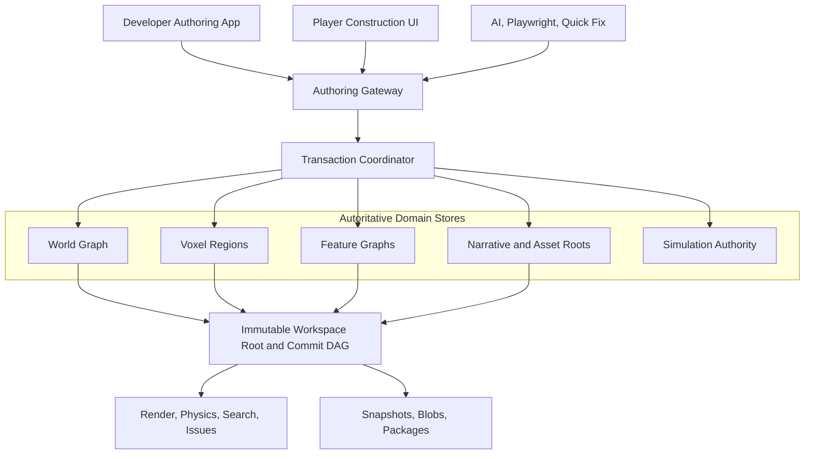
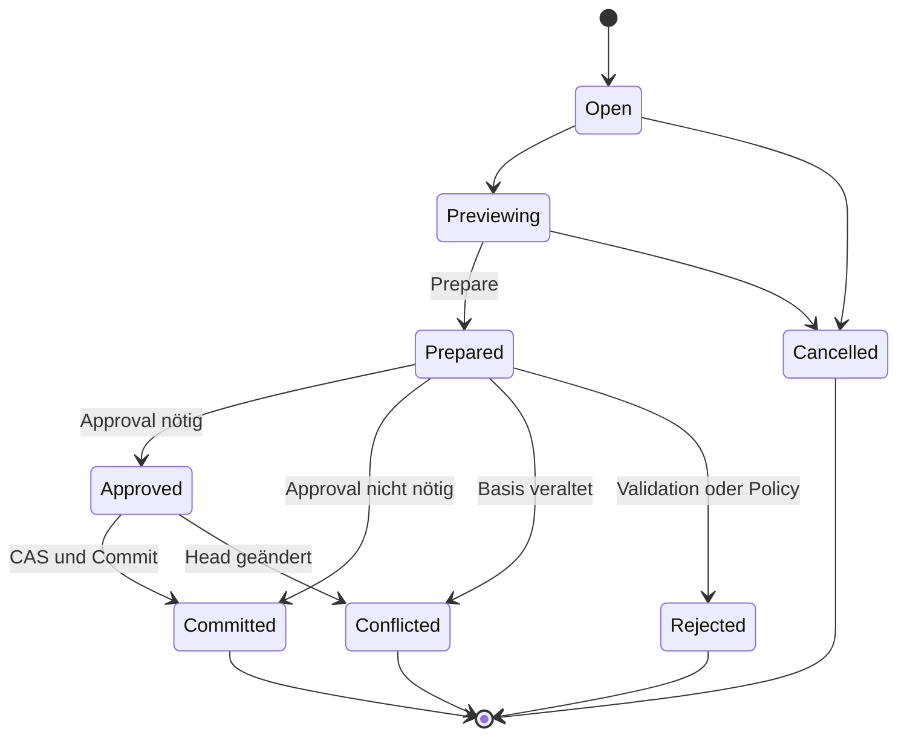

# G02 - Unified In-Game Authoring Platform

## Architektur- und Forschungsabschlussbericht

| Feld | Wert |
|---|---|
| Datum | 2026-08-12 |
| Auftrag | Cloud-Research und implementierungsnahe Architekturspezifikation |
| Technische Referenz | `BenjaminHornung/hestia-voxel-kernel-lab@d95992df05952ac4be6221ca1809c1c9e3c0ac9d` |
| Ergebnis | Zielarchitektur, Command Contract v1, Rechte-, Historien-, Paket- und Roadmapmodell |
| Repositoryarbeit | keine |
| Lokale Builds, Tests oder Benchmarks | keine durchgeführt oder behauptet |
| Abschlussstatus | `REQUIRES_OWNER_DECISION` |

## 1. Kurzentscheidung

Die Unified Authoring Platform soll **kein Editor im Sinne einer zweiten Engine** werden. Empfohlen wird:

1. eine separate Developer-Authoring-App beziehungsweise ein separates Developer-Bundle;
2. ein schlanker Player Construction Workspace in der normalen Spielruntime;
3. gemeinsame, exakt versionierte Runtime-, Domain-, Command-, Validation- und Package-Verträge;
4. genau eine aktive Authority je Zustandsdomäne;
5. ein Authoring Gateway als einziger Mutationseingang für Mensch, Gizmo, Quick Fix, KI und Automation;
6. flüchtige Copy-on-write-Previews, atomare Commits, konfliktgeprüfte Reverts und eine unveränderliche Commit-DAG;
7. Content Snapshots als Lade- und Releasewahrheit, ergänzt um begrenzte ChangeSets für Audit, Review, Undo und Replay;
8. einen KI-Copilot, der in v1 höchstens lesen, planen und Previews erzeugen darf;
9. spätere Collaboration über sequenzierte Commits, CAS, Leases und semantische Three-way-Merges, ohne allgemeinen CRDT-Zwang;
10. einen isolierten Editor-Core-Spike, der zunächst nur Authority-Grenzen, Transform-Preview, Commit, Revert, Redo-Branch, Validator und Diff beweist.

Die separate App teilt sich den Kern mit der Runtime. Sie dupliziert ihn nicht. Three.js, WebGPU, Collider, Navigation, Searchindex, Outliner und Preview bleiben jederzeit abgeleitete Projektionen. Der CPU-seitige Voxelzustand bleibt gemäß Projektvorgabe die einzige Voxelwahrheit.

### Warum der Status nicht `READY_FOR_SYNTHESIS` ist

Der Bericht ist als Architekturgrundlage vollständig. Vor einem Implementierungsstart fehlen jedoch verbindliche Ownerentscheidungen und drei im Auftrag ausdrücklich verlangte Leitdokumente:

- `WELTRAUM_RESEARCH_SYNTHESIS_2026-08-12.md`: `UNAVAILABLE`
- `WELTRAUM_RESEARCH_DECISION_LOG_2026-08-12.md`: `UNAVAILABLE`
- `WELTRAUM_GAMEPLAY_EDITOR_VISION_ADDENDUM_2026-08-12.md`: `UNAVAILABLE`

Diese Dateien dürfen weder rekonstruiert noch durch Annahmen ersetzt werden. Insbesondere können sie Entscheidungen zu Editorgrenze, Voxel-Authority, Player Construction und KI-Rechten enthalten, die die vorliegende Empfehlung verändern. Abschnitt 18 nennt die erforderlichen Entscheidungen und sichere Defaults.

## 2. Evidenzrahmen

### 2.1 Aussageklassen

- **Projektfakt:** durch die bereitgestellten Projektquellen oder den fixierten Repositorystand belegt.
- **Plattformfakt:** durch eine aktuelle offizielle Spezifikation oder Herstellerdokumentation belegt.
- **Technische Inferenz:** aus belegten Fakten abgeleitete Folgerung, noch nicht implementiert.
- **Empfehlung:** normativer Architekturvorschlag dieses Berichts.
- **Offen:** durch Ownerentscheidung, isolierten Spike oder spätere Messung zu klären.

### 2.2 Übernommene Projektinvarianten

1. Der CPU-seitige Voxelzustand ist Authority. Renderer, Collider, UI, Worker und Tests erzeugen keine zweite Voxelwahrheit.
2. Harte, achsenparallele Voxel, `Uint8Array`, Luftwert `0`, 0,25 m Zellkante, sparse `32³`-Chunks, `34³`-Halos und immutable Snapshots bleiben gesetzt.
3. Rendererprodukte sind wegwerfbare Derivate. Die vorhandene `MeshArtifact`-/Presentation-Backend-Grenze ist der Integrationspunkt, nicht Three.js-Objekte.
4. Worker erhalten immutable Snapshots. Ergebnisse werden nur bei passender Epoch-, Revisions-, Request- und Source-Bindung adoptiert.
5. Assetwahrheit ist ein lokales Voxelvolumen mit semantischen Metadaten, nicht GLB oder ein Render-Mesh.
6. Persistenz kombiniert Generator beziehungsweise Basis, geordnete Änderungen, kanonische Checkpoints und einen kurzen Tail. Reines unbegrenztes Event Sourcing und reine undurchsichtige Vollsnapshots sind ungeeignet.
7. Der fixierte Voxel-Lab-Stand enthält keine LICENSE-Datei. Er wird ausschließlich als Researchbasis behandelt.
8. Eine Produktintegration des Voxel-Labs bleibt bis zur ausdrücklich akzeptierten späteren Integrationsentscheidung gesperrt.
9. Eingecheckte Timingwerte sind Diagnostik. Dieser Bericht leitet daraus keine Leistungsbehauptung ab.

Die beiden bereitgestellten Destruction-Berichte sind byteidentisch. Ihr SHA-256 lautet `79ccccb489e01a1d2858979a3983f4b6073fee48e5c876ae256bb653b0b363f0`; sie wurden nicht als zwei unabhängige Evidenzquellen gezählt.

## 3. Entscheidungsmatrix

| Thema | Empfehlung | Verworfene oder vertagte Alternative | Begründung und Gate |
|---|---|---|---|
| Developer-Host | Separate Browser-App auf eigener Developer-Origin oder mindestens eigenem Bundle, gemeinsame Kernpackages | Vollständiger Editor versteckt im Player-Bundle | Kleinere Rechte-, Import-, AI- und Publish-Fläche; Owner bestätigt Deploymentgrenze |
| Player Construction | Workspace in der Runtime, gleicher Command-Evaluator, enge Allowlist | Zweiter, vereinfachter Welteditor | Verhindert Vertragsdrift und zweite Authority; serverseitige Authority nötig für geteilte Welten |
| Mutation | Geschlossene semantische Commands durch ein Gateway | Direkte Objektmutation, untypisiertes JSON Patch, Skriptstrings | Validierbar, auditierbar, replay- und mergefähig |
| Scene Graph | Reine Presentation-Projektion | Persistierte Three.js-Hierarchy als Weltwahrheit | Nicht jedes World-Objekt ist sichtbar, nicht jedes Renderobjekt ist Content |
| Preview | Copy-on-write-Overlay auf fixierter Basisrevision | Live-Welt während Drag oder Brush mutieren | Cancel ist verlustfrei, stale Preview scheitert fail-closed |
| Commit | Prepare, Impact Report, Approval, CAS, atomarer Root-Swap | Schrittweise Teilmutation mehrerer Systeme | Keine halben Cross-Domain-Commits |
| Undo/Redo | Revert und Reapply als neue ChangeSets in einer Commit-DAG | Persistenter linearer Objekt-Undo-Stack | Veröffentlichten Verlauf nicht umschreiben; spätere Änderungen nicht überschreiben |
| Persistenz | Content Snapshot plus begrenztes ChangeSet-Tail | Nur Log oder nur Snapshot | Schnelles Laden, Audit, Diff, Recovery und versionierbares Replay |
| Browserstorage | IndexedDB für Indizes/Heads, OPFS für große immutable Blobs, portable Paketexports | Ein einzelner In-place-Save oder File System Access als Pflicht | Recoverbar; File Picker sind nicht überall gleich verfügbar |
| Collaboration | CAS, sequenzierter Commitdienst, Leases, Merge Queue, semantischer Three-way-Merge | Allgemeines CRDT in v1 oder Last-write-wins | Voxel-, Graph-, Ownership- und Economy-Invarianten sind nicht beliebig kommutativ |
| KI-Rechte | Eigener delegierter Principal, standardmäßig Preview-only | KI erbt Developerrechte oder setzt eigenes Approval Level | Begrenzung von Prompt Injection, Toolmissbrauch und TOCTOU |
| Packagegranularität | Region-/Feature-/Narrative-/Assetpakete mit stabilen IDs und Content Hashes | Monolithische Weltdatei oder Renderartefakte als Mergeeinheit | Kleine Diffs, parallele Arbeit, klare Abhängigkeiten |
| Runtimekontrolle | Getrennte Simulation Commands und Scenario Snapshots | Editor-Undo als Zurückspulen der Simulation | Content- und dynamischer Zustand besitzen verschiedene Wahrheiten |
| Rendering | Gepinnter Three.js-Adapter zunächst beibehalten | Enginewechsel als Vorbedingung des Editors | Kein nachgewiesener Blocker; Renderer bleibt austauschbar |
| Minimaler Beweis | Entity-/Transform-Core zuerst, Voxelbrush als eigenes späteres Gate | Sofort kompletter World Editor | Prüft die schwersten Autoritäts- und Historienfragen mit kleinem Fehlerradius |

## 4. Zielarchitektur



### 4.1 Host- und Deploymentgrenze

**Empfehlung:** Die Developer-App ist ein eigener Browserentry, vorzugsweise auf einer eigenen Origin. Sie konsumiert dieselben versionierten Packages wie die Runtime:

```text
@weltraum/authoring-contracts
@weltraum/domain-contracts
@weltraum/validation-core
@weltraum/transaction-core
@weltraum/content-packages
@weltraum/runtime-projections
@weltraum/presentation-three
```

Developer-only Imports, Paketpublishing, AI-Gateways, Provenienzprüfungen und globale Migrationen werden nicht in den Player-Build aufgenommen. Player Construction registriert nur player-sichere Command Handler. Ein verborgenes Menü oder ein Queryparameter ist keine Sicherheitsgrenze.

Eine eingebettete Runtime Preview ist zulässig. Sie erhält jedoch nur einen versionierten Content Snapshot und kontrollierte Simulation Commands. Sie ist weder Speicherbackend noch Commit-Authority.

### 4.2 Zuständigkeiten und Authority-Matrix

| Zustand | Kanonischer Owner | Persistenz | Abgeleitete oder lokale Sicht |
|---|---|---|---|
| Branch Head und Content Commit | `ContentRepository` | Commit-DAG und Package Manifest | Branchanzeige |
| Stabile Entity-IDs, authored Komponenten und Beziehungen | `WorldGraphAuthority` | World-Graph-Root | Outliner und Inspector-Viewmodel |
| Statische authored Platzierung und Frames | `WorldGraphAuthority` | World-Graph-Root | Three.js-Transforms |
| Dynamische Transforme, Geschwindigkeiten und Tickzustand | `SimulationAuthority` oder Structural Runtime | Scenario-/Save-Snapshot | Renderinterpolation |
| Voxelbelegung, Material, Anchor und Zellrevision | `VoxelRegionAuthority` | Checkpoint plus ChangeSet-Tail | Mesh, Collider, GPU-Seiten |
| Assetzellen, Pivot, Anchors und Connectivity | Asset Package | HVOX plus Metadaten | GLB, LOD und Instanzbatch |
| Straßen, Splines, Parzellen, Zonen und Utilities | `FeatureGraphAuthority` | Feature-Graph-Root | Mesh, Decals, Navigation und Netzsimulation |
| Mission, Dialog, NPC und Fraktion | spezialisierte Content-Graph-Roots | Content Packages | Laufzeitindizes und UI |
| Selection, Kamera, Hide/Solo, Hover | `EditorSession` | optional lokale Präferenz | keine Contentwahrheit |
| Three.js Scene | kein fachlicher Owner | nie | Presentation Cache |
| Search- und Issueindex | kein fachlicher Owner | optional Cache | jederzeit neu aufbaubar |
| Transaction Preview | flüchtiger COW-Overlay | nie publishbar | Previewderivate |

### 4.3 Scene Graph, World Graph und Voxel Authority

- **World Graph:** stabile Domain-IDs, Parent-/Attachment-Beziehungen, authored Frames, registrierte Komponenten und Packagezugehörigkeit.
- **Presentation Scene Graph:** materialisierte Kameras, Lichter, sichtbare Entities, Proxyknoten, Gizmos, Debugobjekte und Renderbatches. Er darf vollständig verworfen und aus Authority-Zustand rekonstruiert werden.
- **Voxel Authority:** Occupancy, Material, Anchors, lokale Revisionen und immutable Region Snapshots. Ein Render-Mesh oder Collider darf niemals zurück in die Voxelwahrheit geschrieben werden.
- **Feature Graph:** parametrisierte Straßen, Splines, Parzellen, Zonen und Utilities. Ihre Geometrie ist Derived State.
- **Narrative Graphs:** Missionen, Dialoge, NPC- und Fraktionsdefinitionen mit spezialisierten Invarianten.
- **Simulation Authority:** dynamischer Zustand. Ein authoringseitiger statischer Transform darf nicht gleichzeitig durch Simulation oder Physik geschrieben werden.

Der Outliner ist eine virtuelle, filterbare Projektion mehrerer Domain Roots. Er ist keine speicherbare zweite Hierarchie.

## 5. Authoring Command Contract v1

### 5.1 Grundregeln

1. UI, Gizmo, KI und Automation erzeugen nur Drafts.
2. Das Gateway bindet vertrauenswürdige Session-, Principal-, Policy- und Budgetdaten an.
3. `operation` ist eine geschlossene, versionierte Union. Unbekannte Varianten scheitern.
4. Commands referenzieren stabile Domain-IDs, nie Renderobjekte, DOM-Knoten, GPU-Handles oder Workerobjekte.
5. Jede Mutation bindet Workspace, Package, Branch, Basiscommit, Root Hash und Zielrevisionen.
6. Bulkoperationen bleiben semantische Bulkcommands. Ein Brush wird nicht in tausende externe `SetCell`-Aufrufe zerlegt.
7. Autoritative Koordinaten verwenden Integer, Half-cell oder einen festgelegten Fixed-point-Vertrag. `NaN`, Infinity, `-0` und unsichere Integer sind ungültig.
8. Algorithmen, Seeds, Snapregeln, Grenzregeln, Registry- und Validatorversionen sind explizit gebunden.
9. Uhrzeit, Locale, DOM, Renderer, Netzwerk und zufällige Iterationsreihenfolge beeinflussen keinen semantischen Ergebnis-Hash.
10. Ein Command bestimmt sein Approval Level nie selbst.

### 5.2 Normativer Typentwurf

```ts
type Sha256 = `sha256:${string}`;
type StableId = string;

type AuthorityKind =
  | "world-graph"
  | "voxel-region"
  | "feature-graph"
  | "mission-graph"
  | "dialogue-graph"
  | "npc-registry"
  | "faction-graph"
  | "asset-catalog";

interface AuthoringCommandDraftV1 {
  readonly schema: "weltraum.authoring-command-draft/v1";
  readonly draftId: StableId;
  readonly transactionId: StableId;
  readonly transactionOrdinal: number;
  readonly base: {
    readonly workspaceId: StableId;
    readonly packageId: StableId;
    readonly branchId: StableId;
    readonly baseCommitId: StableId;
    readonly baseWorkspaceRootHash: Sha256;
    readonly expectedTransactionRevision: number;
    readonly targets: readonly TargetPreconditionV1[];
  };
  readonly target: AuthorityTargetV1;
  readonly operation: AuthoringOperationV1;
  readonly provenance: DraftProvenanceV1;
}

interface TargetPreconditionV1 {
  readonly authorityId: StableId;
  readonly objectId?: StableId;
  readonly expectedRevision: number;
  readonly expectedContentHash?: Sha256;
}

interface AuthorityTargetV1 {
  readonly authorityKind: AuthorityKind;
  readonly authorityId: StableId;
  readonly objectIds: readonly StableId[];
  readonly frameId?: StableId;
}

interface DraftProvenanceV1 {
  readonly origin:
    | "viewport"
    | "inspector"
    | "issue-quick-fix"
    | "ai-proposal"
    | "package-merge"
    | "scripted-test";
  readonly toolId: StableId;
  readonly proposalId?: StableId;
  readonly promptOrSessionHash?: Sha256;
}

type AuthoringCommandV1 = Omit<AuthoringCommandDraftV1, "schema"> & {
  readonly schema: "weltraum.authoring-command/v1";
  readonly commandId: StableId;
  readonly binding: {
    readonly sessionId: StableId;
    readonly principalId: StableId;
    readonly principalKind:
      | "human"
      | "ai-agent"
      | "validator-quick-fix"
      | "automation";
    readonly mode: "developer" | "player-construction";
    readonly policyVersion: StableId;
    readonly capabilitySetHash: Sha256;
    readonly budgetProfileHash: Sha256;
  };
};

type AuthoringOperationV1 =
  | { readonly kind: "world.entity.create"; readonly spec: EntitySpecV1 }
  | { readonly kind: "world.entity.delete"; readonly entityIds: readonly StableId[] }
  | { readonly kind: "world.transform.set-many"; readonly items: readonly TransformEditV1[] }
  | { readonly kind: "world.reparent"; readonly entityId: StableId; readonly parentId: StableId | null }
  | { readonly kind: "world.component.set-fields"; readonly patch: RegisteredFieldPatchV1 }
  | { readonly kind: "world.group.create"; readonly memberIds: readonly StableId[] }
  | { readonly kind: "voxel.set-cell"; readonly edit: VoxelCellEditV1 }
  | { readonly kind: "voxel.fill-box"; readonly edit: FillBoxV1 }
  | { readonly kind: "voxel.subtract-sphere"; readonly edit: SphereBrushV1 }
  | { readonly kind: "voxel.paint"; readonly edit: PaintBrushV1 }
  | { readonly kind: "voxel.apply-stamp"; readonly edit: StampEditV1 }
  | { readonly kind: "feature.spline.create"; readonly spec: SplineSpecV1 }
  | { readonly kind: "feature.spline.set-points"; readonly edit: SplinePointsV1 }
  | { readonly kind: "feature.parcel.split"; readonly edit: ParcelSplitV1 }
  | { readonly kind: "feature.zone.assign"; readonly edit: ZoneAssignV1 }
  | { readonly kind: "feature.utility.connect"; readonly edit: UtilityConnectV1 }
  | { readonly kind: "mission.graph.edit"; readonly edit: MissionGraphEditV1 }
  | { readonly kind: "dialogue.graph.edit"; readonly edit: DialogueGraphEditV1 }
  | { readonly kind: "npc.definition.edit"; readonly edit: NpcEditV1 }
  | { readonly kind: "faction.graph.edit"; readonly edit: FactionEditV1 }
  | { readonly kind: "asset.instance.place"; readonly edit: AssetPlacementV1 }
  | { readonly kind: "asset.instance.replace"; readonly edit: AssetReplacementV1 };
```

Die ausgelassenen Payloadtypen müssen jeweils geschlossene Schemas besitzen. `RegisteredFieldPatchV1` darf nur schemaregistrierte Komponenten und Felder ändern. RFC 6902 kann später als Transportformat für einfache Metadaten dienen, ist aber kein Ersatz für semantische Voxel-, Graph- oder Economy-Commands.

### 5.3 Prepare- und Commitartefakte

```ts
interface PreparedTransactionV1 {
  readonly schema: "weltraum.prepared-transaction/v1";
  readonly transactionId: StableId;
  readonly frozenTransactionRevision: number;
  readonly baseWorkspaceRootHash: Sha256;
  readonly orderedCommandHashes: readonly Sha256[];
  readonly candidateWorkspaceRootHash: Sha256;
  readonly semanticDiffHash: Sha256;
  readonly impactReportHash: Sha256;
  readonly validatorBundleHash: Sha256;
  readonly policyVersion: StableId;
  readonly requiredApprovalLevel: "A0" | "A1" | "A2" | "A3" | "A4";
  readonly preparedChangeSetHash: Sha256;
}

interface CommitReceiptV1 {
  readonly schema: "weltraum.commit-receipt/v1";
  readonly commitId: StableId;
  readonly changeSetId: StableId;
  readonly previousHeadCommitId: StableId;
  readonly resultWorkspaceRootHash: Sha256;
  readonly appliedCommandHashes: readonly Sha256[];
  readonly authorityResults: readonly {
    readonly authorityId: StableId;
    readonly beforeRootHash: Sha256;
    readonly afterRootHash: Sha256;
    readonly resultRevision: number;
  }[];
  readonly validationReceiptHash: Sha256;
  readonly approvalReceiptHashes: readonly Sha256[];
  readonly auditContextHash: Sha256;
}
```

### 5.4 Gemeinsame Validierungs- und Commitpipeline

```text
Decode und Größenlimits
  -> geschlossenes Schema
  -> kanonische Normalisierung
  -> Capability-Prüfung
  -> Source- und CAS-Preconditions
  -> reine semantische Validatoren
  -> Copy-on-write-Candidate
  -> Cross-Domain-Validation und Impactbudgets
  -> Prepared Hash und Approval
  -> atomarer Commit mit vollständigem Recheck
  -> Receipt und ChangeSet
  -> revisionsgebundene Derived Invalidation
```

Die Trennung `parse -> schema -> semantic -> provenance/authority` folgt dem bereits spezifizierten BR-01-Muster. Kontrollplandaten können nach [RFC 8785 JCS](https://www.rfc-editor.org/rfc/rfc8785.html) kanonisiert werden. Binäre Volumen benötigen einen eigenen kanonischen Byte- und Hashvertrag. [JSON Schema Draft 2020-12](https://json-schema.org/draft/2020-12/) prüft Struktur; Graph-, Registry-, Budget- und Cross-field-Regeln bleiben Aufgabe des semantischen Validators.

### 5.5 Commands, die niemals Renderobjekte verändern dürfen

Alle Contentmutationen arbeiten ausschließlich auf Domain-IDs:

- Create, Delete, Duplicate, Reparent und Group;
- Transform, Pivot und Snap;
- Material-, Asset- und Anchoränderungen;
- Terrain- und Voxelbrushes sowie Stamps;
- Straßen, Splines, Parzellen, Zonen und Utilities;
- Missionen, Dialoge, NPCs und Fraktionen;
- Collision-, Masse- und Physikänderungen;
- Quick Fix, Undo, Redo, Merge, Publish und Migration;
- alle KI-generierten Operationen.

Verbotene Vertragstypen sind insbesondere `THREE.Object3D`, `Mesh`, `BufferGeometry`, `Material`, `Raycaster`, `GPUBuffer`, `GPUTexture`, WebGL-Handles, DOM-Knoten, Selektoren, Canvas-Pixelkoordinaten, Worker-, Playwright- und DevTools-Handles.

Direkte Presentation-Aktionen sind Kamera, Hover, Selection Highlight, Grid, Isolation, Gizmo und Ghost Preview. Auch sie dürfen keinen Domainzustand zurückschreiben. Interne `UpsertMeshArtifact`, `RemoveArtifact` oder `EvictArtifact` dürfen den Renderer verändern, werden aber nie als Developer-, Player- oder KI-Tools exponiert.

## 6. Rechte-, Approval- und Validierungsmodell

### 6.1 Effektive Rechte

```text
EffectiveCapabilities =
  UserCapabilities
  ∩ ModeCapabilities
  ∩ SessionDelegation
  ∩ EnvironmentPolicy
```

Grobe Rollen können RBAC verwenden. Für Package, Branch, geschützte Region, Player-Plot, Ownership und Budgets wird zusätzlich ABAC/ReBAC benötigt. Berechtigungen werden deny-by-default und objektbezogen bei jedem Command geprüft. Das entspricht den Empfehlungen des [OWASP Authorization Cheat Sheet](https://cheatsheetseries.owasp.org/cheatsheets/Authorization_Cheat_Sheet.html).

Der KI-Copilot ist ein eigener delegierter Principal. Er erbt keine Developerrechte. Capability, technische Gültigkeit und Approval sind drei unabhängige Gates; Zustimmung kann fehlende Berechtigung niemals ersetzen.

### 6.2 Approval Levels

| Level | Bedeutung | Beispiele | KI-Copilot |
|---|---|---|---|
| `A0 Observe` | Lesen und erklären | Query, Search, Diff, Issues | erlaubt auf gefiltertem Read Model |
| `A1 Preview` | Flüchtiger Draft ohne Authority-Mutation | Ghost Placement, Brush Preview, AI-Plan | Standardmaximum in v1 |
| `A2 Bounded Commit` | Reversibel, eng allowlistet und budgetiert | direkte kleine Developeraktion, Playerbau im eigenen Plot | erst später per kurzem Session Grant |
| `A3 Exact Transaction` | One-shot-Freigabe für exakten Prepared Hash | Delete, Bulk, destructive Brush, AI-Änderung, Fix All | darf nur vorschlagen |
| `A4 Review/Publish` | Owner- oder unabhängige Reviewfreigabe | Merge, Publish, Schema, Registry, Generator, Waiver | niemals selbst freigeben oder publizieren |
| `X Forbidden` | Außerhalb des Command-Systems | Raw DOM/GPU/Storage, `eval`, beliebiger Code oder Netzwerk | immer verboten |

`requiredApprovalLevel` wird deterministisch aus Commandklasse, Zielklassifikation, Diff, Budgets und Irreversibilität berechnet. Der direkte bewusste Abschluss einer kleinen menschlichen Dragaktion kann eine `A2`-Zustimmung darstellen. Ein offener KI-Auftrag wie „räume die Szene auf“ ist keine Zustimmung zu den daraus abgeleiteten Writes.

Ein `ApprovalGrantV1` bindet mindestens Principal, Approver, `preparedChangeSetHash`, Package, Branch, Basisrevision und Root Hash, Policy-, Schema-, Registry- und Validatorversion, normalisierte Effektgrenzen, kurze Ablaufzeit und `maxUses: 1`. Jede Plan- oder Headänderung invalidiert die Freigabe. Der Dialog zeigt eine systemberechnete Diff- und Impactzusammenfassung, nicht nur KI-Prosa. Die [OWASP AI Agent Security Guidance](https://cheatsheetseries.owasp.org/cheatsheets/AI_Agent_Security_Cheat_Sheet.html) stützt diese Trennung von Entscheidung, Vorschau, Freigabe und Ausführung.

### 6.3 Permission/Validation Matrix

| Capability | Developer | Player Construction | KI | Zwingende Gates |
|---|---|---|---|---|
| Lesen, Search, Issues | gesamter erlaubter Workspace | sichtbarer/eigener Scope | gefilterter delegierter Scope | objektbezogene Leserechte |
| Kamera, Auswahl, Grid, Gizmoanzeige | lokal | lokal, eingeschränkt | keine Rendererhandle-Tools | keine Authority-Mutation |
| Entity erstellen, transformieren, gruppieren | `A2`, Bulk/Delete `A3` | nur freigegebene Rezepte im eigenen Bereich, `A2` | `A1`, Commit `A3` | Ownership, Bounds, Collision, CAS, Objektbudget |
| Voxelbrush oder Stamp | klein `A2`, destructive/bulk `A3` | nur freigegebene Form, Material, Reichweite und Plot | `A1`, Commit `A3` | Fixed-point, Zell-/Chunkbudget, Schutzmaterial, Connectivity |
| Asset importieren/aktualisieren | Import `A3`, Registry/Publish `A4` | verboten, nur Prefabinstanzen | Metadatenentwurf `A1` | Quarantäne, Schema, Hash, Pfad, Größe, Lizenz/Provenienz |
| Straße, Spline, Parzelle, Zone, Utility | `A2` oder `A3` | verboten, sofern nicht eigenes späteres Gameplaykommando | `A1`, Commit `A3` | Graphinvarianten, Gebietsschutz, Budget |
| Mission, Dialog, NPC, Fraktion | `A2`, große Graphänderung `A3` | verboten | `A1`, Commit `A3` | Referenzen, Erreichbarkeit, Registry, Lokalisierung, kein Script |
| Simulation Pause/Step/Fast-forward | Developer-Szenario | nicht verfügbar | nur explizit delegierter Testlauf | Resultat bleibt nichtautoritative Evidence |
| Validator ausführen | `A0/A1` | relevante Placementprüfungen | `A0/A1` | gebundener Snapshot und Validatorhash |
| Quick Fix | sicher lokal `A2`, destruktiv `A3` | nur Placementfixes | Vorschlag `A1` | identischer Gateway-, CAS- und Revalidierungspfad |
| Undo/Redo | Draft lokal; Commit als Revert/Reapply | nur eigene erlaubte Aktion | nur Vorschlag | Preimage, Three-way-Konflikt, Rechte, erneute Validation |
| Branch/Diff/Merge | Branch `A2`, Merge/Publish `A4` | kein Package-Merge | Diff/Mergevorschlag `A1` | Three-way-Diff, Mergevalidation, Review |
| Scripts/Plugins | nicht in v1, später eigener signierter Pfad `A4` | `X` | `X` | nie `eval` oder dynamischer Contentimport |
| Renderer/GPU | nur interner Adapter | kein Zugriff | kein Zugriff | Source Binding und stale-result rejection |

Für Player Construction müssen Weltänderung und Inventar-/Ressourcenbuchung atomar sein. Undo ist ein policygeprüfter kompensierender Command mit definierter Rückerstattung, kein ungeprüftes Zurückspulen.

### 6.4 Developer-vs-Player Capability Matrix

| Fähigkeit | Developer Human | KI-Agent | Player Construction |
|---|---|---|---|
| Query, Search, Issues | im Workspace vollständig | `A0` | eigener sichtbarer Scope |
| View, Kamera, lokale Layers | ja | über eingeschränktes Tooling | ja |
| Preview | ja | `A1` standardmäßig | ja |
| Entity Create/Transform/Delete | editierbarer Package-Scope | Proposal, später enger Grant | eigene Bauobjekte in Bauzone |
| Terrain-/Voxelbrush | Budgets und Approval | Preview; Commit `A3` | nur erlaubte Werkzeuge, Materialien und Zone |
| Asset-/Stamp-Platzierung | lokaler oder freigegebener Katalog | Proposal | signierte Whitelist |
| Nativer Assetimport | nach Provenienzprüfung | keine Freigabe | nein |
| Mission/Dialog/NPC/Faction | ja | Proposal | nein |
| Simulation Pause/Step/Snapshot | ja | explizit delegiert | nein |
| Branch erstellen | ja | eigener Featurebranch bei Grant | nein |
| Merge | Human Review | nie auf protected Branch | nein |
| Publish/Promote | Owner | nie | nein |
| Schema, Generator, Palette, Migration | Owner-only | Proposal | nein |
| Arbiträrer Code oder Shader | nicht in v1 | nein | nein |
| Committed Undo | konfliktgeprüfter Revert | Proposal | policy- und kostenpflichtiger Gegencommand |

## 7. Transaction-, Preview-, Undo- und Snapshot-Modell

### 7.1 Zustandsautomat



### 7.2 Preview

- Eine Preview ist ein Copy-on-write-Overlay auf einem immutable `WorkspaceRoot`.
- Sie bindet `transactionId`, `previewRevision`, `baseRootHash`, Zielrevisionen und Algorithmusversionen.
- Pointerbewegungen werden koalesziert. Ein Gizmo-Drag oder Brushzug erzeugt nicht pro Frame einen persistierten Command.
- Renderer, Collider und Validatorworker dürfen Previewderivate berechnen, besitzen aber keine Commit-Capability.
- Ein Ergebnis mit alter Previewrevision oder falschem Inputhash wird verworfen.
- Cancel verwirft Overlay und Derivate. Authority, Commit-DAG und Live-Simulation bleiben unverändert.

Das Session-Layer-Prinzip von OpenUSD ist eine nützliche Referenz für flüchtige Overlays: Eine Session Layer nimmt an der Komposition teil, wird aber nicht als Assetinhalt gespeichert. G02 übernimmt dieses Prinzip, nicht automatisch das USD-Format. Siehe [OpenUSD Session Layer](https://openusd.org/dev/glossary.html) und [UsdEditTarget](https://openusd.org/release/api/class_usd_edit_target.html).

### 7.3 Prepare und Commit

`Prepare` friert genau eine Transaction Revision ein, wiederholt Schema-, Permission-, CAS-, Budget-, Domain- und Cross-Domain-Validation und erzeugt immutable Candidate Roots, semantischen Diff, Impact Report sowie `preparedChangeSetHash`. Jede spätere Draftänderung macht Prepare und Approval ungültig.

`Commit` prüft Branch Head, Zielrevisionen, Capabilities und Approval erneut. Die neuen Contentblobs werden vor dem Sichtbarkeitspunkt immutable geschrieben. Danach werden ChangeSet, Commitobjekt und Branch Head atomar veröffentlicht. Alle Domains werden durch genau einen neuen `WorkspaceRoot` sichtbar. Fehler vor diesem Root-Swap lassen den alten Zustand aktiv. Ein stale Prepare wird nie automatisch gegen eine neue Basis ausgeführt.

### 7.4 ChangeSet, Undo und Redo Branches

```ts
interface ChangeSetV1 {
  readonly schema: "weltraum.authoring-changeset/v1";
  readonly changeSetId: string;
  readonly transactionId: string;
  readonly parentCommitIds: readonly string[];
  readonly orderedCommandHashes: readonly Sha256[];
  readonly baseWorkspaceRootHash: Sha256;
  readonly resultWorkspaceRootHash: Sha256;
  readonly domainChanges: readonly {
    readonly authorityId: string;
    readonly beforeRootHash: Sha256;
    readonly afterRootHash: Sha256;
    readonly semanticDeltaHash: Sha256;
    readonly preimageRef?: Sha256;
  }[];
  readonly touchedTargetIds: readonly string[];
  readonly validationReceiptHash: Sha256;
  readonly approvalReceiptHashes: readonly Sha256[];
  readonly provenanceHash: Sha256;
}
```

- **Uncommitted Undo:** bewegt den Previewcursor und rekonstruiert das Overlay.
- **Committed Undo:** erzeugt ein neues `RevertChangeSet`; Historie wird nicht umgeschrieben.
- **Konfliktprüfung:** Revert vergleicht `before`, `after` und `current`. Später veränderte Felder oder Voxelzellen werden nicht blind überschrieben.
- **Redo:** erzeugt ein neues `ReapplyChangeSet` mit Referenz auf das Original.
- **Redo Branches:** neue Arbeit nach einem Revert löscht den alten Pfad nicht. Beide Pfade bleiben in der Commit-DAG sichtbar.
- **Stable IDs:** gelöschte IDs werden nicht wiederverwendet.
- **Simulation:** Schaden, Wirtschaft und Tickzustand werden nicht durch Editor-Undo zurückgespult.

Unreal dokumentiert einen undo-fähigen Transaktionspuffer, weist aber ausdrücklich darauf hin, dass dieser Puffer nicht als persistente Historie geeignet ist. Das stützt die Trennung von flüchtigem Editor-Undo und persistenter ChangeSet-DAG: [FTransaction](https://dev.epicgames.com/documentation/unreal-engine/API/Editor/UnrealEd/FTransaction?lang=en-US), [UTransBuffer](https://dev.epicgames.com/documentation/unreal-engine/API/Editor/UnrealEd/UTransBuffer?lang=en-US).

### 7.5 Command Log gegen finalen Snapshot

| Artefakt | Zweck | Releasewahrheit | Aufbewahrung |
|---|---|---:|---|
| `ContentSnapshot` | kanonische Domain Roots für Laden und Release | ja | dauerhaft je veröffentlichtem Commit |
| `ChangeSet` | Audit, Review, Revert, Reapply und begrenztes Replay | nein, ergänzt Snapshot | aktives Tail plus Archivpolitik |
| `TransactionPreviewSnapshot` | flüchtiges Overlay | nein | bis Cancel/Commit |
| `VoxelCheckpoint` | kompaktierte Region mit Tailbindung | Teil eines Content-/Save-Snapshot | nach Kompaktionsvertrag |
| `ScenarioSnapshot` | Content Root, Tick, RNG und dynamische Zustände | nur Test-/Save-Kontext | nach Szenariopolitik |
| Presentation Cache | Mesh, Collider, Search und Issues | nein | jederzeit löschbar |

Der finale Snapshot ist der primäre Ladevertrag. Releases dürfen nicht davon abhängen, jede historische Mausgeste oder alte Algorithmusversion neu auszuführen. High-Level-Commands binden Algorithmusversion und Result-/Deltahash. Nach einem festen Schwellwert wird ein Checkpoint erzeugt, während der aktive Tail begrenzt bleibt.

### 7.6 Browserpersistenz und Crash Recovery

Die [IndexedDB-Spezifikation](https://www.w3.org/TR/IndexedDB/) bietet transaktionale Object Stores. Das [WHATWG File System](https://fs.spec.whatwg.org/) stellt OPFS und exklusive Sync Access Handles in geeigneten Workerkontexten bereit. Es gibt jedoch keine atomare Transaktion über IndexedDB und OPFS gemeinsam.

Empfohlenes recoverbares Verfahren:

1. große immutable Blobs, Snapshots und Packages content-addressed in OPFS schreiben und schließen;
2. Digest und Größe verifizieren;
3. Manifest, Commitobjekt und Head-Pointer in einer kurzen IndexedDB-Readwrite-Transaktion umschalten;
4. beim Start Heads und referenzierte Blobs verifizieren;
5. unreferenzierte temporäre Blobs später sicher bereinigen.

IndexedDB hält Indizes, Command-/Checkpoint-Metadaten, Assetkatalog, Issues, Hashes und Heads. OPFS hält große immutable Payloads und wegwerfbare Caches. File System Access bleibt ein optionaler Import-/Exportadapter mit Upload/Download-Fallback. Quoten werden nie als feste Produktzahl versprochen; vor großen Writes werden Schätzung, Reserve, `QuotaExceededError`, Export und Recovery behandelt.

Für v1 erhält nur ein Tab den lokalen Projekt-Writer. Die [Web Locks API](https://developer.mozilla.org/en-US/docs/Web/API/Web_Locks_API) koordiniert denselben Origin über Tabs und Worker; weitere Tabs öffnen das Projekt read-only. Das ist lokale Koordination, keine Sicherheits- oder Multiplayer-Authority.

## 8. Interaktions- und Domänenwerkzeuge

### 8.1 Selection, Gizmos, Snap, Pivot und Grouping

- Picking liefert `AuthorityTarget`, `frameId`, Targetrevision und Content Hash, nie nur ein Three.js-Hitobjekt.
- Ein Drag erzeugt einen `TransformPreviewDraft`; beim Loslassen entsteht genau ein `world.transform.set-many`.
- Der gespeicherte Transform ist kanonisch quantisiert. Pointerpfad und Framerate sind irrelevant.
- Pivot-Modi: `active`, `selection-center`, `individual-origins`, `custom-frame`.
- Räume: `local`, `parent`, `world`, jeweils mit explizitem Frame.
- Snaptypen: Grid, Winkel, Voxel-Face, Anchor, Spline und Surface. Algorithmus und Grenzregel sind versioniert.
- Multi-Selection wird stabil nach Entity-ID sortiert und atomar committed.
- Eine lokale Selection Group ist Sessionzustand. Eine persistente Gruppe benötigt einen expliziten World-Graph-Command.
- Stale Picking oder stale Snapbasis blockiert den Commit. Das System sucht nicht still ein neues Ziel.

Three.js [TransformControls](https://threejs.org/docs/pages/TransformControls.html) liefern etablierte Gizmo-, Raum- und Snapfunktionen, mutieren aber direkt ein `Object3D`. G02 darf sie deshalb nur als Presentation Controller verwenden: direkte Mutation während Preview, anschließend Normalisierung in einen Domain-Command, danach vollständige Rekonstruktion aus Authority.

### 8.2 Terrain-/Voxelbrushes, Stamps und destructive Preview

- Brushgeometrie nutzt Integer beziehungsweise Fixed-point und eine versionierte Inside-/Boundary-Regel.
- Ein Bulk Brush ist ein semantischer Command mit deklarierten Bounds und Policybudgets.
- Preview arbeitet auf einem Overlay-Snapshot und berichtet betroffene Zellen, Chunks, Schutzbereiche, Connectivity- und Kostenfolgen.
- Prepare bindet Basisrevision, Chunkhashes, Algorithmus, Materialregistry und resultierendes kanonisches Zelldelta.
- Commit revalidiert den vorbereiteten Delta-Plan gegen die aktuelle Authority.
- Stamps referenzieren immutable `assetId`, `assetVersion`, HVOX-Hash, Palette-Hash, Anchorvertrag und quantisierten Transform.
- GLB oder Preview-Mesh werden nie zurück zu Voxels gesampelt.
- Der Receipt enthält tatsächliche Changed Cells, Dirty Chunks, Nachbarinvalidierung und Result Hash.
- Mesh, Collision und Connectivity folgen als getrennte, revisionsgebundene Derived Jobs.

Player Construction erhält keine freie Voxel-API. Erlaubt werden konkrete Werkzeuge, Formen, Materialien, Reichweiten, Plotgrenzen, Zellbudgets und Ressourcenregeln. Geschützte Zellen oder systemische Anchors sind unveränderlich.

### 8.3 Straßen, Splines, Parzellen, Zonen und Utilities

Diese Inhalte werden als spezialisierte Feature Graphs im selben Command- und Packagekern geführt:

- stabile IDs für Knoten, Kanten, Splinepunkte, Profile, Parcelgrenzen und Utilityports;
- versionierte Koordinatenräume und Snapregeln;
- abgeleitete Straßenmeshes, Markierungen, Navigation und Netzsimulation;
- Graphvalidatoren für Kreuzungen, Mindestabstände, geschützte Bereiche, Anschlussgrad und Referenzen.

Terrainveränderung darf kein stiller Bake sein. Entweder bleibt ein versionierter `TerrainModifier` Teil der Voxel-Evaluierung, oder Featureänderung und resultierender Voxel-Delta werden in derselben Transaction committed. Der Receipt bindet Featureversion und Voxel-Delta. Der erste Feature-Slice beweist einen Straßenspline ohne irreversible Terrainmaterialisierung.

### 8.4 Missionen, Dialoge, NPCs und Fraktionen

**Gleiche Plattform, spezialisierte Panels.** Gemeinsam sind Gateway, Selection Context, Search, Packages, Branches, History, Validators, Issues, Permissions und Referenznavigation. Spezialisiert bleiben:

- Mission Graph mit Objectives und Bedingungen;
- Dialogue Graph mit Choices, Conditions und Lokalisierung;
- NPC Definition mit Rollen, Inventar, Spawner und Referenzen;
- Faction Graph mit Beziehungen und Reputation;
- Cross-reference Browser für eingehende und ausgehende Abhängigkeiten.

Der generische Inspector eignet sich für einfache registrierte Felder. Graphstruktur und Bedingungen gehören nicht in eine untypisierte Key-Value-Oberfläche. Ausführbare Content-Skripte sind in v1 ausgeschlossen.

### 8.5 Simulation, Pause, Step, Fast-forward und Scenario Snapshots

- `Pause`, `Step`, `FastForward` und `RestoreScenario` sind `SimulationControlV1`, keine Contentmutation.
- Im Minimalmodell sind Authoring Commits nur bei pausierter Simulation erlaubt.
- Ein Scenario Snapshot bindet Content Root Hash, Tick, RNG-Zustände, Runtimeversion, dynamische Komponenten, Transforme und Geschwindigkeiten.
- Browserübergreifende bitidentische Physik wird nicht vorausgesetzt.
- Restore überschreibt keinen Content Branch.
- „Simulationsergebnis übernehmen“ ist ein eigener Authoring Command mit Preview, Diff und Approval.
- Player Construction erhält keine Developer-Pause-, Step- oder Restorekontrolle.

### 8.6 Issue Browser, Validators und Quick Fixes

```ts
interface ValidationIssueV1 {
  readonly schema: "weltraum.validation-issue/v1";
  readonly fingerprint: Sha256;
  readonly code: string;
  readonly severity: "info" | "warning" | "error" | "blocker";
  readonly gate: "intake" | "commit" | "publish" | "advisory";
  readonly validator: { readonly id: string; readonly version: string; readonly digest: Sha256 };
  readonly source: {
    readonly packageId: string;
    readonly branchId: string;
    readonly revision: number;
    readonly snapshotHash: Sha256;
  };
  readonly targets: readonly AuthorityTargetV1[];
  readonly messageKey: string;
  readonly messageArgs: Readonly<Record<string, string | number>>;
  readonly evidenceFacts: readonly unknown[];
  readonly quickFixes: readonly QuickFixProposalV1[];
}
```

- Der Fingerprint bindet Validator, Issuecode, stabile Targets und normalisierte Fakten.
- Issues sind Ergebnisse eines bestimmten Snapshots. „Resolved“ entsteht nur durch erneute Validation.
- Stale Issues dürfen keinen Fix anwenden.
- Quick Fixes sind versionierte Command-Proposals, keine Callbacks und kein Code.
- Jeder Fix durchläuft Schema, Permission, Preview, Budget, Approval, CAS und Revalidation.
- `Fix all` baut einen gemeinsamen Candidate, erkennt gegenseitige Konflikte und benötigt mindestens `A3`.
- Waiver sind eigene auditierte Artefakte mit Scope, Begründung, Ablauf und `A4`. Technische Authority-Invarianten sind nicht waivbar.

## 9. Content Packages, Branching, Diff, Merge und Review

### 9.1 Packagevertrag

```ts
interface ContentPackageManifestV1 {
  readonly schema: "weltraum.content-package/v1";
  readonly packageId: string;
  readonly packageVersionLabel: string;
  readonly packageKind:
    | "base"
    | "region"
    | "feature"
    | "scenario"
    | "asset-kit"
    | "narrative"
    | "player-blueprint";
  readonly contentHash: Sha256;
  readonly sourceCommitId: string;
  readonly parentCommitIds: readonly string[];
  readonly roots: {
    readonly workspaceRoot: Sha256;
    readonly worldGraph?: Sha256;
    readonly voxelDirectory?: Sha256;
    readonly featureGraphs?: Sha256;
    readonly assetCatalog?: Sha256;
    readonly missions?: Sha256;
    readonly dialogues?: Sha256;
    readonly npcRegistry?: Sha256;
    readonly factions?: Sha256;
  };
  readonly dependencies: readonly {
    readonly packageId: string;
    readonly exactContentHash: Sha256;
  }[];
  readonly compatibility: {
    readonly worldSchemaVersion: string;
    readonly coordinateContractHash: Sha256;
    readonly generatorAbiHash: Sha256;
    readonly materialRegistryHash: Sha256;
  };
  readonly provenanceHash: Sha256;
  readonly validationReportHash: Sha256;
  readonly approvalReceiptHashes: readonly Sha256[];
}
```

`packageId + contentHash` bildet die Identität. Abhängigkeiten sind exakt gepinnt. Import prüft geschlossenes Schema, Magic/Medientyp, Hash, entpackte Größe, Dateizahl, Pfadlänge, Traversal, Duplikate und Provenienz. Player Blueprints verwenden ein engeres Subschema aus signierten Assets, quantisierten Transforms und erlaubten Connections. Sie enthalten weder Code noch Generator-, Palette-, Physik- oder Permissiondefinitionen.

Feingranulare Package-/Entityaufteilung reduziert gleichzeitige Dateikonflikte. Unreal dokumentiert mit One File Per Actor ein vergleichbares Ziel, nämlich Änderungen einzelner Actors aus der Hauptleveldatei herauszulösen. G02 übernimmt die Granularitätsidee, nicht das Unreal-Dateiformat: [One File Per Actor](https://dev.epicgames.com/documentation/unreal-engine/one-file-per-actor-in-unreal-engine).

### 9.2 Semantischer Diff und Three-way-Merge

| Fall | Automerge |
|---|---:|
| unterschiedliche IDs oder unterschiedliche registrierte Felder | ja |
| beide Seiten setzen exakt denselben Wert | ja |
| eine Seite ändert, die andere bleibt auf Base | ja |
| Edit gegen Delete | nein |
| verschiedene Werte desselben Felds | nein |
| disjunkte Voxelzellen | ja |
| gleiche Voxelzelle, gleiches Ergebnis | ja |
| gleiche Voxelzelle, anderes Ergebnis | nein |
| überlappende order-sensitive Brushes | nur nach finalem Zelldelta, sonst nein |
| Graphmerge erzeugt Zyklus oder ungültige Referenz | nein |
| Generator-, Koordinaten- oder Material-ABI unterscheidet sich | Ownerentscheidung |
| Dependency zeigt auf verschiedene Content Hashes | nein |
| nur ein Derived Artifact unterscheidet sich | regenerieren, nicht mergen |

Eine Konfliktauflösung ist selbst ein ChangeSet. Zeitstempel, Clientreihenfolge und Last-write-wins lösen keine fachlichen Konflikte. Nach jedem Merge wird der gesamte Candidate erneut cross-domain validiert, weil zwei einzeln gültige Branches zusammen ungültig sein können.

OpenUSD zeigt mit Layer Stacks und Edit Targets ein bewährtes Muster für nichtdestruktive, zielgerichtete Opinions. Das ist eine Referenz für Branch-/Overlaydenken, keine Entscheidung, Weltraum-Inhalte als USD zu speichern: [Introduction to USD](https://openusd.org/dev/intro.html), [UsdEditTarget](https://openusd.org/release/api/class_usd_edit_target.html).

### 9.3 Collaboration ohne frühen CRDT-Zwang

V1 benötigt:

- immutable Base Snapshots und stabile Domain-IDs;
- Branch Heads mit monotoner Revision und CAS;
- append-only ChangeSets;
- deklarierte Read-/Write-Sets;
- optional eine Single-writer-Lease je Workspace oder Package;
- periodische Checkpoints;
- semantische Three-way-Diffs und Merge-Proposals.

Später können ein zentral sequenzierter Commitdienst, Region-/Package-Leases, Presence, Review Queue und serverseitig signierte Receipts ergänzt werden. CRDTs können selektiv für Kommentare, Cursor, Presence oder reine Textfelder sinnvoll sein. Für nichtkommutative Voxel-, Graph-, Ownership-, Inventar- und Economy-Änderungen ersetzen sie weder Autorisierung noch Invarianten.

## 10. Panel- und Workspace-Informationsarchitektur

### 10.1 Standardshell

| Bereich | Inhalt | Authority-Bezug |
|---|---|---|
| Top Bar | Workspace, Branch, Mode, Snap, Pivot, Simulation, Approvalstatus | nur Command-/Sessionsteuerung |
| Linke Spalte | Hierarchy, World/Package Tree, Layers, Saved Searches | virtuelle Rootprojektion |
| Mitte | 3D Viewport, Overlays, Gizmos, Previewdiff | Presentation |
| Rechte Spalte | Inspector, Component Editors, Validation Summary, References | rootgebundene Viewmodels |
| Untere Fläche | Asset Browser, Issues, History, Diff, Console, Jobs | abgeleitete Indizes und Receipts |
| Command Palette | Search, Navigation und Command Drafts | nur registrierte Commands |

Diese Aufteilung orientiert sich an etablierten Browser- und Engineeditoren, ohne deren Datenmodell zu übernehmen. PlayCanvas dokumentiert Toolbar, Hierarchy, Viewport, Inspector und Asset Panel in seiner [Editoroberfläche](https://developer.playcanvas.com/user-manual/editor/interface/). Unity dokumentiert entsprechende Rollen für [Hierarchy](https://docs.unity3d.com/6000.5/Documentation/Manual/Hierarchy.html), [Inspector](https://docs.unity3d.com/6000.5/Documentation/Manual/UsingTheInspector.html) und [Project Window](https://docs.unity3d.com/6000.5/Documentation/Manual/ProjectView.html).

### 10.2 Workspace Presets

| Workspace | Schwerpunkt | Primäre Panels |
|---|---|---|
| World | Entities, Frames und Packages | Hierarchy, Viewport, Inspector, Layers |
| Voxel | Region, Brush, Stamp und Material | Viewport, Brush Settings, Palette, Impact |
| Infrastructure | Straße, Spline, Parcel, Zone, Utility | Feature Tree, Graph/Viewport, Validators |
| Gameplay | Mission, Dialog, NPC und Fraktion | spezialisierte Graphpanels, References |
| Simulation | Pause, Step, Scenario und Evidence | Runtime Preview, Timeline, Snapshot Browser |
| Review | Diff, Issues, History, Approval und Publish | semantischer Diff, Issue Browser, Receipts |

Ein Workspace ändert Layout und erlaubte Tools, nicht die zugrunde liegenden Authority-Regeln. Layers werden getrennt modelliert als authored semantische Layers, Package-/Data Layers, lokale Hide/Solo-Sichten und Simulationsschichten. Eine lokale Sichtbarkeitseinstellung verändert keinen Contentzustand.

## 11. Browserperformance und Workergrenzen

### 11.1 Architekturregeln

- Hierarchy, Asset Browser, Searchresultate und Issues virtualisieren. Keine DOM-Zeile pro Weltobjekt.
- Outliner, Search und Issueindex inkrementell und Root-gebunden aufbauen.
- Inspector-Editoren und Graphpanels lazy laden.
- Selection und Multi-Edit als stabile ID-Mengen führen, nicht als Renderobjektlisten.
- Dragpreviews koaleszieren und Bulkcommands deklarativ halten.
- Sparse Copy-on-write-Overlays statt vollständiger Weltkopien verwenden.
- Worker erhalten immutable Snapshots mit Project-, Package-, Revision-, Request- und Inputhash.
- Queue und Retrypfade bleiben bounded; newest valid revision wins.
- Das letzte gültige Derived Product bleibt sichtbar, während Pending und Stale eindeutig markiert werden.
- Commit veröffentlicht kleine immutable Rootpointer. Meshes, Collider, Search und Validatorresultate folgen asynchron.
- Rendereradoption, Validatoren, Searchindex, Autosave und Import erhalten getrennte Budgets.
- Konkrete Millisekunden-, Objekt-, Speicher- oder Szenengrenzen werden erst durch BR-01-konforme Messungen gesetzt.

Der Baselinepfad verwendet einen Dedicated Worker und Transferables. Der autoritative Live-Buffer wird nie transferiert und anschließend weiter mutiert. SharedArrayBuffer setzt Cross-Origin Isolation und ein explizites Atomics-/Ownershipprotokoll voraus; er wird erst nach einem isolierten Engpassnachweis erwogen. Der [HTML Living Standard](https://html.spec.whatwg.org/multipage/workers.html) und das [ECMAScript Memory Model](https://tc39.es/ecma262/2026/multipage/memory-model.html) bilden dafür die Plattformbasis.

### 11.2 Renderer und Device Loss

Three.js bleibt zunächst gepinnt auf den vom Projekt geprüften Stand `0.185.1`. `TransformControls` und Scene Graph sind nur Adapter. WebGPU-Fähigkeiten und Limits werden pro Gerät geprüft; Device Loss führt zum vollständigen Neuaufbau der Presentation aus Authority. Der [W3C-WebGPU-Standard](https://www.w3.org/TR/webgpu/) garantiert keine identischen Features oder Limits auf jedem Adapter. WebGL2 bleibt so lange Fallback, bis ein späterer, separater Spike funktionale Parität belegt.

## 12. Playwright-, DevTools- und Agentenautomation

### 12.1 Testbare Oberfläche

- Stabile ARIA-Rollen und zugängliche Namen für Panels, Commands und Zustände.
- Test-IDs nur für semantiklose Canvas-/Gizmo-Anker.
- Deterministische Fixture-Routen und explizite Ready-/Pending-/Committed-/Conflicted-Zustände.
- Frischer Browser Context und eigener Principal je Test.
- Read-only Evidence-Export mit Commandtyp, Target-IDs, Basis-/Ergebnisrevision, Root Hash, Validatorstatus und Selection IDs.
- Screenshots und Traces ergänzen semantische Evidence, ersetzen sie aber nicht.
- Kein HUD-Scraping als Authority-Nachweis.
- Keine mutable `window.TestBridge`, kein allgemeiner `postMessage`-RPC und keine Produktmutation über CDP `Runtime.evaluate`.

Playwright empfiehlt rollenbasierte Locators und isolierte Browser Contexts: [Locators](https://playwright.dev/docs/locators), [Browser Contexts](https://playwright.dev/docs/browser-contexts). Der offizielle [Playwright MCP](https://playwright.dev/docs/getting-started-mcp) nutzt strukturierte Accessibility Snapshots für Agenteninteraktion. G02 soll diese Zugänglichkeit unterstützen, aber Agententools weiterhin auf Query, Proposal, Preview und Approval Request des Gateways begrenzen.

### 12.2 DevTools-Grenze

CDP ist Chromium-spezifisch und seine Tip-of-tree-Version garantiert keine Rückwärtskompatibilität. Deshalb gilt:

1. Playwright Public APIs zuerst;
2. CDP nur über einen kleinen, gepinnten Diagnoseadapter;
3. Build-ID, Playwright-Version, Browserprodukt, Browserrevision, OS/GPU-Kontext und Capabilityprofil im Evidence-Bundle;
4. CDP nie als normaler Mutationseingang;
5. Performance- und DevToolsdaten sind Roh-Evidence, keine automatische Benchmarkbehauptung.

Quellen: [Playwright CDPSession](https://playwright.dev/docs/api/class-cdpsession), [Chrome DevTools Protocol](https://chromedevtools.github.io/devtools-protocol/), [Playwright Trace Viewer](https://playwright.dev/docs/trace-viewer).

## 13. Minimal Editor Slice v1

### 13.1 Ziel

Der erste Spike beweist ausschließlich, dass ein professionell bedienbarer Browsereditor denselben autoritativen Kern verwenden kann, ohne Renderer, Preview oder UI zur Weltwahrheit zu machen. Er bleibt vollständig isoliert und verändert weder Voxel-Lab noch Weltraum-Spiel.

### 13.2 Enthaltener Scope

- separate kleine Browser-App;
- deterministische In-memory-Fixture-Authority mit stabilem `WorkspaceRoot`;
- Command Gateway, Policybindung und geschlossene v1-Schemas;
- genau drei Mutationsklassen: `world.entity.create`, `world.transform.set-many`, `world.entity.delete`;
- COW Preview, Cancel, Prepare, CAS Commit und Receipt;
- Commit-DAG, Revert, Reapply und erhaltener Redo-Branch;
- minimaler Viewport, Hierarchy, Inspector, History und Issue Browser;
- Transform Gizmo mit genau einem Commit pro abgeschlossenem Drag;
- ein deterministischer Validator und ein Quick Fix als Command-Proposal;
- Snapshotexport, semantischer Diff und kleiner Three-way-Merge;
- read-only Evidence-Export für Playwright;
- Three.js ausschließlich als gepinnter Presentation Adapter.

### 13.3 Explizit nicht enthalten

- Voxelbrushes oder Voxel-Lab-Integration;
- Player Construction;
- Mission, Dialog, NPC oder Fraktion;
- Assetimport und Packagepublishing;
- Simulation;
- KI-Autocommit;
- Netzwerk, Multiuser oder Collaborationserver;
- SharedArrayBuffer;
- Scripts oder Plugins;
- Produktintegration.

### 13.4 Pflichtgates

1. Derselbe kanonische Commandstream erzeugt denselben Root Hash.
2. Falsche Basisrevision oder falscher Root Hash verändert nichts.
3. Fehler an jeder Prepare-/Commitstufe erzeugt keinen Teilzustand.
4. Cancel hinterlässt Authority und Commit-DAG unverändert.
5. Rendererrebuild aus Authority stellt denselben sichtbaren Zustand her.
6. Direkte Three.js-Manipulation verändert keinen Snapshot.
7. Ein Gizmo-Drag erzeugt genau einen normalisierten `transform.set-many`-Commit.
8. Revert des letzten Commits stellt den semantischen Zustand wieder her.
9. Revert nach einer späteren konkurrierenden Feldänderung liefert Konflikt.
10. Reapply erzeugt einen neuen Commit und löscht keinen Historypfad.
11. Disjunkter Three-way-Merge ist deterministisch.
12. Delete-vs-edit und gleicher-Feld-anderer-Wert werden nicht automatisch aufgelöst.
13. Quick Fix durchläuft denselben Preview-, Permission-, CAS- und Commitpfad.
14. Stale Validatorresultat und stale Quick Fix werden abgewiesen.
15. Kein Three.js-, DOM-, GPU-, Playwright- oder Storage-Typ wird von Command- und Authority-Contracts importiert.
16. Kein Developer-Commandhandler liegt in einem gebauten Player-Fixture-Bundle.

### 13.5 Weitere minimale Beweisslices vor dem Vollsystem

| Slice | Beweis | Harte Stop-Grenze |
|---|---|---|
| v2 Persistence | Crash Recovery, IndexedDB-Head, OPFS-Blob, Single-writer-Lock | kein In-place-Überschreiben, kein verlorener bestätigter Commit |
| v3 Voxel Preview | ein begrenzter Brush auf isolierter Testregion, stale rejection, Result Hash | erst nach akzeptierter Voxel-Authority und zuständigem Voxel-WP |
| v4 Package/Merge | Export, Import, disjunkte und konfliktäre Three-way-Merges | kein Codeimport, keine ungebundenen Dependencies |
| v5 Feature Graph | ein Straßenspline ohne Terrainbake | Derived Mesh bleibt nichtautoritative Projektion |
| v6 Narrative | kleiner Mission-/Dialoggraph und Referenzvalidator | keine freien Scripts |
| v7 Player Sandbox | ein signiertes Prefab im eigenen Plot mit atomarer Ressourcenbuchung | serverseitige Authority für geteilte Welt |
| v8 AI Proposal | Read, Plan, Preview, exact-hash Approval Request | kein Autocommit, keine Selbstfreigabe |
| v9 Collaboration | zwei Writer über Sequencer, Lease, CAS und Merge Queue | kein Last-write-wins und kein allgemeiner CRDT |

## 14. Drei-Jahres-Ausbaufolge in kleinen seriellen Gates

Die Zeiträume sind Planungsfenster, keine Lieferzusagen. Jedes Gate startet erst nach Abnahme des Vorgängers. Ein fehlgeschlagenes Gate wird repariert oder beendet, nicht durch parallele Featurearbeit umgangen.

### Jahr 1: Kern, Workbench und lokale Persistenz

| Gate | Ergebnis | Abnahme | Stop bei |
|---|---|---|---|
| `EC-00` | Ownerentscheidungen und Abgleich der drei fehlenden Leitdokumente | schriftlich eingefrorene Authority-, Host-, Player- und AI-Policy | Konflikt mit akzeptierter Projektentscheidung |
| `EC-01` | pure Command-, Principal-, Policy-, Validator- und Hashverträge | geschlossene Schemas, negative Fixtures, keine Presentationimports | unklare Semantik oder nichtdeterministische Hashes |
| `EC-02` | In-memory Transaction Core | Fault Injection, COW Preview, Prepare, CAS, atomarer Root-Swap | Teilcommit oder stale Adoption |
| `EC-03` | Commit-DAG, Snapshot, Diff, Revert und Reapply | deterministic replay, Konfliktrevert, Redo-Branch | lineares Historymodell verliert Pfade |
| `EC-04` | read-only Workbench und Projection Boundary | Hierarchy/Inspector/Viewport rebuildbar aus Root | Scene Graph wird speicherbare Authority |
| `EC-05` | Transform Gizmo end-to-end | ein normalisierter Commit, Cancel und stale Picking | direkter Persistenzwrite aus `Object3D` |
| `EC-06` | Issues, Validatoren und Quick Fix | gleiche Findings full/inkrementell, stale Fix fail-closed | Quick Fix umgeht Gateway |
| `EC-07` | lokale Persistenz und Recovery | IndexedDB/OPFS-Recovery, Quota- und Crashfixtures, Single Writer | bestätigter Commit nicht wiederherstellbar |

### Jahr 2: Domänenwerkzeuge und kontrollierter Playerpfad

| Gate | Ergebnis | Abnahme | Stop bei |
|---|---|---|---|
| `EC-08` | Content Package Export, Import, Diff und Merge | Provenienz, Hash, Traversal-/Bombenabwehr, semantische Konflikte | unlizenzierter oder ausführbarer Content |
| `EC-09` | isolierter Voxelbrush-Handler | begrenzte Preview, kanonisches Delta, Connectivity- und Derived Receipts | globale Voxel-Authority ungeklärt |
| `EC-10` | Asset-/Stamp-Workflow | HVOX/Metadaten als Truth, GLB nur derived | Rücksamplung aus Renderprodukt |
| `EC-11` | Feature Graph | Straße/Spline/Parcel/Zone/Utility ohne stillen Terrainbake | Featuremesh wird Terraintruth |
| `EC-12` | Narrative Workspaces | Mission/Dialog/NPC/Faction plus Cross-reference-Validatoren | allgemeine Scripts erforderlich |
| `EC-13` | Simulation Preview und Scenario Snapshot | Pause/Step/Restore ohne Contentmutation | Scenario Restore überschreibt Branch |
| `EC-14` | Player Capability Sandbox | signiertes Prefab, Plot, Budget, atomare Ledger-/World-Transaktion | Regeln nur clientseitig in geteilter Welt |

### Jahr 3: KI, Review, Collaboration und Produktfreigabe

| Gate | Ergebnis | Abnahme | Stop bei |
|---|---|---|---|
| `EC-15` | KI Proposal Port | eigener Principal, gefiltertes Read Model, Preview-only, Prompt-Injection-Fixtures | KI erbt Userrechte oder kann Approval prägen |
| `EC-16` | Exact Transaction Approval | one-shot Grant, Prepared Hash, TTL, Recheck, Audit Receipt | TOCTOU oder UI-Prosa statt Systemdiff |
| `EC-17` | Publish-/Protected-Branch-Governance | `A4`, Review, signierte Package Receipts | Clienthash wird als Vertrauenswurzel behandelt |
| `EC-18` | sequenzierte Collaboration | serverseitiger Commitservice, CAS, Lease, Presence, Merge Queue | Last-write-wins bei fachlichen Konflikten |
| `EC-19` | große Szenen und Budgettuning | BR-konforme Szenarien, Raw Evidence, definierte Budgets | fremde oder diagnostische Timingwerte |
| `EC-20` | Security-, Recovery- und Supply-chain-Härtung | CSP, Trusted Types, Importfuzzing, Backup/Restore, Rollenfixtures | beliebiger Code-/Netzwerkimport |
| `EC-21` | Produktintegrationsentscheidung | erst nach WP12, Lizenzgate, Authorityentscheidung und Parity-Suite | konkurrierende Produkt- und Lab-Authorities |

## 15. Abdeckung der 20 Pflichtfragen

| Nr. | Kurzantwort | Hauptabschnitt |
|---:|---|---|
| 1 | Gleicher Kern, unterschiedliche Appgrenze und Capability Policy; Player stark allowlistet | 4.1, 6.4 |
| 2 | Geschlossener, versionierter Command-, Validation- und Transaction-Kern | 5 |
| 3 | World Graph authored Semantik, Voxel Authority Zellen, Scene Graph nur Presentation | 4.2, 4.3 |
| 4 | Standardworkbench aus Viewport, Hierarchy, Inspector, Assets, Layers und Search | 10 |
| 5 | Previewbasierte Gizmos, quantisierte Transforms, explizite Frames, Multi-Edit atomar | 8.1 |
| 6 | COW Preview, Prepare, exact Approval, CAS Commit, Revert/Reapply, Redo-DAG | 7 |
| 7 | Snapshot als Lade-/Releasewahrheit, begrenztes ChangeSet-Log für Audit und Revert | 7.5 |
| 8 | Bounded semantische Brushes und immutable Stamps mit destructive Overlay Preview | 8.2 |
| 9 | Feature Graphs; Geometrie derived; Terrainmodifier oder atomarer Voxel-Delta | 8.3 |
| 10 | Selbe Plattform und Kern, spezialisierte Graphpanels | 8.4, 10.2 |
| 11 | Separate Simulation Controls und rootgebundene Scenario Snapshots | 8.5 |
| 12 | Snapshotgebundene Issues; Quick Fix ist normales Command-Proposal | 8.6 |
| 13 | Content-addressed Packages, Commit-DAG, semantischer Diff/Merge und Review Receipts | 9 |
| 14 | KI als eigener Principal, v1 Preview-only, exact-hash Approvals | 6 |
| 15 | Virtualisierung, COW, bounded Worker/Scheduler, progressive Derivate, Messung vor Budget | 11 |
| 16 | Accessibility-first Playwright, read-only Evidence, CDP nur Diagnose | 12 |
| 17 | CAS, Sequencer, Leases und Three-way-Merge; CRDT nur selektiv später | 9.3 |
| 18 | Separate Developer-App mit geteilten Engine-/Contract-Packages | 3, 4.1 |
| 19 | Sämtliche Content-, Undo-, Merge-, Quick-Fix- und KI-Commands | 5.5 |
| 20 | Entity-Core zuerst, danach Persistence, Voxel, Package, Feature, Player, AI und Collaboration | 13, 14 |

## 16. Risiken und Stop-Gates

| Priorität | Risiko | Konsequenz | Zwingende Gegenmaßnahme |
|---|---|---|---|
| P0 | Player-Commit nur im Browser geschützt | manipuliertes Bundle umgeht Regeln | serverseitige Commit-Authority für geteilte Welten |
| P0 | KI erbt Developerrechte | Prompt Injection wird privilegierter Write | eigener Principal, Capability-Schnittmenge, Default `A1` |
| P0 | UI/Renderer umgeht Gateway | zweite World Truth und nichtauditierte Edits | keine Domainhandles im Renderer, alle Writes zentral |
| P0 | Quick Fix oder Package führt Code aus | XSS, Datenabfluss, vollständige Übernahme | nur typisierte Commands, kein `eval`, kein freies JS/WASM/Netzwerk |
| P0 | Approval-TOCTOU | Freigabe gilt nach Plan- oder Headänderung weiter | Prepared Hash, Basisbindung, kurze TTL, one-shot, Recheck |
| P1 | unbounded Brush, Import oder Agentenloop | Browser-Freeze und Speicher-DoS | harte Zell-, Entity-, Byte-, Job-, Retry- und Ratebudgets |
| P1 | bösartiges Assetpaket | Zip Bomb, Traversal, Parserangriff | Quarantäne, Allowlist, Magic, Größen-/Count-/Pfadgrenzen |
| P1 | nichtdeterministische Commands | Replay-, Undo- und Merge-Drift | Fixed-point, Seeds, Versionen, kanonische Ordnung und Hashes |
| P1 | Hashlog gilt als manipulationssicher | privilegierter Client kann Historie neu bilden | Server-MAC/Signatur oder externer immutable Store |
| P1 | Undo trennt World und Inventar | Duplikation oder Ressourcenverlust | atomare Ledger-/World-Transaktion und Compensation Command |
| P1 | stale Worker-/Rendererresultat | alte Projektion ersetzt neue | vollständige Source Binding und stale rejection |
| P1 | Dev App driftet von Runtime | unterschiedliche Semantik | gemeinsame Contract- und Projection-Conformance-Suite |
| P1 | konkurrierende Voxelpfade | mehrere Authorities | schriftliche Owner-Matrix vor Produktintegration |
| P2 | Multi-Tab-Writer | lokaler Headkonflikt | Web Lock, ein Writer, weitere Tabs read-only |
| P2 | CDP mit Adminsession | vollständige Fernsteuerung | getrennte Testprincipals, keine produktive CDP-Exposition |

Für die Developer-Origin werden mindestens strikte CSP ohne `unsafe-eval`, Trusted Types, enge `worker-src`/`connect-src`, `object-src 'none'`, `base-uri 'none'`, `frame-ancestors 'none'`, eine restriktive Permissions Policy und exakte Origin-/Schemavalidierung bei Messages empfohlen. Primärquellen: [CSP Level 3](https://www.w3.org/TR/CSP3/), [Trusted Types](https://www.w3.org/TR/trusted-types/), [Permissions Policy](https://www.w3.org/TR/permissions-policy/), [Cross-document Messaging](https://html.spec.whatwg.org/multipage/web-messaging.html).

## 17. Kleine unmittelbare Folgegates

Diese Gates sind die kürzeste sichere Reihenfolge nach dem vorliegenden Bericht:

1. **G02-D0 Quellenabgleich:** die drei fehlenden Leitdokumente bereitstellen und Konflikte protokollieren.
2. **G02-D1 Owner Freeze:** Appgrenze, globale Voxel-Authority, Player-Server-Authority, KI-Autocommit und `A4`-Governance entscheiden.
3. **G02-S1 Contract Review:** Command, Principal, Approval, ChangeSet und Package v1 gegen Projektentscheidungen reviewen.
4. **G02-S2 Negative Dependency Gate:** Contracts dürfen keine Three.js-, DOM-, GPU-, Storage- oder Playwright-Typen importieren.
5. **G02-S3 Isolated Core Spike:** Minimal Editor Slice v1 aus Abschnitt 13, ohne Repo- oder Produktintegration.
6. **G02-S4 Evidence Review:** deterministic Hashes, Fault Injection, stale rejection, Revertkonflikt, Rendererrebuild und Playerbundle-Negativtest prüfen.
7. **G02-S5 Persistence Spike:** erst nach erfolgreichem Core, mit Crash- und Quota-Recovery.
8. **G02-S6 Voxel Permission:** erst nach akzeptiertem zuständigem Voxel-WP und schriftlicher Authorityentscheidung einen Brush-Slice genehmigen.

## 18. Offene Ownerfragen

| Priorität | Frage | Empfohlener Default | Blockiert |
|---|---|---|---|
| P0 | Stimmen Synthesis, Decision Log und Gameplay Editor Vision mit diesem Bericht überein? | fehlende Dateien liefern, Konflikte explizit entscheiden | jeden Implementierungsstart |
| P0 | Separate Developer-App auf eigener Origin oder Dev-Route im Hauptbundle? | separate App/Origin mit Shared Packages | Deployment- und Securityarchitektur |
| P0 | Welche Komponente ist nach WP12 globale Terrain-/Voxel-Authority? | genau eine gemeinsame CPU-Authority, andere Pfade nur Adapter/Research | jeden Voxel-Editor-Slice |
| P0 | Darf Player Construction eine geteilte oder serverpersistente Welt ändern? | nur mit serverseitiger Commit-Authority | Player Construction außerhalb lokaler Welt |
| P0 | Darf der Copilot in v1 irgendetwas automatisch committen? | nein, maximal `A1 Preview` | AI-Write-Handler |
| P0 | Wer darf `A4` erteilen und braucht Publish eine zweite Person? | Owner plus unabhängige Review für protected Publish | Merge/Publish |
| P1 | Darf Player Construction Terrain zerstören oder zunächst nur Prefabs bauen? | Prefab-/Recipe-Placement zuerst | Player-Command-Allowlist |
| P1 | Welche Bauzonen, Ownership-, Kosten-, Refund- und Undo-Regeln gelten? | explizite Plot- und Ledgerpolicy | Player-Transaction Contract |
| P1 | Bleiben Straßenänderungen als Modifier oder werden sie in Voxel-Delta materialisiert? | Modifier zuerst, Materialisierung eigener Commit | Feature-/Voxelkopplung |
| P1 | Wie lange bleiben vollständige Commands und Preimages erhalten? | aktives Tail plus versionierte Archiv-/Retentionpolicy | Storageplanung und Datenschutz |
| P1 | Welche Scenario-Daten müssen exakt wiederherstellbar sein? | Content Root, Tick, RNG und explizite Dynamik; Physikparität nicht behaupten | Scenario Contract |
| P1 | Bleiben Scripts und Plugins für drei Jahre außerhalb des Packagevertrags? | ja | Import- und Sicherheitsfläche |
| P1 | Sind Player Blueprints lokal, teilbar oder server-signiert? | lokal bis Signatur-/Moderationsdienst existiert | Sharing und Marketplace |
| P2 | In neuem Repository oder isoliertem Scratchprojekt spiken? | eigenes isoliertes Spikeprojekt | Handoffziel |

## 19. Copy-and-paste-Handoff-Prompt für den isolierten Editor-Core-Spike

```text
Du bist genau ein lokaler Codex-Write-Agent für einen vollständig isolierten
G02 Editor-Core-Spike. Du arbeitest NICHT im Weltraum-Spiel und NICHT im
Voxel-Lab. Erzeuge keinen Produktmerge und übernimm keinen WP04-Zwischenstand.

HARTE STARTBEDINGUNGEN
1. Der Owner hat die drei zuvor fehlenden Dateien bereitgestellt und den
   G02-Abgleich freigegeben:
   - WELTRAUM_RESEARCH_SYNTHESIS_2026-08-12.md
   - WELTRAUM_RESEARCH_DECISION_LOG_2026-08-12.md
   - WELTRAUM_GAMEPLAY_EDITOR_VISION_ADDENDUM_2026-08-12.md
2. Der Owner hat schriftlich bestätigt:
   - separate Developer-App beziehungsweise erlaubte Spikegrenze,
   - keine Produkt- oder Voxel-Lab-Integration,
   - KI bleibt Preview-only,
   - der Spike enthält noch keine Voxelmutation.
3. Lies den vollständigen Bericht
   G02_unified_ingame_authoring_platform_abschlussbericht_2026-08-12.md.
4. Wenn eine akzeptierte Entscheidung dem Bericht widerspricht, stoppe und
   dokumentiere den Konflikt. Nicht improvisieren.

ZIEL
Beweise in einer kleinen Browser-App, dass Hierarchy, Inspector, Viewport und
Transform-Gizmo ausschließlich einen versionierten Command-/Transaction-Kern
bedienen und keine zweite World Authority erzeugen.

SCOPE
- deterministic In-memory WorkspaceRoot mit stabilen IDs;
- geschlossene Runtime-Schemas für Draft, Command, PreparedTransaction,
  ApprovalGrant, ChangeSet, CommitReceipt und ValidationIssue;
- genau diese Mutationen:
  world.entity.create
  world.transform.set-many
  world.entity.delete
- Copy-on-write Preview, Cancel, Prepare, CAS Commit;
- Commit-DAG, Revert, Reapply und erhaltener Redo-Branch;
- semantischer Three-way-Diff/Merge für registrierte Entityfelder;
- ein deterministischer Validator und ein Quick Fix als Command-Proposal;
- minimaler Viewport, Hierarchy, Inspector, History und Issue Browser;
- Three.js nur als exakt gepinnter Presentation Adapter;
- read-only Evidence-Export und Playwright-Gates.

ARCHITEKTURREGELN
- UI, Gizmo, Quick Fix und Tests erzeugen nur Command Drafts.
- Session, Principal, Mode, Policy und Budgets werden im Gateway gebunden.
- Kein Command importiert Three.js, DOM, GPU, IndexedDB, OPFS, Worker,
  Playwright oder DevTools.
- Commands referenzieren stabile Domain-IDs, Basisroot und Zielrevisionen.
- Alle äußeren Objekte sind geschlossen. Unbekannte Felder und Versionen
  scheitern fail-closed.
- Zahlen sind finite; -0, NaN, Infinity und unsichere Integer scheitern.
- Kanonische Sortierung und Hashbildung sind locale- und rendererunabhängig.
- Previewprodukte binden transactionId, previewRevision und baseRootHash.
- Commit wiederholt Permission, CAS, Validation und Approvalprüfung.
- Der sichtbare Zustand wird durch einen atomaren WorkspaceRoot-Swap ersetzt.
- Renderer, Search, Issues und Historyviews sind rebuildbare Projektionen.
- Kein eval, Function Constructor, dynamischer Contentimport, allgemeiner RPC,
  window.TestBridge oder postMessage-Mutationsdienst.

NICHTZIELE
- keine Voxelbrushes, Stamps oder Voxel-Lab-Imports;
- kein Player Construction;
- kein Assetimport oder Packagepublishing;
- keine Missionen, Dialoge, NPCs oder Fraktionen;
- keine Simulation;
- kein AI-Agent und kein Autocommit;
- kein Netzwerk, Multiuser, CRDT oder Collaborationserver;
- kein SharedArrayBuffer;
- keine Scripts, Plugins oder fremden Assets;
- keine Produktintegration und keine Performancebehauptung.

PFLICHTTESTS
1. Gleicher Commandstream ergibt denselben Root Hash.
2. Falsche Revision oder falscher Root Hash verändert nichts.
3. Fault Injection an jeder Prepare-/Commitstufe erzeugt keinen Teilzustand.
4. Cancel lässt Authority und Commit-DAG unverändert.
5. Rendererrebuild aus Authority ergibt denselben sichtbaren Zustand.
6. Direkte Object3D-Manipulation verändert keinen Snapshot.
7. Ein Gizmo-Drag erzeugt genau einen normalisierten Transformcommit.
8. Revert stellt den semantischen Zustand wieder her.
9. Revert nach konkurrierender Feldänderung liefert Konflikt.
10. Reapply ist ein neuer Commit; kein Redo-Pfad wird gelöscht.
11. Disjunkter Three-way-Merge ist deterministisch.
12. Delete-vs-edit und gleicher-Feld-anderer-Wert sind Konflikte.
13. Quick Fix durchläuft denselben Gateway- und Commitpfad.
14. Stale Issue, Preview und Validatorresultat werden abgewiesen.
15. Statischer Importtest beweist die negative Presentationabhängigkeit.
16. Ein Player-Fixture-Bundle enthält keinen Developer-Commandhandler.

PLAYWRIGHT
- Nutze frische Browser Contexts und zugängliche Rollen/Namen.
- Prüfe UI-Aktion plus Commandtyp, Target-IDs, Basis-/Ergebnisrevision,
  Root Hash und Validatorstatus über eine read-only Evidenceoberfläche.
- Screenshots ergänzen die semantische Evidence.
- Kein CDP Runtime.evaluate als Mutation und kein HUD-Scraping.

ABGABE
- exakter Projektpfad, Branch und Basisstand;
- geänderte Dateien nach Contracts, Core, UI, Tests und Dokumentation;
- ausgeführte Befehle und Ergebnisse;
- Contractversionen und deterministische Goldenwerte;
- Ergebnisse aller 16 Pflichtgates;
- Bestätigung: keine Produkt-/Voxel-Lab-Änderung, keine Voxelmutation,
  kein Player Mode, keine KI, kein Netzwerk, kein Benchmark;
- offene Findings und finales git status --short;
- kein Merge und kein Folgegate beginnen.
```

## 20. Quellen- und Versionsregister

### 20.1 Projektquellen

| Quelle | Verwendung | Status |
|---|---|---|
| `WELTRAUM_PROJECT_INSTRUCTIONS_ADDENDUM(1).md` | Governance und Sicherheitsgrenzen | bereitgestellt und ausgewertet |
| `WELTRAUM_PROJECT_MEMORY(1).md` | akzeptierte Kerninvarianten und Roadmapgrenzen | bereitgestellt und ausgewertet |
| `WELTRAUM_RESEARCH_REGISTER(1).md` | Researchstatus und Paketbezüge | bereitgestellt und ausgewertet |
| `WELTRAUM_RESEARCH_SYNTHESIS_2026-08-12.md` | verlangte Synthesebasis | `UNAVAILABLE` |
| `WELTRAUM_RESEARCH_DECISION_LOG_2026-08-12.md` | verlangte Entscheidungsbasis | `UNAVAILABLE` |
| `WELTRAUM_GAMEPLAY_EDITOR_VISION_ADDENDUM_2026-08-12.md` | verlangte Editorvision | `UNAVAILABLE` |
| Destruction-/Connectivity-Bericht | Authority-, Fragment- und Physikgrenzen | bereitgestellt; Duplikat byteidentisch |
| Asset-Pipeline-Bericht | HVOX, Provenienz, Palette, Anchors und Derived Assets | bereitgestellt und ausgewertet |
| Worker-/Scheduler-Bericht | Snapshots, Queue, Revision und stale rejection | bereitgestellt und ausgewertet |
| Landscape-Generation-Bericht | Feature Graphs, Hydrologie und Voxelmaterialisierung | bereitgestellt und ausgewertet |
| Benchmark-/Methodikberichte BR-01/BR-02 | Vertrags-, Provenienz-, Telemetrie- und Evidencegrenzen | bereitgestellt und ausgewertet |
| Integration-Boundary-Audit | `MeshArtifact`-/Presentation-Grenze und Produktkonflikte | bereitgestellt und ausgewertet |
| Planet-Streaming-/Persistence-Bericht | Generator, Events, Checkpoints, LOD und Storage | bereitgestellt und ausgewertet |
| WebGPU-/Engine-Bake-off | Renderer- und Capabilitygrenzen | bereitgestellt und ausgewertet |
| Open-Source-/Lizenz-Audit | Copy-Risiken, Referenzen und fehlende Lab-Lizenz | bereitgestellt und ausgewertet |
| [`hestia-voxel-kernel-lab@d95992d`](https://github.com/BenjaminHornung/hestia-voxel-kernel-lab/tree/d95992df05952ac4be6221ca1809c1c9e3c0ac9d) | unveränderliche Researchbasis | read-only; im Tree keine LICENSE |

### 20.2 Externe Primärquellen

| Quelle und Stand | Verwendung | Lizenz-/Nutzungsstatus |
|---|---|---|
| [JSON Schema Draft 2020-12](https://json-schema.org/draft/2020-12/) | geschlossene strukturelle Contracts | Spezifikationsreferenz, kein Code übernommen |
| [RFC 8785 JCS](https://www.rfc-editor.org/rfc/rfc8785.html) | kanonische JSON-Control-Plane | Standardreferenz, kein Referenzcode übernommen |
| [W3C IndexedDB](https://www.w3.org/TR/IndexedDB/) | transaktionale Browsermetadaten | Standardreferenz |
| [WHATWG File System](https://fs.spec.whatwg.org/) | OPFS, Sync Access Handle und Locks | Standardreferenz |
| [Web Locks API](https://developer.mozilla.org/en-US/docs/Web/API/Web_Locks_API) | lokaler Single Writer über Tabs/Worker | Dokumentationsreferenz |
| [WHATWG Storage](https://storage.spec.whatwg.org/) | Quota-, Persistenz- und Evictiongrenzen | Standardreferenz |
| [W3C WebGPU](https://www.w3.org/TR/webgpu/) | Feature-/Limit-/Device-Loss-Grenze | Standardreferenz |
| [Three.js r185](https://github.com/mrdoob/three.js/releases/tag/r185) und [TransformControls](https://threejs.org/docs/pages/TransformControls.html) | gepinnter Presentation- und Gizmoadapter | MIT; keine Codeübernahme in diesem Auftrag |
| [OpenUSD Introduction](https://openusd.org/dev/intro.html), [EditTarget](https://openusd.org/release/api/class_usd_edit_target.html), [Session Layer](https://openusd.org/dev/glossary.html) | Layer-, Overlay- und Edit-Target-Präzedenz | Dokumentationsreferenz; keine Formatentscheidung oder Codeübernahme |
| [Unreal FTransaction](https://dev.epicgames.com/documentation/unreal-engine/API/Editor/UnrealEd/FTransaction?lang=en-US), [UTransBuffer](https://dev.epicgames.com/documentation/unreal-engine/API/Editor/UnrealEd/UTransBuffer?lang=en-US) | Undo-Transaktionspräzedenz und Persistenzgrenze | Herstellerdokumentation, keine Codeübernahme |
| [Unreal One File Per Actor](https://dev.epicgames.com/documentation/unreal-engine/one-file-per-actor-in-unreal-engine) | feingranulare Inhaltsaufteilung | Herstellerdokumentation, keine Formatübernahme |
| [PlayCanvas Editor](https://developer.playcanvas.com/user-manual/editor/interface/) und [Version Control](https://developer.playcanvas.com/user-manual/editor/version-control/) | Browsereditor- und Branch-UX | Dokumentationsreferenz; Enginecode MIT, kein Code übernommen |
| [Unity Inspector](https://docs.unity3d.com/6000.5/Documentation/Manual/UsingTheInspector.html) und [Undo](https://docs.unity3d.com/6000.5/Documentation/ScriptReference/Undo.html) | etablierte Panel- und Undo-UX | Herstellerdokumentation, keine Codeübernahme |
| [Godot UndoRedo](https://docs.godotengine.org/en/stable/classes/class_undoredo.html) | Action-/History-Präzedenz | Godot-Code MIT, nur Dokumentation referenziert |
| [Playwright MCP](https://playwright.dev/docs/getting-started-mcp), [Locators](https://playwright.dev/docs/locators), [Contexts](https://playwright.dev/docs/browser-contexts) | Accessibility-first Automation und Isolation | Apache-2.0; keine Codeübernahme |
| [OWASP Authorization](https://cheatsheetseries.owasp.org/cheatsheets/Authorization_Cheat_Sheet.html), [AI Agent Security](https://cheatsheetseries.owasp.org/cheatsheets/AI_Agent_Security_Cheat_Sheet.html), [File Upload](https://cheatsheetseries.owasp.org/cheatsheets/File_Upload_Cheat_Sheet.html) | Rechte-, Agenten- und Importsicherheitsmodell | Sicherheitsreferenz, keine Codeübernahme |

Versions- und Capabilityaussagen sind auf den Stichtag 2026-08-12 gebunden. Bewegliche Browser- und Libraryfähigkeiten müssen im späteren Spike erneut exakt gepinnt und per Runtime Capability Probe erfasst werden.

## 21. Abschlussstatus

**Status: `REQUIRES_OWNER_DECISION`**

Die Zielarchitektur, Command- und Transactionverträge, Rechte- und Approvalmatrix, Undo-/Snapshotmodell, Workspace-IA, Minimal Slice, dreijährige Gatefolge und der Handoff sind spezifiziert. Ein isolierter Spike ist technisch klar abgrenzbar.

Der Implementierungsstart bleibt blockiert, bis:

1. die drei fehlenden Leitdokumente bereitgestellt und gegen diesen Bericht abgeglichen wurden;
2. die Developer-App-Grenze bestätigt ist;
3. die globale Voxel-Authority schriftlich entschieden ist;
4. der Player-Scope samt serverseitiger Authority für geteilte Welten feststeht;
5. KI-Autocommit und `A4`-Publish-Governance entschieden sind.

Bis dahin ist der sichere Default: separate Developer-App, genau eine CPU-Authority je Domain, Player Construction nur lokal beziehungsweise serverautorisiert, KI maximal Preview-only und kein Publish ohne Ownerreview.
