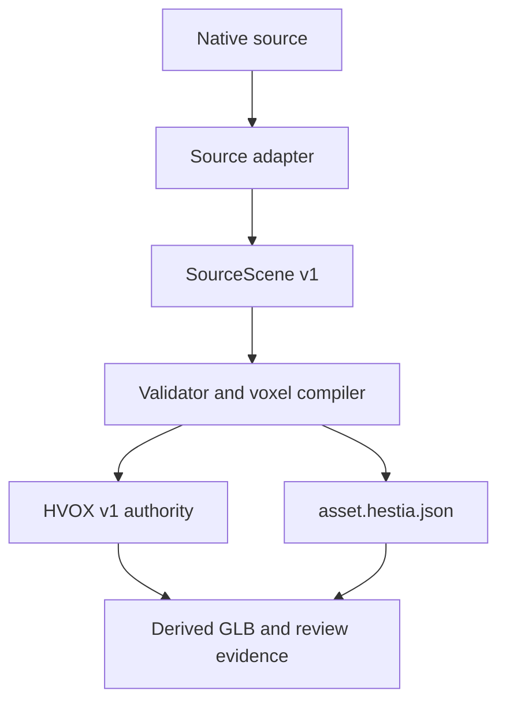

# G12: Blender-to-HVOX Voxel Toolchain

## Architektur-, Vertrags- und Spike-Bericht

**Datum:** 2026-08-12  
**Status:** `REQUIRES_SPIKE`  
**Arbeitsart:** Research, Architektur und Handoff, keine Implementierung  
**Verbindlicher Lab-Stand:** `voxel-lab@d95992df05952ac4be6221ca1809c1c9e3c0ac9d`  
**Geprüfter Produkt-Stand:** `Weltraum-Spiel@15f3550bd604856b25d40a7ac700ec4d5106b89e`

## 0. Kurzentscheidung

Die Toolchain soll als getrenntes Asset-Compiler-Programm aufgebaut werden:

```text
native Quelle
  -> formatgebundener Source Adapter
  -> normalisiertes SourceScene-v1-Paket
  -> deterministischer Voxel Compiler
  -> HVOX v1 plus asset.hestia.json
  -> abgeleitete GLB-Proxies, Review-Captures und Evidenz
```

Dabei gelten fünf harte Grenzen:

1. **HVOX-Zellen sind Autorität.** GLB, Meshes, Collider, AO und Review-Bilder sind abgeleitet.
2. **Die erste Mesh-Voxelisierung kombiniert konservative Dreieck-Zellen-Überdeckung mit Generalized Winding Number.** Sie akzeptiert nur definierte Eingaben und weist numerisch oder semantisch mehrdeutige Fälle ab.
3. **0,25 m bleibt das normative v1-Raster.** 0,125 m ist ein ausdrücklich freizugebendes lokales Forschungsprofil, nicht stillschweigend ein zweiter Standard.
4. **Blender-Semantik wird aus dem vorhandenen Hestia-Exporter wiederverwendet, nicht neu erfunden.** Dessen GLB plus Report ist jedoch kein Voxelformat und keine Laufzeitautorität.
5. **Die Arbeit läuft seriell durch kleine Abnahmegates.** Der nächste Schritt ist ein Vertragsspike mit goldenen Kleinstfällen. Produktintegration und der parallele WP04-Schreibpfad bleiben unangetastet.

Die Architektur ist tragfähig, aber drei Sachfragen sind vor Implementierung noch nicht bewiesen: bitstabile Innen-Außen-Klassifikation auf allen Zielplattformen, belastbare Materialübertragung an Mehrmaterialgrenzen und die Überlebensregeln für dünne Features. Deshalb lautet der Status `REQUIRES_SPIKE`.

## 1. Auftrag, Grenzen und Evidenz

### 1.1 Unveränderte Projektwahrheiten

- Browser- und Chromium-first.
- Harte quadratische Voxels, keine geglättete Nahdarstellung.
- CPU-seitige Materialzellen sind Autorität, Renderprodukte sind abgeleitet.
- Zellenlayout X-fastest: `x + sizeX * (y + sizeY * z)`.
- `Uint8`-Materialzellen, `0` ist Luft.
- Normative Zellgröße 0,25 m.
- Normative Chunkkante 32, ein 34³-Halo ist ein abgeleitetes Meshing-Artefakt.
- Kein Produkt-Handoff vor WP12.
- Globale Landschaft und objektlokale Asset-Volumen bleiben getrennte Autoritätsdomänen.
- Spätere Konnektivität verwendet Face-6 und atomare Zellübertragung.
- KI-Änderungen brauchen Dry Run, Diff, Preview und menschliche Bestätigung.

Diese Festlegungen stammen aus `WELTRAUM_PROJECT_INSTRUCTIONS_ADDENDUM`, `WELTRAUM_PROJECT_MEMORY`, `WELTRAUM_RESEARCH_SYNTHESIS_2026-08-12`, `WELTRAUM_RESEARCH_DECISION_LOG_2026-08-12`, `WELTRAUM_GAMEPLAY_EDITOR_VISION_ADDENDUM_2026-08-12` sowie den beigefügten R04-, R05-, R07-, R08-, R09-, R10-, WP04- und WP05-Berichten.

### 1.2 Was in dieser Arbeit nicht geschehen ist

- Keine Repositories, Issues, Branches oder Pull Requests wurden verändert.
- Keine Implementierung wurde begonnen.
- Keine Tests oder Benchmarks wurden ausgeführt.
- Es werden keine neuen Laufzeit-, Qualitäts- oder Performancewerte behauptet.
- Die Tests im bestehenden Repository wurden als Quellenevidenz gelesen, nicht lokal ausgeführt.

### 1.3 Evidenzstufen

| Stufe | Bedeutung in diesem Bericht |
|---|---|
| Festgelegt | Bereits akzeptierte Projektentscheidung |
| Beobachtet | Direkt aus Quellcode, Schema, Dokumentation oder gepinntem Repositorystand gelesen |
| Empfohlen | Architekturentscheidung dieses Berichts, noch nicht implementiert |
| Zu beweisen | Benötigt einen seriellen Spike oder Testgate |

## 2. Audit des vorhandenen Blender-Exporters

### 2.1 Gepinnte Herkunft

Geprüft wurde das öffentliche Produkt-Repository am Commit `15f3550bd604856b25d40a7ac700ec4d5106b89e`, insbesondere [`tools/blender/hestia_asset_authoring`](https://github.com/BenjaminHornung/Weltraum-Spiel/tree/15f3550bd604856b25d40a7ac700ec4d5106b89e/tools/blender/hestia_asset_authoring), das zugehörige Schema, die Vertragsdokumente und die Tests.

Relevante Herkunftskette:

| Commit | Rolle |
|---|---|
| [`f4a0dd356cb133dc6ecbb0ca01ce466c4c4fdbe8`](https://github.com/BenjaminHornung/Weltraum-Spiel/commit/f4a0dd356cb133dc6ecbb0ca01ce466c4c4fdbe8) | Hestia Asset Authoring Contract v1 |
| [`02c78ad744c17c74cd5c7e6d815245ed5f7fcd47`](https://github.com/BenjaminHornung/Weltraum-Spiel/commit/02c78ad744c17c74cd5c7e6d815245ed5f7fcd47) | Blender-Exporter |
| [`f6d3fe69175b168ddea5e385c6d7b3452e6cba16`](https://github.com/BenjaminHornung/Weltraum-Spiel/commit/f6d3fe69175b168ddea5e385c6d7b3452e6cba16) | gehärtete Validierung |

### 2.2 Tatsächliche Grenze

Der Exporter erzeugt atomar:

- ein GLB als Geometrie- und Node-Transport,
- einen deterministischen `.hestia-authoring-report.json`,
- kanonische Projektionen von Asset, Parts, Joints, Markers und Materials.

Er voxelisiert ausdrücklich nicht. Er erzeugt keine HVOX-Datei und keine Laufzeit-Welt- oder Voxelautorität. Transformationen bleiben Transportinhalt der GLB-Nodes und werden erst nachgelagert normalisiert. Die vorhandene Mindestdicke ist eine Autorendeklaration, keine gemessene Geometrieeigenschaft.

### 2.3 Wiederverwenden, anpassen, historisch behandeln

| Bereich | Entscheidung | Begründung |
|---|---|---|
| Exakte Blender-Property-Namen und fail-closed Mapping | Wiederverwenden | Verhindert Aliasdrift und stilles Trimmen |
| Reiner Python-Kern plus schmale `bpy`-Grenze | Wiederverwenden | Gut testbarer Adapteraufbau |
| Stabile IDs und kanonisches JSON mit SHA-256 | Wiederverwenden | Passt zur BR01-Provenienzlogik |
| Parts, Joints, Markers und Asset-Hierarchie | Wiederverwenden | Trägt spätere Assembly- und Destruction-Semantik |
| Trennung Render- und Strukturmaterial | Wiederverwenden | Verhindert RGB als physische Identität |
| Atomarer GLB- und Report-Handoff | Wiederverwenden | Verhindert halb geschriebene Artefaktpaare |
| Blender-Extraktion in `SourceScene v1` | Anpassen | Normalisierte Geometrie, Raster und Provenienz fehlen |
| `paletteIndex` bis 65535 | Anpassen | HVOX v1 besitzt lokal nur Slots 1 bis 255 |
| Thin-feature-Deklarationen | Anpassen | Der Compiler muss tatsächliche Geometrie und Ausgabeüberleben prüfen |
| Markertransformationen | Anpassen | V1 braucht quantisierte Pivot-, Anchor-, Socket- und Joint-Posen |
| GLB als primäres Ergebnis | Historisch für diese Toolchain | GLB bleibt Quelle oder Preview, nie Voxelautorität |
| Erwähnte 16³-Compiled-Bricks | Historische Notiz | Widerspricht der akzeptierten 32³-Lab-Autorität und wird nicht übernommen |
| Autorendeklarierte Dicke als ausreichender Nachweis | Verwerfen | Kein geometrischer Beweis |

Die vorhandenen Hosttests decken viel Kernlogik ab. Das Repositorydokument hält jedoch fest, dass der reale Blender-Background-Smoke in der damaligen Umgebung mangels Blender nicht lief. Daraus folgt kein aktueller Headless-Pass.

## 3. Toolchain Architecture v1



### 3.1 Komponenten

| Komponente | Verantwortung | Darf nicht |
|---|---|---|
| Source Adapter | Toolformat lesen, Einheiten und Achsen normalisieren, Semantik verlustfrei projizieren | Voxelregeln verstecken oder Material nach RGB erraten |
| Source Validator | IDs, Geometrie, Topologie, Transformationen, Lizenzen und Policies prüfen | Meshes automatisch reparieren |
| Voxel Compiler | Raster festlegen, Oberfläche und Volumen klassifizieren, Materialien und Metadaten senken | GLB als Autorität behandeln |
| HVOX Writer | Kanonische dichte Zellfolge und deterministischen Container schreiben | Plattformspezifische Byteordnung oder freie Codecs verwenden |
| Asset Packager | Manifest, Parts, Hashes, Provenienz und abgeleitete Artefakte binden | Dateien außerhalb des Pakets referenzieren |
| Preview Builder | GLB aus HVOX erzeugen | Quelle und Ausgabe visuell vermischen |
| Evidence Runner | Goldens, Captures, Diffs und Manifeste erzeugen | fehlende Messungen als Null oder Pass ausgeben |

### 3.2 Repositorygrenze

**Empfehlung:** eigenes Repository `hestia-asset-toolchain` mit permissiver, vom Owner freigegebener Lizenz. Blender, Vengi und gegebenenfalls OpenVDB haben andere Abhängigkeiten und Releasezyklen als Browserprodukt und Voxel-Lab. Ein isoliertes Paket im Produkt-Repository bleibt nur Rückfalloption, falls Codeeigentum oder Releaseprozess ein separates Repository blockieren.

Der bestehende Exporter darf erst nach Eigentümerentscheidung extrahiert oder dupliziert werden. Bis dahin ist er eine gepinnte Referenz. Der Voxel-Lab-Commit bleibt Referenz für Zellordnung, Chunkkante und abgeleitete Mesher, nicht Schreibziel.

### 3.3 Vorgeschlagene Paketstruktur des Tools

```text
packages/
  contracts/              # SourceScene, HVOX und Asset-Schemas
  core/                   # reine deterministische Compilerlogik
  adapters/
    blender/
    magicavoxel/
    vengi/
    blockbench/
    qubicle/
  preview/                # HVOX zu GLB, nur abgeleitet
  cli/
fixtures/
  compiler/
  blender/
  adapters/
evidence/
docs/
third_party/
```

Native Bibliotheken werden nicht in `core` hineingezogen. Orakeladapter liegen separat und dürfen die normative Ausgabe nicht unbemerkt bestimmen.

## 4. Source Adapter Contract v1

### 4.1 Zweck

`SourceScene v1` ist die einzige Eingabe des Compilers. Jeder Adapter muss dasselbe logische Modell liefern. Damit können Blender, MagicaVoxel, Vengi, Blockbench und Qubicle unterschiedlich lesen, ohne eigene Voxelregeln einzuführen.

### 4.2 Logisches Vertragsmodell

```json
{
  "schema": "hestia.source-scene.v1",
  "adapter": {
    "id": "hestia.blender",
    "version": "<exact-adapter-version>",
    "sourceTool": "Blender",
    "sourceToolVersion": "<exact-tool-version>",
    "sourceSha256": "<sha256>"
  },
  "asset": {
    "id": "<stable-lower-ascii-id>",
    "revision": "<immutable-author-revision>"
  },
  "frame": {
    "handedness": "right",
    "upAxis": "+Z",
    "forwardAxis": "-Y",
    "unit": "micrometer",
    "assetOriginUm": [0, 0, 0]
  },
  "parts": [],
  "materials": [],
  "markers": [],
  "provenance": {}
}
```

Große Geometriepuffer dürfen binär ausgelagert werden. Das JSON enthält dann Länge, Elementtyp, Byteordnung, SHA-256 und paketrelativen Pfad. Ein Adapter darf keine absoluten Pfade schreiben.

### 4.3 Pflichtfelder pro Part

| Feld | Typ | Regel |
|---|---|---|
| `partId` | stabile ASCII-ID | Innerhalb des Assets eindeutig |
| `parentPartId` | ID oder `null` | Kein Zyklus |
| `representation` | Enum | Aus bestehendem Hestia-Vertrag übernehmen |
| `verticesUm` | `int64[3]` | Bereits in Asset- oder Part-Lokalraum quantisiert |
| `triangles` | Indextripel | Degenerierte Dreiecke sind Fehler |
| `triangleKey` | stabile ID | Bestimmt Reihenfolge und Tie-Breaks |
| `materialKey` | stabile ID | Niemals RGB als Identität |
| `fillMaterialKey` | stabile ID oder `null` | Für feste Teile zwingend |
| `thinFeaturePolicy` | Enum | `Reject`, `DecorativeOnly`, `PreserveAsBeam`, `PreserveAsRod`, `PreserveAsShell` |
| `componentPolicy` | Enum plus Sollzahl | Erwartete Anfangskomponenten explizit |
| `pivotUm` | `int64[3]` | Bleibt unabhängig vom beschnittenen Volumen |

### 4.4 Transformationen

- Der Adapter wendet Objekt-, Parent- und Instanztransformationen in dokumentierter Reihenfolge an.
- Nichtuniforme Skalierung wird in Geometrie gebacken.
- Spiegelung korrigiert Dreieckorientierung deterministisch.
- Shear ist im normalisierten Vertrag nicht erlaubt. Er wird entweder vollständig gebacken oder abgewiesen.
- Alle Vertexpositionen werden von Meter nach ganzzahlige Mikrometer mit Round-to-nearest, ties-to-even konvertiert.
- `NaN`, `Infinity`, Überlauf und zu große Quantisierungsabweichung sind Fehler.
- Adapter sortieren nicht nach Eingabereihenfolge, sondern nach stabiler Part-, Triangle-, Marker- und Material-ID.

### 4.5 Marker und Assembly-Semantik

V1 unterscheidet:

| Marker | Autoritative Darstellung |
|---|---|
| Pivot | ganzzahlige Mikrometer im Part-Lokalraum |
| Anchor | ganzzahlige Halbzellen-Koordinate plus Rolle |
| Socket | Halbzellen-Position plus signed-permutation Basis aus lokalen Achsen |
| Hinge/Slider Joint | stabile Part-IDs, lokale Achse, Limits in Milligrad oder Mikrometern |
| Spawn/Editor Marker | Halbzellen-Position, diskrete Basis, nicht physisch |

Beliebige Float-Quaternionen sind in v1 kein kanonisches Markerformat. Falls ein Quelltool beliebige Orientierung liefert, muss der Adapter sie innerhalb einer festgelegten Toleranz auf eine diskrete Basis snappen oder abweisen.

### 4.6 Adapter-Evidenz

Jeder Adapterauslauf bindet:

- Quellbyte-Hash,
- Adapter-ID, Version und Commit,
- Quelltool und Version,
- normalisierten Vertrags-Hash,
- Warnungen und Verluste,
- Lizenz- und Herkunftsreferenzen,
- bei KI-Beteiligung Modell, Toolversion, Prompt-Hash, Input-Hashes und menschliche Entscheidung.

## 5. Voxelizer-Entscheidungsmatrix

| Verfahren | Feste Volumen | Offene/fehlerhafte Meshes | Hohlräume | Materialtransfer | Determinismus | Abhängigkeit | Rolle |
|---|---:|---:|---:|---:|---:|---:|---|
| Nur konservative Oberflächenrasterung | Nein | Gut als Shell | Nur Shell | Gut an Oberfläche | Hoch mit Integer-Grenzen | Niedrig | Baustein, nicht allein ausreichend |
| Außen-Flood-Fill nach Oberflächenrasterung | Ja, wenn Oberfläche wasserdicht | Schwach bei Lecks | Gut bei dichter Barriere | Innenmaterial explizit | Hoch | Niedrig | einfacher Referenzpfad für saubere Goldens |
| Einachsen-Ray-Parität | Ja | Fragil | Grundsätzlich ja | Mittel | Fragil an Kanten und Ecken | Niedrig | nicht normativ |
| Drei-Achsen-Paritätskonsens | Ja | Besser, aber weiterhin fragil | Ja | Mittel | Mehrdeutigkeiten abweisbar | Niedrig | unabhängiges Testorakel |
| Generalized Winding Number | Ja | Gutmütiger als Parität | Ja bei konsistenter Orientierung | Gut mit separater Oberflächenphase | Zu beweisen | Mittel | **empfohlene erste normative Klassifikation** |
| SDF oder OpenVDB Level Set | Ja | Robust, abhängig vom Modus | Ja | Zusätzliche Regeln nötig | Bibliotheks- und Plattformabhängigkeit | Hoch | Vergleichsorakel, nicht v1-Autorität |
| Blender Voxel Remesh | Ja | Werkzeugabhängig | Modifikatorabhängig | Semantikverlust möglich | Versionsabhängig | Blender | Authoring-Hilfe, nicht Compiler |
| Vengi Mesh-Voxelizer | Ja | Werkzeugabhängig | Unterstützt Solid | Mehrmaterialfähig | Zu messen | Externer Prozess | gepinntes Vergleichsorakel |
| Cubiquity-Voxelizer | Ja | GWN-basiert | Ja | Mehrmaterialfähig | Zu messen | C++ | Referenz und möglicher Codekandidat nach Lizenzprüfung |

Generalized Winding Number ist für wasserdichte Eingaben eine saubere Innen-Außen-Segmentierung und bleibt bei problematischeren Dreiecksnetzen gutmütiger als ein einzelner Ray-Test. Die wissenschaftliche Grundlage ist Jacobson, Kavan und Sorkine-Hornung, [Robust Inside-Outside Segmentation using Generalized Winding Numbers](https://igl.ethz.ch/projects/winding-number/). Cubiquity beschreibt genau die Kombination aus 3D-Rasterung und Generalized Winding Numbers für gefüllte Mehrmaterialvolumen, ist aber als experimenteller Referenzkandidat zu behandeln, nicht ungeprüft zu übernehmen: [Cubiquity voxelization](https://github.com/DavidWilliams81/cubiquity/blob/cf5125c264c6bb58871b8276c475a6ad586eb243/docs/voxelization.md).

OpenVDB kann Dreiecks- und Quadmeshes in signed oder unsigned distance fields überführen. Der signed Pfad setzt eine geschlossene Oberfläche voraus, unterstützt aber laut API auch Selbstüberschneidungen und degenerierte Flächen und ist von Normalenorientierung unabhängig. Das macht OpenVDB zu einem starken Vergleichsorakel, aber noch nicht zu einer geeigneten HVOX-Autorität, weil Materialsenkung, Schwellen, Native-Dependency und Cross-Platform-Determinismus separat bewiesen werden müssten: [OpenVDB MeshToVolume](https://www.openvdb.org/documentation/doxygen/MeshToVolume_8h.html).

## 6. Empfohlener erster Mesh-Algorithmus

### 6.1 Zulässige Eingabe des ersten Gates

Der normative Pfad startet absichtlich eng:

- trianguliertes Mesh,
- endliche Koordinaten,
- konsistente Orientierung,
- wasserdichte feste Parts,
- keine Selbstüberschneidung,
- keine degenerierten Flächen,
- explizites `fillMaterialKey`,
- höchstens 255 lokale Materialschlüssel einschließlich aller Parts des Assets,
- keine unbehandelte `PreserveAsBeam`, `PreserveAsRod` oder `PreserveAsShell`-Policy.

Offene Shells sind nur im ausdrücklich nichtstrukturellen `surface`-Modus zulässig. Automatische Mesh-Reparatur gehört nicht in v1.

### 6.2 Schritte

1. **Normalisieren und quantisieren.** Alle Transformationen werden angewandt. Vertexpositionen liegen als `int64`-Mikrometer vor.
2. **Kanonische Reihenfolge herstellen.** Parts, Dreiecke und Materialien werden über stabile IDs geordnet.
3. **Rasterbereich bestimmen.** Die belegbare Zellspanne wird mit mathematischem `floorDiv` berechnet. Negative Koordinaten bleiben korrekt. Ein deklarierter Paddingwert, standardmäßig eine Zelle für Compile-Evidenz, verändert nicht den Asset-Ursprung.
4. **Oberflächenzellen konservativ markieren.** Jedes Dreieck wird gegen berührte Zell-AABBs getestet. Grundlage ist der Separating Axis Theorem Test nach Akenine-Möller, aber eine Implementierung muss unabhängig und mit expliziter Lizenzprovenienz erfolgen: [Fast 3D Triangle-Box Overlap Testing](https://fileadmin.cs.lth.se/cs/Personal/Tomas_Akenine-Moller/code/tribox_tam.pdf).
5. **Innen-Außen-Klassifikation.** Für noch unklassifizierte Zellzentren wird die Generalized Winding Number in stabiler Dreiecksreihenfolge ausgewertet.
6. **Unsicherheitsband anwenden.** `w > 0.5 + tau` bedeutet innen, `w < 0.5 - tau` außen. Werte im geschlossenen Band sind Fehler, nicht zufällige Rundungsentscheidung. `tau` ist Bestandteil der Compile-Profile-Version und wird im Spike festgelegt.
7. **Material senken.** Oberflächenmaterial kommt aus überdeckenden Dreiecken nach der in Abschnitt 8 beschriebenen Konfliktregel. Innenzellen erhalten das explizite `fillMaterialKey`.
8. **Semantik validieren.** Cavities, erwartete Komponenten, Anchors, Joints, dünne Features und Materialabdeckung werden geprüft.
9. **HVOX serialisieren.** Erst die kanonische dekodierte Zellfolge bilden und hashen, dann den Container schreiben.
10. **Orakel vergleichen.** Goldens werden zusätzlich über Drei-Achsen-Parität sowie gepinntes Cubiquity und OpenVDB klassifiziert. Abweichungen sind Diagnose, kein automatisches Mehrheitsvotum.

### 6.3 Warum nicht sofort SDF oder Ray-Parität

Ein SDF ist ein nützliches Zwischenfeld, aber Materialgrenzen und der exakte Schwellwert zum blockigen Zellentscheid bleiben zusätzliche, autoritätskritische Regeln. Ein einzelner Ray ist an Vertex-, Kanten- und achsparallelen Treffern fragil. Beide Verfahren bleiben wertvoll als unabhängige Gegenprobe. Der erste Spike muss zeigen, ob GWN mit fester Reihenfolge, Binary64 und Unsicherheitsband auf den unterstützten Zielplattformen denselben dekodierten Hash erzeugt. Bei Misserfolg ist der Rückfallpfad konservative Oberfläche plus dichtheitsgeprüfter Flood-Fill für ausschließlich wasserdichte Eingaben.

## 7. Raster, Ursprung und Determinismus

### 7.1 Zellprofile

| Profil | `voxelSizeUm` | Status | Regel |
|---|---:|---|---|
| `standard-025-v1` | 250000 | normativ | Standard für alle produktionsnahen Piloten |
| `micro-0125-research-v1` | 125000 | lokal, explizit | Nur nach Ownerfreigabe, keine stillschweigende Hochskalierung |

Gemischte Auflösungen innerhalb einer strukturell verbundenen Assembly werden in v1 abgewiesen. Ein Asset wird vollständig mit einem Profil kompiliert. Ein 0,125-m-Dekorteil kann später als getrennte, nichtstrukturelle Assetinstanz untersucht werden.

### 7.2 Asset-Ursprung und beschnittener Gridbereich

Der Asset-Ursprung ist immer die vom Autor definierte lokale Null. Die HVOX-Datei speichert zusätzlich `gridMinCell: i32[3]` und `dimensions: u32[3]`. Damit darf ein beschnittenes Volumen bei negativen oder positiven Zellkoordinaten beginnen, ohne Pivot und Platzierung beim Hinzufügen neuer Geometrie zu verschieben.

Für Zellkoordinate `c` und Zellgröße `s` gilt die halb offene Zelle:

```text
[c*s, (c+1)*s)
```

Das Zellzentrum liegt bei `(c + 0.5) * s`. `floorDiv` ist mathematisch nach minus unendlich definiert. Hostsprachliche Division mit Abschneiden gegen Null ist dafür verboten.

### 7.3 Rundung und Grenzfälle

- Meter zu Mikrometer: round-to-nearest, ties-to-even.
- Keine versteckten Epsilons in Adaptern.
- Flächen auf einer positiven Zellgrenze gehören nach halb offener Regel zur Nachbarzelle. Der Triangle-Box-Test braucht dazu eine normativ dokumentierte Boundary-Ownership-Regel.
- Winding-Summen verwenden feste Dreiecksreihenfolge und einen festgelegten Summationsalgorithmus, mindestens Neumaier oder paarweise balanciert.
- Jeder Build speichert Compiler-Commit, Plattformkennung, Compile-Profil und dekodierten Hash.
- Ein Cross-Platform-Hashunterschied ist ein Fehler und stoppt die Freigabe.

## 8. Materialien, dünne Features und Cavities

### 8.1 Stabile Materialidentität

`materialKey` ist die Identität. Farbe, Textur und PBR-Werte sind Darstellung. Jeder Schlüssel besitzt mindestens:

```json
{
  "key": "wood.wet.alder",
  "renderRef": "palette/alder-wet",
  "structuralMaterial": "wood.green",
  "physicalClass": "organic-wood",
  "sourceLicenseRef": "prov/material/alder"
}
```

Lokale HVOX-Slots werden deterministisch vergeben:

- Slot `0` ist Luft.
- Eindeutige Materialschlüssel werden byteweise nach UTF-8 sortiert.
- Slots `1..N` entsprechen dieser Sortierung.
- `N > 255` ist ein harter Fehler.
- Die Laufzeit löst stabile Schlüssel über das getrennte Material Registry auf.

So bleibt ein HVOX-Asset lokal kompakt, ohne globale IDs oder RGB als physische Wahrheit zu missbrauchen.

### 8.2 Oberflächenmaterial

Für jede Oberflächenzelle wird die Menge aller überdeckenden Dreiecke bestimmt.

- Ein Materialschlüssel: direkt übernehmen.
- Mehrere Dreiecke, aber ein Schlüssel: direkt übernehmen.
- Mehrere Schlüssel: standardmäßig `HVA3005 MATERIAL_CELL_CONFLICT`.
- Ein explizites assetlokales `materialPriority` darf den Konflikt erst in einem späteren Gate lösen. Es muss als bewusste Autorentscheidung mit Konfliktzahl im Reviewbericht erscheinen.

Eine implizite Regel wie letztes Dreieck, nächstes RGB oder Hashreihenfolge ist verboten.

### 8.3 Innenmaterial

Feste Parts brauchen `fillMaterialKey`. Unterschiedliche innere Materialien werden nicht aus der nächsten Oberfläche geraten. Sie benötigen getrennte geschlossene Materialregionen oder getrennte Parts mit expliziter Überlappungspriorität. Der erste Spike unterstützt nur ein Innenmaterial pro solid Part.

### 8.4 Dünne Features

| Policy | v1-Senkung |
|---|---|
| `Reject` | Kompilierung stoppt, sobald das deklarierte Feature nicht mindestens eine Zelle überlebt |
| `DecorativeOnly` | Surface-Zellen mit nichtstrukturellem Material, Review zwingend |
| `PreserveAsBeam` | Noch nicht automatisch ableiten, braucht expliziten Beam-Proxy oder Fehler |
| `PreserveAsRod` | Noch nicht automatisch ableiten, braucht expliziten Rod-Proxy oder Fehler |
| `PreserveAsShell` | Noch nicht automatisch ableiten, braucht explizite Shellstärke und Gate |

Die vorhandene Blender-Deklaration wird übernommen, aber der Compiler misst Ausgabeüberleben. Ein Feature gilt nicht allein deshalb als erhalten, weil irgendein Voxel in seiner Nähe liegt. Featuremarker oder explizite Source-Gruppen müssen betroffene Dreiecke und erwartete Zellkomponenten identifizieren.

### 8.5 Hohlräume

Ein Hohlraum bleibt Luft, wenn eine geschlossen orientierte innere Schale die äußere Winding Number kompensiert. Für jedes relevante Asset werden `airProbe`- und `solidProbe`-Punkte im Source-Vertrag deklariert. Der Compiler prüft sie nach Voxelisierung. Verliert ein Hohlraum durch Auflösung oder Oberflächendicke seine Luftkomponente, folgt ein Fehler oder eine ausdrückliche Art-Abnahme, kein stilles Füllen.

## 9. Parts, Pivots, Anchors, Joints und Sockets

### 9.1 Volumengrenze

- Bewegliche oder künftig separat zerstörbare Parts erhalten jeweils eine eigene HVOX-Datei im Part-Lokalraum.
- Eine statische, semantisch unteilbare Geometrie darf ein einzelner Part sein.
- `asset.hestia.json` bildet die Assembly, Parentbeziehungen, Pivots, Joints und Sockets ab.
- Parttransformationen verwenden ganzzahlige Translation und diskrete Orientierung. Freie Skalierung ist zur Laufzeit verboten.

### 9.2 Konnektivität

Jeder Part deklariert:

- erwartete Anzahl initialer Face-6-Komponenten,
- Ankerrollen und zugehörige Materialanforderungen,
- ob eine Komponente strukturell oder dekorativ ist,
- optional erwartete Mindestzellzahl.

Ein Anchor muss in oder unmittelbar an einer nichtleeren, strukturell zulässigen Zelle liegen. Joints und Sockets müssen auf existierende Parts zeigen und kompatible diskrete Posen besitzen.

### 9.3 Spätere Zerstörung

Der Asset-Compiler berechnet keine Laufzeitfragmente. Er liefert lediglich stabile Part-IDs, Materialzellen, Anchor- und Joint-Verträge sowie die initiale Face-6-Komponentenprüfung. Später bleiben Meshes, Collider und Fragmentkörper Caches. Zellübertragung zwischen Objekt und Welt muss atomar erfolgen. Ein Physikkörper pro Voxel bleibt ausdrücklich ausgeschlossen.

## 10. HVOX v1 und Asset-Contract-Crosswalk

### 10.1 Logischer HVOX-v1-Vertrag

Die folgende Byteform ist eine Empfehlung für Gate AT-02, noch keine implementierte Norm:

| Feld | Typ | Regel |
|---|---|---|
| `magic` | 4 Bytes | ASCII `HVOX` |
| `version` | `u16` | `1` |
| `headerBytes` | `u16` | `128` für die hier vorgeschlagene v1-Form |
| `flags` | `u32` | v1 muss `0` sein |
| `voxelSizeUm` | `u32` | 250000 oder freigegeben 125000 |
| `gridMinCell` | `i32[3]` | Zellkoordinate relativ zum Asset-Ursprung |
| `dimensions` | `u32[3]` | logische dichte Ausdehnung |
| `chunkEdge` | `u16` | exakt `32` |
| `materialBits` | `u8` | exakt `8` |
| `codec` | `u8` | `0 = raw-u8` im ersten Gate |
| `paletteSha256` | 32 Bytes | kanonische Materialtabelle |
| `decodedCellsSha256` | 32 Bytes | dichte Zellbytes, X-fastest |
| `chunkCount` | `u32` | nur gespeicherte Nichtluft-Chunks |
| `chunkTableOffset` | `u64` | innerhalb der Datei |
| `payloadOffset` | `u64` | innerhalb der Datei |

Alle Mehrbytewerte sind little endian. Unbekannte Versionen, Flags oder Codecs werden abgewiesen.

### 10.2 Chunktabelle

- Relative Chunkkoordinaten als `u32[3]`.
- Einträge streng Z, dann Y, dann X sortiert.
- Keine Duplikate oder Überlappung.
- All-air-Chunks fehlen implizit und dekodieren zu Slot 0.
- Raw-Payload eines Randchunks enthält nur die logisch vorhandenen Zellen, weiterhin X-fastest.
- Tabelle und Payload erscheinen in derselben Reihenfolge.
- Optionaler Chunk-Hash ist erlaubt, aber `decodedCellsSha256` bleibt der kanonische Gesamtbeweis.

### 10.3 Hashdomänen

| Hash | Inhalt | Zweck |
|---|---|---|
| `decodedCellsSha256` | Nur dichte Zellbytes in kanonischer Reihenfolge | semantische Zellgleichheit |
| `paletteSha256` | kanonisches Material-JSON | Materialbindung |
| `fileSha256` | exakte HVOX-Dateibytes | Transportintegrität |
| `authoritySemanticSha256` | kanonisches JSON aus Profil, Ursprung, Dimensionen, Zell-, Palette- und Vertrags-Hash | vollständige Asset-Autorität |

Die Domänentrennung folgt dem Prinzip aus BR01: gleiche Payloadbytes in anderem Kontext dürfen nicht versehentlich denselben Bedeutungsbeweis darstellen.

### 10.4 Crosswalk

| SourceScene | `asset.hestia.json` | HVOX | Laufzeit |
|---|---|---|---|
| `asset.id`, `revision` | `assetId`, `revision` | nicht dupliziert | Asset Registry |
| Frame und Pivot | Partframe, `pivotUm` | `gridMinCell` | Objekttransformation |
| Partgeometrie | Part mit `volumeRef` | Zellvolumen | objektlokale Autorität |
| `materialKey` | stabile Materialtabelle und lokale Slots | u8-Slots | globales Material Registry |
| Anchors und Sockets | quantisierte Marker | nicht in Zellbytes | Assembly und spätere Konnektivität |
| Joints | Partbeziehungen und Limits | getrennte Partvolumen | spätere Physik |
| Quellprovenienz | Provenienzreferenzen | Datei- und Zellhash | Audit |
| GLB-Quelle | `sourcePreviewRef`, optional | keine | nur Autorensicht |
| HVOX-derived GLB | `derived.previewRef` | aus HVOX gebaut | Darstellungscache |

### 10.5 Asset-Paket

```text
<asset-id>/
  asset.hestia.json
  source/
    source-scene.json
    native/<pinned-source-file>
    buffers/<geometry-buffer>
  volume/
    <part-id>.hvox
  materials/
    materials.json
  preview/
    lod0.glb
  review/
    family-sheet.png
    captures/
    review.json
  provenance/
    provenance.json
```

Pfade sind relativ, normalisiert und dürfen das Paket nicht verlassen. Native Quellen können in vertrauensarmen oder rechtlich eingeschränkten Fällen durch Hash plus verwaltete Quellreferenz ersetzt werden.

## 11. GLB-Preview und Runtime-Grenze

Das produktionsnahe `preview/lod0.glb` wird aus den dekodierten HVOX-Zellen erzeugt, vorzugsweise mit einem Lab-kompatiblen Visible-Face- oder Greedy-Mesher. So ist die Preview ein Sichtfenster auf die Autorität statt ein zweites, driftfähiges Modell.

Der Quell-GLB des vorhandenen Blender-Exporters bleibt optional im Source-Bereich und dient Semantik- oder Autorenvergleich. Er darf nicht als Laufzeitvolumen geladen werden.

Preview-Validierung prüft:

- Bounds und Pivot gegen HVOX,
- Materialslotabdeckung,
- keine nichtaxialen LOD0-Normalen,
- keine zusätzlichen Nodes mit physischer Semantik,
- Hashbindung an HVOX und Mesher-Commit.

AO, Schatten und Farbkorrektur sind abgeleitet. AO wird nie in die Materialzellen gebacken.

## 12. Adapterstrategie

| Quelle | V1-Strategie | Verlust- und Lizenzgrenze |
|---|---|---|
| Blender | Vorhandenen Hestia-Kern in `SourceScene v1` projizieren, optional Quell-GLB behalten | Blender 5.2 LTS zuerst, 4.5 LTS nur nach Ownerentscheidung |
| MagicaVoxel `.vox` | Diskrete Zellen direkt übernehmen, keine Mesh-Voxelisierung | Offizielle klassische VOX-v150-Spezifikation deckt moderne Szenengraph-Erweiterungen nicht vollständig ab |
| Vengi | Gepinnter CLI- oder Library-Adapter mit JSON-Bericht und verlustarmem Volumenexport | MIT, genaue Version und Commit binden |
| Blockbench | Eigenes Export-Plugin zu `SourceScene v1`, nicht `.bbmodel` als dauerhaftes API behandeln | `.bbmodel` kann sich laut offizieller Doku ändern, Blockbench-Kern GPL-3.0-or-later, externe Plugins dürfen separat lizenziert sein |
| Qubicle | In v1 über gepinntes Vengi für QB/QBT/QBCL | Direkten Parser erst nach Format- und Rechteprüfung |
| Generisches GLB/glTF | Nur Geometriequelle plus Hestia-Sidecar | Hierarchie und PBR reichen nicht für HVOX-Semantik |

Vengi dokumentiert Import und Export unter anderem für MagicaVoxel, Qubicle und Blockbench, warnt aber zugleich, dass Konvertierungen Details verlieren können. Daher ist Vengi ein expliziter Adapter mit Verlustbericht, kein unsichtbarer Universalimporter: [Vengi Formats](https://vengi-voxel.github.io/vengi/Formats/). Für den Spike wird `vengi v0.5.0` am Releasecommit `4d5fbc9` gepinnt: [Vengi releases](https://github.com/vengi-voxel/vengi/releases/).

Blockbench bezeichnet `.bbmodel` als internes JSON-Format ohne vollständige, stabile Spezifikation und empfiehlt für Integrationen Plugins. Der Kern ist GPL-3.0-or-later, externe Plugins dürfen laut Projekt separat lizenziert sein. Deshalb ist ein schmaler Hestia-Export-Pluginvertrag sauberer als das Nachbauen des internen Formats: [`.bbmodel`-Dokumentation](https://www.blockbench.net/wiki/docs/bbmodel/), [Blockbench-Lizenzhinweise](https://github.com/JannisX11/blockbench/blob/master/README.md).

Bereits diskrete Voxelquellen werden nicht erneut über Dreiecke voxelisiert. Achse, Ursprung und ganzzahliger Skalierungsfaktor müssen verlustfrei auf das Zielraster abbildbar sein. Resampling ist ein eigener späterer Vertrag, nicht implizites Verhalten.

## 13. Validierungs- und Fehlerregister

Fehlercodes sind stabil und maschinenlesbar. Texte dürfen sich ändern, Code, Stufe und Schwere nicht.

| Code | Schwere | Stufe | Bedeutung |
|---|---|---|---|
| `HVA1001` | Error | Package | Pflichtdatei fehlt |
| `HVA1002` | Error | Contract | Schema ungültig |
| `HVA1003` | Error | Package | Pfad verlässt Paket |
| `HVA1010` | Error | Contract | Version oder Feature unbekannt |
| `HVA2001` | Error | Normalize | Ursprung oder Transform nicht darstellbar |
| `HVA2002` | Error | Normalize | Nichtendliche Zahl oder Integerüberlauf |
| `HVA2003` | Error | Geometry | Solid-Part nicht wasserdicht oder non-manifold |
| `HVA2004` | Error | Geometry | Selbstüberschneidung oder degenerierte Fläche |
| `HVA2005` | Error | Voxelize | Winding-Wert im Unsicherheitsband oder Orakelwiderspruch |
| `HVA2006` | Error | Voxelize | Dimension oder Zellbudget überschritten |
| `HVA2007` | Error | HVOX | Dekodierter Zellhash stimmt nicht |
| `HVA2008` | Error | HVOX | Zell- oder Chunktabellenordnung ungültig |
| `HVA3001` | Error | Material | Unbekannter `materialKey` |
| `HVA3002` | Error | Material | Mehr als 255 lokale Materialien |
| `HVA3003` | Error | Material | Solid-Part ohne `fillMaterialKey` |
| `HVA3004` | Error | Material | RGB oder Renderwert als Identität verwendet |
| `HVA3005` | Error | Material | Mehrere Materialschlüssel beanspruchen eine Zelle |
| `HVA4001` | Error | Semantics | Anchor außerhalb des Partbereichs |
| `HVA4002` | Error | Semantics | Anchor hat keine zulässige Stützzelle |
| `HVA4003` | Error | Semantics | Joint oder Socket zeigt auf unbekannten oder inkompatiblen Part |
| `HVA4004` | Error | Connectivity | Anfangskomponenten weichen vom Vertrag ab |
| `HVA4005` | Error | Thin feature | Policy kann in diesem Gate nicht gesenkt werden |
| `HVA4006` | Error | Cavity | Air- oder Solid-Probe verletzt |
| `HVA5001` | Error | Preview | GLB-Bounds oder Pivot weichen von HVOX ab |
| `HVA5002` | Error | Preview | LOD0 enthält unzulässige nichtaxiale Flächen |
| `HVA6001` | Error | Evidence | Pflichtartefakt oder Rohbeleg fehlt |
| `HVA6002` | Error | Evidence | Capture- oder Testvertrag passt nicht |
| `HVA7001` | Error | Provenance | Herkunft unvollständig |
| `HVA7002` | Error | License | Lizenz oder Nutzungsrecht ungeklärt |
| `HVA7003` | Error | AI | KI-Provenienz oder Human Review unvollständig |
| `HVA8001` | Error | Runtime import | Codec oder Flag unbekannt |
| `HVA8002` | Error | Runtime import | Größen-, Decode- oder Allokationsbudget verletzt |
| `HVA8003` | Error | Runtime import | Chunkbereich überlappt oder liegt außerhalb |

Warnungen sind nur für ausdrücklich reviewbare Qualitätsabweichungen zulässig, etwa hoher Oberflächenmaterialkonflikt vor Freigabe. Sicherheit, Autorität, Hash, Lizenz und Semantik sind nie Warnungen.

## 14. Fünf-Asset-Pilot und technische Goldens

### 14.1 Produktnahe Pilotassets

Die in R10 festgelegte erste Familie bleibt unverändert:

1. Wetland alder.
2. Mossy half-sunken rock.
3. Straight shore/cliff module.
4. Root plate.
5. Reed cluster.

### 14.2 Abnahmeschwerpunkte

| Asset | Hauptbeweis | Erwartetes Risiko |
|---|---|---|
| Wetland alder | Parts, Materialrollen, Astüberleben | dünne Äste und Materialgrenzen |
| Mossy rock | Mehrmaterialoberfläche, feste Füllung | Moos-Stein-Konflikte pro Zelle |
| Shore/cliff module | Rasterausrichtung, Sockets, Familiennaht | Pivot- und Seam-Drift |
| Root plate | negative Koordinaten, Hohlräume, Bodenanchor | dünne Wurzeln und Cavities |
| Reed cluster | DecorativeOnly, visuelle Familienprüfung | subzellulare Halme |

### 14.3 Zusätzliche Compilerfixtures

Die fünf Kunstassets ersetzen keine kleinen mathematischen Goldens:

- geschlossener Einheitswürfel,
- hohler Würfel mit Air- und Solid-Probes,
- zwei Parts mit Hinge und Socket,
- subzellulärer Stab mit jeder Thin-feature-Policy,
- Mehrmaterialfläche genau auf Zellgrenze,
- Geometrie in negativen Zellkoordinaten,
- absichtlich offenes Mesh,
- selbstüberschneidendes Mesh,
- 255- und 256-Material-Grenzfall.

### 14.4 Evidence pro Lauf

- gepinnte Input-, Adapter-, Compiler- und Tool-Hashes,
- normalisierter SourceScene-Hash,
- HVOX-Datei- und dekodierter Zellhash pro Part,
- Zellzahl nach Material und Komponentenanzahl,
- Materialkonflikt-, Unsicherheits- und Thin-feature-Zähler,
- Orakeldiff als rohe Zellkoordinatenliste,
- feste orthografische Captures und Familienblatt,
- menschliche Entscheidung mit Reviewer-ID und Begründung.

Es gibt in diesem Bericht keine Pilotmesswerte, weil nichts ausgeführt wurde.

## 15. Blender-Headless-Testplan

Blender 5.2 LTS wurde am 14. Juli 2026 veröffentlicht und wird bis Juli 2028 unterstützt. Der offizielle CLI-Vertrag bietet `--background` für UI-losen Betrieb: [Blender 5.2 LTS](https://www.blender.org/releases/5-2/), [Command Line Arguments](https://docs.blender.org/manual/en/latest/advanced/command_line/arguments.html).

### 15.1 Serielle Ebenen

| Ebene | Test | Exitbedingung |
|---|---|---|
| HBT-0 | Reiner Vertragskern ohne `bpy` | stabile Goldens auf zwei Wiederholungen |
| HBT-1 | Statische Importgrenze | kein `bpy` außerhalb des Adapters |
| HBT-2 | Generierte `.blend`-Fixtures im Background-Modus | Prozesscode 0 und vollständige Artefakte |
| HBT-3 | Zweifache identische Exporte | identische SourceScene-, GLB- und Report-Hashes |
| HBT-4 | Transform-, Parent-, Material-, Marker- und Negativfixtures | alle erwarteten Codes exakt |
| HBT-5 | Export plus Voxelcompile | erwartete dekodierte Zellhashes |
| HBT-6 | Unterstützte Blender-Matrix | identische Semantik oder dokumentierter versionsgebundener Reject |

### 15.2 Aufruf-Skelett für AT-03

```text
blender --background <fixture.blend> \
  --python <export_entry.py> -- \
  <contract-defined-export-flags>
```

Die exakten Exportflags werden in AT-03 aus dem bestehenden Exporter übernommen und dort als eigener CLI-Vertrag eingefroren. Jeder Lauf erfolgt in einem frischen Arbeitsverzeichnis. Tests müssen Prozesscode, stdout, stderr und Dateiliste binden. Temporäre Pfade oder Zeitstempel dürfen nicht in kanonische Hashes gelangen.

### 15.3 Unterstützte Versionen

Empfehlung für den ersten Gate: Blender 5.2 LTS als normative Authoring-Version. Blender 4.5 LTS kann als Kompatibilitäts-Smoke geführt werden, darf aber nicht ohne belegte Hashgleichheit ebenfalls als normativ gelten.

## 16. KI-, Lizenz- und Provenienzregeln

### 16.1 KI-Assets

Ein KI-unterstützter Source-Schritt muss speichern:

- Tool und Anbieter,
- Modell- und Toolversion,
- Prompt-Hash oder verwaltete Promptreferenz,
- Input-Asset-Hashes,
- erzeugte Datei-Hashes,
- bekannte Nutzungsbedingungen,
- menschlichen Reviewer,
- Dry Run, Diff, Preview und finale Entscheidung.

KI darf weder stabile Materialschlüssel erfinden und still registrieren noch Goldens, Reviewergebnisse oder Laufzeitautorität direkt überschreiben.

### 16.2 Drittcode

Für jeden übernommenen Codepfad sind mindestens Upstream-Repository, Commit oder Tag, Quelldateipfade, SPDX-Lizenz, Copyright, Notice, Modifikationen und transitive Abhängigkeiten zu binden. Algorithmische Literatur darf unabhängig implementiert werden, aber Quellen und Eigenimplementierung sind trotzdem zu dokumentieren.

Aktuell geeignete Prüfpfade aus R06:

| Projekt | Beobachtete Lizenz | Zulässige Rolle |
|---|---|---|
| Vengi | MIT | Adapter oder Orakel nach Pinning |
| Cubiquity | CC0/Public Domain im Projekt | Referenz oder Kandidat nach Datei- und Dependencyprüfung |
| OpenVDB | Apache-2.0 | externes Orakel, Native-Dependency isolieren |
| Blockbench-Kern | GPL-3.0-or-later | Toolgrenze, keinen Kerncode in permissiven Compiler kopieren |
| Blockbench-Plugin | separat lizenzierbar laut Projekt | eigener schmaler Exportadapter |
| `karimnaaji/voxelizer` | keine verlässliche Lizenz | kein Code-Copy |

Die MagicaVoxel-Dateispezifikation ist Formatbeleg, aber kein pauschaler Lizenznachweis für fremden Code oder Assets. Qubicle-Formate werden zunächst nur über den geprüften Vengi-Werkzeugrand unterstützt.

## 17. Runtime-Import und spätere Integration

### 17.1 Sicherer Import

Ein späterer Runtime-Loader muss vor Allokation prüfen:

- Paketpfade und Traversal,
- Manifest- und HVOX-Version,
- maximale Datei-, Dimensions-, Zell-, Chunk- und Materialbudgets,
- Multiplikationsüberlauf,
- Header-, Tabellen- und Payloadgrenzen,
- sortierte, nicht überlappende Chunks,
- Palette-, Datei- und Zellhash,
- zulässiges Compile-Profil,
- Part-, Anchor-, Joint- und Materialreferenzen.

Der Loader dekodiert in einen objektlokalen `Uint8`-Zellspeicher mit X-fastest-Ordnung. GLB wird nur optional und lazy als Darstellungscache geladen oder aus HVOX neu erzeugt.

### 17.2 Produktgrenze

Vor WP12 gibt es keinen Produkt-Handoff. Ein späterer Integrationsgate muss einen kleinen, read-only Asset Loader gegen ein Fixturepaket prüfen, ohne Weltformat, Workerarchitektur oder WP04-Implementierung umzuschreiben. Die globale Landschaft bleibt globale Autorität, Assetvolumen bleiben objektlokal. Zellübertragung ist eine eigene spätere Mutation mit atomarem Commit.

## 18. Serielle Arbeits- und Abnahmegates

Nur ein Gate ist gleichzeitig offen. Ein Gate darf keine Folgearbeit vorwegnehmen.

| Gate | Umfang | Artefakte | Exitkriterium |
|---|---|---|---|
| AT-00 Ownerentscheidungen | Repo, Lizenz, Blender-Matrix, 0,125-m-Regel, Material Registry | signiertes Decision Addendum | alle blockierenden Fragen beantwortet |
| AT-01 Contracts | `SourceScene v1`, `asset.hestia.json`, Fehlerregister | Schemas, Beispiele, negative Fixtures | Schema- und Architekturreview bestanden |
| AT-02 HVOX raw-u8 | Bytevertrag, Reader/Writer-Goldens, Hashdomänen | Kleinstdateien und Hexdumps | Cross-Platform-Decode und Hash identisch |
| AT-03 Blender Adapter | bestehende Semantik zu SourceScene, Headless HBT-0 bis HBT-4 | gepinnte `.blend`-Fixtures | deterministische Exporte und erwartete Rejects |
| AT-04 Surface plus GWN Spike | konservative Oberfläche, Innen-Außen, Cavities | Compilerfixtures und Orakeldiffs | Hashstabilität, keine ungeklärte Ambiguität |
| AT-05 Material und Thin Features | Materialkonflikte, Füllmaterial, Featurepolicies | Mehrmaterial- und Thin-Goldens | Regeln sind deterministisch und reviewbar |
| AT-06 Editoradapter und Preview | VOX, Vengi, Blockbench, Qubicle, HVOX-derived GLB | Adapterfixtures und Verlustberichte | kein stiller Semantikverlust |
| AT-07 Fünf-Asset-Pilot | R10-Familie, Captures, menschliches Review | fünf vollständige Pakete | technische und visuelle Abnahme |
| AT-08 Integrations-Handoff | isolierter Loadervertrag für spätere Produktphase | Handoff-Spezifikation | WP12-Freigabe und Boundary-Review |

### 18.1 Unmittelbar freigabefähiger nächster Schritt

Nach AT-00 darf ausschließlich AT-01 beginnen. AT-01 implementiert weder Voxelizer noch Produktloader. Es friert Verträge, Beispiele, Fehlercodes und die HVOX-Entscheidungsfragen ein. Erst ein akzeptierter Contract Review öffnet AT-02.

## 19. Copy-and-paste-Handoff-Prompt für die nächste Arbeitsinstanz

```text
Du arbeitest am WELTRAUM-Projekt im Gate AT-01 "Asset Toolchain Contracts".

Verbindliche Eingaben:
- G12_Blender_to_HVOX_Toolchain_Architekturbericht_2026-08-12.md
- WELTRAUM_PROJECT_INSTRUCTIONS_ADDENDUM
- WELTRAUM_PROJECT_MEMORY
- WELTRAUM_RESEARCH_SYNTHESIS_2026-08-12
- WELTRAUM_RESEARCH_DECISION_LOG_2026-08-12
- 10_asset_pipeline_visual_style_research_report
- 05_destruction_connectivity_physics_research_report
- 06_open_source_github_license_audit_report
- 09_weltraum_integration_boundary_audit_report
- BR01_benchmark_contracts_provenance_specification

Verbindlicher Referenzstand:
- voxel-lab d95992df05952ac4be6221ca1809c1c9e3c0ac9d
- auditierter Produktstand 15f3550bd604856b25d40a7ac700ec4d5106b89e

Scope dieses Gates:
1. Formuliere JSON Schemas für hestia.source-scene.v1 und asset.hestia.json.
2. Formuliere den logischen HVOX-v1-Vertrag, aber implementiere noch keinen Reader oder Writer.
3. Erstelle positive und negative Kleinstbeispiele.
4. Friere stabile Fehlercodes, Hashdomänen, Pfadregeln, Einheiten, Achsen, Rundung, gridMinCell, Parts, Materials, Anchors, Joints, Sockets und Provenienz ein.
5. Erstelle einen Contract Review Report mit offenen Differenzen.

Harte Grenzen:
- Keine Produktintegration.
- Keine Änderung am parallelen WP04-Schreibpfad.
- Keine Voxelizerimplementierung.
- Keine Benchmarks oder unbelegten Performancebehauptungen.
- GLB, Meshes, Collider, AO und Captures sind nie Autorität.
- 0,25 m ist normativ. 0,125 m nur nach expliziter Ownerfreigabe.
- X-fastest, air=0, Uint8, chunkEdge=32.
- Fail closed bei unbekannten Versionen, Flags, Materialschlüsseln, Pfaden oder Semantik.
- Drittcode nur mit exakter Lizenz- und Commitprovenienz.

Stoppe nach dem Contract Review. Öffne AT-02 nicht selbst. Melde den Status als
ACCEPTED, REQUIRES_REVISION, BLOCKED oder REQUIRES_SPIKE und liste konkrete
Ownerentscheidungen separat auf.
```

## 20. Offene Ownerfragen

| ID | Frage | Empfehlung | Blockiert |
|---|---|---|---|
| OQ-01 | Eigenes Repository `hestia-asset-toolchain` und welche Lizenz? | Ja, permissiv und kompatibel mit Produktpolitik, Drittcode isoliert | AT-01 Repository-Handoff |
| OQ-02 | Darf Produktcode des bestehenden Exporters extrahiert werden? | Ja, mit unveränderter Git-Provenienz und expliziter Eigentümerfreigabe | AT-03 |
| OQ-03 | Ist `gridMinCell: i32[3]` Teil von HVOX v1? | Ja, damit Asset-Ursprung und Crop unabhängig bleiben | AT-02 |
| OQ-04 | Ist 0,125 m für ganze Forschungsassets zulässig? | Ja, aber nur Profil `micro-0125-research-v1`, keine gemischte strukturelle Assembly | AT-01 und AT-04 |
| OQ-05 | Welche Blender-Matrix ist normativ? | 5.2 LTS normativ, 4.5 LTS nur Smoke bis Hashgleichheit bewiesen ist | AT-03 |
| OQ-06 | Wer besitzt stabile Materialschlüssel und Registry-Änderungen? | Ein benannter Registry-Owner, keine Adapter- oder KI-Autoregistrierung | AT-01 und AT-05 |
| OQ-07 | Gehört ein eigener Blockbench-Pluginadapter in v1? | Ja, falls Blockbench ein primärer Authoringpfad ist, sonst in AT-06 optional | AT-06 |
| OQ-08 | Qubicle nur über Vengi oder direkter Parser? | V1 nur über gepinntes Vengi, direkter Parser erst nach Rechte- und Formatspezifikation | AT-06 |
| OQ-09 | Wer nimmt die fünf Pilotassets visuell ab? | Art Owner plus technischer Reviewer, beide namentlich im Reviewmanifest | AT-07 |
| OQ-10 | Darf ein explizites Materialprioritätsschema Mehrmaterialzellen lösen? | Erst nach Fail-closed-Pilot, Priorität muss sichtbar und reviewbar sein | AT-05 |

## 21. Status und Exitkriterien

**Status: `REQUIRES_SPIKE`**

Die Architektur kann nach Ownerentscheidung in AT-01 überführt werden. Eine Implementierungsfreigabe wäre derzeit verfrüht. Für `ACCEPTED` müssen mindestens folgende Nachweise vorliegen:

- HVOX-v1-Bytevertrag und Hashdomänen akzeptiert,
- Cross-Platform-Goldens für raw-u8 Reader und Writer,
- GWN-Ausgabe auf unterstützten Plattformen hashgleich oder ein akzeptierter Rückfallalgorithmus,
- Materialkonflikt- und Thin-feature-Regeln anhand Kleinstfixtures bewiesen,
- realer Blender-5.2-LTS-Headless-Lauf bestanden,
- Lizenz- und Provenienzmanifest vollständig,
- fünf Pilotassets technisch und visuell abgenommen.

## 22. Primärquellen und Projektquellen

### 22.1 Projektquellen

- `WELTRAUM_PROJECT_INSTRUCTIONS_ADDENDUM(1).md`
- `WELTRAUM_PROJECT_MEMORY(1).md`
- `WELTRAUM_RESEARCH_REGISTER(1).md`
- `WELTRAUM_RESEARCH_SYNTHESIS_2026-08-12.md`
- `WELTRAUM_RESEARCH_DECISION_LOG_2026-08-12.md`
- `WELTRAUM_GAMEPLAY_EDITOR_VISION_ADDENDUM_2026-08-12.md`
- `10_asset_pipeline_visual_style_research_report(1).md`
- `05_destruction_connectivity_physics_research_report(1).md`
- `04_voxel_landscape_generation_research_report(1).md`
- `07_benchmark_test_methodology_audit_report(1).md`
- `08_planet_scale_streaming_lod_persistence_research_report(1).md`
- `09_weltraum_integration_boundary_audit_report(1).md`
- `WP04_Block_AO_Palette_Research_Abschlussbericht(1).md`
- `wp05_worker_scheduler_abschlussbericht(1).md`
- `03_webgpu_engine_bakeoff_abschlussbericht(2).md`
- `06_open_source_github_license_audit_report(2).md`
- `BR01_benchmark_contracts_provenance_specification(1).md`
- `BR02_In_Browser_Telemetrie_Abschlussbericht_2026-08-12(1).md`

### 22.2 Externe Primärquellen

- [Hestia Blender Asset Authoring Exporter am auditierten Commit](https://github.com/BenjaminHornung/Weltraum-Spiel/tree/15f3550bd604856b25d40a7ac700ec4d5106b89e/tools/blender/hestia_asset_authoring)
- [Blender 5.2 LTS](https://www.blender.org/releases/5-2/)
- [Blender Command Line Arguments](https://docs.blender.org/manual/en/latest/advanced/command_line/arguments.html)
- [Generalized Winding Numbers, Projektseite und Paper](https://igl.ethz.ch/projects/winding-number/)
- [Akenine-Möller, Fast 3D Triangle-Box Overlap Testing](https://fileadmin.cs.lth.se/cs/Personal/Tomas_Akenine-Moller/code/tribox_tam.pdf)
- [OpenVDB MeshToVolume API](https://www.openvdb.org/documentation/doxygen/MeshToVolume_8h.html)
- [OpenVDB Releases](https://github.com/AcademySoftwareFoundation/openvdb/releases)
- [Cubiquity voxelization](https://github.com/DavidWilliams81/cubiquity/blob/cf5125c264c6bb58871b8276c475a6ad586eb243/docs/voxelization.md)
- [Vengi Formats](https://vengi-voxel.github.io/vengi/Formats/)
- [Vengi Releases](https://github.com/vengi-voxel/vengi/releases/)
- [Blockbench `.bbmodel` documentation](https://www.blockbench.net/wiki/docs/bbmodel/)
- [Blockbench export formats](https://www.blockbench.net/wiki/guides/export-formats/)
- [Blockbench license guidance](https://github.com/JannisX11/blockbench/blob/master/README.md)
- [MagicaVoxel VOX v150 format reference](https://github.com/ephtracy/voxel-model/blob/master/MagicaVoxel-file-format-vox.txt)
